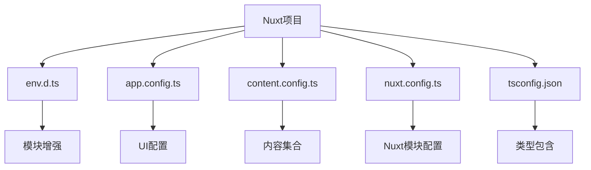
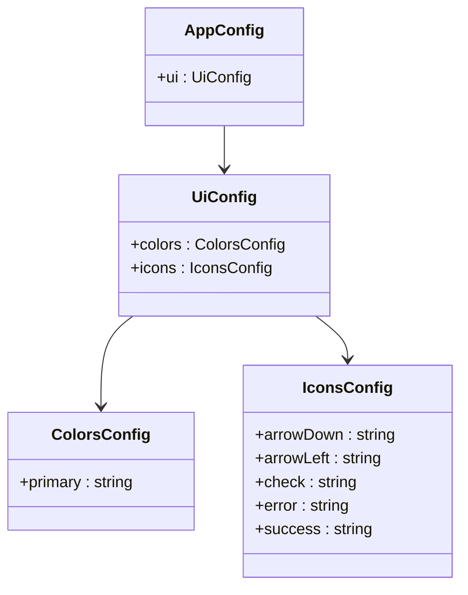
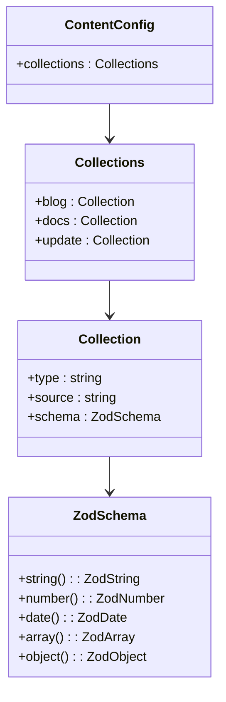
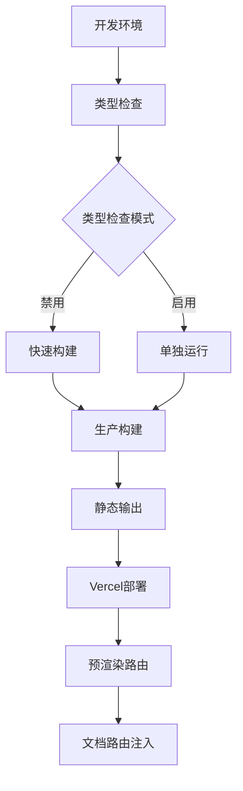
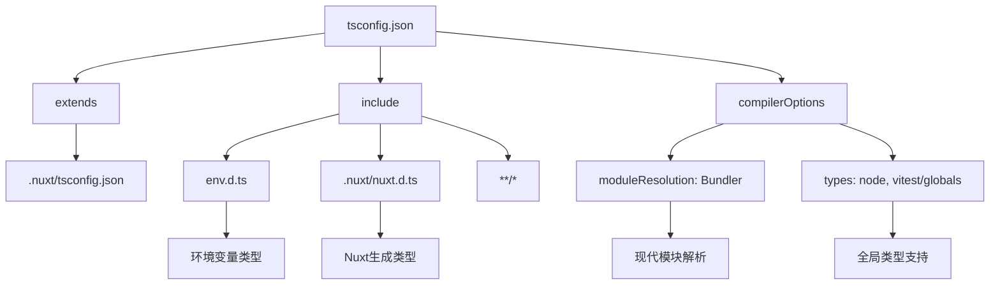

# 全局类型定义与环境扩展

<cite>
**本文档引用的文件**   
- [env.d.ts](file://env.d.ts)
- [app.config.ts](file://app.config.ts)
- [content.config.ts](file://content.config.ts)
- [nuxt.config.ts](file://nuxt.config.ts)
- [tsconfig.json](file://tsconfig.json)
</cite>

## 目录
1. [项目结构](#项目结构)
2. [环境变量类型扩展](#环境变量类型扩展)
3. [应用配置类型推断](#应用配置类型推断)
4. [内容配置类型定义](#内容配置类型定义)
5. [类型安全集成机制](#类型安全集成机制)
6. [全局类型声明策略](#全局类型声明策略)

## 项目结构

本项目采用Nuxt 4框架构建，具有清晰的模块化结构。核心配置文件包括`env.d.ts`用于类型声明，`app.config.ts`用于UI应用配置，`content.config.ts`用于内容管理配置，以及`nuxt.config.ts`作为主配置文件。



**图示来源**
- [env.d.ts](file://env.d.ts)
- [app.config.ts](file://app.config.ts)
- [content.config.ts](file://content.config.ts)
- [nuxt.config.ts](file://nuxt.config.ts)
- [tsconfig.json](file://tsconfig.json)

**本节来源**
- [env.d.ts](file://env.d.ts)
- [app.config.ts](file://app.config.ts)
- [content.config.ts](file://content.config.ts)
- [nuxt.config.ts](file://nuxt.config.ts)

## 环境变量类型扩展

通过`env.d.ts`文件中的模块增强技术，项目实现了对`import.meta.env`的类型安全扩展。该文件通过三重斜杠指令引用Vite和Storybook的类型定义，确保开发环境中的类型完整性。

模块增强机制允许在不修改原始声明文件的情况下，向现有模块添加新的类型定义。当在代码中访问`import.meta.env`时，TypeScript能够提供准确的类型检查和自动补全功能，避免"Property does not exist on type ImportMeta"等常见类型错误。

```mermaid
classDiagram
class ImportMetaEnv {
+VITE_API_URL : string
+VITE_APP_NAME : string
+PROD : boolean
+DEV : boolean
+SSR : boolean
}
note right of ImportMetaEnv
通过模块增强技术扩展
import.meta.env的类型定义
end
```

**图示来源**
- [env.d.ts](file://env.d.ts#L1-L3)

**本节来源**
- [env.d.ts](file://env.d.ts#L1-L3)
- [tsconfig.json](file://tsconfig.json#L4-L5)

## 应用配置类型推断

`app.config.ts`文件利用Nuxt的Typed Config功能，定义了可类型推断的应用配置对象。通过`defineAppConfig`函数，项目配置了@nuxt/ui模块的全局样式和行为，包括主题颜色和图标映射。

配置对象的结构化定义使得TypeScript能够自动生成精确的类型信息。开发人员在使用配置时可以获得完整的类型安全和智能提示，确保配置属性的正确使用。主品牌色被设置为'violet'，并自动生成相应的色阶应用于所有UI组件。



**图示来源**
- [app.config.ts](file://app.config.ts#L9-L82)

**本节来源**
- [app.config.ts](file://app.config.ts#L9-L82)
- [nuxt.config.ts](file://nuxt.config.ts#L18-L20)

## 内容配置类型定义

`content.config.ts`文件定义了内容管理模块的类型安全配置，通过`defineContentConfig`和`defineCollection`函数创建了结构化的内容集合。项目包含三个主要集合：博客(blog)、文档(docs)和更新日志(update)。

每个集合都通过Zod模式(schema)定义了严格的类型约束，确保内容文件的结构一致性。例如，博客集合要求包含标签数组、分类名称、发布日期等字段，而文档集合则定义了标题、描述、排序权重等属性。这种类型定义不仅提供了开发时的类型检查，还支持自动补全功能。



**图示来源**
- [content.config.ts](file://content.config.ts#L3-L56)

**本节来源**
- [content.config.ts](file://content.config.ts#L3-L56)
- [nuxt.config.ts](file://nuxt.config.ts#L20)

## 类型安全集成机制

项目通过多种机制实现类型安全的集成。`nuxt.config.ts`文件中的配置启用了Nuxt DevTools，并集成了@nuxt/ui和@nuxt/content模块。TypeScript配置中禁用了构建时的类型检查以提高构建速度，建议通过单独的`npm run typecheck`命令进行类型检查。

Nitro服务端引擎配置为静态预设，确保输出目录为'dist'以适配Vercel部署。预渲染配置中注入了动态生成的文档路由，同时设置`failOnError`为false以确保构建过程的稳定性。这些配置与类型系统协同工作，提供了一致的开发和生产环境。



**图示来源**
- [nuxt.config.ts](file://nuxt.config.ts#L4-L90)

**本节来源**
- [nuxt.config.ts](file://nuxt.config.ts#L4-L90)
- [tsconfig.json](file://tsconfig.json)

## 全局类型声明策略

项目的全局类型声明策略通过`tsconfig.json`文件中的配置实现。该文件扩展了`.nuxt/tsconfig.json`的配置，并明确包含了`env.d.ts`和`.nuxt/nuxt.d.ts`等类型声明文件。这种包含策略确保了所有自定义类型声明都能被TypeScript编译器正确识别。

编译器选项中设置了模块解析为"Bundler"模式，并包含了"node"和"vitest/globals"类型。这种配置支持现代JavaScript特性的同时，确保了测试环境的类型完整性。通过这种全局声明策略，项目实现了跨文件的类型一致性，提升了整体代码质量和开发体验。



**图示来源**
- [tsconfig.json](file://tsconfig.json#L1-L16)

**本节来源**
- [tsconfig.json](file://tsconfig.json#L1-L16)
- [env.d.ts](file://env.d.ts)
- [nuxt.config.ts](file://nuxt.config.ts)