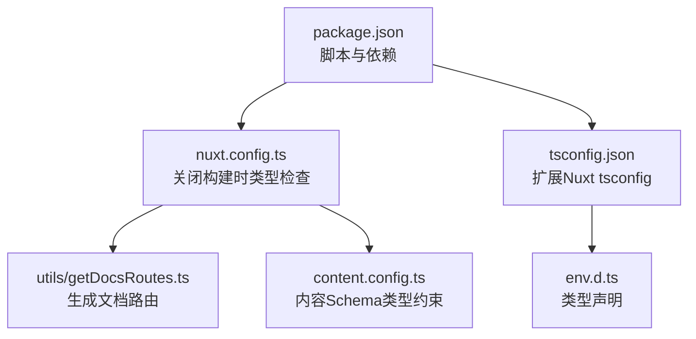
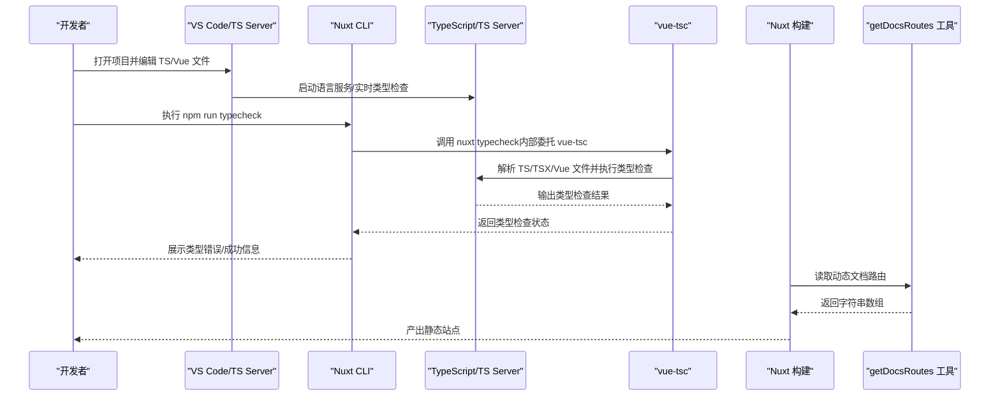
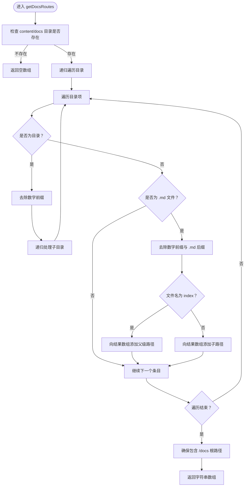
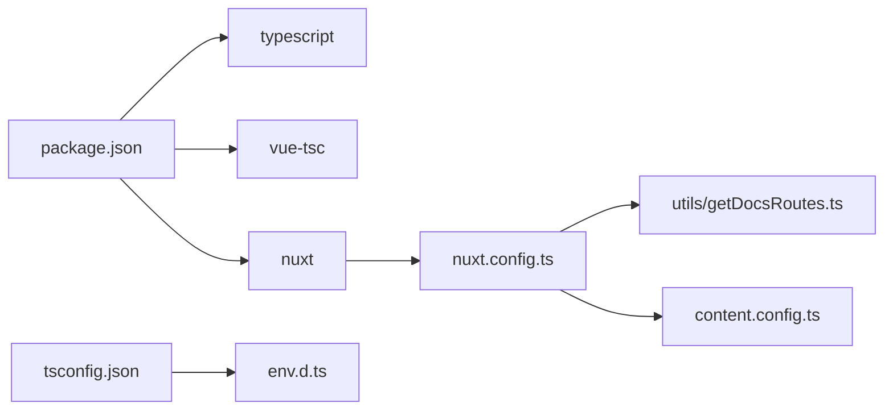

# 类型检查工作流与开发工具集成

<cite>
**本文引用的文件**
- [package.json](file://package.json)
- [tsconfig.json](file://tsconfig.json)
- [nuxt.config.ts](file://nuxt.config.ts)
- [utils/getDocsRoutes.ts](file://utils/getDocsRoutes.ts)
- [content.config.ts](file://content.config.ts)
- [env.d.ts](file://env.d.ts)
</cite>

## 目录
1. [简介](#简介)
2. [项目结构](#项目结构)
3. [核心组件](#核心组件)
4. [架构总览](#架构总览)
5. [详细组件分析](#详细组件分析)
6. [依赖关系分析](#依赖关系分析)
7. [性能考量](#性能考量)
8. [故障排查指南](#故障排查指南)
9. [结论](#结论)
10. [附录](#附录)

## 简介
本文件系统化梳理 budi.ai 项目中 TypeScript 类型检查的工作流，覆盖开发阶段的 IDE 实时类型校验与构建阶段通过 Nuxt CLI 的类型检查命令执行流程；解释 package.json 中 typescript、vue-tsc 等依赖的作用；说明如何通过 Nuxt CLI 集成类型检查，确保提交前的代码质量；结合 utils/getDocsRoutes.ts 展示工具函数如何通过类型约束保证文档路由生成的正确性；并提供 VS Code 配置建议（如启用严格空值检查）、常见类型错误的快速修复策略，以及如何在 CI/CD 中集成类型检查以防止类型相关 bug 上线。

## 项目结构
围绕类型检查的关键文件与职责如下：
- package.json：定义脚本与开发依赖（typescript、vue-tsc），并通过 npm run typecheck 调用 nuxt typecheck。
- tsconfig.json：扩展 Nuxt 生成的 tsconfig，并声明 include 与 types，确保 IDE 与构建工具共享一致的编译选项。
- nuxt.config.ts：通过 typescript.typeCheck 关闭构建时的类型检查，将类型检查独立为单独的 npm 脚本，提升开发体验与构建效率。
- utils/getDocsRoutes.ts：提供文档路由生成逻辑，其参数与返回值均带有明确的类型注解，便于 IDE 提示与静态分析。
- content.config.ts：使用 Zod 定义内容集合的 schema，类型驱动内容结构，减少运行期错误。
- env.d.ts：声明 Vite 与 Storybook 的类型引用，避免 IDE 缺失类型导致的误报。

**图表来源**
- [package.json](file://package.json#L1-L48)
- [tsconfig.json](file://tsconfig.json#L1-L17)
- [nuxt.config.ts](file://nuxt.config.ts#L1-L91)
- [utils/getDocsRoutes.ts](file://utils/getDocsRoutes.ts#L1-L58)
- [content.config.ts](file://content.config.ts#L1-L57)
- [env.d.ts](file://env.d.ts#L1-L3)

**章节来源**
- [package.json](file://package.json#L1-L48)
- [tsconfig.json](file://tsconfig.json#L1-L17)
- [nuxt.config.ts](file://nuxt.config.ts#L1-L91)

## 核心组件
- 类型检查脚本与工具链
  - npm run typecheck 通过 nuxt typecheck 触发类型检查，配合 vue-tsc 与 TypeScript 运行时完成对 TS/TSX/Vue 文件的静态类型验证。
  - 依赖关系：typescript 提供 tsc 与 tsserver；vue-tsc 提供 Vue SFC 的类型检查能力；Nuxt CLI 提供 nuxt typecheck 命令入口。
- 构建期类型检查策略
  - 在 nuxt.config.ts 中将 typescript.typeCheck 设为 false，避免在开发与生产构建时进行重复的类型检查，从而缩短构建时间；将类型检查作为独立步骤，便于在 CI 中集中处理。
- 文档路由生成的类型约束
  - utils/getDocsRoutes.ts 明确了输入输出的类型签名（目录路径、URL 前缀、返回字符串数组），使 IDE 能够在编辑器内进行类型提示与错误定位，同时保证生成的路由集合符合预期的数据结构。

**章节来源**
- [package.json](file://package.json#L1-L48)
- [nuxt.config.ts](file://nuxt.config.ts#L1-L91)
- [utils/getDocsRoutes.ts](file://utils/getDocsRoutes.ts#L1-L58)

## 架构总览
下图展示了从“开发阶段 IDE 实时类型校验”到“构建阶段 nuxt typecheck”的完整工作流，以及各组件之间的交互关系。

**图表来源**
- [package.json](file://package.json#L1-L48)
- [nuxt.config.ts](file://nuxt.config.ts#L1-L91)
- [utils/getDocsRoutes.ts](file://utils/getDocsRoutes.ts#L1-L58)

## 详细组件分析

### 组件A：类型检查脚本与工具链
- npm run typecheck
  - 通过 nuxt typecheck 命令触发类型检查，该命令由 Nuxt CLI 提供，内部会调用 vue-tsc 对项目进行类型验证。
- 依赖作用
  - typescript：提供 tsc 与 tsserver，支撑基础的 TypeScript 类型检查与语言服务。
  - vue-tsc：提供 Vue SFC 的类型检查能力，确保 .vue 文件中的 TS/JS 代码得到正确验证。
  - nuxt：提供 CLI 与配置能力，将类型检查与构建流程解耦。
- 最佳实践
  - 在本地开发时保持构建时 typeCheck 关闭，以获得更快的热更新与预览反馈；在提交前或 CI 中统一执行 npm run typecheck，集中发现类型问题。

**章节来源**
- [package.json](file://package.json#L1-L48)

### 组件B：Nuxt CLI 集成与类型检查策略
- nuxt.config.ts 中的 typescript.typeCheck
  - 将 typeCheck 设为 false，避免在构建过程中进行类型检查，从而提升构建速度。
  - 将类型检查作为独立的 npm 脚本，便于在 CI 中控制执行时机与失败策略。
- 与 nitro prerender 的协作
  - 通过 getDocsRoutes() 动态注入文档路由，类型检查不会影响该工具函数的运行时行为，但会在静态分析阶段确保其返回值类型正确。

**章节来源**
- [nuxt.config.ts](file://nuxt.config.ts#L1-L91)

### 组件C：utils/getDocsRoutes.ts 的类型约束与正确性保障
- 函数签名与返回值
  - 输入：无显式参数（使用 process.cwd 与固定路径拼接）。
  - 返回：字符串数组，表示文档路由路径集合。
- 类型约束与安全
  - 通过明确的返回类型注解，IDE 可以在调用处进行类型推断与错误提示。
  - 对目录与文件名的处理（去除数字前缀、.md 后缀、index 特例）在类型层面保持幂等性，避免产生不一致的路由字符串。
- 与内容系统的协同
  - content.config.ts 使用 Zod schema 对内容字段进行类型约束，与 getDocsRoutes.ts 的静态生成形成互补：前者保证内容结构的类型正确，后者保证路由生成的类型正确。

**图表来源**
- [utils/getDocsRoutes.ts](file://utils/getDocsRoutes.ts#L1-L58)

**章节来源**
- [utils/getDocsRoutes.ts](file://utils/getDocsRoutes.ts#L1-L58)
- [content.config.ts](file://content.config.ts#L1-L57)

### 组件D：tsconfig 与类型声明
- tsconfig.json
  - 通过 extends 引用 Nuxt 生成的 tsconfig，确保与框架生成的类型声明一致。
  - include 中包含 env.d.ts、Nuxt 生成的类型声明与 stories 目录，保证 IDE 能够索引到完整的类型上下文。
  - compilerOptions.types 指定 node 与 vitest/globals，避免缺失类型导致的误报。
- env.d.ts
  - 引入 vite/client 与 @storybook/vue3 类型，确保在开发与 Storybook 场景下的类型可用性。

**章节来源**
- [tsconfig.json](file://tsconfig.json#L1-L17)
- [env.d.ts](file://env.d.ts#L1-L3)

## 依赖关系分析
- 工具链依赖
  - typescript 与 vue-tsc：共同构成类型检查的核心能力，前者负责 TS/TSX 的类型检查，后者负责 Vue SFC 的类型检查。
  - nuxt：提供 CLI 与配置能力，将类型检查从构建流程中剥离，便于独立执行与 CI 集成。
- 项目内依赖
  - utils/getDocsRoutes.ts 与 content.config.ts：前者提供路由生成的类型约束，后者通过 Zod schema 提供内容结构的类型约束，二者在类型层面相互补充。
- IDE 与构建工具的关系
  - IDE 侧通过 tsconfig.json 与 env.d.ts 获取完整的类型上下文；构建侧通过 nuxt typecheck 与 vue-tsc 执行静态类型验证。

**图表来源**
- [package.json](file://package.json#L1-L48)
- [nuxt.config.ts](file://nuxt.config.ts#L1-L91)
- [utils/getDocsRoutes.ts](file://utils/getDocsRoutes.ts#L1-L58)
- [content.config.ts](file://content.config.ts#L1-L57)
- [tsconfig.json](file://tsconfig.json#L1-L17)
- [env.d.ts](file://env.d.ts#L1-L3)

**章节来源**
- [package.json](file://package.json#L1-L48)
- [nuxt.config.ts](file://nuxt.config.ts#L1-L91)

## 性能考量
- 构建时关闭类型检查
  - 在 nuxt.config.ts 中将 typescript.typeCheck 设为 false，避免在开发与生产构建时进行重复的类型检查，显著缩短构建时间。
- 独立执行类型检查
  - 通过 npm run typecheck 单独执行类型检查，可在 CI 中并行加速，或在本地提交前集中处理，减少 IDE 与构建过程中的冲突。
- IDE 实时类型检查
  - 结合 tsconfig.json 的 include 与 types 配置，确保 IDE 能够快速索引到类型声明，提升编辑体验。

[本节为通用指导，无需列出具体文件来源]

## 故障排查指南
- 常见类型错误与快速修复
  - 未声明的变量或属性：根据 IDE 提示添加类型注解或初始化值，确保变量在所有分支中都有定义。
  - 可空值访问：启用严格空值检查（见附录），并在访问前进行空值判断或使用非空断言（谨慎使用）。
  - 返回值类型不匹配：核对函数签名与实际返回值，确保返回类型与调用方期望一致。
  - Vue SFC 类型错误：确认模板与 script 中的类型声明一致，必要时使用泛型或类型断言。
- VS Code 配置建议
  - 启用严格空值检查：在 tsconfig.json 中启用 strictNullChecks，有助于提前发现潜在的空值访问问题。
  - 启用类型检查：确保 tsconfig.json 的 include 与 types 正确，避免 IDE 缺失类型导致的误报。
  - 使用 vue-tsc：在 VS Code 中安装 Vue 扩展，确保对 SFC 的类型支持。
- CI/CD 集成
  - 在流水线中加入 npm run typecheck 步骤，失败即终止后续部署，防止类型相关 bug 上线。
  - 可将类型检查与单元测试并行执行，提高整体反馈速度。

**章节来源**
- [tsconfig.json](file://tsconfig.json#L1-L17)
- [package.json](file://package.json#L1-L48)

## 结论
通过将类型检查从构建流程中剥离，并借助 nuxt typecheck 与 vue-tsc，buidai 项目实现了“开发阶段快速反馈 + 提交前集中校验”的类型检查策略。结合 tsconfig.json 的统一配置与 utils/getDocsRoutes.ts 的类型约束，项目在文档路由生成与内容结构方面具备良好的类型安全保障。建议在 VS Code 中启用严格空值检查，并在 CI/CD 中强制执行类型检查，以进一步提升代码质量与稳定性。

[本节为总结性内容，无需列出具体文件来源]

## 附录

### A. VS Code 配置建议
- 启用严格空值检查
  - 在 tsconfig.json 中启用 strictNullChecks，以便在编辑器中即时发现潜在的空值访问问题。
- 类型声明与 include
  - 确保 tsconfig.json 的 include 与 types 正确，避免 IDE 缺失类型导致的误报。
- Vue SFC 类型支持
  - 安装 Vue 扩展，确保对 SFC 的类型支持与模板类型检查。

**章节来源**
- [tsconfig.json](file://tsconfig.json#L1-L17)

### B. 常见类型错误与修复策略
- 未声明变量/属性
  - 添加类型注解或初始化值，确保变量在所有分支中都有定义。
- 可空值访问
  - 启用严格空值检查，使用空值判断或可选链操作符，避免直接访问可能为空的属性。
- 返回值类型不匹配
  - 核对函数签名与实际返回值，确保返回类型与调用方期望一致。
- Vue SFC 类型错误
  - 确认模板与 script 中的类型声明一致，必要时使用泛型或类型断言（谨慎使用）。

**章节来源**
- [tsconfig.json](file://tsconfig.json#L1-L17)

### C. CI/CD 集成建议
- 在流水线中加入 npm run typecheck 步骤，失败即终止后续部署，防止类型相关 bug 上线。
- 可将类型检查与单元测试并行执行，提高整体反馈速度。

**章节来源**
- [package.json](file://package.json#L1-L48)