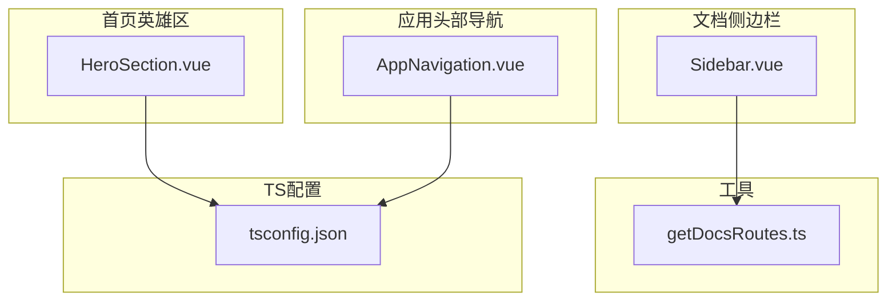
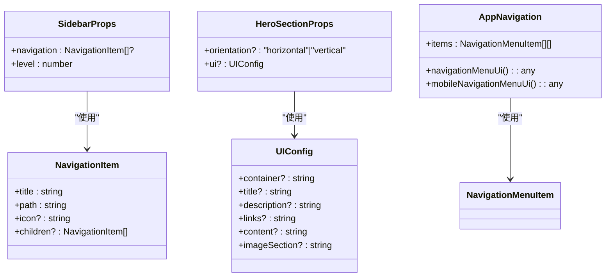
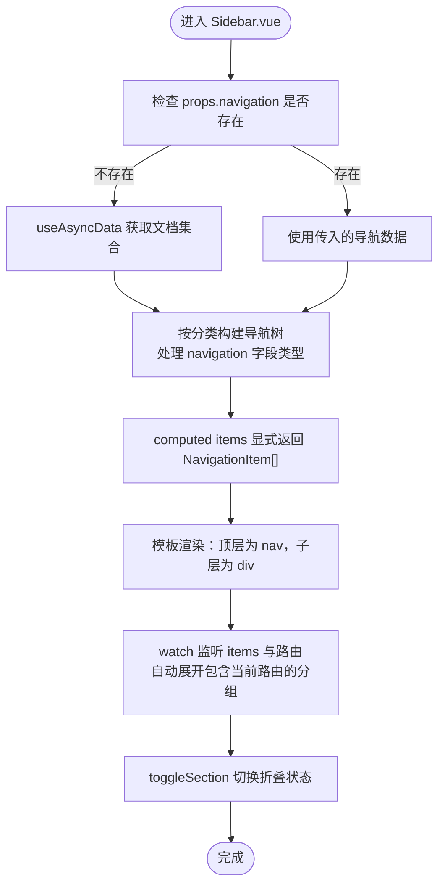
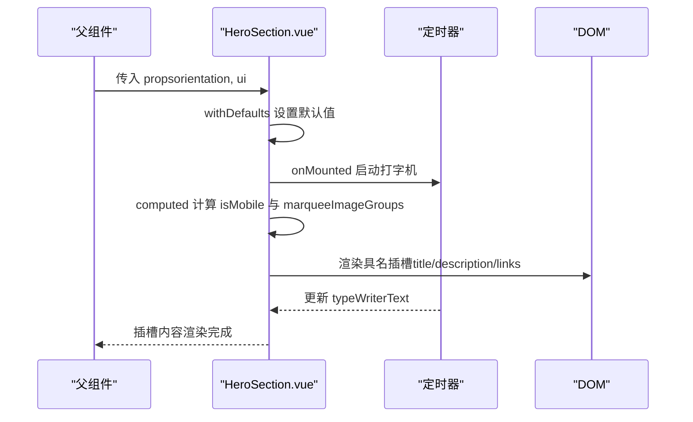
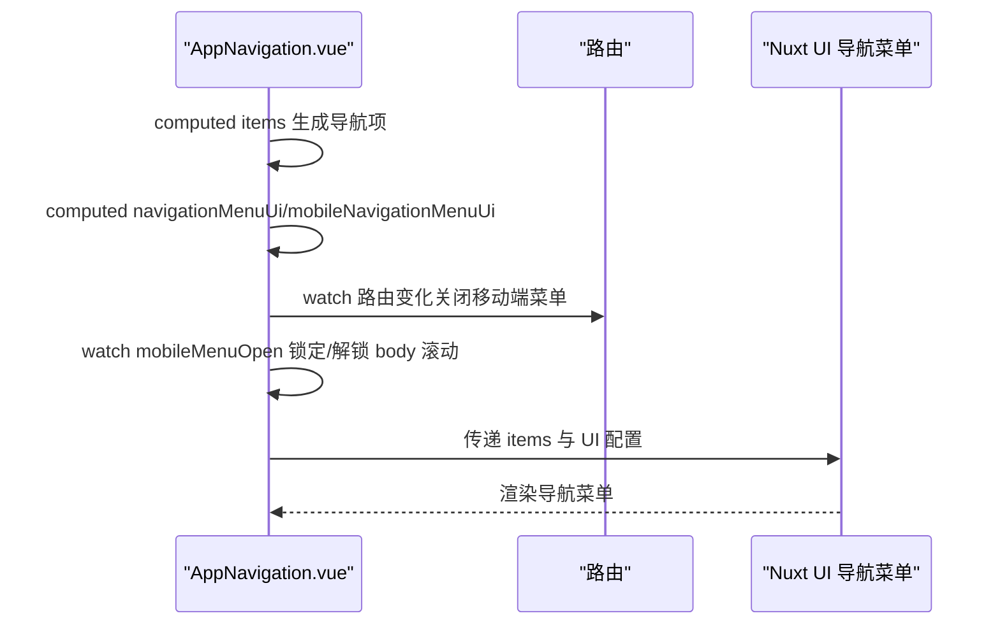
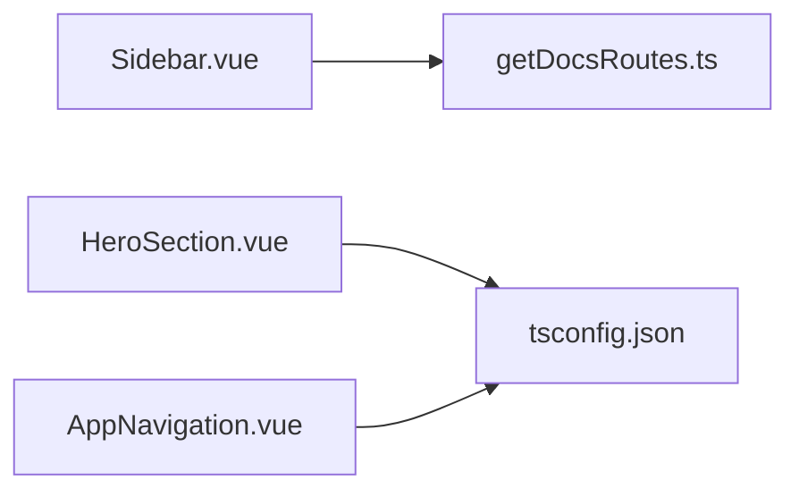

# 组件中的TypeScript实践

<cite>
**本文引用的文件**
- [components/docs/Sidebar.vue](file://components/docs/Sidebar.vue)
- [components/landing/HeroSection.vue](file://components/landing/HeroSection.vue)
- [components/AppNavigation.vue](file://components/AppNavigation.vue)
- [utils/getDocsRoutes.ts](file://utils/getDocsRoutes.ts)
- [tsconfig.json](file://tsconfig.json)
</cite>

## 目录
1. [简介](#简介)
2. [项目结构](#项目结构)
3. [核心组件](#核心组件)
4. [架构总览](#架构总览)
5. [详细组件分析](#详细组件分析)
6. [依赖关系分析](#依赖关系分析)
7. [性能考量](#性能考量)
8. [故障排查指南](#故障排查指南)
9. [结论](#结论)
10. [附录](#附录)

## 简介
本文件围绕三个Vue 3组合式API组件，系统性展示在TypeScript环境下如何实现类型安全的props、emits与slots实践，重点包括：
- 使用接口（interface）或类型别名（type）定义props结构
- 利用泛型与PropType处理复杂、动态数据类型（如文档路由数据的递归结构）
- 通过withDefaults与defineProps实现默认值与类型约束
- 通过defineSlots声明具名插槽，结合作用域插槽参数进行类型推断
- 解决响应式变量的类型推断问题（如Ref解包、计算属性返回类型推断）
- 提供“Property does not exist on type Ref”等典型错误的解决方案

## 项目结构
本次文档聚焦以下组件与工具文件：
- 文档侧边栏组件：components/docs/Sidebar.vue
- 首页英雄区组件：components/landing/HeroSection.vue
- 应用头部导航组件：components/AppNavigation.vue
- 文档路由生成工具：utils/getDocsRoutes.ts
- TypeScript编译配置：tsconfig.json

图表来源
- [components/docs/Sidebar.vue](file://components/docs/Sidebar.vue#L1-L294)
- [components/landing/HeroSection.vue](file://components/landing/HeroSection.vue#L1-L392)
- [components/AppNavigation.vue](file://components/AppNavigation.vue#L1-L309)
- [utils/getDocsRoutes.ts](file://utils/getDocsRoutes.ts#L1-L58)
- [tsconfig.json](file://tsconfig.json#L1-L17)

章节来源
- [components/docs/Sidebar.vue](file://components/docs/Sidebar.vue#L1-L294)
- [components/landing/HeroSection.vue](file://components/landing/HeroSection.vue#L1-L392)
- [components/AppNavigation.vue](file://components/AppNavigation.vue#L1-L309)
- [utils/getDocsRoutes.ts](file://utils/getDocsRoutes.ts#L1-L58)
- [tsconfig.json](file://tsconfig.json#L1-L17)

## 核心组件
本节概述三个组件在TypeScript类型安全方面的关键实践点：
- Sidebar.vue：使用接口定义导航项结构，配合PropType与泛型处理递归数据；通过withDefaults与defineProps实现默认值与类型约束；利用计算属性与响应式状态进行导航渲染与折叠控制。
- HeroSection.vue：通过defineProps与withDefaults定义组件props，使用接口描述UI配置结构；通过计算属性与响应式状态实现打字机效果与移动端适配；通过具名插槽与作用域插槽参数实现内容定制。
- AppNavigation.vue：使用外部类型定义（来自@nuxt/ui）作为导航菜单项的数据结构；通过计算属性动态生成UI配置；通过响应式状态与生命周期钩子实现滚动与移动端交互。

章节来源
- [components/docs/Sidebar.vue](file://components/docs/Sidebar.vue#L124-L289)
- [components/landing/HeroSection.vue](file://components/landing/HeroSection.vue#L202-L355)
- [components/AppNavigation.vue](file://components/AppNavigation.vue#L140-L308)

## 架构总览
下面的类图展示了三个组件在类型层面的关键关系与职责划分。

图表来源
- [components/docs/Sidebar.vue](file://components/docs/Sidebar.vue#L124-L289)
- [components/landing/HeroSection.vue](file://components/landing/HeroSection.vue#L202-L355)
- [components/AppNavigation.vue](file://components/AppNavigation.vue#L140-L308)

## 详细组件分析

### Sidebar.vue：递归导航与类型安全
- 接口定义与PropType断言
  - 使用接口定义导航项结构，包含标题、路径、图标与可选子项，形成递归结构。
  - 通过PropType对数组类型进行精确断言，确保传入的导航数据符合预期。
  - 通过withDefaults与defineProps为level提供默认值，保证组件在不同层级下的行为一致。
- 泛型与计算属性
  - items计算属性显式声明返回类型为NavigationItem[]，避免类型推断歧义。
  - 在未提供navigation时，通过异步数据获取并进行分类聚合，同时处理navigation字段可能为布尔值或对象的情况，采用条件判断与类型守卫确保安全访问。
- 响应式状态与折叠控制
  - 使用useState保存折叠状态，结合watch监听items与路由变化，自动展开包含当前激活路由的分组。
  - toggleSection方法通过布尔状态切换实现折叠/展开。
- 递归渲染与无障碍
  - 顶层渲染为nav元素并提供aria-label；折叠按钮使用aria-expanded标记状态，提升可访问性。
- 文档路由数据生成
  - 通过工具函数遍历content/docs目录，生成文档路由列表，用于预渲染配置，确保导航数据与路由一致。

图表来源
- [components/docs/Sidebar.vue](file://components/docs/Sidebar.vue#L156-L289)
- [utils/getDocsRoutes.ts](file://utils/getDocsRoutes.ts#L1-L58)

章节来源
- [components/docs/Sidebar.vue](file://components/docs/Sidebar.vue#L124-L289)
- [utils/getDocsRoutes.ts](file://utils/getDocsRoutes.ts#L1-L58)

### HeroSection.vue：具名插槽与UI配置类型
- Props定义与默认值
  - 使用接口HeroSectionProps定义orientation与ui配置，其中ui为可选对象，包含容器、标题、描述、链接、内容与图片展示区的样式键。
  - 通过withDefaults为orientation与ui提供默认值，确保组件在未传入props时仍能正常工作。
- 计算属性与响应式状态
  - isMobile通过窗口尺寸检测，驱动marqueeImageGroups的两组图片分配策略。
  - marqueeImageGroups计算属性返回包含first与second两个数组的对象，移动端与桌面端总数不同，且均进行随机打乱。
  - typeWriterText通过定时器实现打字机效果，配合生命周期钩子在挂载与卸载时注册/清理事件。
- 具名插槽与作用域插槽
  - 模板中使用具名插槽title、description与links，并向插槽传递作用域参数（如links的样式类），便于父组件自定义内容与样式。
- 类型推断与Ref解包
  - 通过显式声明计算属性返回类型，避免在模板中直接使用Ref导致的类型推断问题。
  - 在需要访问响应式值时，统一使用.value进行解包，避免“Property does not exist on type Ref”的错误。

图表来源
- [components/landing/HeroSection.vue](file://components/landing/HeroSection.vue#L202-L355)

章节来源
- [components/landing/HeroSection.vue](file://components/landing/HeroSection.vue#L1-L392)

### AppNavigation.vue：外部类型与动态UI配置
- 外部类型定义
  - 从@nuxt/ui导入NavigationMenuItem类型，作为导航菜单项的数据结构，确保items的类型安全。
- 动态UI配置
  - navigationMenuUi与mobileNavigationMenuUi计算属性根据透明/实体状态动态生成UI类名，保证在不同状态下视觉与交互的一致性。
- 响应式状态与生命周期
  - isScrolled通过滚动事件与requestAnimationFrame优化，避免频繁重绘。
  - mobileMenuOpen控制移动端菜单开关，watch监听路由变化自动关闭菜单；watch监听mobileMenuOpen锁定/解锁body滚动。
- 递归导航与嵌套菜单
  - items计算属性返回二维数组，支持子菜单嵌套，便于Nuxt UI组件渲染。

图表来源
- [components/AppNavigation.vue](file://components/AppNavigation.vue#L140-L308)

章节来源
- [components/AppNavigation.vue](file://components/AppNavigation.vue#L1-L309)

## 依赖关系分析
- Sidebar.vue依赖工具函数getDocsRoutes.ts生成文档路由列表，用于预渲染配置，确保导航数据与路由一致。
- HeroSection.vue与AppNavigation.vue均依赖tsconfig.json中的编译配置，确保TypeScript类型检查与模块解析正确。

图表来源
- [components/docs/Sidebar.vue](file://components/docs/Sidebar.vue#L156-L177)
- [utils/getDocsRoutes.ts](file://utils/getDocsRoutes.ts#L1-L58)
- [components/landing/HeroSection.vue](file://components/landing/HeroSection.vue#L192-L201)
- [components/AppNavigation.vue](file://components/AppNavigation.vue#L140-L149)
- [tsconfig.json](file://tsconfig.json#L1-L17)

章节来源
- [components/docs/Sidebar.vue](file://components/docs/Sidebar.vue#L156-L177)
- [utils/getDocsRoutes.ts](file://utils/getDocsRoutes.ts#L1-L58)
- [components/landing/HeroSection.vue](file://components/landing/HeroSection.vue#L192-L201)
- [components/AppNavigation.vue](file://components/AppNavigation.vue#L140-L149)
- [tsconfig.json](file://tsconfig.json#L1-L17)

## 性能考量
- 请求帧优化：AppNavigation.vue在滚动事件中使用requestAnimationFrame减少重绘频率，提升交互流畅度。
- 计算属性缓存：HeroSection.vue的marqueeImageGroups与isMobile基于响应式状态，自动缓存结果，避免重复计算。
- 异步数据获取：Sidebar.vue在根层级且未提供navigation时才发起异步请求，避免不必要的网络开销。
- 模板渲染优化：Sidebar.vue通过骨架屏与条件渲染减少首屏渲染压力；HeroSection.vue通过具名插槽减少父组件耦合。

## 故障排查指南
- “Property does not exist on type Ref”
  - 症状：在模板或逻辑中直接使用响应式变量而未解包，TypeScript报错。
  - 解决方案：统一使用.value访问响应式值；在计算属性中显式声明返回类型，避免隐式Ref类型导致的推断问题。
  - 参考位置：
    - HeroSection.vue中isMobile、typeWriterText等响应式变量的使用与.value解包
    - Sidebar.vue中items、collapsedSections等响应式状态的访问
- 递归数据类型断言
  - 症状：导航项children类型不确定，导致访问子项时报错。
  - 解决方案：使用PropType对数组进行精确断言；在运行时使用类型守卫（如判断是否为数组）后再访问子项。
  - 参考位置：
    - Sidebar.vue中navigation的PropType断言与children访问
- 默认值与可选属性
  - 症状：未传入props导致类型不匹配或默认值缺失。
  - 解决方案：使用withDefaults为可选属性提供默认值；在接口中明确可选字段。
  - 参考位置：
    - HeroSection.vue中orientation与ui的默认值
    - Sidebar.vue中level的默认值
- 具名插槽参数类型
  - 症状：插槽作用域参数类型不明确，导致父组件无法正确接收。
  - 解决方案：在组件模板中为具名插槽提供明确的作用域参数；在父组件中使用slot的参数进行类型推断。
  - 参考位置：
    - HeroSection.vue中links插槽的作用域参数传递

章节来源
- [components/landing/HeroSection.vue](file://components/landing/HeroSection.vue#L252-L355)
- [components/docs/Sidebar.vue](file://components/docs/Sidebar.vue#L137-L154)
- [components/docs/Sidebar.vue](file://components/docs/Sidebar.vue#L185-L239)
- [components/landing/HeroSection.vue](file://components/landing/HeroSection.vue#L39-L97)

## 结论
通过以上三个组件的实践，可以总结出在Vue 3组合式API中实现类型安全的关键要点：
- 使用接口或类型别名定义props结构，结合withDefaults与defineProps提供默认值与类型约束。
- 对复杂、动态数据（如递归导航树）使用PropType与类型守卫进行断言与保护。
- 通过显式声明计算属性返回类型与统一使用.value解包，避免Ref解包相关错误。
- 使用具名插槽与作用域插槽参数实现灵活的内容定制，并确保父组件的类型推断准确。
- 在性能方面，合理使用计算属性缓存、requestAnimationFrame优化与条件渲染，提升用户体验。

## 附录
- 相关文件与参考位置
  - Sidebar.vue：导航项接口、PropType断言、计算属性与响应式状态
  - HeroSection.vue：具名插槽、UI配置接口、计算属性与响应式状态
  - AppNavigation.vue：外部类型导入、动态UI配置、滚动与移动端交互
  - getDocsRoutes.ts：文档路由生成工具
  - tsconfig.json：TypeScript编译配置

章节来源
- [components/docs/Sidebar.vue](file://components/docs/Sidebar.vue#L124-L289)
- [components/landing/HeroSection.vue](file://components/landing/HeroSection.vue#L202-L355)
- [components/AppNavigation.vue](file://components/AppNavigation.vue#L140-L308)
- [utils/getDocsRoutes.ts](file://utils/getDocsRoutes.ts#L1-L58)
- [tsconfig.json](file://tsconfig.json#L1-L17)