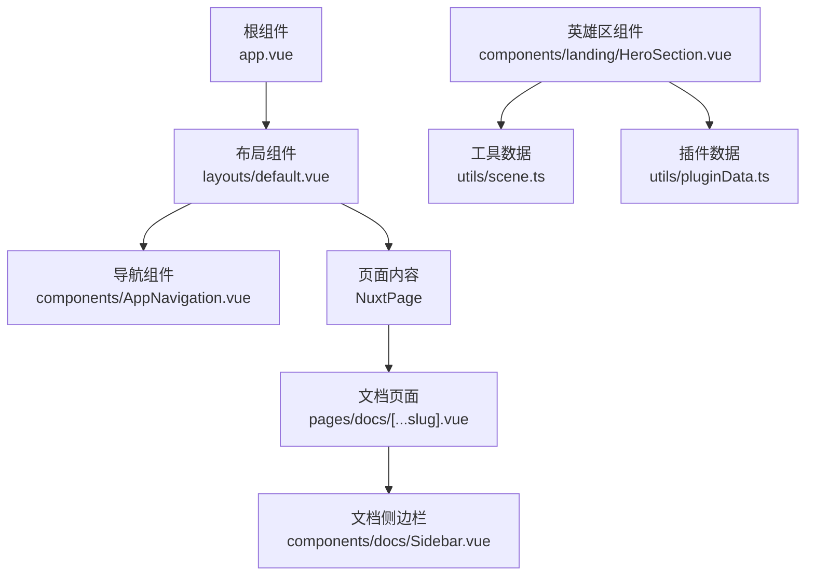
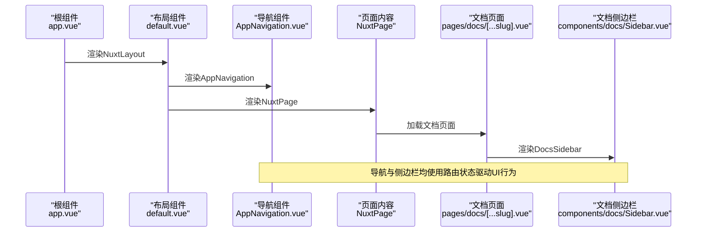
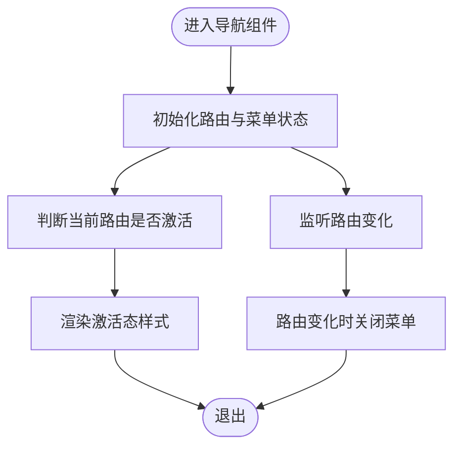
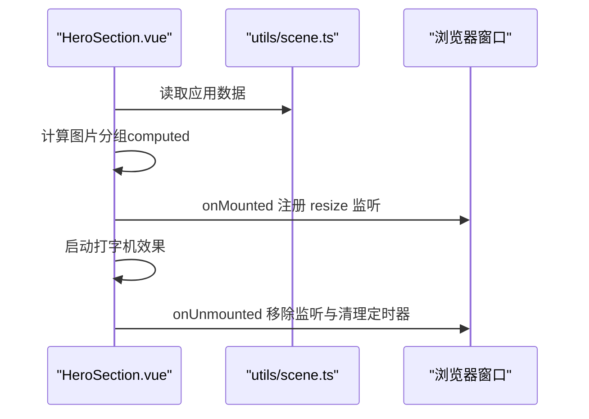
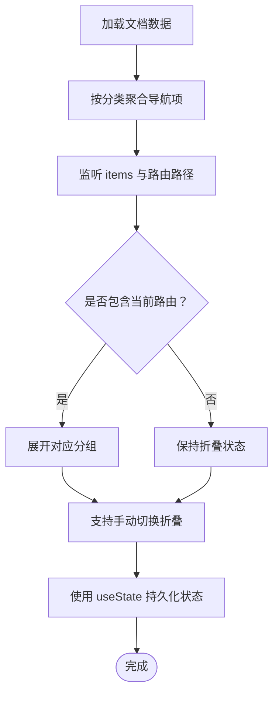
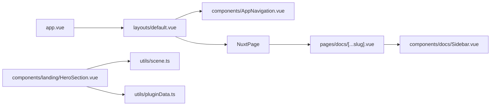

# Vue 3组合式API应用

<cite>
**本文引用的文件**
- [app.vue](file://app.vue)
- [default.vue](file://layouts/default.vue)
- [AppNavigation.vue](file://components/AppNavigation.vue)
- [HeroSection.vue](file://components/landing/HeroSection.vue)
- [Sidebar.vue](file://components/docs/Sidebar.vue)
- [[...slug].vue](file://pages/docs/[...slug].vue)
- [scene.ts](file://utils/scene.ts)
- [pluginData.ts](file://utils/pluginData.ts)
</cite>

## 目录
1. [简介](#简介)
2. [项目结构](#项目结构)
3. [核心组件](#核心组件)
4. [架构总览](#架构总览)
5. [详细组件分析](#详细组件分析)
6. [依赖关系分析](#依赖关系分析)
7. [性能考量](#性能考量)
8. [故障排查指南](#故障排查指南)
9. [结论](#结论)
10. [附录](#附录)

## 简介
本文件聚焦于buidai项目中Vue 3组合式API（Composition API）的工程化实践，围绕以下目标展开：
- 在根组件中通过<script setup>声明全局应用上下文
- 在default布局中利用响应式API（ref、reactive）管理主题状态与导航逻辑
- 结合AppNavigation组件，说明如何封装可复用的useNavigation自定义Hook，实现菜单展开状态与路由联动
- 在HeroSection中解析生命周期钩子（onMounted、onBeforeUnmount）与第三方库AOS动画的集成方式
- 提供响应式数据流设计、组件间通信（props/emits）、以及useSlots、useAttrs等高级API的使用范例
- 阐述错误处理机制与开发调试技巧，包括Vue DevTools集成与响应式依赖追踪

## 项目结构
本项目采用Nuxt生态，根组件负责承载布局与页面；default布局统一承载头部导航、主要内容区与底部；landing区域包含HeroSection等落地页组件；docs区域包含Sidebar与文档页面。

图表来源
- [app.vue](file://app.vue#L1-L12)
- [default.vue](file://layouts/default.vue#L1-L25)
- [AppNavigation.vue](file://components/AppNavigation.vue#L1-L140)
- [[...slug].vue](file://pages/docs/[...slug].vue#L1-L165)
- [Sidebar.vue](file://components/docs/Sidebar.vue#L1-L120)
- [HeroSection.vue](file://components/landing/HeroSection.vue#L192-L355)
- [scene.ts](file://utils/scene.ts#L1-L122)
- [pluginData.ts](file://utils/pluginData.ts#L1-L323)

章节来源
- [app.vue](file://app.vue#L1-L12)
- [default.vue](file://layouts/default.vue#L1-L25)

## 核心组件
- 根组件（app.vue）：通过<script setup>声明全局应用上下文，承载NuxtLayout与NuxtPage，作为应用入口。
- 布局组件（default.vue）：承载AppBanner、AppNavigation、AppFooter、BackToTop等，使用插槽承载页面内容。
- 导航组件（AppNavigation.vue）：使用ref管理移动端菜单开关，使用watch监听路由变化自动关闭菜单，使用useRoute判断路由激活状态。
- 英雄区组件（HeroSection.vue）：使用ref、computed、onMounted/onUnmounted管理移动端检测、打字机效果与跑马灯图片分组，引入utils/scene.ts中的应用数据。
- 文档侧边栏（Sidebar.vue）：使用useRoute、computed、watch、useState管理折叠状态与当前激活路由，支持递归渲染与无障碍属性。
- 文档页面（[...slug].vue）：并行获取文档内容与相邻条目，使用IntersectionObserver与滚动锚点实现目录联动，使用useSeoMeta设置SEO元信息。

章节来源
- [app.vue](file://app.vue#L1-L12)
- [default.vue](file://layouts/default.vue#L1-L25)
- [AppNavigation.vue](file://components/AppNavigation.vue#L101-L140)
- [HeroSection.vue](file://components/landing/HeroSection.vue#L192-L355)
- [Sidebar.vue](file://components/docs/Sidebar.vue#L108-L294)
- [[...slug].vue](file://pages/docs/[...slug].vue#L167-L284)

## 架构总览
本项目以组合式API为核心，通过响应式数据与生命周期钩子实现跨组件的状态共享与行为编排。根组件负责应用级上下文声明，布局组件承担通用UI骨架，具体业务组件（导航、英雄区、文档侧边栏）各自封装职责，形成清晰的分层与解耦。

图表来源
- [app.vue](file://app.vue#L1-L12)
- [default.vue](file://layouts/default.vue#L1-L25)
- [AppNavigation.vue](file://components/AppNavigation.vue#L101-L140)
- [[...slug].vue](file://pages/docs/[...slug].vue#L1-L165)
- [Sidebar.vue](file://components/docs/Sidebar.vue#L1-L120)

## 详细组件分析

### 根组件：全局应用上下文声明
- 在根组件中使用<script setup>声明全局应用上下文，避免重复导入与样板代码，集中管理应用级逻辑。
- 通过NuxtLayout包裹页面，确保布局与页面解耦，便于后续扩展主题与导航。

章节来源
- [app.vue](file://app.vue#L1-L12)

### 布局组件：主题状态与导航逻辑
- 布局组件本身不包含复杂逻辑，主要职责是承载通用UI骨架与插槽，便于在页面中注入内容。
- 主题状态与导航逻辑集中在导航组件中，布局组件通过引入导航组件完成导航渲染。

章节来源
- [default.vue](file://layouts/default.vue#L1-L25)

### 导航组件：useNavigation自定义Hook与路由联动
- 使用ref维护移动端菜单开关状态，使用watch监听路由变化自动关闭菜单，避免内存泄漏与状态不一致。
- 使用useRoute判断路由激活状态，实现导航高亮与无障碍属性（aria-expanded、aria-current）。
- 该组件体现了组合式API在“菜单展开状态”与“路由联动”的最佳实践，可抽象为useNavigation自定义Hook，实现跨组件复用。

图表来源
- [AppNavigation.vue](file://components/AppNavigation.vue#L101-L140)

章节来源
- [AppNavigation.vue](file://components/AppNavigation.vue#L101-L140)

### 英雄区组件：生命周期钩子与第三方库集成
- 使用ref管理移动端检测状态，使用computed派生跑马灯图片分组，使用onMounted注册窗口resize事件与启动打字机效果，使用onUnmounted清理事件与定时器，避免内存泄漏。
- 通过utils/scene.ts提供的应用数据，动态生成跑马灯图片分组，实现响应式布局下的不同展示策略。
- 该组件展示了组合式API在生命周期管理与第三方库集成方面的工程化实践。

图表来源
- [HeroSection.vue](file://components/landing/HeroSection.vue#L192-L355)
- [scene.ts](file://utils/scene.ts#L1-L122)

章节来源
- [HeroSection.vue](file://components/landing/HeroSection.vue#L192-L355)
- [scene.ts](file://utils/scene.ts#L1-L122)

### 文档侧边栏：折叠状态与路由联动
- 使用useRoute、computed、watch、useState管理折叠状态与当前激活路由，支持递归渲染与无障碍属性。
- 通过watch监听items与路由路径，自动展开包含当前激活路由的分组，提升用户体验。
- 该组件体现了组合式API在复杂UI状态管理与路由联动方面的工程化实践。

图表来源
- [Sidebar.vue](file://components/docs/Sidebar.vue#L156-L294)

章节来源
- [Sidebar.vue](file://components/docs/Sidebar.vue#L108-L294)

### 文档页面：并行数据获取与目录联动
- 使用Promise.all并行获取文档内容与相邻条目，减少等待时间，提升首屏性能。
- 使用IntersectionObserver与滚动锚点实现目录联动，使用history.pushState更新URL锚点，保持滚动位置与URL一致。
- 使用useSeoMeta设置SEO元信息，提升搜索引擎友好性。

章节来源
- [[...slug].vue](file://pages/docs/[...slug].vue#L167-L284)

## 依赖关系分析
- 组件间依赖：根组件依赖布局组件；布局组件依赖导航组件；文档页面依赖文档侧边栏；英雄区组件依赖工具数据。
- 外部依赖：Vue 3（组合式API、生命周期钩子、响应式API）、Nuxt（路由、内容渲染、SEO）、第三方UI图标库与内容集合查询API。

图表来源
- [app.vue](file://app.vue#L1-L12)
- [default.vue](file://layouts/default.vue#L1-L25)
- [AppNavigation.vue](file://components/AppNavigation.vue#L1-L140)
- [[...slug].vue](file://pages/docs/[...slug].vue#L1-L165)
- [Sidebar.vue](file://components/docs/Sidebar.vue#L1-L120)
- [HeroSection.vue](file://components/landing/HeroSection.vue#L192-L355)
- [scene.ts](file://utils/scene.ts#L1-L122)
- [pluginData.ts](file://utils/pluginData.ts#L1-L323)

章节来源
- [app.vue](file://app.vue#L1-L12)
- [default.vue](file://layouts/default.vue#L1-L25)
- [AppNavigation.vue](file://components/AppNavigation.vue#L101-L140)
- [HeroSection.vue](file://components/landing/HeroSection.vue#L192-L355)
- [Sidebar.vue](file://components/docs/Sidebar.vue#L108-L294)
- [[...slug].vue](file://pages/docs/[...slug].vue#L167-L284)

## 性能考量
- 响应式数据流：优先使用computed派生数据，减少重复计算；使用watch监听必要状态，避免不必要的重渲染。
- 生命周期管理：在onMounted中注册事件，在onUnmounted中清理，防止内存泄漏与资源占用。
- 并行数据获取：在文档页面中使用Promise.all并行获取内容与相邻条目，缩短首屏等待时间。
- 事件去抖与节流：在窗口resize等高频事件中，合理控制回调频率，避免过度重绘。
- 图片懒加载与骨架屏：HeroSection中使用懒加载与骨架屏优化首屏体验（参考相关组件的实现）。

## 故障排查指南
- 错误边界与重试：文档页面使用NuxtErrorBoundary捕获渲染错误，提供clearError重试机制，便于定位与恢复。
- 日志与异常：在数据获取与渲染过程中输出错误日志，便于定位问题来源。
- 调试工具：结合Vue DevTools进行组件树与响应式依赖追踪，观察ref、reactive、computed的依赖关系与变更轨迹。
- 无障碍与可访问性：为交互元素添加aria属性，确保屏幕阅读器与键盘导航可用。

章节来源
- [[...slug].vue](file://pages/docs/[...slug].vue#L116-L129)
- [Sidebar.vue](file://components/docs/Sidebar.vue#L1-L120)

## 结论
本项目在Vue 3组合式API的指导下，形成了清晰的组件分层与工程化实践：
- 根组件通过<script setup>声明全局上下文，布局组件承载通用UI骨架
- 导航组件通过ref与watch实现菜单状态与路由联动
- 英雄区组件通过生命周期钩子与第三方库集成，实现流畅的视觉效果
- 文档侧边栏与页面通过组合式API实现复杂状态管理与路由联动
- 通过错误边界、并行数据获取与响应式依赖追踪，提升了系统的稳定性与可维护性

## 附录
- 响应式数据流设计要点
  - 使用ref管理局部状态，使用computed派生只读数据，使用watch监听必要状态
  - 在组件销毁时清理事件与定时器，避免内存泄漏
- 组件间通信
  - props传递只读数据，emits向上抛出事件
  - 使用provide/inject在深层组件间共享状态
- 高级API使用范例
  - useSlots与useAttrs：在需要透传属性与插槽时使用，确保组件的可扩展性
  - useState：在需要跨渲染持久化状态时使用，避免状态丢失