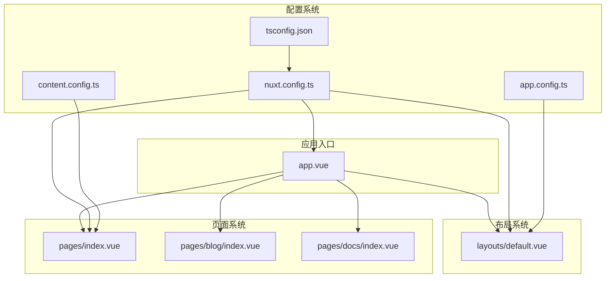
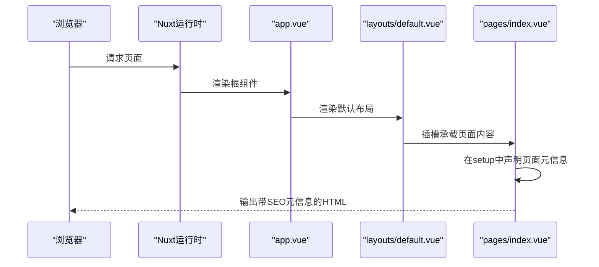
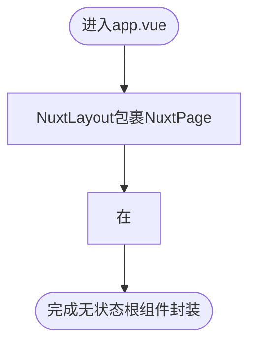
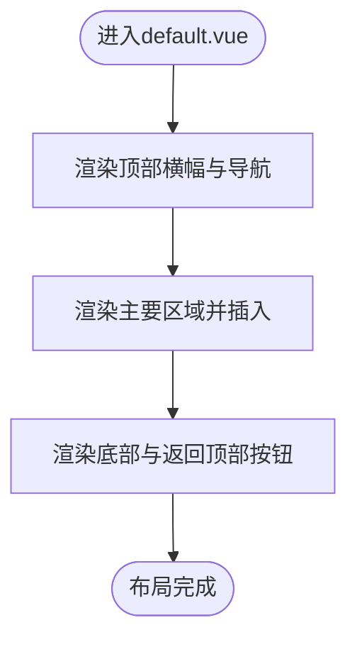
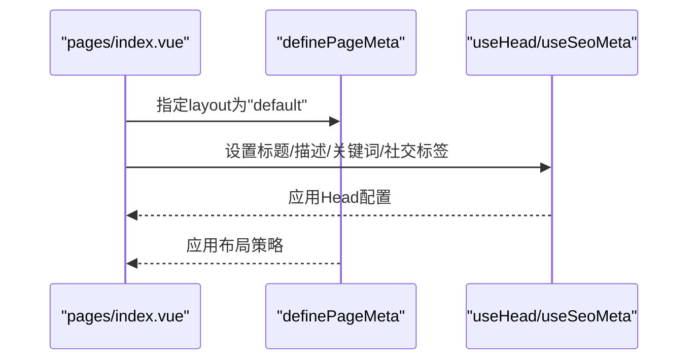
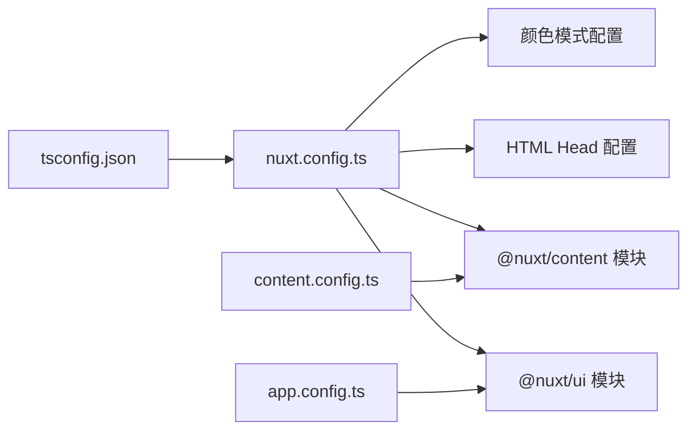
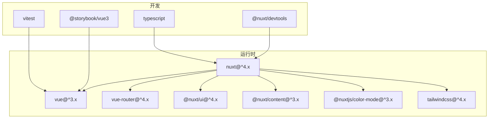

# setup语法糖与全局上下文

<cite>
**本文引用的文件**
- [app.vue](file://app.vue)
- [layouts/default.vue](file://layouts/default.vue)
- [pages/index.vue](file://pages/index.vue)
- [nuxt.config.ts](file://nuxt.config.ts)
- [package.json](file://package.json)
- [app.config.ts](file://app.config.ts)
- [content.config.ts](file://content.config.ts)
- [tsconfig.json](file://tsconfig.json)
</cite>

## 目录
1. [引言](#引言)
2. [项目结构](#项目结构)
3. [核心组件](#核心组件)
4. [架构总览](#架构总览)
5. [详细组件分析](#详细组件分析)
6. [依赖关系分析](#依赖关系分析)
7. [性能考量](#性能考量)
8. [故障排查指南](#故障排查指南)
9. [结论](#结论)
10. [附录](#附录)

## 引言
本文件围绕智言万象项目中setup语法糖的工程化应用展开，重点阐释app.vue根组件如何通过<script setup>声明全局应用上下文；解析NuxtLayout与NuxtPage的组合模式，说明如何借助setup语法实现“无状态根组件”的简洁封装；结合default.vue布局组件，阐述其如何继承全局上下文并提供页面级布局容器；最后总结Nuxt 4中setup语法的最佳实践，包括自动导入机制、编译时优化以及与Nuxt特有API（如definePageMeta、useHead/useSeoMeta）的集成方式。

## 项目结构
- 根组件：app.vue负责承载全局布局与页面容器，采用无状态封装，仅通过NuxtLayout/NuxtPage组织页面流。
- 布局层：layouts/default.vue提供站点通用头部、导航、主要内容区与底部的布局骨架，供页面选择性继承。
- 页面层：pages下的各页面通过definePageMeta指定布局策略，并使用useHead/useSeoMeta等API管理页面元信息。
- 配置层：nuxt.config.ts集中管理模块、Nitro预渲染、Head配置、颜色模式、字体与全局CSS等；app.config.ts与content.config.ts分别面向UI模块与内容模块的Schema与集合配置；tsconfig.json指向Nuxt生成的类型声明，确保类型安全。

**图表来源**
- [app.vue](file://app.vue#L1-L12)
- [layouts/default.vue](file://layouts/default.vue#L1-L25)
- [pages/index.vue](file://pages/index.vue#L1-L28)
- [nuxt.config.ts](file://nuxt.config.ts#L1-L91)
- [app.config.ts](file://app.config.ts#L1-L83)
- [content.config.ts](file://content.config.ts#L1-L57)
- [tsconfig.json](file://tsconfig.json#L1-L17)

**章节来源**
- [app.vue](file://app.vue#L1-L12)
- [nuxt.config.ts](file://nuxt.config.ts#L1-L91)
- [tsconfig.json](file://tsconfig.json#L1-L17)

## 核心组件
- app.vue：以NuxtLayout包裹NuxtPage，形成“布局容器 + 页面内容”的标准组合；在<script setup>中预留全局应用上下文声明位置，便于后续注入全局状态、指令或插件。
- layouts/default.vue：提供站点通用布局骨架，包含顶部横幅、导航、主要内容区与底部，通过<slot/>承接页面内容；在<script setup>中保持零配置，体现“继承全局上下文”的轻量封装。
- pages/index.vue：通过definePageMeta指定layout为'default'，并通过useHead/useSeoMeta设置页面标题、描述、关键词与社交分享元信息，展示Nuxt特有API在setup中的使用范式。

**章节来源**
- [app.vue](file://app.vue#L1-L12)
- [layouts/default.vue](file://layouts/default.vue#L1-L25)
- [pages/index.vue](file://pages/index.vue#L1-L28)

## 架构总览
Nuxt 4在本项目中采用“根组件 + 布局 + 页面”的三层结构：
- 根组件负责顶层布局与页面容器；
- 布局组件提供页面级容器与通用UI；
- 页面组件负责业务内容与元信息管理。

**图表来源**
- [app.vue](file://app.vue#L1-L12)
- [layouts/default.vue](file://layouts/default.vue#L1-L25)
- [pages/index.vue](file://pages/index.vue#L1-L28)

## 详细组件分析

### app.vue：无状态根组件与全局上下文声明
- 组合模式：NuxtLayout包裹NuxtPage，形成“布局容器 + 页面内容”的标准组合，避免在根组件内编写复杂逻辑，保持无状态与简洁。
- 全局上下文：在<script setup>中预留全局应用上下文声明位置，可用于：
  - 注入全局状态（如用户态、主题、语言等）；
  - 注册全局指令或插件；
  - 统一处理全局事件或生命周期钩子；
  - 与Nuxt模块生态协作（如自动导入、编译时优化）。

**图表来源**
- [app.vue](file://app.vue#L1-L12)

**章节来源**
- [app.vue](file://app.vue#L1-L12)

### layouts/default.vue：继承全局上下文的页面级布局容器
- 布局职责：提供站点通用头部、导航、主要内容区与底部，通过<slot/>承接页面内容，形成页面级布局容器。
- 上下文继承：布局组件本身不承担业务逻辑，仅通过模板与脚本占位，体现对全局上下文的“继承”而非“创建”，降低耦合度。
- 最佳实践：在布局中尽量保持无状态，避免在<script setup>中引入复杂逻辑，将状态与副作用下沉至页面或工具层。

**图表来源**
- [layouts/default.vue](file://layouts/default.vue#L1-L25)

**章节来源**
- [layouts/default.vue](file://layouts/default.vue#L1-L25)

### pages/index.vue：页面级元信息管理与布局选择
- 布局选择：通过definePageMeta选择'default'布局，实现页面与布局的解耦。
- SEO元信息：通过useHead/useSeoMeta设置页面标题、描述、关键词与社交分享元信息，提升SEO与社交分享体验。
- 组合模式：页面模板中直接渲染业务组件，逻辑集中在<script setup>中，配合definePageMeta与useHead/useSeoMeta，形成清晰的页面级封装。

**图表来源**
- [pages/index.vue](file://pages/index.vue#L1-L28)

**章节来源**
- [pages/index.vue](file://pages/index.vue#L1-L28)

### Nuxt配置与自动导入机制
- nuxt.config.ts：集中管理模块（如@nuxt/ui、@nuxt/content）、Nitro预渲染、Head配置、颜色模式、字体与全局CSS等；为setup语法提供运行时环境。
- app.config.ts：面向@nuxt/ui模块的全局样式与行为配置，影响布局与页面组件的视觉表现。
- content.config.ts：面向@nuxt/content模块的内容集合Schema与类型约束，支撑页面内容的结构化管理。
- tsconfig.json：指向.Nuxt生成的类型声明，确保在setup中使用Nuxt特有API时具备类型安全。

**图表来源**
- [nuxt.config.ts](file://nuxt.config.ts#L1-L91)
- [app.config.ts](file://app.config.ts#L1-L83)
- [content.config.ts](file://content.config.ts#L1-L57)
- [tsconfig.json](file://tsconfig.json#L1-L17)

**章节来源**
- [nuxt.config.ts](file://nuxt.config.ts#L1-L91)
- [app.config.ts](file://app.config.ts#L1-L83)
- [content.config.ts](file://content.config.ts#L1-L57)
- [tsconfig.json](file://tsconfig.json#L1-L17)

## 依赖关系分析
- 运行时依赖：Nuxt 4、Vue 3、@nuxt/content、@nuxt/ui、@nuxtjs/color-mode、Tailwind CSS等。
- 开发依赖：Nuxt DevTools、Storybook、TypeScript、Vitest等，支持开发体验与测试保障。
- 自动导入：Nuxt内置自动导入机制（由unimport驱动），在setup中可直接使用useHead、useSeoMeta、definePageMeta等API，无需显式import。

**图表来源**
- [package.json](file://package.json#L1-L48)

**章节来源**
- [package.json](file://package.json#L1-L48)

## 性能考量
- 预渲染与静态输出：nuxt.config.ts中将Nitro预渲染设为failOnError=false，并通过getDocsRoutes动态注入文档路由，有助于提升首屏性能与SEO表现。
- Head配置：在nuxt.config.ts集中配置HTML Head，减少页面重复设置带来的开销。
- 布局复用：default.vue作为通用布局，避免页面重复渲染相同结构，降低DOM体积与渲染成本。
- 自动导入：利用Nuxt自动导入机制，减少import语句与打包体积，同时保持代码简洁。

[本节为通用性能讨论，不直接分析具体文件]

## 故障排查指南
- 页面未应用布局：检查页面是否通过definePageMeta正确指定layout为'default'。
- SEO元信息未生效：确认useHead/useSeoMeta调用顺序与参数正确，且未被页面其他Head配置覆盖。
- 颜色模式异常：检查nuxt.config.ts中的colorMode配置与classSuffix设置。
- 预渲染失败：观察Nitro预渲染日志，定位failOnError=false下的错误路由并修复。

**章节来源**
- [pages/index.vue](file://pages/index.vue#L1-L28)
- [nuxt.config.ts](file://nuxt.config.ts#L1-L91)

## 结论
本项目通过app.vue的无状态封装与NuxtLayout/NuxtPage的组合模式，实现了根组件与页面层的清晰分层；default.vue作为页面级布局容器，继承全局上下文并提供稳定骨架；页面层通过definePageMeta与useHead/useSeoMeta等Nuxt特有API，实现布局选择与元信息管理。结合nuxt.config.ts、app.config.ts与content.config.ts的集中配置，以及Nuxt自动导入机制，形成了Nuxt 4中setup语法的最佳实践路径。

[本节为总结性内容，不直接分析具体文件]

## 附录
- Nuxt 4中setup语法最佳实践要点
  - 无状态根组件：app.vue仅负责布局与页面容器，复杂逻辑下沉至页面或工具层。
  - 布局选择：在页面中通过definePageMeta选择布局，实现页面与布局解耦。
  - SEO管理：在页面中使用useHead/useSeoMeta设置标题、描述、关键词与社交标签。
  - 自动导入：充分利用Nuxt自动导入机制，减少import语句，提升开发效率。
  - 编译时优化：合理配置nuxt.config.ts，启用预渲染与Head优化，提升性能与SEO表现。

[本节为概念性附录，不直接分析具体文件]