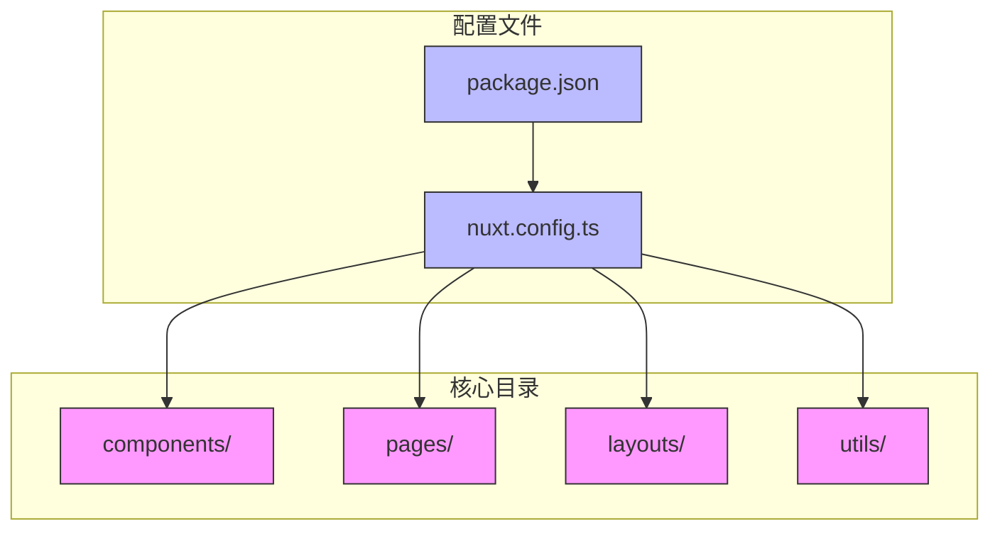
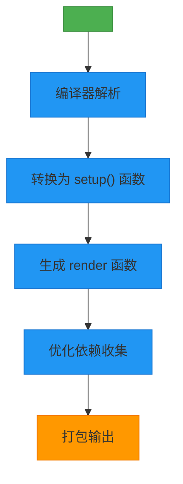
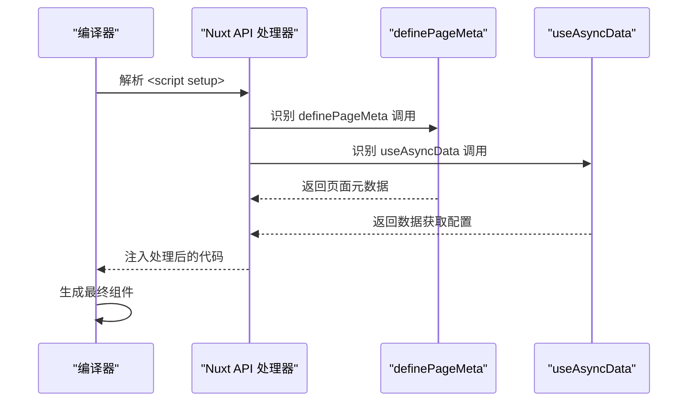
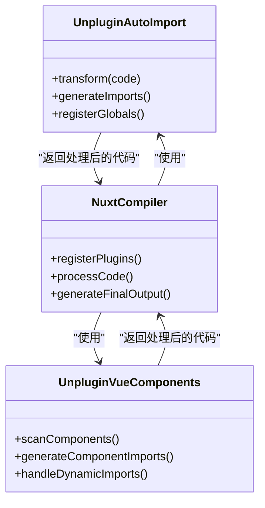

# setup语法糖编译原理与自动导入机制

<cite>
**本文档引用文件**   
- [nuxt.config.ts](file://nuxt.config.ts)
- [app.vue](file://app.vue)
- [index.vue](file://pages/index.vue)
- [HeroSection.vue](file://components/landing/HeroSection.vue)
- [ProductFeatures.vue](file://components/landing/ProductFeatures.vue)
- [package.json](file://package.json)
- [getDocsRoutes.ts](file://utils/getDocsRoutes.ts)
</cite>

## 目录
1. [项目结构分析](#项目结构分析)
2. [setup语法糖的编译机制](#setup语法糖的编译机制)
3. [Nuxt特有API的编译处理](#nuxt特有api的编译处理)
4. [自动导入机制实现原理](#自动导入机制实现原理)
5. [自定义自动导入规则配置](#自定义自动导入规则配置)
6. [app.vue中的无导出组件声明](#appvue中的无导出组件声明)
7. [结论](#结论)

## 项目结构分析

本项目采用Nuxt 4框架构建，遵循约定优于配置的目录结构。核心目录包括`components`（组件）、`pages`（页面）、`layouts`（布局）和`utils`（工具函数）。项目通过`nuxt.config.ts`进行全局配置，利用`<script setup>`语法糖简化Vue 3组件的定义。

**Diagram sources**
- [nuxt.config.ts](file://nuxt.config.ts#L1-L91)
- [package.json](file://package.json#L1-L48)

**Section sources**
- [nuxt.config.ts](file://nuxt.config.ts#L1-L91)
- [package.json](file://package.json#L1-L48)

## setup语法糖的编译机制

Vue 3的`<script setup>`语法糖通过编译时转换实现更简洁的组件定义，避免了运行时开销。在Nuxt 4环境中，该语法被Vite构建工具在编译阶段处理，将顶层变量和函数自动转换为组件的`setup()`函数的返回值。

在`HeroSection.vue`组件中，可以看到`<script setup>`的典型用法，其中导入的Vue Composition API函数（如`ref`、`computed`）和自定义逻辑被直接使用，无需显式返回对象。这种语法糖的使用显著减少了样板代码，提高了开发效率。

**Diagram sources**
- [HeroSection.vue](file://components/landing/HeroSection.vue#L192-L355)

**Section sources**
- [HeroSection.vue](file://components/landing/HeroSection.vue#L192-L355)
- [ProductFeatures.vue](file://components/landing/ProductFeatures.vue#L75-L162)

## Nuxt特有API的编译处理

Nuxt 4提供了`definePageMeta`、`useAsyncData`等特有API，这些API在编译过程中被特殊处理。`definePageMeta`用于定义页面元数据，在编译时被提取并注入到页面配置中；`useAsyncData`用于数据获取，在编译时被转换为适当的异步数据加载逻辑。

在`index.vue`页面中，`definePageMeta`被用来设置页面布局，而`useSeoMeta`则用于配置SEO元数据。这些API的使用无需手动导入，得益于Nuxt的自动导入机制。

**Diagram sources**
- [index.vue](file://pages/index.vue#L14-L27)
- [docs/[...slug].vue](file://pages/docs/[...slug].vue#L185-L210)

**Section sources**
- [index.vue](file://pages/index.vue#L14-L27)
- [docs/[...slug].vue](file://pages/docs/[...slug].vue#L185-L210)

## 自动导入机制实现原理

Nuxt 4基于`unplugin-auto-import`和`unplugin-vue-components`实现API与组件的自动导入。这些插件在编译时分析代码，自动为使用的API和组件添加相应的导入语句，无需开发者手动管理导入。

从`package.json`和`package-lock.json`可以看出，项目依赖了`unplugin-auto-import@20.3.0`和`unplugin-vue-components@30.0.0`，这些插件与Nuxt框架深度集成，实现了无缝的自动导入体验。

**Diagram sources**
- [package.json](file://package.json#L13-L35)
- [package-lock.json](file://package-lock.json#L17608-L17733)

**Section sources**
- [package.json](file://package.json#L13-L35)
- [package-lock.json](file://package-lock.json#L17608-L17733)

## 自定义自动导入规则配置

虽然Nuxt 4提供了开箱即用的自动导入功能，但开发者仍可自定义导入规则。这通常通过在`nuxt.config.ts`中配置相关插件选项来实现，允许添加自定义的导入源、修改导入行为或排除特定的全局变量。

尽管当前项目配置中未显式展示自定义规则，但`unplugin-auto-import`和`unplugin-vue-components`都支持通过配置文件进行深度定制，为复杂项目提供了灵活性。

**Section sources**
- [nuxt.config.ts](file://nuxt.config.ts#L1-L91)

## app.vue中的无导出组件声明

`app.vue`作为Nuxt应用的根组件，展示了无显式`export default`的组件声明方式。通过`<script setup>`语法，组件逻辑被直接定义，编译器自动处理组件的导出。这种方式简化了组件定义，使代码更加简洁。

**Diagram sources**
- [app.vue](file://app.vue#L9-L11)

**Section sources**
- [app.vue](file://app.vue#L9-L11)

## 结论

智言万象项目充分展示了Nuxt 4环境下Vue 3 `setup`语法糖的强大功能。通过编译时转换，`<script setup>`实现了更简洁的组件定义，避免了运行时开销。结合`unplugin-auto-import`和`unplugin-vue-components`，项目实现了API与组件的无缝自动导入，极大地提升了开发效率。Nuxt特有的`definePageMeta`、`useAsyncData`等API在编译过程中被特殊处理，确保了功能的正确实现。`app.vue`中的无显式导出声明方式体现了现代Vue开发的简洁性。整体架构体现了现代前端开发的最佳实践，为复杂应用提供了可扩展的基础。