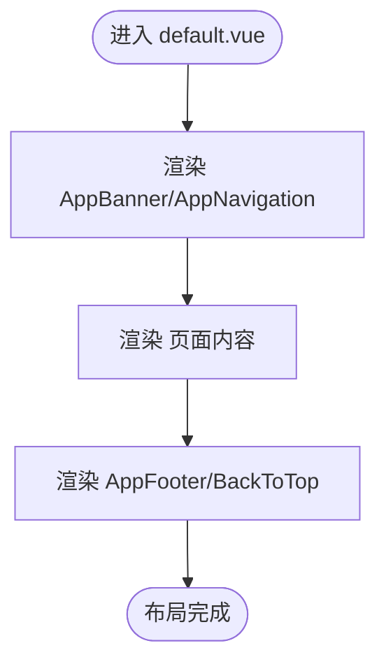

# 全局应用上下文管理与状态继承

<cite>
**本文引用的文件**
- [app.vue](file://app.vue)
- [app.config.ts](file://app.config.ts)
- [layouts/default.vue](file://layouts/default.vue)
- [nuxt.config.ts](file://nuxt.config.ts)
- [pages/demo.vue](file://pages/demo.vue)
- [components/AppNavigation.vue](file://components/AppNavigation.vue)
- [assets/css/main.css](file://assets/css/main.css)
- [package.json](file://package.json)
</cite>

## 目录
1. [简介](#简介)
2. [项目结构](#项目结构)
3. [核心组件](#核心组件)
4. [架构总览](#架构总览)
5. [详细组件分析](#详细组件分析)
6. [依赖关系分析](#依赖关系分析)
7. [性能考量](#性能考量)
8. [故障排查指南](#故障排查指南)
9. [结论](#结论)
10. [附录](#附录)

## 简介
本文件围绕 buidai 项目在 Nuxt 4 中如何通过 app.vue 的 setup 语法构建全局应用上下文，结合 default.vue 布局组件实现根组件上下文的继承与子页面一致的 UI 容器，系统阐述 app.config.ts 与 app.vue 的协同配置最佳实践，涵盖主题模式、语言设置与默认布局继承，并提供在 setup 中使用 useHead 等 API 统一管理元数据与全局状态的路径示例与流程图。

## 项目结构
- 应用入口与布局
  - app.vue：应用根组件，承载页面容器与布局嵌套。
  - layouts/default.vue：默认布局，提供统一的头部、主内容区与底部结构。
- 全局配置
  - app.config.ts：Nuxt UI 模块的全局样式与行为配置（主题色、图标别名）。
  - nuxt.config.ts：应用级 HTML Head、颜色模式、Nitro 输出、字体与内容模块等全局配置。
  - assets/css/main.css：Tailwind 与 @nuxt/ui 的全局样式与深浅色覆盖。
- 示例页面与组件
  - pages/demo.vue：展示 useHead 的 SEO 元数据与结构化数据配置。
  - components/AppNavigation.vue：导航组件，体现布局继承与上下文共享。

**图表来源**
- [app.vue](file://app.vue#L1-L12)
- [layouts/default.vue](file://layouts/default.vue#L1-L25)
- [components/AppNavigation.vue](file://components/AppNavigation.vue#L1-L120)
- [app.config.ts](file://app.config.ts#L1-L83)
- [nuxt.config.ts](file://nuxt.config.ts#L1-L91)
- [assets/css/main.css](file://assets/css/main.css#L1-L39)

**章节来源**
- [app.vue](file://app.vue#L1-L12)
- [layouts/default.vue](file://layouts/default.vue#L1-L25)
- [app.config.ts](file://app.config.ts#L1-L83)
- [nuxt.config.ts](file://nuxt.config.ts#L1-L91)
- [assets/css/main.css](file://assets/css/main.css#L1-L39)

## 核心组件
- app.vue
  - 作用：通过 NuxtLayout/NuxtPage 构建全局页面容器，承载默认布局与页面内容。
  - 特点：在 setup 中预留全局上下文初始化空间，便于挂载全局状态、注入依赖与统一处理生命周期。
- layouts/default.vue
  - 作用：提供统一的 UI 容器（横幅、导航、主内容、页脚、回到顶部），继承根组件上下文并为子页面提供一致的视觉与交互体验。
- app.config.ts
  - 作用：集中配置 @nuxt/ui 的全局样式与行为，如主品牌色与图标别名，影响全站 UI 组件的一致性。
- nuxt.config.ts
  - 作用：全局 Head、颜色模式、Nitro 输出、字体与内容模块等配置，决定应用的基础行为与 SEO 元数据。
- assets/css/main.css
  - 作用：全局 CSS 变量覆盖与基础层样式，配合深色模式实现主题切换。

**章节来源**
- [app.vue](file://app.vue#L1-L12)
- [layouts/default.vue](file://layouts/default.vue#L1-L25)
- [app.config.ts](file://app.config.ts#L1-L83)
- [nuxt.config.ts](file://nuxt.config.ts#L1-L91)
- [assets/css/main.css](file://assets/css/main.css#L1-L39)

## 架构总览
下图展示了从根组件到布局再到页面内容的数据流与依赖关系，强调 app.vue 作为全局上下文的承载者，default.vue 作为布局继承的载体，以及配置文件对全局行为的影响。

**图表来源**
- [app.vue](file://app.vue#L1-L12)
- [layouts/default.vue](file://layouts/default.vue#L1-L25)
- [app.config.ts](file://app.config.ts#L1-L83)
- [nuxt.config.ts](file://nuxt.config.ts#L1-L91)

## 详细组件分析

### app.vue：全局应用上下文与布局嵌套
- 设计要点
  - 使用 NuxtLayout/NuxtPage 实现布局与页面内容的解耦，保证默认布局继承与页面内容独立。
  - 在 setup 中预留全局上下文初始化位置，便于后续注入全局状态、监听全局事件与统一处理生命周期。
- 最佳实践
  - 在 setup 中调用 useAppConfig 获取全局配置（如主题色、图标别名），并与 @nuxt/ui 集成。
  - 对全局状态进行集中管理（例如通过 provide/inject 或全局响应式对象），并在 setup 中完成注入。
  - 使用 onMounted/onUnmounted 等生命周期钩子统一处理全局副作用（如滚动监听、设备检测等）。

**章节来源**
- [app.vue](file://app.vue#L1-L12)
- [app.config.ts](file://app.config.ts#L1-L83)

### layouts/default.vue：布局继承与一致 UI 容器
- 设计要点
  - 通过 slot 接收页面内容，确保子页面无需关心布局细节即可获得一致的 UI 容器。
  - 在布局内集成 AppNavigation/AppFooter/AppBanner/BackToTop 等通用组件，形成统一的导航与交互体验。
- 最佳实践
  - 布局内的样式与主题（如深色模式）应与全局配置保持一致，避免局部覆盖导致的视觉割裂。
  - 布局不承担业务逻辑，仅负责结构与样式，业务逻辑下沉至页面组件，提高复用性与可维护性。

**章节来源**
- [layouts/default.vue](file://layouts/default.vue#L1-L25)
- [components/AppNavigation.vue](file://components/AppNavigation.vue#L1-L120)

### app.config.ts 与 nuxt.config.ts：协同配置全局行为
- app.config.ts
  - 主题色与图标别名：通过 ui.colors.primary 与 ui.icons 定义全局品牌色与图标映射，影响 @nuxt/ui 组件的默认外观。
  - 与 assets/css/main.css 协同：CSS 变量覆盖与深色模式类名共同决定最终视觉表现。
- nuxt.config.ts
  - HTML Head：title、meta、link 等基础 SEO 配置，确保页面在搜索引擎与社交平台的良好展示。
  - 颜色模式：colorMode.classSuffix 控制深色模式类名，与布局与组件样式联动。
  - Nitro 输出：static 预设与 dist 输出目录，便于静态部署与 CI/CD。
  - 内容模块与字体：content.database.sqlite 与 fonts.providers.google 关闭，减少外部依赖与网络风险。

**图表来源**
- [app.config.ts](file://app.config.ts#L1-L83)
- [assets/css/main.css](file://assets/css/main.css#L1-L39)
- [nuxt.config.ts](file://nuxt.config.ts#L1-L91)
- [app.vue](file://app.vue#L1-L12)

**章节来源**
- [app.config.ts](file://app.config.ts#L1-L83)
- [assets/css/main.css](file://assets/css/main.css#L1-L39)
- [nuxt.config.ts](file://nuxt.config.ts#L1-L91)

### 页面元数据与全局状态：以 pages/demo.vue 为例
- useHead 的使用
  - 在页面 setup 中调用 useHead 设置 title、meta、link 与结构化数据（JSON-LD），确保 SEO 与社交分享预览一致。
  - 通过 link: [{ rel: 'canonical', ... }] 指定规范 URL，避免重复内容问题。
- 全局状态与上下文
  - 页面可读取全局配置（如主题色、图标别名），并通过 provide/inject 与根组件共享状态。
  - 布局继承使页面无需重复声明头部与导航，直接专注于业务内容。

**图表来源**
- [pages/demo.vue](file://pages/demo.vue#L136-L251)
- [app.vue](file://app.vue#L1-L12)
- [layouts/default.vue](file://layouts/default.vue#L1-L25)

**章节来源**
- [pages/demo.vue](file://pages/demo.vue#L136-L251)

### 组件协作与依赖注入：AppNavigation 与布局
- AppNavigation 作为布局的一部分，通过 computed 与响应式状态（如 isTransparent/headerClasses/navigationMenuUi）动态适配布局状态。
- 布局继承使得导航组件无需感知具体页面内容，仅需关注自身 UI 与交互逻辑，从而实现高内聚低耦合。

**图表来源**
- [components/AppNavigation.vue](file://components/AppNavigation.vue#L1-L120)
- [layouts/default.vue](file://layouts/default.vue#L1-L25)

**章节来源**
- [components/AppNavigation.vue](file://components/AppNavigation.vue#L1-L120)
- [layouts/default.vue](file://layouts/default.vue#L1-L25)

## 依赖关系分析
- 模块依赖
  - @nuxt/ui：提供统一组件库与主题能力，受 app.config.ts 与 assets/css/main.css 影响。
  - @nuxt/content：内容模块，受 nuxt.config.ts content 数据库与预渲染配置影响。
  - @nuxtjs/color-mode：颜色模式模块，受 nuxt.config.ts colorMode 配置影响。
  - Tailwind CSS：基础样式框架，与 @nuxt/ui 协同工作。
- 文件间耦合
  - app.vue 与 layouts/default.vue：通过 NuxtLayout/NuxtPage 实现布局继承，耦合度低，职责清晰。
  - app.config.ts 与 assets/css/main.css：共同决定 UI 主题与视觉表现，存在间接耦合。
  - nuxt.config.ts 与 app.vue：nuxt.config.ts 的 Head/颜色模式/Nitro 配置直接影响 app.vue 的渲染与 SEO。

**图表来源**
- [package.json](file://package.json#L1-L48)
- [nuxt.config.ts](file://nuxt.config.ts#L1-L91)
- [app.config.ts](file://app.config.ts#L1-L83)
- [assets/css/main.css](file://assets/css/main.css#L1-L39)
- [app.vue](file://app.vue#L1-L12)
- [layouts/default.vue](file://layouts/default.vue#L1-L25)

**章节来源**
- [package.json](file://package.json#L1-L48)
- [nuxt.config.ts](file://nuxt.config.ts#L1-L91)

## 性能考量
- 静态输出与预渲染
  - nuxt.config.ts 中 nitro.preset: 'static' 与 prerender.routes 使用动态生成的文档路由，有助于提升首屏性能与 SEO。
- 字体与资源加载
  - nuxt.config.ts 关闭 googleicons 与 fonts.providers.google，减少外部依赖；通过 link.preconnect 与 link.stylesheet 提升字体加载效率。
- 样式与主题
  - app.config.ts 与 assets/css/main.css 的组合避免了大量内联样式，有利于缓存与复用。

[本节为通用性能讨论，不直接分析具体文件]

## 故障排查指南
- SEO 元数据未生效
  - 检查 pages/demo.vue 中 useHead 的调用时机与参数是否正确，确保 title、meta、link、script 配置完整。
  - 确认 nuxt.config.ts app.head 是否包含基础 SEO 配置，避免被页面级配置覆盖。
- 主题色与图标不一致
  - 检查 app.config.ts 的 ui.colors.primary 与 ui.icons 是否正确映射，同时确认 assets/css/main.css 的 :root/.dark 变量覆盖是否生效。
- 深色模式切换异常
  - 检查 nuxt.config.ts colorMode.classSuffix 配置，确保与布局与组件样式一致。
- 布局继承问题
  - 确认 app.vue 使用 NuxtLayout/NuxtPage，且子页面未显式覆盖布局；若需自定义布局，请在页面级通过 layout 属性指定。

**章节来源**
- [pages/demo.vue](file://pages/demo.vue#L136-L251)
- [app.config.ts](file://app.config.ts#L1-L83)
- [assets/css/main.css](file://assets/css/main.css#L1-L39)
- [nuxt.config.ts](file://nuxt.config.ts#L1-L91)
- [app.vue](file://app.vue#L1-L12)

## 结论
buidai 项目通过 app.vue 的 setup 语法构建全局应用上下文，结合 default.vue 布局实现根组件上下文的继承与子页面一致的 UI 容器。app.config.ts 与 nuxt.config.ts 协同配置全局行为（主题、图标、SEO、颜色模式与输出），pages/demo.vue 展示了在 setup 中使用 useHead 等 API 统一管理元数据与结构化数据的最佳实践。通过 provide/inject 与布局继承，项目实现了高内聚、低耦合的全局状态与 UI 管理。

[本节为总结性内容，不直接分析具体文件]

## 附录
- 术语说明
  - 全局应用上下文：指在 app.vue 中集中初始化的状态、配置与依赖，供整个应用共享。
  - 布局继承：指通过 NuxtLayout/NuxtPage 将默认布局应用于所有页面，保证一致的 UI 容器。
  - useHead：Nuxt 提供的 API，用于在页面级动态设置 HTML Head 元素。
  - useAppConfig：Nuxt 提供的 API，用于读取与合并全局应用配置。

[本节为概念性内容，不直接分析具体文件]