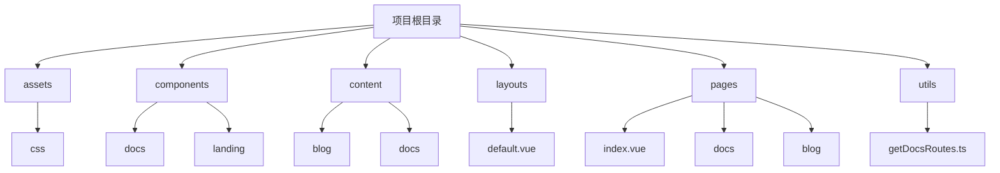

# 页面元信息管理与definePageMeta应用

<cite>
**本文档引用文件**
- [index.vue](file://pages/index.vue)
- [docs/index.vue](file://pages/docs/index.vue)
- [docs/[...slug].vue](file://pages/docs/[...slug].vue)
- [contact.vue](file://pages/contact.vue)
- [pricing.vue](file://pages/pricing.vue)
- [about.vue](file://pages/about.vue)
- [blog/index.vue](file://pages/blog/index.vue)
- [layouts/default.vue](file://layouts/default.vue)
- [components/AppNavigation.vue](file://components/AppNavigation.vue)
- [nuxt.config.ts](file://nuxt.config.ts)
- [utils/getDocsRoutes.ts](file://utils/getDocsRoutes.ts)
- [demo.vue](file://pages/demo.vue)
</cite>

## 目录
1. [引言](#引言)
2. [项目结构与页面布局](#项目结构与页面布局)
3. [核心元信息管理机制](#核心元信息管理机制)
4. [definePageMeta在setup语法中的应用](#definepagemeta在setup语法中的应用)
5. [default布局与页面渲染协同](#default布局与页面渲染协同)
6. [实际用例分析](#实际用例分析)
7. [动态元信息与条件布局](#动态元信息与条件布局)
8. [SEO优化策略](#seo优化策略)
9. [国际化与社交媒体配置](#国际化与社交媒体配置)
10. [与Nuxt预设布局系统集成](#与nuxt预设布局系统集成)
11. [结论](#结论)

## 引言

在buidai项目中，页面级元信息的管理是确保网站SEO优化、用户体验和搜索引擎可见性的关键环节。通过`definePageMeta`在setup语法中声明页面级元信息，开发者能够灵活地控制每个页面的标题、描述、关键词和布局选择。本文档将深入探讨如何在buidai项目中使用`definePageMeta`来实现这些功能，并结合`default.vue`布局结构，说明元信息如何与`AppNavigation`和页面内容协同渲染。

## 项目结构与页面布局

buidai项目的目录结构清晰，主要分为以下几个部分：
- `assets/css/`：存放CSS样式文件。
- `components/`：存放可复用的Vue组件。
- `content/`：存放Markdown格式的内容文件，如博客文章和文档。
- `layouts/`：存放页面布局文件，如`default.vue`。
- `pages/`：存放页面组件，每个`.vue`文件对应一个路由。
- `utils/`：存放工具函数，如`getDocsRoutes.ts`用于生成文档路由。



**图示来源**
- [项目结构](file://README.md#L1-L50)

## 核心元信息管理机制

在buidai项目中，页面元信息的管理主要依赖于Nuxt框架提供的`definePageMeta`和`useSeoMeta`函数。`definePageMeta`用于在setup语法中声明页面级元信息，而`useSeoMeta`则用于设置SEO相关的元数据，如标题、描述和关键词。

### definePageMeta

`definePageMeta`是一个Nuxt提供的组合式API，允许在`<script setup>`中定义页面的元信息。这些元信息可以包括布局选择、页面标题、描述等。例如，在`index.vue`中，我们可以通过`definePageMeta`指定页面使用`default`布局：

```vue
<script setup>
definePageMeta({
  layout: 'default'
})
</script>
```

### useSeoMeta

`useSeoMeta`函数用于设置页面的SEO元数据，包括标题、描述、关键词等。这些元数据会被注入到HTML的`<head>`标签中，帮助搜索引擎更好地理解和索引页面内容。例如，在`index.vue`中，我们可以通过`useSeoMeta`设置页面的标题和描述：

```vue
<script setup>
useSeoMeta({
  title: '必创AI - BuidAI新一代AI一站式创意生产力平台',
  description: '必创AI - BuidAI新一代AI一站式创意生产力平台，为您提供全方位的智能创作服务。从AI对话、AI绘画、AI视频到知识库查询、模型管理，再到文件导入导出、网页解析、内容总结、图表生成等强大功能，满足您在创意工作中的各种需求。更有AI配音工具、艺术二维码、PDF解析工具、图文解析、文档问答、豆包文生图、AI改图、图像识别、网页速读、快递查询、天气查询以及爆款文章生成等特色功能，助力您高效创作，提升生产力，开启智能创意新时代',
  keywords: '必创AI, BuidAI, AI创意生产力平台, 智能体,香蕉绘画Nanobanana, AI绘画, AI视频, AI对话, Sora2, 知识库, 内容总结, PDF解析工具, 文档问答, 爆款文章生成'
})
</script>
```

## definePageMeta在setup语法中的应用

在buidai项目中，`definePageMeta`被广泛应用于各个页面组件中，以声明页面级元信息。通过在`<script setup>`中使用`definePageMeta`，开发者可以轻松地为每个页面设置不同的布局、标题、描述等元信息。

### 布局选择

`definePageMeta`的一个重要用途是选择页面布局。在buidai项目中，`default.vue`是默认的页面布局，包含了`AppBanner`、`AppNavigation`、`AppFooter`和`BackToTop`等全局组件。通过在页面组件中使用`definePageMeta`，可以指定页面使用`default`布局或其他自定义布局。

例如，在`contact.vue`中，我们通过`definePageMeta`指定页面使用`default`布局：

```vue
<script setup lang="ts">
definePageMeta({
  layout: 'default'
})
</script>
```

### 页面标题与描述

除了布局选择，`definePageMeta`还可以用于设置页面的标题和描述。虽然`useSeoMeta`是更常用的方法，但在某些情况下，`definePageMeta`也可以直接设置这些元信息。例如，在`pricing.vue`中，我们通过`useSeoMeta`设置页面的标题和描述：

```vue
<script setup lang="ts">
useSeoMeta({
  title: '必创AI - 价格方案 - BuidAI | 灵活透明的 AI 平台订阅计划',
  description: '必创AI-BuidAI提供基础版、标准版、专业版及企业定制版等多种价格方案，满足个人开发者、初创团队及大型企业的不同 AI 应用开发需求。'
})
</script>
```

## default布局与页面渲染协同

`default.vue`是buidai项目中的默认页面布局，它定义了页面的基本结构，包括顶部横幅、导航栏、主要内容区域、页脚和返回顶部按钮。通过`<slot />`插槽，`default.vue`可以灵活地插入不同页面的内容。

### 布局结构

`default.vue`的结构如下：

```vue
<template>
  <div class="min-h-screen bg-gray-50 dark:bg-gray-900 transition-colors duration-200">
    <!-- 顶部横幅 -->
    <AppBanner />

    <!-- 导航 -->
    <AppNavigation />

    <!-- 主要内容 -->
    <main>
      <slot />
    </main>

    <!-- Footer -->
    <AppFooter />

    <!-- 返回顶部按钮 -->
    <BackToTop />
  </div>
</template>
```

### 协同渲染

当一个页面组件使用`default`布局时，其内容会被插入到`<slot />`中，从而与`AppBanner`、`AppNavigation`、`AppFooter`和`BackToTop`等全局组件协同渲染。例如，在`index.vue`中，页面内容被插入到`<slot />`中，与`AppNavigation`和`AppFooter`一起构成完整的页面。

```vue
<template>
  <div class="bg-white min-h-screen">
    <LandingHeroSection />
    <LandingFeatureCarousel />
    <LandingValueProps />
    <LandingScenarioSection />
    <LandingProductFeatures />
    <LandingProductDesign />
    <LandingCallToAction />
    <LandingAIArsenal />
  </div>
</template>

<script setup>
definePageMeta({
  layout: 'default'
})

useSeoMeta({
  title: '必创AI - BuidAI新一代AI一站式创意生产力平台',
  description: '必创AI - BuidAI新一代AI一站式创意生产力平台，为您提供全方位的智能创作服务。从AI对话、AI绘画、AI视频到知识库查询、模型管理，再到文件导入导出、网页解析、内容总结、图表生成等强大功能，满足您在创意工作中的各种需求。更有AI配音工具、艺术二维码、PDF解析工具、图文解析、文档问答、豆包文生图、AI改图、图像识别、网页速读、快递查询、天气查询以及爆款文章生成等特色功能，助力您高效创作，提升生产力，开启智能创意新时代',
  keywords: '必创AI, BuidAI, AI创意生产力平台, 智能体,香蕉绘画Nanobanana, AI绘画, AI视频, AI对话, Sora2, 知识库, 内容总结, PDF解析工具, 文档问答, 爆款文章生成'
})
</script>
```

## 实际用例分析

### index.vue

`index.vue`是buidai项目的首页，它使用`default`布局，并通过`useSeoMeta`设置了页面的标题、描述和关键词。页面内容包括多个`Landing`系列组件，如`LandingHeroSection`、`LandingFeatureCarousel`等，这些组件共同构成了首页的视觉效果。

### docs/index.vue

`docs/index.vue`是文档中心的首页，它同样使用`default`布局，并通过`useSeoMeta`设置了页面的标题和描述。页面内容包括一个`UPageGrid`组件，用于展示文档导航结构，方便用户快速查找和搜索引擎爬取。

### blog/index.vue

`blog/index.vue`是技术博客的首页，它使用`default`布局，并通过`useSeoMeta`设置了页面的标题和描述。页面内容包括一个`NuxtLink`组件，用于展示博客文章列表，用户可以通过点击文章标题进入详细页面。

## 动态元信息与条件布局

在buidai项目中，动态元信息和条件布局是提升用户体验的重要手段。通过`definePageMeta`和`useSeoMeta`，开发者可以根据不同的条件动态设置页面的元信息和布局。

### 动态元信息

动态元信息是指根据页面内容或用户行为动态生成的元信息。例如，在`docs/[...slug].vue`中，页面的标题和描述是根据文档内容动态生成的：

```vue
<script setup lang="ts">
const route = useRoute()
const currentPath = computed(() => {
  const path = route.path
  const decodedPath = decodeURIComponent(path)
  return decodedPath.endsWith('/') && decodedPath !== '/'
    ? decodedPath.slice(0, -1)
    : decodedPath
})

const [{ data: page }, { data: surround }] = await Promise.all([
  useAsyncData(`docs-${currentPath.value}`, async () => {
    const exact = await queryCollection('docs').where('path', '=', currentPath.value).first()
    if (exact) return exact

    const allDocs = await queryCollection('docs').select('path').all()
    const found = allDocs.find(doc => {
      const cleanPath = doc.path
        .split('/')
        .map(p => p.replace(/^\d+\./, ''))
        .join('/')
        .replace(/\/index$/, '')

      const cleanCurrent = currentPath.value.replace(/\/$/, '')

      return cleanPath === cleanCurrent
    })

    if (found) {
      return queryCollection('docs').where('path', '=', found.path).first()
    }

    return null
  }),
  useAsyncData(`docs-surround-${currentPath.value}`, () => queryCollectionItemSurroundings('docs', currentPath.value, {
    fields: ['title', 'path']
  }))
])

useSeoMeta({
  title: page.value ? `${page.value.title} - 文档中心` : '文档中心',
  description: page.value?.description || 'BuidAI 文档中心'
})
</script>
```

### 条件布局

条件布局是指根据不同的条件选择不同的页面布局。在buidai项目中，虽然大多数页面使用`default`布局，但某些特殊页面可能需要使用其他布局。例如，`demo.vue`可能需要使用一个专门的布局来展示产品演示。

## SEO优化策略

在buidai项目中，SEO优化是确保网站在搜索引擎中获得良好排名的关键。通过合理使用`definePageMeta`和`useSeoMeta`，开发者可以有效地提升页面的SEO表现。

### 关键词优化

关键词是SEO优化的核心。在`useSeoMeta`中，通过设置`keywords`字段，可以指定页面的关键字。这些关键字应该与页面内容高度相关，以便搜索引擎能够准确地索引页面。例如，在`index.vue`中，我们设置了多个与AI创意生产力平台相关的关键词：

```vue
useSeoMeta({
  keywords: '必创AI, BuidAI, AI创意生产力平台, 智能体,香蕉绘画Nanobanana, AI绘画, AI视频, AI对话, Sora2, 知识库, 内容总结, PDF解析工具, 文档问答, 爆款文章生成'
})
```

### 描述优化

页面描述是搜索引擎结果摘要中的重要部分。通过设置`description`字段，可以提供一个简短而准确的页面概述。描述应该简洁明了，包含页面的主要内容和关键词。例如，在`index.vue`中，我们设置了详细的页面描述：

```vue
useSeoMeta({
  description: '必创AI - BuidAI新一代AI一站式创意生产力平台，为您提供全方位的智能创作服务。从AI对话、AI绘画、AI视频到知识库查询、模型管理，再到文件导入导出、网页解析、内容总结、图表生成等强大功能，满足您在创意工作中的各种需求。更有AI配音工具、艺术二维码、PDF解析工具、图文解析、文档问答、豆包文生图、AI改图、图像识别、网页速读、快递查询、天气查询以及爆款文章生成等特色功能，助力您高效创作，提升生产力，开启智能创意新时代'
})
```

### Open Graph协议

Open Graph协议是社交媒体分享预览的重要标准。通过设置`og:title`、`og:description`、`og:image`等字段，可以确保页面在社交媒体上分享时显示正确的预览信息。例如，在`index.vue`中，我们设置了Open Graph协议的相关字段：

```vue
useSeoMeta({
  ogTitle: '必创AI - BuidAI新一代AI一站式创意生产力平台',
  ogDescription: '必创AI - BuidAI 致力于降低企业 AI 应用开发门槛，赋能每一个团队构建智能未来。',
  ogType: 'website'
})
```

## 国际化与社交媒体配置

在buidai项目中，国际化和社交媒体配置是提升全球用户访问体验的重要手段。通过合理配置多语言元数据和社交媒体分享卡片，可以确保网站在不同语言和地区都能获得良好的用户体验。

### 多语言元数据

多语言元数据是指为不同语言版本的页面设置相应的元信息。在buidai项目中，虽然目前主要使用中文，但未来可能需要支持其他语言。通过`useSeoMeta`，可以为不同语言版本的页面设置不同的标题、描述和关键词。例如，为英文版本的页面设置元信息：

```vue
useSeoMeta({
  title: 'BuidAI - The Next-Generation AI Creative Productivity Platform',
  description: 'BuidAI provides a comprehensive suite of AI-powered creative tools, from AI chat, AI art, AI video to knowledge base queries, model management, file import/export, web parsing, content summarization, chart generation, and more. With features like AI voice synthesis, artistic QR codes, PDF parsing tools, image recognition, web speed reading, express tracking, weather queries, and viral article generation, BuidAI empowers you to create efficiently and enhance productivity, ushering in a new era of intelligent creativity.',
  keywords: 'BuidAI, AI creative productivity platform, intelligent agents, Nanobanana AI art, AI art, AI video, AI chat, Sora2, knowledge base, content summarization, PDF parsing tools, document Q&A, viral article generation'
})
```

### 社交媒体分享卡片

社交媒体分享卡片是指在社交媒体上分享页面时显示的预览信息。通过设置Open Graph协议和Twitter Cards标签，可以确保页面在社交媒体上分享时显示正确的预览信息。例如，在`demo.vue`中，我们设置了Twitter Cards标签：

```vue
useHead({
  meta: [
    { name: 'twitter:card', content: 'summary_large_image' },
    { name: 'twitter:title', content: pageTitle },
    { name: 'twitter:description', content: pageDescription },
    { name: 'twitter:image', content: ogImage }
  ]
})
```

## 与Nuxt预设布局系统集成

Nuxt框架提供了强大的预设布局系统，允许开发者轻松地管理和切换页面布局。在buidai项目中，`definePageMeta`与Nuxt预设布局系统的集成非常紧密，通过简单的配置即可实现复杂的布局管理。

### 预设布局

Nuxt预设布局系统允许开发者在`layouts/`目录下定义多个布局文件，每个布局文件对应一个布局。在`definePageMeta`中，通过设置`layout`字段，可以指定页面使用哪个布局。例如，在`contact.vue`中，我们指定了页面使用`default`布局：

```vue
<script setup lang="ts">
definePageMeta({
  layout: 'default'
})
</script>
```

### 自定义布局

除了使用预设布局，开发者还可以创建自定义布局。例如，可以创建一个名为`custom.vue`的布局文件，用于特定页面的特殊需求。在`definePageMeta`中，通过设置`layout`字段为`custom`，可以指定页面使用自定义布局。

```vue
<script setup lang="ts">
definePageMeta({
  layout: 'custom'
})
</script>
```

## 结论

在buidai项目中，通过`definePageMeta`在setup语法中声明页面级元信息，结合`default.vue`布局结构，可以有效地管理页面的标题、描述、关键词和布局选择。通过`useSeoMeta`设置SEO元数据，可以提升页面的搜索引擎可见性。动态元信息和条件布局的使用，使得页面能够根据不同的条件灵活地调整元信息和布局。国际化和社交媒体配置的优化，确保了网站在全球范围内的良好用户体验。与Nuxt预设布局系统的紧密集成，使得布局管理变得简单而高效。通过这些技术和策略，buidai项目能够提供高质量的用户体验和优秀的SEO表现。

**文档来源**
- [index.vue](file://pages/index.vue#L1-L28)
- [docs/index.vue](file://pages/docs/index.vue#L1-L129)
- [docs/[...slug].vue](file://pages/docs/[...slug].vue#L1-L348)
- [contact.vue](file://pages/contact.vue#L1-L154)
- [pricing.vue](file://pages/pricing.vue#L1-L453)
- [about.vue](file://pages/about.vue#L1-L251)
- [blog/index.vue](file://pages/blog/index.vue#L1-L153)
- [layouts/default.vue](file://layouts/default.vue#L1-L25)
- [components/AppNavigation.vue](file://components/AppNavigation.vue#L1-L309)
- [nuxt.config.ts](file://nuxt.config.ts#L1-L91)
- [utils/getDocsRoutes.ts](file://utils/getDocsRoutes.ts#L1-L58)
- [demo.vue](file://pages/demo.vue#L136-L239)
