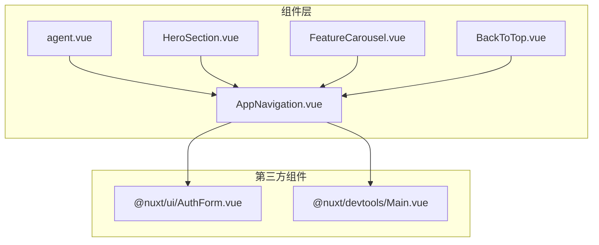
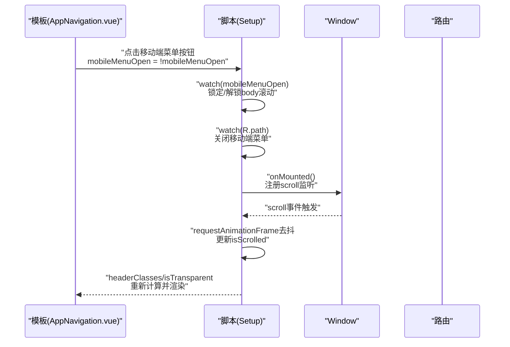
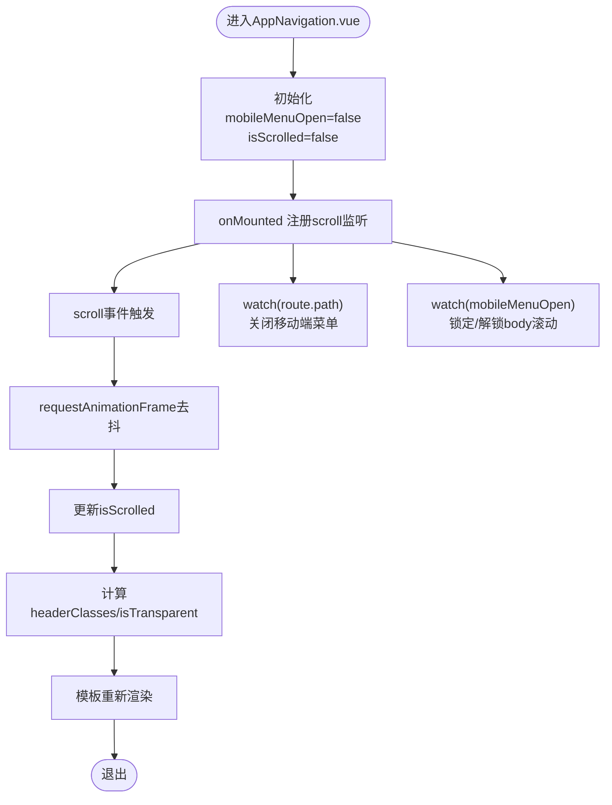
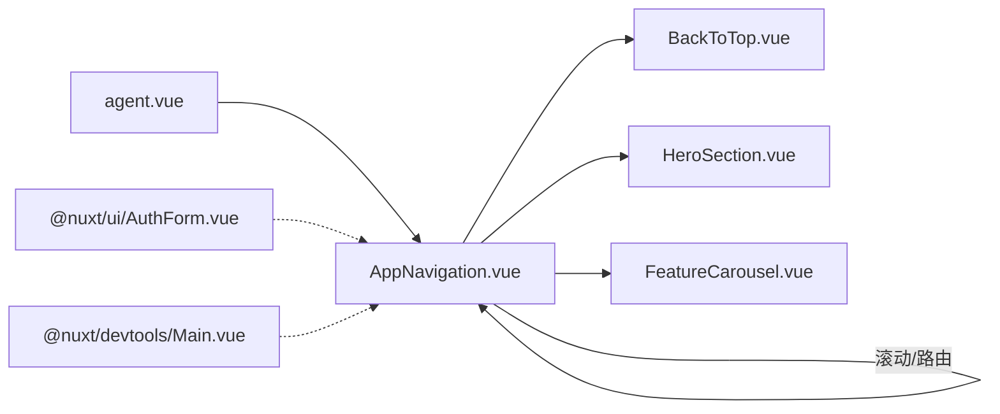

# ref与reactive：状态管理基础

<cite>
**本文引用的文件**
- [components/AppNavigation.vue](file://components/AppNavigation.vue)
- [components/BackToTop.vue](file://components/BackToTop.vue)
- [components/landing/HeroSection.vue](file://components/landing/HeroSection.vue)
- [components/landing/FeatureCarousel.vue](file://components/landing/FeatureCarousel.vue)
- [pages/agent.vue](file://pages/agent.vue)
- [@nuxt/ui/AuthForm.vue](file://node_modules/@nuxt/ui/dist/runtime/components/AuthForm.vue)
- [@nuxt/devtools/Main.vue](file://node_modules/@nuxt/devtools/dist/runtime/plugins/view/Main.vue)
</cite>

## 目录
1. [简介](#简介)
2. [项目结构](#项目结构)
3. [核心组件](#核心组件)
4. [架构总览](#架构总览)
5. [详细组件分析](#详细组件分析)
6. [依赖关系分析](#依赖关系分析)
7. [性能考量](#性能考量)
8. [故障排查指南](#故障排查指南)
9. [结论](#结论)
10. [附录](#附录)

## 简介
本文件围绕Vue 3在智言万象项目中的状态管理实践，系统解析ref与reactive的应用边界与差异。重点以AppNavigation.vue为例，说明如何使用ref定义布尔型响应式状态（如移动端菜单开关与滚动状态），阐述其在组件生命周期中的初始化、更新与监听机制；同时对比reactive在复杂对象管理中的适用场景，解释为何对简单布尔或标量状态优先选择ref而非reactive。文末提供ref自动解包特性在模板与脚本中的差异表现，以及避免常见陷阱（如解包丢失、深层嵌套响应性断裂）的实践建议。

## 项目结构
本项目采用基于功能的组件组织方式，导航、落地页、工具类组件分别位于components目录下，页面级组件位于pages目录。状态管理主要集中在<script setup>中，配合生命周期钩子与watch/watchEffect完成交互。

图表来源
- [components/AppNavigation.vue](file://components/AppNavigation.vue#L1-L309)
- [components/BackToTop.vue](file://components/BackToTop.vue#L215-L280)
- [components/landing/HeroSection.vue](file://components/landing/HeroSection.vue#L250-L392)
- [components/landing/FeatureCarousel.vue](file://components/landing/FeatureCarousel.vue#L125-L324)
- [pages/agent.vue](file://pages/agent.vue#L450-L470)
- [@nuxt/ui/AuthForm.vue](file://node_modules/@nuxt/ui/dist/runtime/components/AuthForm.vue#L40-L76)
- [@nuxt/devtools/Main.vue](file://node_modules/@nuxt/devtools/dist/runtime/plugins/view/Main.vue#L10-L209)

章节来源
- [components/AppNavigation.vue](file://components/AppNavigation.vue#L1-L309)

## 核心组件
- AppNavigation.vue：演示了ref在布尔状态管理中的完整用法，包括生命周期初始化、滚动监听更新、路由变更关闭菜单、移动端滚动锁定等。
- BackToTop.vue：展示了多个布尔状态的组合使用，体现ref在简单状态上的简洁表达。
- HeroSection.vue：包含布尔状态与字符串状态的混合使用，强调ref在标量状态上的直观性。
- FeatureCarousel.vue：在复杂交互中使用ref存储DOM引用与数值状态，配合requestAnimationFrame实现高性能动画。
- agent.vue：FAQ展开/收起的状态管理，使用ref保存索引或空值，体现ref在标量状态下的易用性。
- @nuxt/ui/AuthForm.vue：使用reactive管理表单字段集合，展示复杂对象场景下reactive的优势。
- @nuxt/devtools/Main.vue：多处使用reactive维护布局与拖拽状态，体现复杂对象与联动计算的场景。

章节来源
- [components/AppNavigation.vue](file://components/AppNavigation.vue#L140-L309)
- [components/BackToTop.vue](file://components/BackToTop.vue#L215-L280)
- [components/landing/HeroSection.vue](file://components/landing/HeroSection.vue#L250-L392)
- [components/landing/FeatureCarousel.vue](file://components/landing/FeatureCarousel.vue#L125-L324)
- [pages/agent.vue](file://pages/agent.vue#L450-L470)
- [@nuxt/ui/AuthForm.vue](file://node_modules/@nuxt/ui/dist/runtime/components/AuthForm.vue#L40-L76)
- [@nuxt/devtools/Main.vue](file://node_modules/@nuxt/devtools/dist/runtime/plugins/view/Main.vue#L10-L209)

## 架构总览
下图展示了AppNavigation.vue中关键状态与生命周期的交互关系，以及与模板绑定的路径。

图表来源
- [components/AppNavigation.vue](file://components/AppNavigation.vue#L140-L309)

## 详细组件分析

### AppNavigation.vue：ref在布尔状态管理中的应用
- 状态定义
  - 使用ref定义布尔状态mobileMenuOpen与isScrolled，分别控制移动端菜单开关与滚动状态。
- 生命周期初始化与更新
  - 在onMounted中注册scroll监听并在首次进入时执行一次检查，确保初始状态正确。
  - 使用requestAnimationFrame对滚动事件进行节流，避免频繁重排与重绘。
- 监听与副作用
  - 监听route.path变化，当路由切换时自动关闭移动端菜单。
  - 监听mobileMenuOpen变化，动态设置document.body的overflow以锁定/解锁滚动。
- 计算状态与模板绑定
  - isScrolled参与计算headerClasses与isTransparent，从而驱动头部样式与透明度切换。
- 为什么选择ref而非reactive
  - 布尔状态是标量，使用ref更直观、语义清晰，且天然具备自动解包特性，便于在模板中直接使用。
  - reactive更适合复杂对象的响应式管理，若将布尔状态放入reactive对象，会增加不必要的嵌套与访问成本。

图表来源
- [components/AppNavigation.vue](file://components/AppNavigation.vue#L140-L309)

章节来源
- [components/AppNavigation.vue](file://components/AppNavigation.vue#L140-L309)

### BackToTop.vue：多个布尔状态的组合使用
- 多个布尔状态（如isVisible、showQRCode、showAfterSales、showClickQRCode）均通过ref定义，便于在模板中直接绑定与切换。
- 该组件展示了ref在简单布尔状态上的典型用法：声明、赋值、监听与模板绑定。

章节来源
- [components/BackToTop.vue](file://components/BackToTop.vue#L215-L280)

### HeroSection.vue：标量与布尔状态的混合使用
- 使用ref定义布尔状态isMobile与字符串状态typeWriterText，分别用于设备检测与打字机文本。
- 该组件体现了ref在标量状态上的简洁性与可读性。

章节来源
- [components/landing/HeroSection.vue](file://components/landing/HeroSection.vue#L250-L392)

### FeatureCarousel.vue：复杂交互中的ref使用
- 使用ref存储DOM引用（cardRefs）与数值状态（isDragging、startX、initialScrollLeft），并通过requestAnimationFrame实现高性能滚动与变换。
- 该组件展示了ref在复杂交互场景中对DOM引用与数值状态的良好支持。

章节来源
- [components/landing/FeatureCarousel.vue](file://components/landing/FeatureCarousel.vue#L125-L324)

### agent.vue：FAQ展开/收起的状态管理
- 使用ref保存当前展开的FAQ索引或空值，通过toggleFaq函数在点击时切换状态，体现ref在标量状态下的易用性。

章节来源
- [pages/agent.vue](file://pages/agent.vue#L450-L470)

### @nuxt/ui/AuthForm.vue：reactive在复杂对象管理中的应用
- 使用reactive创建一个动态字段集合state，按传入的fields数组初始化每个字段的默认值，便于统一管理表单字段状态。
- 该组件展示了reactive在复杂对象场景下的优势：集中管理、易于扩展、与模板双向绑定友好。

章节来源
- [@nuxt/ui/AuthForm.vue](file://node_modules/@nuxt/ui/dist/runtime/components/AuthForm.vue#L40-L76)

### @nuxt/devtools/Main.vue：复杂对象与联动计算
- 使用reactive维护面板边距、窗口尺寸、拖拽偏移与鼠标位置等复杂对象，并通过computed与watchEffect实现联动计算与响应式更新。
- 该组件体现了reactive在复杂对象与多状态联动场景中的适用性。

章节来源
- [@nuxt/devtools/Main.vue](file://node_modules/@nuxt/devtools/dist/runtime/plugins/view/Main.vue#L10-L209)

## 依赖关系分析
- 组件间依赖
  - AppNavigation.vue与BackToTop.vue、HeroSection.vue、FeatureCarousel.vue、agent.vue存在间接依赖（如滚动行为影响头部样式）。
  - 第三方组件@nuxt/ui/AuthForm.vue与@nuxt/devtools/Main.vue在复杂对象管理与联动计算方面提供了参考实现。
- 状态依赖
  - AppNavigation.vue中的isScrolled与mobileMenuOpen依赖于浏览器事件与路由变化，形成“事件→状态→视图”的闭环。
  - BackToTop.vue、HeroSection.vue、FeatureCarousel.vue中的状态分别依赖于滚动、窗口尺寸与用户交互。

图表来源
- [components/AppNavigation.vue](file://components/AppNavigation.vue#L140-L309)
- [components/BackToTop.vue](file://components/BackToTop.vue#L215-L280)
- [components/landing/HeroSection.vue](file://components/landing/HeroSection.vue#L250-L392)
- [components/landing/FeatureCarousel.vue](file://components/landing/FeatureCarousel.vue#L125-L324)
- [pages/agent.vue](file://pages/agent.vue#L450-L470)
- [@nuxt/ui/AuthForm.vue](file://node_modules/@nuxt/ui/dist/runtime/components/AuthForm.vue#L40-L76)
- [@nuxt/devtools/Main.vue](file://node_modules/@nuxt/devtools/dist/runtime/plugins/view/Main.vue#L10-L209)

## 性能考量
- 使用requestAnimationFrame对滚动事件进行节流，减少isScrolled更新频率，降低重排与重绘成本。
- 在复杂交互中，优先使用ref存储DOM引用与数值状态，避免不必要的对象深拷贝与响应式代理开销。
- 对于复杂对象，使用reactive集中管理，避免分散的ref导致的重复响应式追踪与更新。

## 故障排查指南
- 解包丢失问题
  - 在模板中直接使用ref变量名即可获得其值，无需.value；在脚本中访问ref值需使用.value。若在模板中误写.value或在脚本中省略.value，会导致状态无法正确更新或渲染异常。
  - 参考路径：[components/AppNavigation.vue](file://components/AppNavigation.vue#L140-L309)
- 深层嵌套响应性断裂
  - 将简单布尔或标量状态放入reactive对象中，会引入额外的代理层级，增加访问成本且容易出现解包丢失。对于简单状态，优先使用ref。
  - 参考路径：[@nuxt/ui/AuthForm.vue](file://node_modules/@nuxt/ui/dist/runtime/components/AuthForm.vue#L40-L76)
- 事件监听未清理
  - 在onUnmounted中必须移除事件监听，避免内存泄漏与重复触发。AppNavigation.vue中已正确处理滚动监听的注册与注销。
  - 参考路径：[components/AppNavigation.vue](file://components/AppNavigation.vue#L140-L309)
- 模板与脚本混用错误
  - 在模板中直接使用布尔状态变量名；在脚本中使用.value访问。避免在模板中写.value或在脚本中省略.value。
  - 参考路径：[components/BackToTop.vue](file://components/BackToTop.vue#L215-L280)

## 结论
- 对于简单布尔或标量状态，优先使用ref，因其语义清晰、自动解包、访问便捷，适合在模板与脚本中直接使用。
- 对于复杂对象（如表单字段集合、布局与拖拽状态），使用reactive更合适，便于集中管理与联动计算。
- 在AppNavigation.vue中，ref被用于移动端菜单开关与滚动状态，配合requestAnimationFrame与watch，实现了高性能与稳定的用户体验。

## 附录
- 实践建议
  - 简单状态用ref，复杂对象用reactive。
  - 在模板中直接使用ref变量名，在脚本中使用.value访问。
  - 对高频事件（如scroll）使用节流策略，减少状态更新频率。
  - 在onUnmounted中清理所有事件监听与定时器，避免内存泄漏。