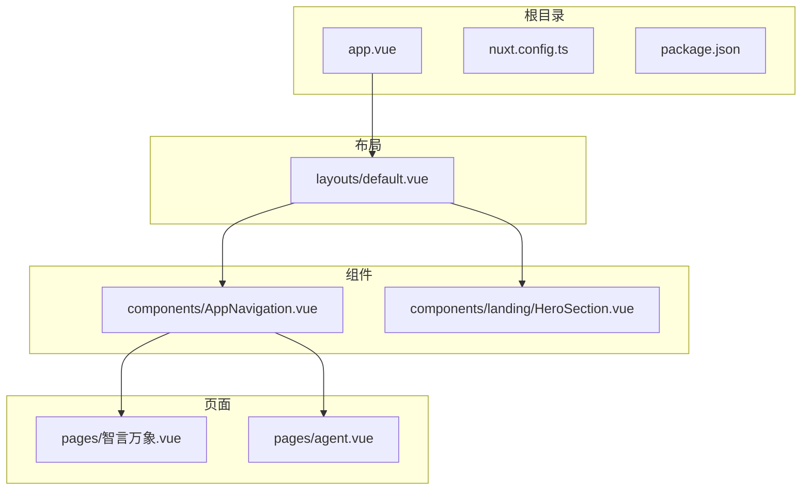
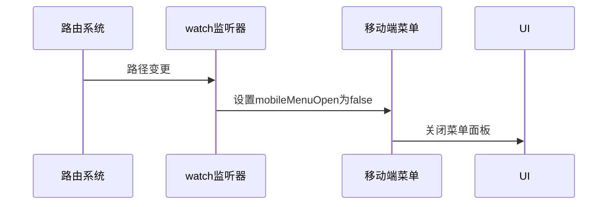
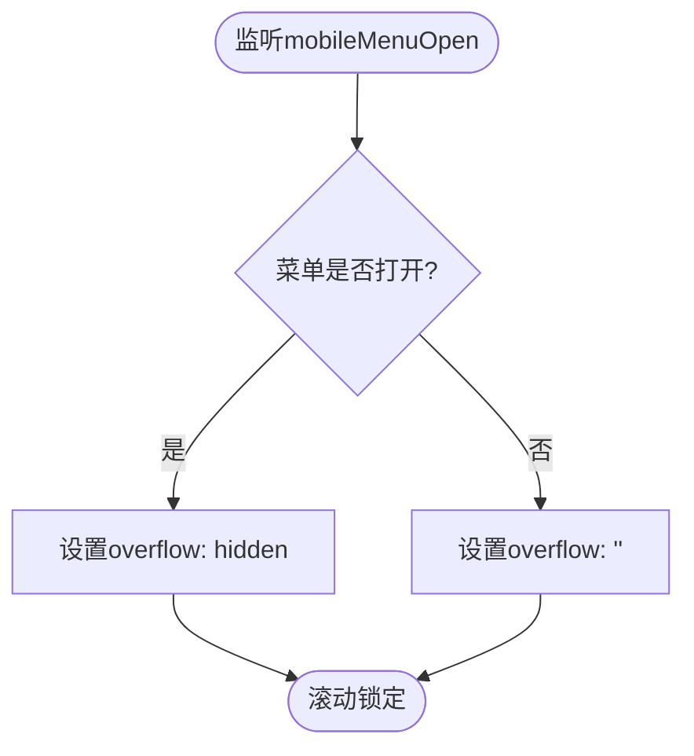
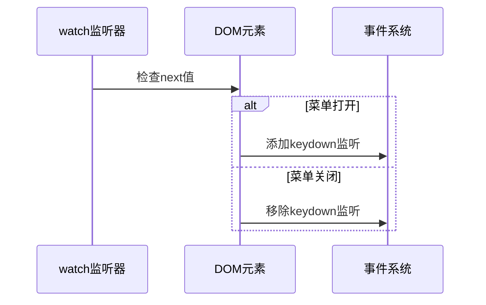
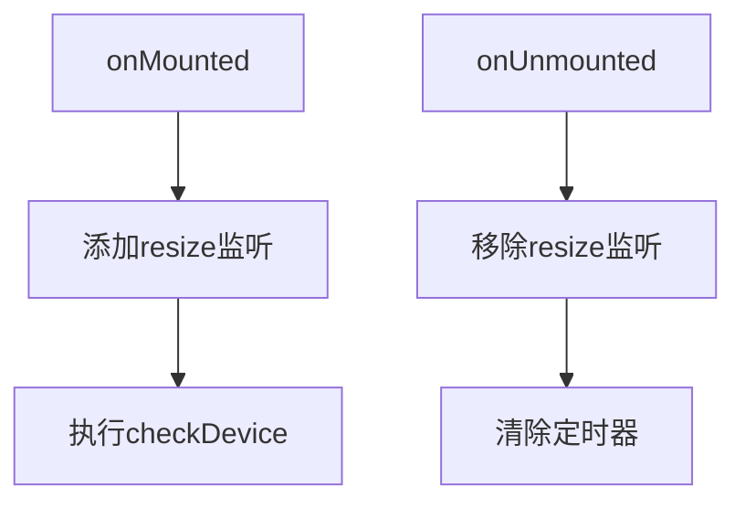
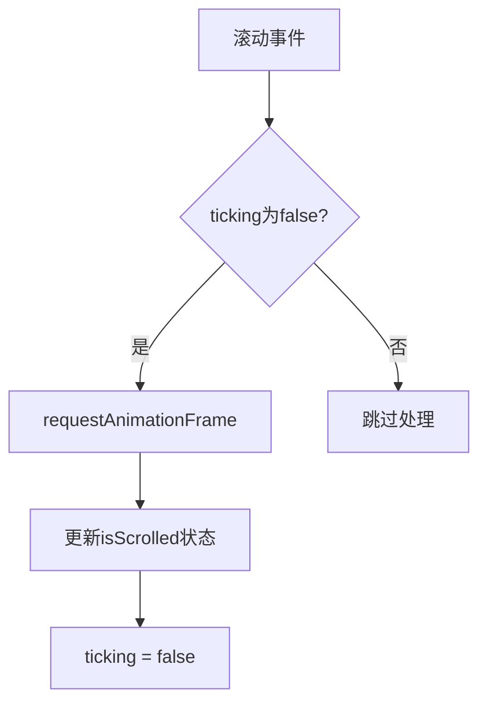

# 响应式工具函数与高级模式

<cite>
**本文档引用文件**  
- [AppNavigation.vue](file://components/AppNavigation.vue#L140-L308)
- [HeroSection.vue](file://components/landing/HeroSection.vue#L252-L391)
- [智言万象.vue](file://pages/智言万象.vue#L920-L933)
- [agent.vue](file://pages/agent.vue#L454-L469)
- [default.vue](file://layouts/default.vue)
- [app.config.ts](file://app.config.ts)
</cite>

## 目录
1. [项目结构](#项目结构)
2. [核心响应式模式](#核心响应式模式)
3. [watch 高级应用](#watch-高级应用)
4. [生命周期与事件监听](#生命周期与事件监听)
5. [工具函数与类型安全](#工具函数与类型安全)
6. [全局状态协调机制](#全局状态协调机制)
7. [性能优化实践](#性能优化实践)
8. [总结](#总结)

## 项目结构

**图示来源**  
- [app.vue](file://app.vue)
- [default.vue](file://layouts/default.vue)
- [AppNavigation.vue](file://components/AppNavigation.vue)

## 核心响应式模式

在 智言万象 项目中，Vue 3 的响应式系统被广泛应用于实现动态交互和状态管理。通过 `ref`、`computed` 和 `watch` 等核心 API，组件能够对用户行为和系统状态变化做出即时响应。

例如，在 `HeroSection.vue` 中，`isMobile` 状态通过 `ref` 定义，并在窗口大小变化时动态更新，确保移动端适配逻辑的实时性。

**本节来源**  
- [HeroSection.vue](file://components/landing/HeroSection.vue#L252-L253)

## watch 高级应用

### 监听路由变化自动关闭移动端菜单

在 `AppNavigation.vue` 组件中，`watch` 被用于监听 `route.path` 的变化，当用户导航到新页面时，自动关闭移动端菜单。这种模式避免了用户在切换页面后仍保留打开的菜单状态，提升了用户体验。

**图示来源**  
- [AppNavigation.vue](file://components/AppNavigation.vue#L298-L300)

### 监听 mobileMenuOpen 实现 body 滚动锁定

另一个 `watch` 的典型应用是监听 `mobileMenuOpen` 状态，当移动端菜单打开时，通过修改 `document.body.style.overflow` 来锁定页面滚动，防止背景内容滚动干扰菜单操作。

**图示来源**  
- [AppNavigation.vue](file://components/AppNavigation.vue#L303-L307)

### 副作用清理与选项配置

在 `智言万象.vue` 页面中，`watch` 被用于监听 `overlayScenarioIndex`，并在索引变化时动态添加或移除键盘事件监听器，实现了副作用的精确清理。同时，通过 `immediate` 选项确保初始状态即被处理。

**图示来源**  
- [智言万象.vue](file://pages/智言万象.vue#L920-L927)

## 生命周期与事件监听

### onMounted 与 onUnmounted 中的事件注册与销毁

在多个组件中，如 `HeroSection.vue` 和 `AppNavigation.vue`，`onMounted` 和 `onUnmounted` 被用于注册和销毁事件监听器。这种模式确保了事件监听器在组件生命周期内正确管理，避免内存泄漏。

例如，在 `HeroSection.vue` 中，`resize` 事件监听器在组件挂载时添加，在卸载时移除。

**图示来源**  
- [HeroSection.vue](file://components/landing/HeroSection.vue#L345-L354)

### requestAnimationFrame 实现高性能滚动节流

在 `AppNavigation.vue` 中，`onScroll` 函数使用 `requestAnimationFrame` 实现滚动节流，避免频繁触发滚动事件导致性能问题。通过 `ticking` 标志位控制动画帧的调度，确保滚动处理的高效性。

**图示来源**  
- [AppNavigation.vue](file://components/AppNavigation.vue#L273-L284)

## 工具函数与类型安全

### isRef 与 unref 在解包处理中的作用

虽然项目中未直接使用 `isRef` 和 `unref`，但其设计模式体现了对响应式引用的类型安全处理。在需要访问 `ref` 内部值的场景中，应使用 `.value` 进行解包，确保类型正确性。

### 类型推断与响应式数据管理

在 `HeroSection.vue` 中，`typeWriterText` 和 `isMobile` 均通过 `ref` 显式声明类型，增强了代码的可维护性和类型安全性。

**本节来源**  
- [HeroSection.vue](file://components/landing/HeroSection.vue#L256-L257)

## 全局状态协调机制

### default.vue 布局组件中的全局状态协调

`default.vue` 作为根布局组件，通过 `<slot />` 提供内容占位，并集成 `AppNavigation` 和 `AppFooter` 等全局组件，实现了页面结构的统一管理。尽管该文件本身不包含复杂逻辑，但它作为全局状态协调的容器，确保了各页面组件的一致性。

**本节来源**  
- [default.vue](file://layouts/default.vue)

## 性能优化实践

### 计算属性的高效使用

在 `HeroSection.vue` 中，`marqueeImageGroups` 使用 `computed` 缓存打乱后的图片数组，避免每次渲染时重复计算，提升了性能。

### 事件监听的被动模式

在 `AppNavigation.vue` 中，`scroll` 事件监听器使用 `{ passive: true }` 选项，告知浏览器该监听器不会调用 `preventDefault()`，从而提升滚动性能。

**本节来源**  
- [AppNavigation.vue](file://components/AppNavigation.vue#L289)

## 总结

智言万象 项目充分展示了 Vue 3 响应式工具函数的高级应用。通过 `watch` 监听路由和状态变化，结合 `onMounted` 和 `onUnmounted` 管理事件生命周期，以及使用 `requestAnimationFrame` 优化性能，项目实现了高效、可维护的前端架构。同时，对类型安全和响应式数据的合理管理，确保了代码的健壮性和可扩展性。

**本节来源**  
- [AppNavigation.vue](file://components/AppNavigation.vue)
- [HeroSection.vue](file://components/landing/HeroSection.vue)
- [智言万象.vue](file://pages/智言万象.vue)