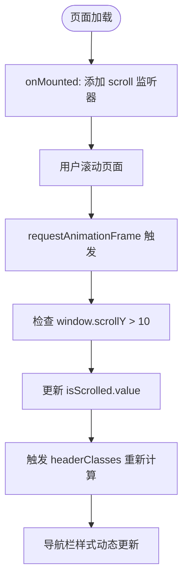
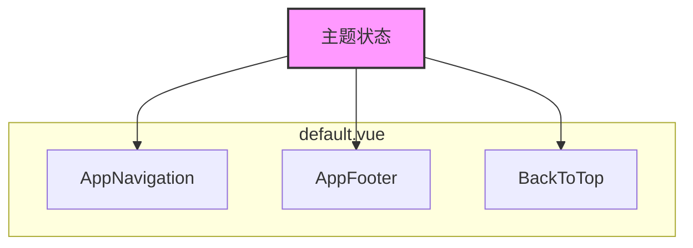

# 响应式系统与状态管理

<cite>
**本文档引用的文件**  
- [AppNavigation.vue](file://components/AppNavigation.vue)
- [default.vue](file://layouts/default.vue)
- [HeroSection.vue](file://components/landing/HeroSection.vue)
- [AIIndustry.vue](file://components/AIIndustry.vue)
- [agent.vue](file://pages/agent.vue)
</cite>

## 目录
1. [简介](#简介)
2. [核心响应式实践](#核心响应式实践)
3. [AppNavigation.vue中的状态管理](#appnavigationvue中的状态管理)
4. [default.vue布局中的响应式协调](#defaultvue布局中的响应式协调)
5. [响应式数据流设计最佳实践](#响应式数据流设计最佳实践)
6. [工具函数增强代码健壮性](#工具函数增强代码健壮性)
7. [结论](#结论)

## 简介
本文档深入分析buidai项目中Vue 3响应式系统的工程实践，重点探讨`ref`、`reactive`、`computed`等核心API在实际组件中的应用。通过分析`AppNavigation.vue`和`default.vue`等关键组件，揭示如何有效管理布尔状态、复杂对象以及跨组件通信。文档还总结了响应式数据流的设计模式和优化技巧，为开发者提供可复用的最佳实践。

## 核心响应式实践
在buidai项目中，Vue 3的响应式系统被广泛应用于各种场景，从简单的布尔标志到复杂的计算属性和状态联动。项目主要采用`<script setup>`语法糖，结合`ref`和`computed`实现声明式的状态管理。这种模式不仅提高了代码的可读性，也使得状态变更的追踪更加直观。

**Section sources**
- [AppNavigation.vue](file://components/AppNavigation.vue#L158-L159)
- [HeroSection.vue](file://components/landing/HeroSection.vue#L253-L254)

## AppNavigation.vue中的状态管理
`AppNavigation.vue`组件是响应式API应用的典范，它巧妙地使用`ref`管理多个布尔状态，并通过`computed`属性实现动态样式和UI配置。

### 布尔状态的响应式管理
该组件使用`ref`创建了两个关键的布尔响应式变量：`mobileMenuOpen`和`isScrolled`。`mobileMenuOpen`用于控制移动端菜单的展开与收起，其值通过点击事件直接修改，体现了`ref`在管理简单开关状态上的简洁性。`isScrolled`则通过监听`scroll`事件，利用`requestAnimationFrame`进行优化，判断页面是否已滚动过一定距离，从而触发导航栏样式的动态变化。

**Diagram sources**
- [AppNavigation.vue](file://components/AppNavigation.vue#L159)
- [AppNavigation.vue](file://components/AppNavigation.vue#L273-L284)
- [AppNavigation.vue](file://components/AppNavigation.vue#L232-L237)

### 计算属性的动态配置
组件中大量使用`computed`属性来实现逻辑与表现的分离。`headerClasses`根据`isTransparent`和`isScrolled`的状态动态生成CSS类，实现了导航栏在透明和实色背景之间的平滑过渡。`navigationMenuUi`和`mobileNavigationMenuUi`则根据`isTransparent`状态返回不同的UI配置对象，确保了桌面端和移动端导航菜单在不同背景下的视觉一致性。

**Section sources**
- [AppNavigation.vue](file://components/AppNavigation.vue#L158-L159)
- [AppNavigation.vue](file://components/AppNavigation.vue#L224-L227)
- [AppNavigation.vue](file://components/AppNavigation.vue#L232-L237)
- [AppNavigation.vue](file://components/AppNavigation.vue#L243-L254)
- [AppNavigation.vue](file://components/AppNavigation.vue#L260-L265)

### 状态副作用的处理
通过`watch`监听器，组件实现了状态变更的副作用处理。一个`watch`监听`route.path`的变化，自动关闭移动端菜单，保证了路由切换时的用户体验一致性。另一个`watch`监听`mobileMenuOpen`，在菜单打开时锁定`body`的滚动，防止背景内容滚动，提升了移动端的交互体验。

**Section sources**
- [AppNavigation.vue](file://components/AppNavigation.vue#L298-L307)

## default.vue布局中的响应式协调
`default.vue`作为项目的根布局组件，虽然其自身代码简单，但它在响应式架构中扮演着至关重要的角色——作为所有子组件的容器，协调全局状态的传递。

### 全局状态的容器
该布局组件通过包含`AppNavigation`、`AppFooter`等全局组件，构建了一个稳定的应用框架。尽管`default.vue`本身没有复杂的响应式逻辑，但它为`AppNavigation.vue`中的`isScrolled`和`mobileMenuOpen`等状态提供了存在的上下文。这些状态的变更会直接影响整个页面的视觉表现，体现了布局组件在状态管理中的枢纽作用。

### 主题状态与子组件通信
虽然在当前代码中未直接体现主题状态的管理，但`default.vue`的结构为实现主题切换提供了理想的场所。未来可以在`<script setup>`中定义一个`reactive`对象来管理主题配置（如暗色/亮色模式），并通过`provide/inject`或`v-model`的方式将主题状态传递给`AppNavigation`和`AppFooter`等子组件，实现全局主题的统一协调。

**Diagram sources**
- [default.vue](file://layouts/default.vue#L1-L25)
- [AppNavigation.vue](file://components/AppNavigation.vue#L7)
- [AppNavigation.vue](file://components/AppNavigation.vue#L15)

**Section sources**
- [default.vue](file://layouts/default.vue#L1-L25)

## 响应式数据流设计最佳实践
通过对项目代码的分析，可以总结出一系列响应式数据流的设计最佳实践。

### 状态提升
在`HeroSection.vue`组件中，`isMobile`状态被定义在组件顶层，其变更会触发`marqueeImageGroups`这个`computed`属性的重新计算。这是一种典型的状态提升模式，将设备类型的判断逻辑集中管理，避免了在多个地方重复进行`window.innerWidth`的检查，提高了代码的可维护性。

### 计算属性优化
项目中`computed`属性的使用非常高效。例如，`marqueeImageGroups`依赖于`isMobile`和`allPluginImages`，它会在依赖项变化时自动重新执行，生成用于跑马灯展示的图片分组。这避免了手动管理图片列表的复杂性，确保了数据的一致性。

### 避免响应式陷阱
项目通过使用`passive: true`的事件监听器和`requestAnimationFrame`来优化滚动处理，有效避免了因频繁状态更新导致的性能问题。此外，`watch`监听器被精确地用于处理特定的副作用（如关闭菜单、锁定滚动），而不是滥用，这遵循了“只在必要时使用watch”的原则。

**Section sources**
- [HeroSection.vue](file://components/landing/HeroSection.vue#L253)
- [HeroSection.vue](file://components/landing/HeroSection.vue#L319-L328)
- [AppNavigation.vue](file://components/AppNavigation.vue#L289)
- [AppNavigation.vue](file://components/AppNavigation.vue#L298-L307)

## 工具函数增强代码健壮性
虽然在当前分析的文件中未直接使用`isRef`、`unref`等工具函数，但它们在复杂的应用中至关重要。例如，在`AIIndustry.vue`中，`active`是一个`ref`，而`currentTab`是一个`computed`属性，它安全地访问了`active.value`。在更复杂的场景下，`unref`可以用于统一处理`ref`和普通值，而`isRef`可以用于类型检查，确保代码在处理可能为`ref`的值时更加健壮。

**Section sources**
- [AIIndustry.vue](file://components/AIIndustry.vue#L221-L222)
- [agent.vue](file://pages/agent.vue#L455)

## 结论
buidai项目对Vue 3响应式系统的应用体现了现代前端开发的最佳实践。通过合理使用`ref`管理局部状态、`computed`实现派生数据、`watch`处理副作用，项目构建了一个高效、可维护的状态管理体系。`AppNavigation.vue`展示了如何将响应式API应用于复杂的UI交互，而`default.vue`则体现了布局组件在全局状态协调中的基础作用。开发者应借鉴这些模式，注重状态的合理提升、计算属性的优化使用，并警惕潜在的性能陷阱，以构建更加健壮的响应式应用。