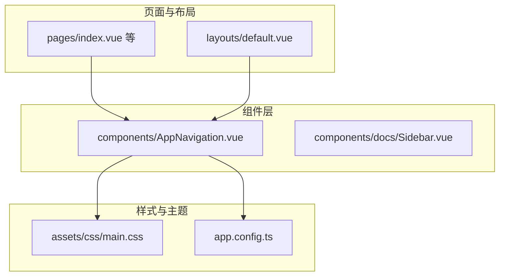
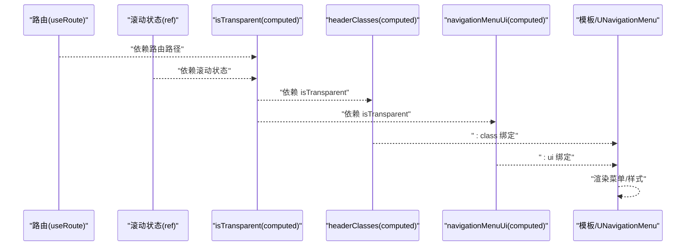
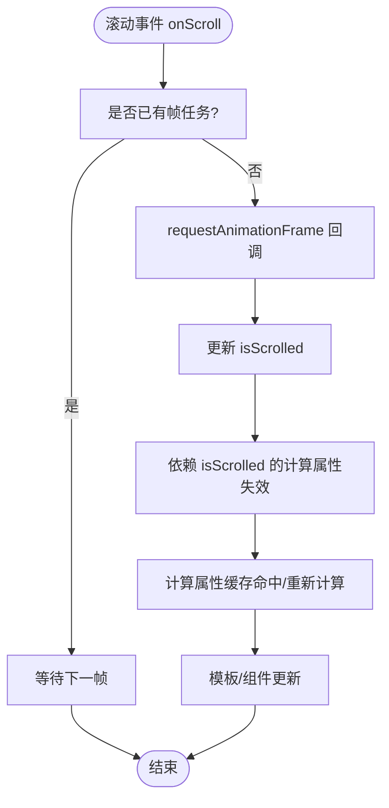
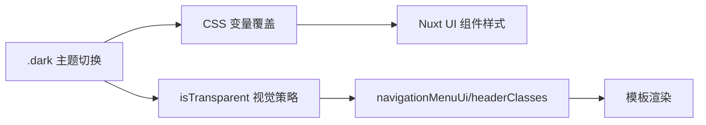
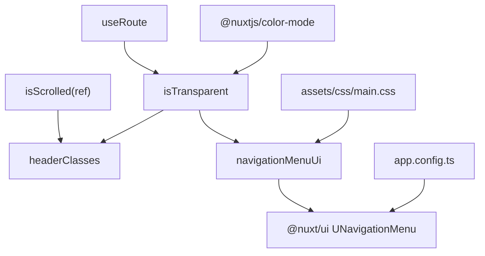

# 计算属性优化与性能实践

<cite>
**本文引用的文件**
- [components/AppNavigation.vue](file://components/AppNavigation.vue)
- [assets/css/main.css](file://assets/css/main.css)
- [app.config.ts](file://app.config.ts)
- [package.json](file://package.json)
</cite>

## 目录
1. [简介](#简介)
2. [项目结构](#项目结构)
3. [核心组件](#核心组件)
4. [架构总览](#架构总览)
5. [详细组件分析](#详细组件分析)
6. [依赖关系分析](#依赖关系分析)
7. [性能考量](#性能考量)
8. [故障排查指南](#故障排查指南)
9. [结论](#结论)
10. [附录](#附录)

## 简介
本文件围绕 budi.ai 项目的计算属性（computed）工程化应用进行系统性梳理，重点以 AppNavigation.vue 中的 items、isTransparent、headerClasses、navigationMenuUi 等计算属性为例，说明其如何封装复杂逻辑、实现视图与状态解耦；分析计算属性的懒求值与缓存机制如何在高频触发的 scroll 事件中避免重复计算；展示计算属性依赖响应式数据的自动追踪机制，并结合 UI 主题切换场景说明其在动态样式生成中的优势；最后提供调试技巧与性能监测方法，帮助读者在实际开发中高效、稳定地运用计算属性。

## 项目结构
本项目采用 Nuxt 4 + Vue 3 Composition API 的前端架构，组件通过 script setup 形式组织，大量使用 ref/computed/watch 等响应式 API。导航组件 AppNavigation.vue 作为头部导航的核心，承担了透明/实体背景切换、菜单项配置、移动端适配、滚动节流等职责。

图表来源
- [components/AppNavigation.vue](file://components/AppNavigation.vue#L1-L138)
- [assets/css/main.css](file://assets/css/main.css#L1-L39)
- [app.config.ts](file://app.config.ts#L1-L83)

章节来源
- [components/AppNavigation.vue](file://components/AppNavigation.vue#L1-L138)
- [assets/css/main.css](file://assets/css/main.css#L1-L39)
- [app.config.ts](file://app.config.ts#L1-L83)

## 核心组件
本节聚焦 AppNavigation.vue 中的计算属性，解释其如何将“状态”转化为“视图所需的数据”，并通过懒求值与缓存降低渲染成本。

- items：导航菜单项的静态配置，以二维数组形式组织，便于桌面/移动端统一消费。
- isTransparent：基于路由路径与滚动状态的透明背景判定，当前默认返回 false，预留扩展点。
- headerClasses：根据 isTransparent 与 isScrolled 的组合结果，动态生成背景、边框、模糊等样式类字符串。
- navigationMenuUi / mobileNavigationMenuUi：根据 isTransparent 动态生成菜单链接、激活态、图标等 UI 类名配置，供 Nuxt UI 组件消费。

这些计算属性将“业务规则”（如透明/实体背景、菜单样式）与“视图渲染”解耦，使得模板只需绑定计算结果，无需在模板中编写复杂分支逻辑。

章节来源
- [components/AppNavigation.vue](file://components/AppNavigation.vue#L160-L265)

## 架构总览
计算属性在导航组件中的工作流如下：响应式状态（路由、滚动、移动端开关）驱动计算属性，计算结果直接绑定到模板与 UI 组件，形成“状态 -> 计算 -> 视图”的单向数据流。

图表来源
- [components/AppNavigation.vue](file://components/AppNavigation.vue#L157-L265)

## 详细组件分析

### 计算属性：items
- 作用：提供导航菜单的层级化数据结构，支持子菜单与描述文本，便于桌面与移动端复用。
- 设计要点：
  - 使用二维数组组织菜单，便于按需拆分与扩展。
  - 子菜单包含标题、描述、图标与跳转地址，统一由 UNavigationMenu 消费。
- 性能影响：为纯静态数据，不依赖运行时状态，不会随滚动/路由频繁变更。

章节来源
- [components/AppNavigation.vue](file://components/AppNavigation.vue#L160-L218)

### 计算属性：isTransparent
- 作用：决定头部是否采用透明背景。
- 当前实现：默认返回 false，预留扩展点（例如结合路由路径与滚动状态）。
- 依赖追踪：依赖路由路径与滚动状态（isScrolled），当任一依赖变化时重新计算。
- 实践建议：若启用透明背景，可将“首页且未滚动”作为条件，减少不必要的透明态切换。

章节来源
- [components/AppNavigation.vue](file://components/AppNavigation.vue#L220-L227)

### 计算属性：headerClasses
- 作用：根据 isTransparent 与 isScrolled 的组合，动态生成背景、边框、模糊等类名。
- 依赖追踪：直接依赖 isTransparent 与 isScrolled。
- 性能影响：在滚动高频触发场景下，通过计算属性缓存避免重复拼接字符串与类名判断。

章节来源
- [components/AppNavigation.vue](file://components/AppNavigation.vue#L232-L237)

### 计算属性：navigationMenuUi / mobileNavigationMenuUi
- 作用：根据 isTransparent 动态生成菜单链接、激活态、图标等 UI 类名配置，供 Nuxt UI 组件消费。
- 依赖追踪：依赖 isTransparent，确保主题切换时自动更新。
- 性能影响：返回对象字面量，Vue 在依赖未变时复用同一对象引用，减少 UI 组件的 props 变更。

章节来源
- [components/AppNavigation.vue](file://components/AppNavigation.vue#L243-L265)

### 滚动处理与节流
- 问题背景：滚动事件触发频率极高，直接在事件回调中更新 DOM 或执行复杂逻辑会导致掉帧。
- 已有实践：使用 requestAnimationFrame 对滚动事件进行节流，仅在下一帧更新 isScrolled，从而间接驱动计算属性更新。
- 与计算属性的关系：isScrolled 作为 ref，在 requestAnimationFrame 内部更新，触发依赖它的计算属性（如 headerClasses、navigationMenuUi）按需重新计算。

图表来源
- [components/AppNavigation.vue](file://components/AppNavigation.vue#L267-L295)

章节来源
- [components/AppNavigation.vue](file://components/AppNavigation.vue#L267-L295)

### 主题切换与动态样式
- 主题来源：全局 CSS 变量与 Nuxt UI 配置共同决定品牌色与组件默认样式。
- CSS 变量覆盖：通过 :root 与 .dark 两类选择器覆盖主品牌色，影响所有使用 UI 变量的组件。
- Nuxt UI 配置：app.config.ts 中定义主色与图标别名，保证全局一致性。
- 计算属性的优势：navigationMenuUi 等计算属性依赖 isTransparent，当主题切换导致 isTransparent 的视觉需求变化时，计算属性可自动反映新的样式类，无需手动维护多处逻辑。

图表来源
- [assets/css/main.css](file://assets/css/main.css#L1-L39)
- [app.config.ts](file://app.config.ts#L1-L83)
- [components/AppNavigation.vue](file://components/AppNavigation.vue#L220-L265)

章节来源
- [assets/css/main.css](file://assets/css/main.css#L1-L39)
- [app.config.ts](file://app.config.ts#L1-L83)
- [components/AppNavigation.vue](file://components/AppNavigation.vue#L220-L265)

## 依赖关系分析
- 组件内依赖：
  - useRoute 提供路由路径，驱动 isTransparent 的条件判断。
  - ref(isScrolled) 作为滚动状态，驱动 headerClasses 与 navigationMenuUi 的样式变化。
  - computed(items/navigationMenuUi/headerClasses/isTransparent) 之间存在清晰的依赖链。
- 外部依赖：
  - @nuxt/ui：UNavigationMenu 组件消费 navigationMenuUi/mobileNavigationMenuUi。
  - @nuxtjs/color-mode：与主题切换相关，影响 isTransparent 的视觉策略与 CSS 变量。
  - Vue 3：ref/computed/watch 的响应式系统与懒求值/缓存机制。

图表来源
- [components/AppNavigation.vue](file://components/AppNavigation.vue#L157-L265)
- [assets/css/main.css](file://assets/css/main.css#L1-L39)
- [app.config.ts](file://app.config.ts#L1-L83)
- [package.json](file://package.json#L36-L46)

章节来源
- [components/AppNavigation.vue](file://components/AppNavigation.vue#L157-L265)
- [assets/css/main.css](file://assets/css/main.css#L1-L39)
- [app.config.ts](file://app.config.ts#L1-L83)
- [package.json](file://package.json#L36-L46)

## 性能考量
- 懒求值与缓存
  - 计算属性在依赖未变时返回缓存结果，避免重复计算与字符串拼接。
  - 在高频滚动场景中，通过 requestAnimationFrame 将更新合并到下一帧，进一步降低抖动。
- 依赖追踪
  - computed 自动追踪依赖，只有被依赖的 ref/computed 变化才会触发重新计算。
  - 将“与滚动无关”的静态数据（如 items）放入 computed，避免被滚动事件波及。
- 渲染层面
  - 将样式类拼接交给 headerClasses 计算，模板只绑定 :class，减少模板表达式复杂度。
  - UI 配置对象 navigationMenuUi 返回的是纯对象，Vue 在依赖不变时复用引用，减少 props 变更。
- 进一步优化建议
  - 若 isTransparent 的判定逻辑复杂，可将其拆分为多个小的 computed，按需组合，提升缓存命中率。
  - 对于移动端菜单 UI，保持与桌面一致的结构，避免在模板中做条件渲染，减少分支判断。

[本节为通用性能指导，不直接分析具体文件]

## 故障排查指南
- 计算属性未更新
  - 检查依赖是否正确：确保 isTransparent 依赖 useRoute 与 isScrolled，且在滚动节流中确实更新了 isScrolled。
  - 排查模板绑定：确认模板中使用了 :class="headerClasses" 与 :ui="navigationMenuUi"。
- 主题切换样式异常
  - 检查 .dark 类是否正确挂载，以及 CSS 变量覆盖是否生效。
  - 确认 app.config.ts 中的颜色与图标配置未被覆盖。
- 滚动抖动或卡顿
  - 确认 requestAnimationFrame 节流已启用，且未在回调中执行昂贵操作。
  - 避免在滚动回调中直接写入 DOM，尽量通过 ref 更新状态，让计算属性接管渲染。
- 调试技巧
  - 使用 Vue DevTools 查看组件的响应式状态与计算属性依赖，观察依赖链与失效次数。
  - 在 isTransparent/headerClasses 中添加条件断点，观察依赖变化触发时机。
  - 使用浏览器性能面板录制滚动过程，检查帧时间与重排重绘热点。

章节来源
- [components/AppNavigation.vue](file://components/AppNavigation.vue#L267-L295)
- [assets/css/main.css](file://assets/css/main.css#L1-L39)
- [app.config.ts](file://app.config.ts#L1-L83)
- [package.json](file://package.json#L12-L22)

## 结论
AppNavigation.vue 中的计算属性通过“状态 -> 计算 -> 视图”的单向数据流，有效封装了导航背景、菜单样式等复杂逻辑，实现了视图与状态的解耦。借助懒求值与缓存机制，配合 requestAnimationFrame 节流，显著降低了高频滚动场景下的计算与渲染成本。结合主题切换与全局样式配置，计算属性在动态样式生成方面展现出强大的工程化优势。建议在实际项目中继续沿用该模式，将“规则”下沉到计算属性，保持模板简洁、逻辑清晰、性能稳定。

[本节为总结性内容，不直接分析具体文件]

## 附录
- 相关文件路径与关键行号
  - 导航菜单配置：[components/AppNavigation.vue](file://components/AppNavigation.vue#L160-L218)
  - 透明背景判定：[components/AppNavigation.vue](file://components/AppNavigation.vue#L220-L227)
  - 背景样式类：[components/AppNavigation.vue](file://components/AppNavigation.vue#L232-L237)
  - 菜单 UI 配置：[components/AppNavigation.vue](file://components/AppNavigation.vue#L243-L265)
  - 滚动节流与生命周期：[components/AppNavigation.vue](file://components/AppNavigation.vue#L267-L295)
  - 主题 CSS 变量覆盖：[assets/css/main.css](file://assets/css/main.css#L1-L39)
  - Nuxt UI 全局配置：[app.config.ts](file://app.config.ts#L1-L83)
  - 开发工具与依赖：[package.json](file://package.json#L12-L22), [package.json](file://package.json#L36-L46)