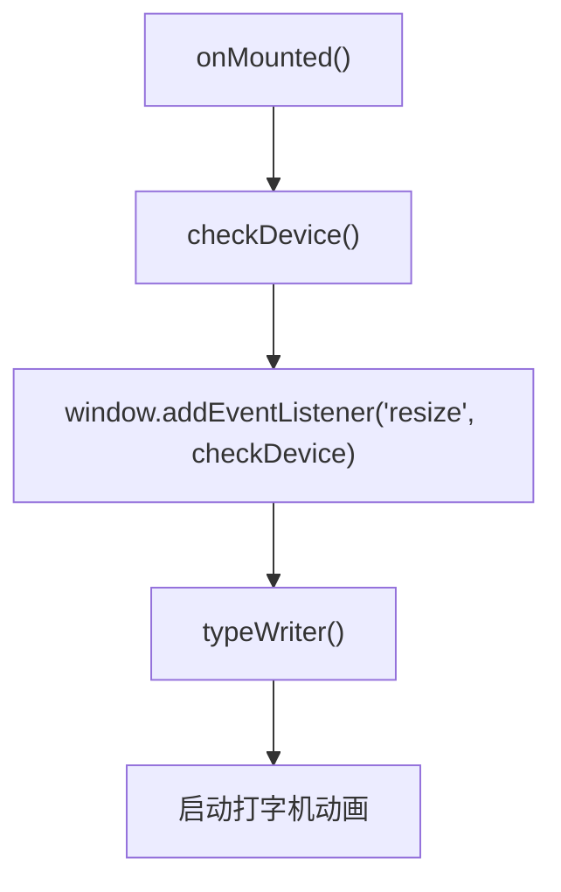
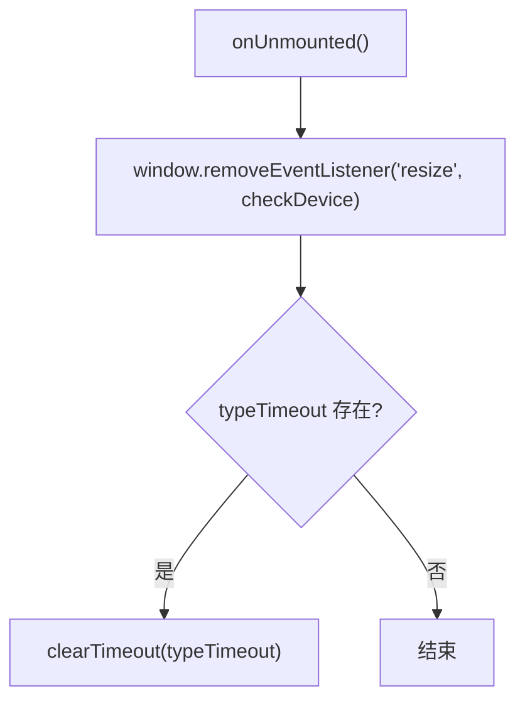
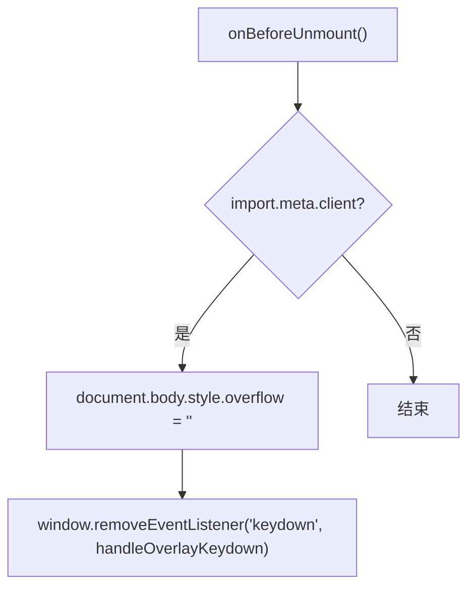
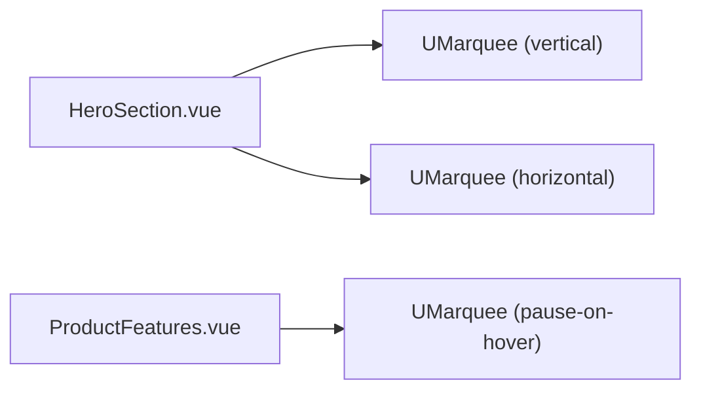
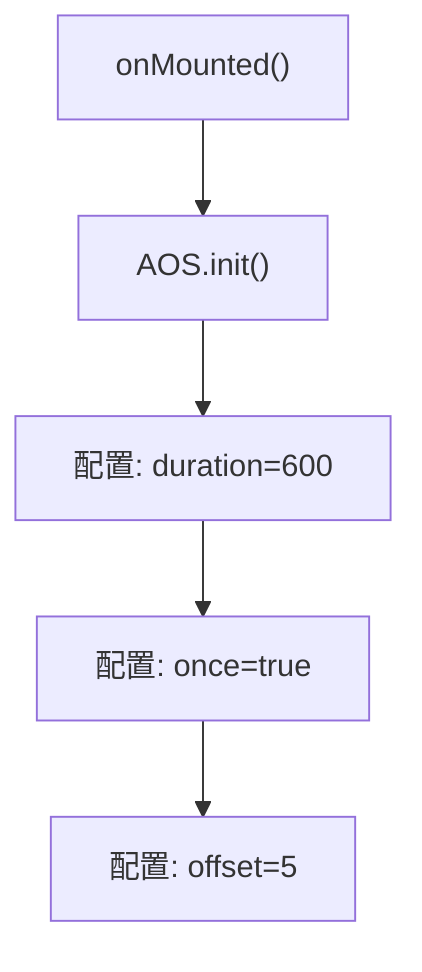
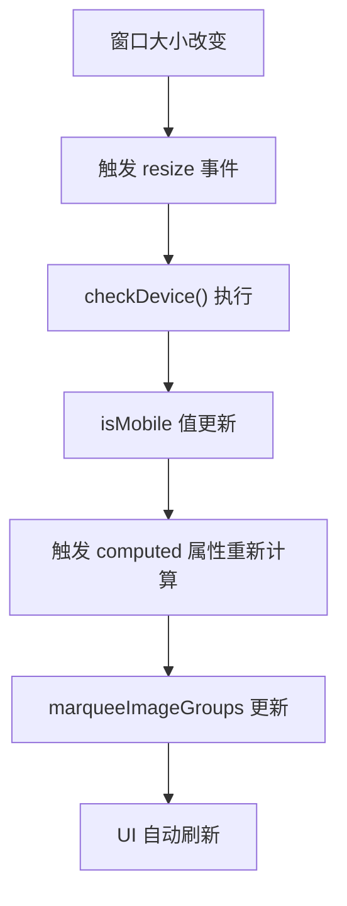

# 生命周期与第三方库集成

<cite>
**本文档引用文件**  
- [HeroSection.vue](file://components/landing/HeroSection.vue)
- [buidai.vue](file://pages/buidai.vue)
- [AppNavigation.vue](file://components/AppNavigation.vue)
- [BackToTop.vue](file://components/BackToTop.vue)
- [FeatureCarousel.vue](file://components/landing/FeatureCarousel.vue)
- [scene.ts](file://utils/scene.ts)
</cite>

## 目录
1. [简介](#简介)
2. [onMounted 钩子实践](#onmounted-钩子实践)
3. [onUnmounted 与资源清理](#onunmounted-与资源清理)
4. [onBeforeUnmount 优雅销毁](#onbeforeunmount-优雅销毁)
5. [与UMarquee跑马灯库集成](#与umarquee跑马灯库集成)
6. [与AOS动画库集成](#与aos动画库集成)
7. [响应式适配与性能优化](#响应式适配与性能优化)
8. [最佳实践总结](#最佳实践总结)

## 简介
本文档深入解析buidai项目中Vue 3生命周期钩子与第三方库的集成实践，重点分析`onMounted`、`onUnmounted`和`onBeforeUnmount`在实际组件中的应用。通过`HeroSection.vue`等核心组件，详细阐述如何利用生命周期钩子启动和清理定时器、事件监听器，避免内存泄漏。同时，探讨与AOS、UMarquee等动画库集成的最佳实践，涵盖异步资源加载、响应式适配和性能优化策略。

## onMounted 钩子实践
`onMounted`钩子在组件挂载后立即执行，是启动初始化逻辑的理想位置。在`HeroSection.vue`中，该钩子被用于启动打字机动画和窗口大小监听器。

**图示来源**  
- [HeroSection.vue](file://components/landing/HeroSection.vue#L344-L349)

该钩子确保了组件在DOM完全渲染后才开始执行关键的UI动画和事件绑定，保证了用户体验的流畅性。

**组件来源**  
- [HeroSection.vue](file://components/landing/HeroSection.vue#L344-L349)

## onUnmounted 与资源清理
`onUnmounted`钩子在组件卸载前执行，是清理资源、防止内存泄漏的关键环节。`HeroSection.vue`组件展示了如何正确清理在`onMounted`中创建的资源。

**图示来源**  
- [HeroSection.vue](file://components/landing/HeroSection.vue#L351-L354)

该组件通过移除`resize`事件监听器和清除打字机动画的`setTimeout`定时器，确保了组件销毁后不会继续占用系统资源或触发无效回调。

**组件来源**  
- [HeroSection.vue](file://components/landing/HeroSection.vue#L351-L354)

## onBeforeUnmount 优雅销毁
`onBeforeUnmount`钩子在组件卸载前、`onUnmounted`之前执行，适用于执行一些需要在DOM完全销毁前完成的清理工作。`buidai.vue`页面展示了其在管理全局状态方面的应用。

**图示来源**  
- [buidai.vue](file://pages/buidai.vue#L929-L933)

该钩子用于恢复`document.body`的滚动样式并移除键盘事件监听器，确保了当组件被销毁时，页面的全局状态能够被正确重置，避免了潜在的UI冲突。

**组件来源**  
- [buidai.vue](file://pages/buidai.vue#L929-L933)

## 与UMarquee跑马灯库集成
`UMarquee`是项目中用于实现图片滚动效果的第三方组件。多个组件如`HeroSection.vue`和`ProductFeatures.vue`都集成了该库，实现了水平和垂直方向的无缝滚动。

**图示来源**  
- [HeroSection.vue](file://components/landing/HeroSection.vue#L107-L145)
- [ProductFeatures.vue](file://components/landing/ProductFeatures.vue#L36-L70)

集成策略包括：
- **异步加载**：使用`loading="lazy"`和`decoding="async"`属性优化图片加载性能。
- **响应式配置**：根据屏幕尺寸动态调整滚动速度（`--duration`）和布局。
- **数据驱动**：通过`computed`属性从`scene.ts`动态获取图片列表，并进行随机打乱，确保内容的新鲜感。

**组件来源**  
- [HeroSection.vue](file://components/landing/HeroSection.vue#L107-L145)
- [ProductFeatures.vue](file://components/landing/ProductFeatures.vue#L36-L70)
- [scene.ts](file://utils/scene.ts#L10-L121)

## 与AOS动画库集成
AOS (Animate On Scroll) 库被用于实现滚动触发动画效果。`buidai.vue`页面在`onMounted`钩子中对其进行初始化配置。

**图示来源**  
- [buidai.vue](file://pages/buidai.vue#L623-L629)

通过在`onMounted`中调用`AOS.init()`，确保了DOM元素已经存在，动画库可以正确地计算元素位置并应用动画。`once: true`的配置保证了动画只在首次进入视口时触发，提升了性能。

**组件来源**  
- [buidai.vue](file://pages/buidai.vue#L623-L629)

## 响应式适配与性能优化
项目通过多种策略实现了优秀的响应式适配和性能优化：

1.  **设备检测**：`HeroSection.vue`中的`checkDevice`函数通过`window.innerWidth`判断设备类型，并更新`isMobile`响应式变量，驱动UI的条件渲染。
2.  **计算属性优化**：`marqueeImageGroups`是一个`computed`属性，它依赖`isMobile`的值来决定返回10张还是16张图片，实现了数据的动态响应。
3.  **节流与防抖**：虽然代码中未直接体现，但监听`resize`事件时，应考虑使用防抖（debounce）或节流（throttle）技术来避免频繁触发，`@vueuse/core`库提供了`useDebounceFn`等工具。
4.  **资源懒加载**：广泛使用`loading="lazy"`属性，延迟非关键图片的加载，提升首屏性能。

**图示来源**  
- [HeroSection.vue](file://components/landing/HeroSection.vue#L335-L343)

**组件来源**  
- [HeroSection.vue](file://components/landing/HeroSection.vue#L335-L343)

## 最佳实践总结
1.  **成对出现**：`onMounted`中添加的事件监听器和定时器，必须在`onUnmounted`或`onBeforeUnmount`中成对地移除和清除。
2.  **检查客户端环境**：在使用`window`、`document`等浏览器API前，使用`typeof window !== 'undefined'`或`import.meta.client`进行环境检查，确保代码在服务端渲染（SSR）时不会报错。
3.  **利用计算属性**：将复杂的、依赖其他响应式数据的逻辑封装在`computed`属性中，Vue会自动处理依赖追踪和缓存，提高性能。
4.  **第三方库初始化时机**：在`onMounted`中初始化依赖DOM的第三方库（如AOS），确保DOM已准备就绪。
5.  **关注内存泄漏**：定期审查代码，确保没有未清理的定时器、事件监听器或对已销毁组件的引用。