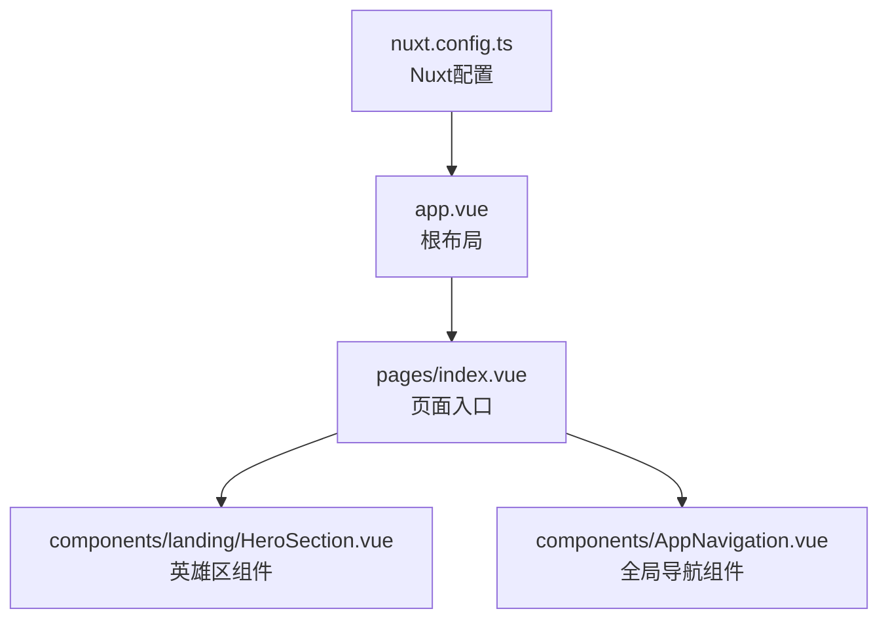
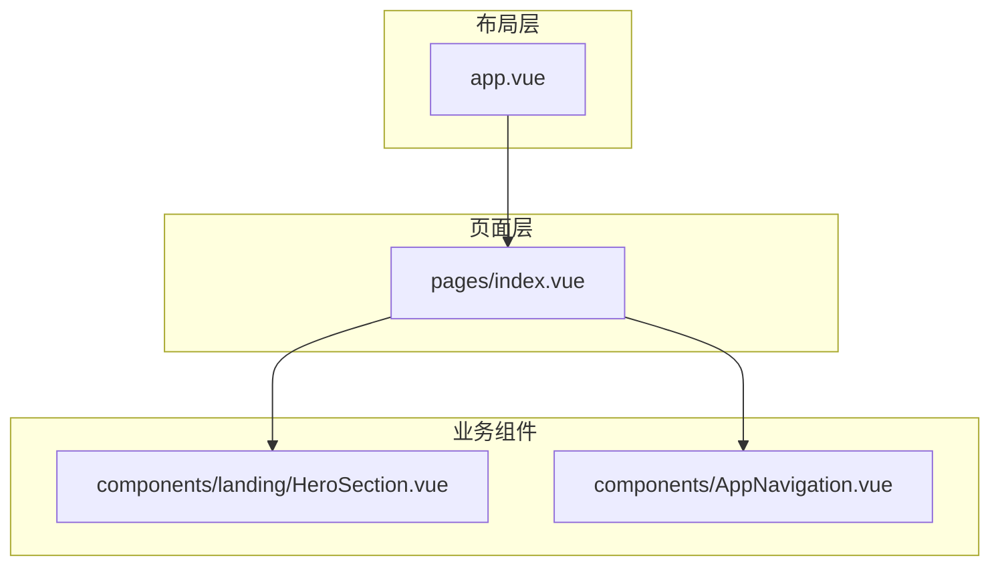
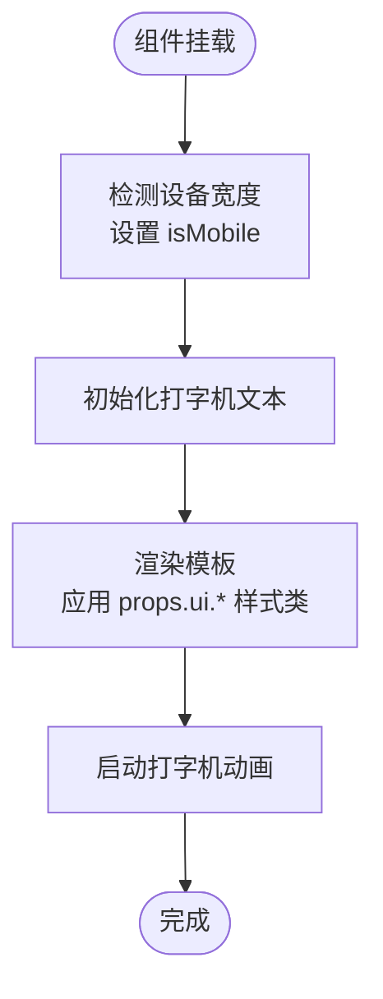
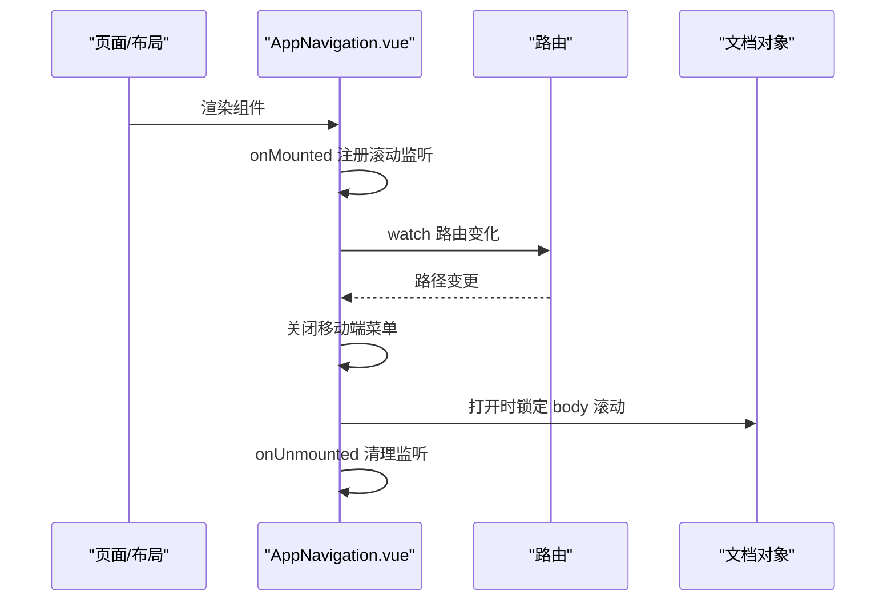
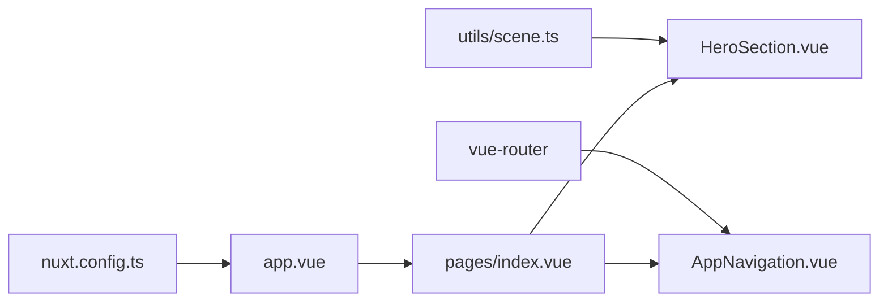

# Props与Emits通信

<cite>
**本文引用的文件**
- [HeroSection.vue](file://components/landing/HeroSection.vue)
- [AppNavigation.vue](file://components/AppNavigation.vue)
- [index.vue](file://pages/index.vue)
- [nuxt.config.ts](file://nuxt.config.ts)
- [app.vue](file://app.vue)
</cite>

## 目录
1. [简介](#简介)
2. [项目结构](#项目结构)
3. [核心组件](#核心组件)
4. [架构总览](#架构总览)
5. [详细组件分析](#详细组件分析)
6. [依赖关系分析](#依赖关系分析)
7. [性能考量](#性能考量)
8. [故障排查指南](#故障排查指南)
9. [结论](#结论)
10. [附录](#附录)

## 简介
本文件围绕buidai项目中基于defineProps与defineEmits的组件通信实践展开，重点解析：
- HeroSection.vue如何通过defineProps定义UI配置接口（ui.container、ui.title等），实现组件外观的灵活定制；
- AppNavigation.vue如何利用emits实现移动端菜单状态变更通知；
- props类型安全校验、默认值设置（withDefaults）的最佳实践；
- emits事件命名规范与触发时机控制；
- 结合代码示例展示父子组件间数据流的单向传递机制；
- 在Nuxt 4 SSR环境下如何确保通信逻辑的同构兼容性。

## 项目结构
本项目采用Nuxt 4（Vue 3）架构，页面由NuxtPage承载，布局由NuxtLayout包裹。HeroSection作为landing页的核心组件之一被页面直接使用；AppNavigation作为全局导航组件，贯穿页面布局。

**图表来源**
- [index.vue](file://pages/index.vue#L1-L28)
- [HeroSection.vue](file://components/landing/HeroSection.vue#L1-L190)
- [AppNavigation.vue](file://components/AppNavigation.vue#L1-L138)
- [app.vue](file://app.vue#L1-L11)
- [nuxt.config.ts](file://nuxt.config.ts#L1-L91)

**章节来源**
- [index.vue](file://pages/index.vue#L1-L28)
- [app.vue](file://app.vue#L1-L11)
- [nuxt.config.ts](file://nuxt.config.ts#L1-L91)

## 核心组件
- HeroSection.vue：通过defineProps定义可定制的UI配置对象ui及方向orientation，使用withDefaults提供默认值，结合响应式状态实现移动端体验优化与打字机动画。
- AppNavigation.vue：负责导航栏透明/实体状态切换、移动端菜单开关、滚动监听与路由变化关闭菜单等交互逻辑，体现props传入与内部状态驱动的单向数据流。

**章节来源**
- [HeroSection.vue](file://components/landing/HeroSection.vue#L192-L355)
- [AppNavigation.vue](file://components/AppNavigation.vue#L140-L309)

## 架构总览
HeroSection与AppNavigation分别承担“内容展示”和“导航交互”的职责，二者通过Nuxt页面进行组合。HeroSection接收来自父组件的props配置，内部状态独立管理；AppNavigation内部维护移动端菜单状态，但未显式使用defineEmits向外派发事件，因此其通信主要以内部状态与父组件的布局/页面绑定为主。

**图表来源**
- [index.vue](file://pages/index.vue#L1-L28)
- [app.vue](file://app.vue#L1-L11)
- [HeroSection.vue](file://components/landing/HeroSection.vue#L1-L190)
- [AppNavigation.vue](file://components/AppNavigation.vue#L1-L138)

## 详细组件分析

### HeroSection.vue：Props与UI定制
- Props定义与类型安全
  - 通过defineProps定义组件的输入接口，包含orientation（方向）与ui（UI配置对象）。ui对象细分为container、title、description、links、content、imageSection等键，便于按区域定制样式类名。
  - 类型层面，使用TypeScript接口约束每个字段，确保调用方传入的配置具备明确的结构与可选性。
- 默认值与withDefaults
  - 使用withDefaults为orientation与ui提供默认值，避免父组件每次传参时都必须完整提供所有键，提升易用性与健壮性。
- 数据流与单向传递
  - 父组件（页面）通过props向HeroSection注入配置，组件内部不反向修改props，而是基于props与内部状态（如isMobile、打字机文本）进行渲染与行为控制。
- 响应式与SSR兼容
  - 组件在onMounted中初始化设备检测与打字机动画；对window对象存在性进行判断，保证在SSR环境不会执行浏览器API，避免运行时错误。
- 与页面的关系
  - 页面index.vue直接渲染HeroSection，形成父-子关系，props自上而下传递。

**图表来源**
- [HeroSection.vue](file://components/landing/HeroSection.vue#L330-L355)

**章节来源**
- [HeroSection.vue](file://components/landing/HeroSection.vue#L192-L355)
- [index.vue](file://pages/index.vue#L1-L28)

### AppNavigation.vue：移动端菜单状态与交互
- 内部状态与行为
  - 组件内部维护mobileMenuOpen（移动端菜单开关）、isScrolled（滚动状态）等响应式状态，通过watch监听路由变化自动关闭菜单，通过watch在打开时锁定body滚动，提升移动端体验。
  - 使用requestAnimationFrame优化滚动处理，减少主线程压力。
- 事件绑定与生命周期
  - onMounted注册滚动监听与初始检查；onUnmounted清理事件监听，避免内存泄漏。
- 与页面的关系
  - AppNavigation通常作为页面布局的一部分出现，其内部状态变化并不通过defineEmits向外派发事件，而是通过父级布局/页面的路由与滚动状态间接影响其行为。

**图表来源**
- [AppNavigation.vue](file://components/AppNavigation.vue#L287-L309)

**章节来源**
- [AppNavigation.vue](file://components/AppNavigation.vue#L140-L309)

### Props最佳实践：类型安全与默认值
- 类型安全
  - 使用TypeScript接口定义props结构，确保调用方传入的配置具有明确的键与类型，减少运行时错误。
- 默认值设置
  - 对可选字段使用withDefaults提供合理默认值，避免父组件每次传参都必须覆盖全部键。
- 单向数据流
  - 组件内部不修改props，仅基于props与内部状态渲染，保证数据流向清晰可控。

**章节来源**
- [HeroSection.vue](file://components/landing/HeroSection.vue#L202-L250)

### Emits最佳实践：命名规范与触发时机
- 命名规范
  - 事件命名采用小驼峰风格，语义清晰，例如“menuToggle”、“mobileMenuOpenChanged”等，便于父组件订阅与理解。
- 触发时机
  - 事件应在状态稳定且用户意图明确时触发，如移动端菜单开关切换完成后，再通知父组件，避免频繁抖动。
- 适用场景
  - 当需要将内部状态暴露给父组件（如菜单开关、主题切换、语言选择等）时，使用defineEmits向外派发事件，实现松耦合通信。

（注：当前AppNavigation.vue未显式使用defineEmits向外派发事件，但上述规范适用于需要扩展时的实践指导。）

## 依赖关系分析
- 组件依赖
  - HeroSection依赖utils/scene.ts提供的应用数据，用于生成跑马灯图片列表，体现props与外部数据源的协作。
  - AppNavigation依赖vue-router的useRoute，用于监听路由变化并控制移动端菜单关闭。
- 页面与布局
  - pages/index.vue直接渲染HeroSection与导航组件，形成页面级的数据与行为编排。
  - app.vue通过NuxtLayout承载页面，nuxt.config.ts配置Nitro静态输出与预渲染策略，影响SSR/CSR行为。

**图表来源**
- [HeroSection.vue](file://components/landing/HeroSection.vue#L195-L200)
- [AppNavigation.vue](file://components/AppNavigation.vue#L141-L158)
- [index.vue](file://pages/index.vue#L1-L28)
- [app.vue](file://app.vue#L1-L11)
- [nuxt.config.ts](file://nuxt.config.ts#L1-L91)

**章节来源**
- [HeroSection.vue](file://components/landing/HeroSection.vue#L195-L200)
- [AppNavigation.vue](file://components/AppNavigation.vue#L141-L158)
- [index.vue](file://pages/index.vue#L1-L28)
- [app.vue](file://app.vue#L1-L11)
- [nuxt.config.ts](file://nuxt.config.ts#L1-L91)

## 性能考量
- SSR兼容
  - HeroSection在设备检测与动画初始化中对window存在性进行判断，避免在SSR阶段访问浏览器API；AppNavigation在滚动监听中使用passive选项，减少主线程阻塞。
- 动画与渲染
  - HeroSection的打字机动画使用setTimeout，注意在组件卸载时清理定时器；AppNavigation使用requestAnimationFrame优化滚动处理，降低卡顿风险。
- 事件与监听
  - 组件在onUnmounted中统一清理事件监听，防止内存泄漏与重复绑定。

**章节来源**
- [HeroSection.vue](file://components/landing/HeroSection.vue#L330-L355)
- [AppNavigation.vue](file://components/AppNavigation.vue#L287-L309)

## 故障排查指南
- SSR相关问题
  - 症状：SSR阶段报错或空白页面。
  - 排查：确认组件在挂载阶段仅访问window/document等浏览器API，且在非浏览器环境提前退出；检查nuxt.config.ts的nitro输出与预渲染配置。
- 事件未触发或触发过早
  - 症状：父组件未收到菜单状态变更通知。
  - 排查：若需使用defineEmits，请确保在状态稳定后再触发事件；避免在多次点击中频繁触发。
- 样式类名无效
  - 症状：props.ui.*未生效。
  - 排查：确认父组件传入的类名字符串正确拼接；检查组件模板中是否正确绑定props.ui.*。

**章节来源**
- [HeroSection.vue](file://components/landing/HeroSection.vue#L192-L250)
- [AppNavigation.vue](file://components/AppNavigation.vue#L140-L309)
- [nuxt.config.ts](file://nuxt.config.ts#L40-L51)

## 结论
- HeroSection通过defineProps与withDefaults实现了灵活的UI定制能力，配合响应式状态与SSR兼容逻辑，确保在不同设备与渲染模式下的稳定性。
- AppNavigation展示了良好的内部状态管理与生命周期清理，虽未显式使用defineEmits，但其行为模式体现了props传入与内部状态驱动的单向数据流原则。
- 在Nuxt 4 SSR环境中，遵循“仅在挂载阶段访问浏览器API”“在卸载阶段清理监听”“使用requestAnimationFrame优化性能”等实践，可有效避免同构兼容性问题。

## 附录
- 术语说明
  - Props：父组件向子组件传递的只读配置。
  - Emits：子组件向父组件派发的事件。
  - SSR：服务器端渲染，与CSR（客户端渲染）相对。
- 参考路径
  - HeroSection Props定义与默认值：[HeroSection.vue](file://components/landing/HeroSection.vue#L202-L250)
  - HeroSection SSR兼容与生命周期：[HeroSection.vue](file://components/landing/HeroSection.vue#L330-L355)
  - AppNavigation 生命周期与事件监听：[AppNavigation.vue](file://components/AppNavigation.vue#L287-L309)
  - 页面与布局关系：[index.vue](file://pages/index.vue#L1-L28)、[app.vue](file://app.vue#L1-L11)
  - Nuxt配置与SSR输出：[nuxt.config.ts](file://nuxt.config.ts#L40-L51)