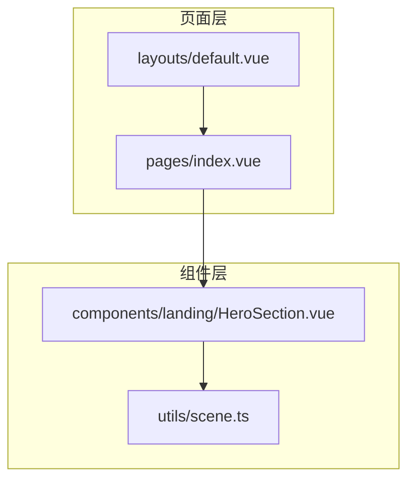
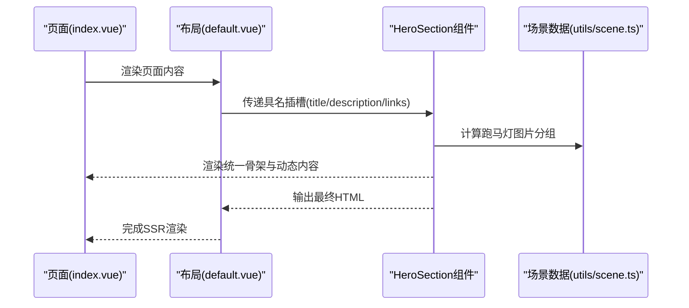
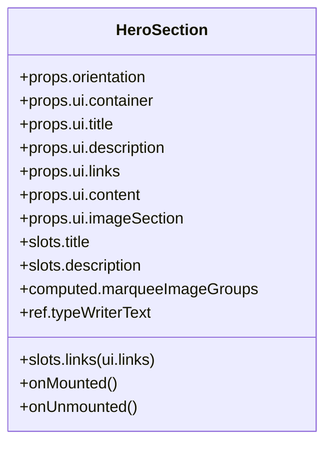
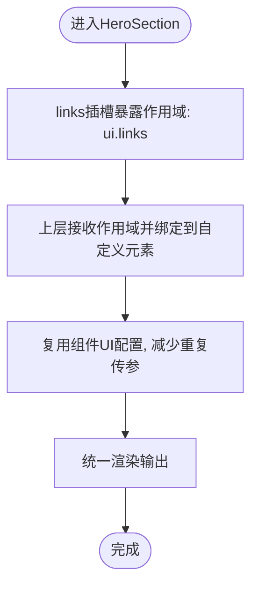
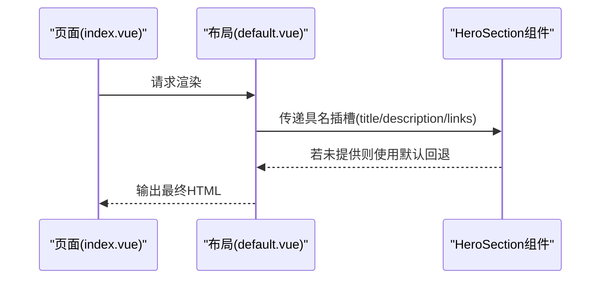
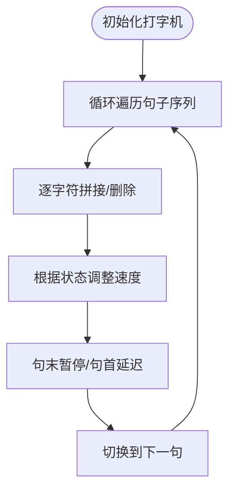
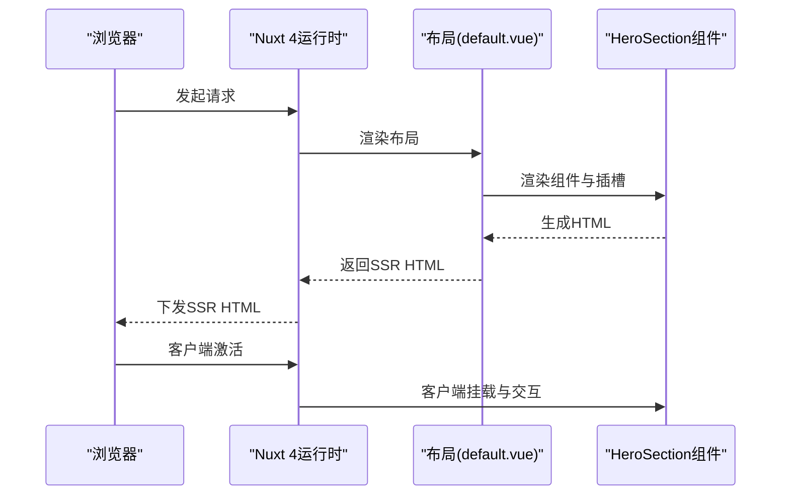
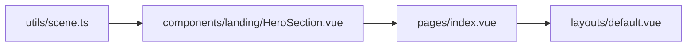

# Slots插槽应用模式

<cite>
**本文引用的文件**
- [components/landing/HeroSection.vue](file://components/landing/HeroSection.vue)
- [utils/scene.ts](file://utils/scene.ts)
- [pages/index.vue](file://pages/index.vue)
- [layouts/default.vue](file://layouts/default.vue)
- [content/docs/introduction/10.migration.md](file://content/docs/introduction/10.migration.md)
- [package.json](file://package.json)
- [nuxt.config.ts](file://nuxt.config.ts)
</cite>

## 目录
1. [简介](#简介)
2. [项目结构](#项目结构)
3. [核心组件](#核心组件)
4. [架构总览](#架构总览)
5. [详细组件分析](#详细组件分析)
6. [依赖关系分析](#依赖关系分析)
7. [性能考量](#性能考量)
8. [故障排查指南](#故障排查指南)
9. [结论](#结论)
10. [附录](#附录)

## 简介
本文件围绕智言万象项目中的HeroSection组件，系统梳理其插槽（Slots）高级应用实践，重点包括：
- 如何使用具名插槽（title、description、links）实现内容分发与结构定制
- 插槽作用域数据暴露机制及其在动态内容渲染中的优势
- 默认插槽回退内容的设计模式
- 结合打字机效果文本与按钮组的实际案例，展示如何通过插槽提升组件复用性与布局灵活性
- 在Nuxt 4服务端渲染（SSR）场景下，保障插槽内容渲染一致性的策略

## 项目结构
HeroSection位于landing组件目录，作为页面首屏的核心视觉区块，承担标题、描述、行动按钮等关键内容的承载职责。其插槽设计使得上层页面可以灵活注入不同语义与风格的内容，同时保留统一的布局骨架与交互逻辑。

**图表来源**
- [pages/index.vue](file://pages/index.vue#L1-L28)
- [layouts/default.vue](file://layouts/default.vue#L1-L24)
- [components/landing/HeroSection.vue](file://components/landing/HeroSection.vue#L1-L120)
- [utils/scene.ts](file://utils/scene.ts#L1-L122)

**章节来源**
- [pages/index.vue](file://pages/index.vue#L1-L28)
- [layouts/default.vue](file://layouts/default.vue#L1-L24)
- [components/landing/HeroSection.vue](file://components/landing/HeroSection.vue#L1-L120)
- [utils/scene.ts](file://utils/scene.ts#L1-L122)

## 核心组件
本节聚焦HeroSection的插槽设计与实现要点，涵盖具名插槽、默认插槽回退、作用域数据暴露与UI定制化。

- 具名插槽
  - title：用于注入标题层级内容，支持默认回退与上层覆盖
  - description：用于注入描述性文本，内置打字机效果渲染
  - links：用于注入按钮组与辅助信息，支持作用域绑定ui.links样式类

- 默认插槽回退
  - 当上层未提供对应具名插槽内容时，组件内部提供默认回退内容，确保基础可用性与一致性

- 插槽作用域
  - links插槽以作用域形式暴露props.ui.links，便于上层直接复用组件的UI配置，减少重复传参

- UI定制化
  - 通过props.ui容器、标题、描述、链接、左侧内容、右侧图片展示区等键位，实现细粒度样式控制

- 动态内容渲染
  - 描述区采用打字机效果，结合响应式设备检测，保障移动端体验与性能

**章节来源**
- [components/landing/HeroSection.vue](file://components/landing/HeroSection.vue#L26-L97)
- [components/landing/HeroSection.vue](file://components/landing/HeroSection.vue#L202-L250)
- [components/landing/HeroSection.vue](file://components/landing/HeroSection.vue#L252-L355)

## 架构总览
HeroSection在页面中的典型调用链路如下：页面通过布局容器渲染组件，组件内部负责布局骨架、装饰背景、动态内容与交互逻辑；上层页面通过具名插槽注入业务内容，形成“骨架统一、内容可变”的组合模式。

**图表来源**
- [pages/index.vue](file://pages/index.vue#L1-L28)
- [layouts/default.vue](file://layouts/default.vue#L1-L24)
- [components/landing/HeroSection.vue](file://components/landing/HeroSection.vue#L1-L120)
- [utils/scene.ts](file://utils/scene.ts#L1-L122)

## 详细组件分析

### HeroSection插槽体系
- 具名插槽定义与回退
  - title：提供默认标题与副标题结构，支持上层覆盖
  - description：提供默认打字机文本容器，支持上层覆盖
  - links：提供默认按钮组与特性标签区，支持上层覆盖
- 作用域绑定
  - links插槽以作用域形式暴露props.ui.links，便于上层直接复用组件的UI配置
- UI配置
  - 通过props.ui对容器、标题、描述、链接、左侧内容、右侧图片展示区进行样式定制

**图表来源**
- [components/landing/HeroSection.vue](file://components/landing/HeroSection.vue#L202-L250)
- [components/landing/HeroSection.vue](file://components/landing/HeroSection.vue#L252-L355)

**章节来源**
- [components/landing/HeroSection.vue](file://components/landing/HeroSection.vue#L26-L97)
- [components/landing/HeroSection.vue](file://components/landing/HeroSection.vue#L202-L250)

### 插槽作用域与UI定制
- 作用域数据暴露
  - links插槽以作用域形式暴露props.ui.links，上层可直接将其绑定到自定义元素，避免重复传参
- UI配置键位
  - 通过ui.container、ui.title、ui.description、ui.links、ui.content、ui.imageSection实现细粒度样式控制
- 与页面布局的协作
  - 页面通过布局(default.vue)承载HeroSection，保证SSR阶段的结构一致性

**图表来源**
- [components/landing/HeroSection.vue](file://components/landing/HeroSection.vue#L43-L59)
- [layouts/default.vue](file://layouts/default.vue#L1-L24)

**章节来源**
- [components/landing/HeroSection.vue](file://components/landing/HeroSection.vue#L43-L59)
- [layouts/default.vue](file://layouts/default.vue#L1-L24)

### 默认插槽回退与内容定制
- 默认回退
  - title、description、links均提供默认回退内容，确保在未被覆盖时仍具备可用的结构与样式
- 内容定制
  - 上层可通过具名插槽注入标题、描述与按钮组，实现不同页面的差异化表达
- 与页面集成
  - 页面(index.vue)通过布局(default.vue)渲染HeroSection，形成“页面-布局-组件”的标准渲染链路

**图表来源**
- [pages/index.vue](file://pages/index.vue#L1-L28)
- [layouts/default.vue](file://layouts/default.vue#L1-L24)
- [components/landing/HeroSection.vue](file://components/landing/HeroSection.vue#L26-L97)

**章节来源**
- [pages/index.vue](file://pages/index.vue#L1-L28)
- [layouts/default.vue](file://layouts/default.vue#L1-L24)
- [components/landing/HeroSection.vue](file://components/landing/HeroSection.vue#L26-L97)

### 打字机效果与动态内容渲染
- 打字机逻辑
  - 组件内部维护打字机文本状态与轮播句集，实现循环播放与删除效果
- 动态内容
  - 描述区动态渲染当前句子，配合闪烁光标动画，增强视觉反馈
- 性能与体验
  - 基于响应式设备检测，移动端可优化复杂动画与交互，提升渲染性能

**图表来源**
- [components/landing/HeroSection.vue](file://components/landing/HeroSection.vue#L256-L311)
- [components/landing/HeroSection.vue](file://components/landing/HeroSection.vue#L345-L355)

**章节来源**
- [components/landing/HeroSection.vue](file://components/landing/HeroSection.vue#L256-L311)
- [components/landing/HeroSection.vue](file://components/landing/HeroSection.vue#L345-L355)

### 插槽在Nuxt 4 SSR场景下的渲染一致性保障
- SSR渲染链路
  - 页面通过布局(default.vue)承载组件，组件在服务端完成初次渲染，再由客户端激活
- 插槽一致性
  - 由于插槽内容在服务端与客户端均遵循同一模板与作用域绑定规则，因此在SSR与CSR阶段保持一致
- 版本与生态
  - 项目使用Nuxt 4，内容渲染与插槽机制遵循Vue原生规范，兼容SSR

**图表来源**
- [layouts/default.vue](file://layouts/default.vue#L1-L24)
- [components/landing/HeroSection.vue](file://components/landing/HeroSection.vue#L1-L120)
- [content/docs/introduction/10.migration.md](file://content/docs/introduction/10.migration.md#L31-L44)
- [package.json](file://package.json#L1-L200)
- [nuxt.config.ts](file://nuxt.config.ts#L1-L200)

**章节来源**
- [layouts/default.vue](file://layouts/default.vue#L1-L24)
- [components/landing/HeroSection.vue](file://components/landing/HeroSection.vue#L1-L120)
- [content/docs/introduction/10.migration.md](file://content/docs/introduction/10.migration.md#L31-L44)
- [package.json](file://package.json#L1-L200)
- [nuxt.config.ts](file://nuxt.config.ts#L1-L200)

## 依赖关系分析
- 组件依赖
  - HeroSection依赖utils/scene.ts提供的场景应用数据，用于生成跑马灯图片分组
- 页面依赖
  - pages/index.vue通过布局(default.vue)渲染HeroSection，形成标准的页面-布局-组件结构
- 生态依赖
  - 项目使用Nuxt 4，内容渲染与插槽机制遵循Vue原生规范，兼容SSR

**图表来源**
- [utils/scene.ts](file://utils/scene.ts#L1-L122)
- [components/landing/HeroSection.vue](file://components/landing/HeroSection.vue#L1-L120)
- [pages/index.vue](file://pages/index.vue#L1-L28)
- [layouts/default.vue](file://layouts/default.vue#L1-L24)

**章节来源**
- [utils/scene.ts](file://utils/scene.ts#L1-L122)
- [components/landing/HeroSection.vue](file://components/landing/HeroSection.vue#L1-L120)
- [pages/index.vue](file://pages/index.vue#L1-L28)
- [layouts/default.vue](file://layouts/default.vue#L1-L24)

## 性能考量
- 打字机效果
  - 通过定时器与状态控制实现，注意在组件卸载时清理定时器，避免内存泄漏
- 响应式优化
  - 基于设备宽度检测，移动端可减少复杂动画与交互，提升渲染性能
- 图片与跑马灯
  - 跑马灯图片数量与分组在移动端与桌面端有所差异，合理控制初始加载数量，避免阻塞首屏

**章节来源**
- [components/landing/HeroSection.vue](file://components/landing/HeroSection.vue#L256-L311)
- [components/landing/HeroSection.vue](file://components/landing/HeroSection.vue#L330-L355)

## 故障排查指南
- 插槽未生效
  - 确认上层是否正确使用具名插槽（title、description、links），并检查作用域绑定是否正确
- 打字机不显示
  - 检查组件mounted钩子是否触发，确认定时器是否被清理
- SSR与CSR不一致
  - 确保插槽内容在服务端与客户端保持一致，避免依赖仅客户端的API
- 样式错位
  - 检查props.ui各键位是否正确传入，确认默认回退样式与覆盖样式的一致性

**章节来源**
- [components/landing/HeroSection.vue](file://components/landing/HeroSection.vue#L26-L97)
- [components/landing/HeroSection.vue](file://components/landing/HeroSection.vue#L256-L311)
- [components/landing/HeroSection.vue](file://components/landing/HeroSection.vue#L330-L355)

## 结论
HeroSection通过具名插槽与默认回退机制，实现了“骨架统一、内容可变”的高复用设计；借助插槽作用域数据暴露与UI配置键位，进一步简化了上层传参与样式定制流程。在Nuxt 4 SSR场景下，该设计确保了服务端与客户端渲染的一致性。结合打字机效果与响应式优化，组件在视觉表现与性能之间取得良好平衡，适合在多种页面场景中复用。

## 附录
- 实际使用参考
  - 页面index.vue通过布局default.vue渲染HeroSection，体现标准的页面-布局-组件结构
- 生态与版本
  - 项目使用Nuxt 4，内容渲染与插槽机制遵循Vue原生规范，兼容SSR

**章节来源**
- [pages/index.vue](file://pages/index.vue#L1-L28)
- [layouts/default.vue](file://layouts/default.vue#L1-L24)
- [content/docs/introduction/10.migration.md](file://content/docs/introduction/10.migration.md#L31-L44)