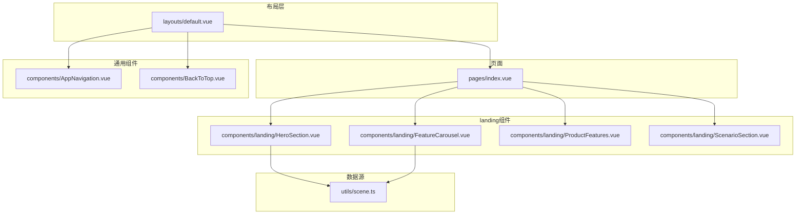
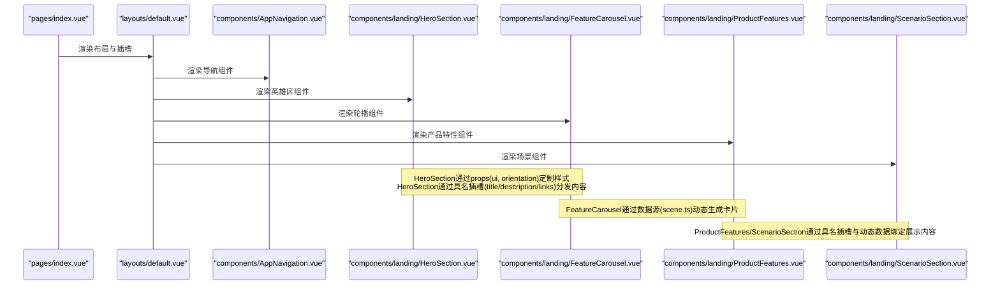
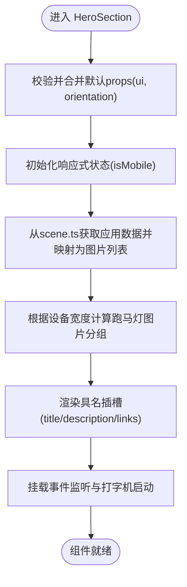
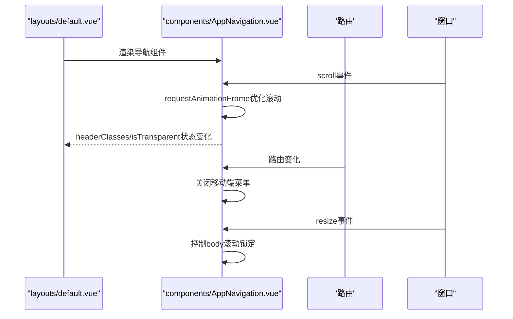
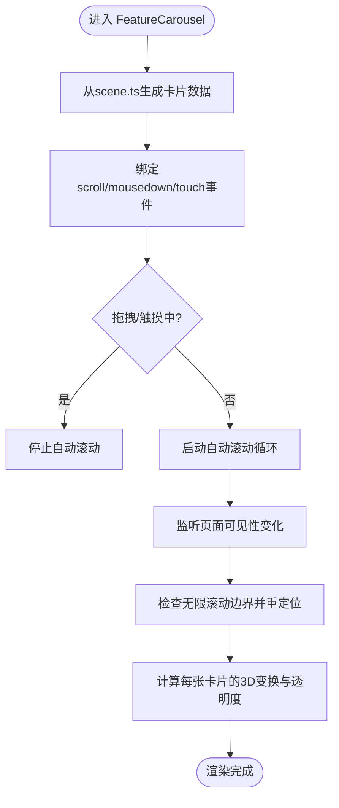
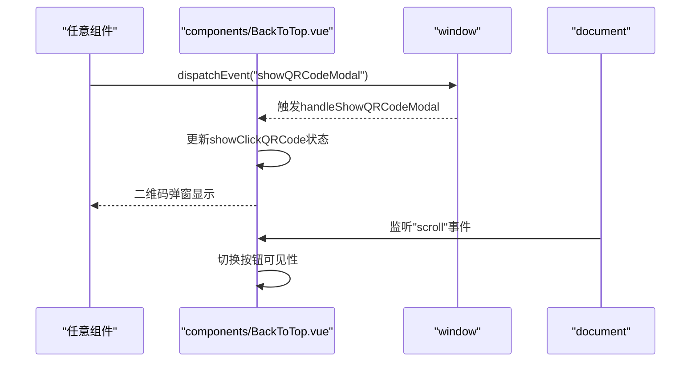
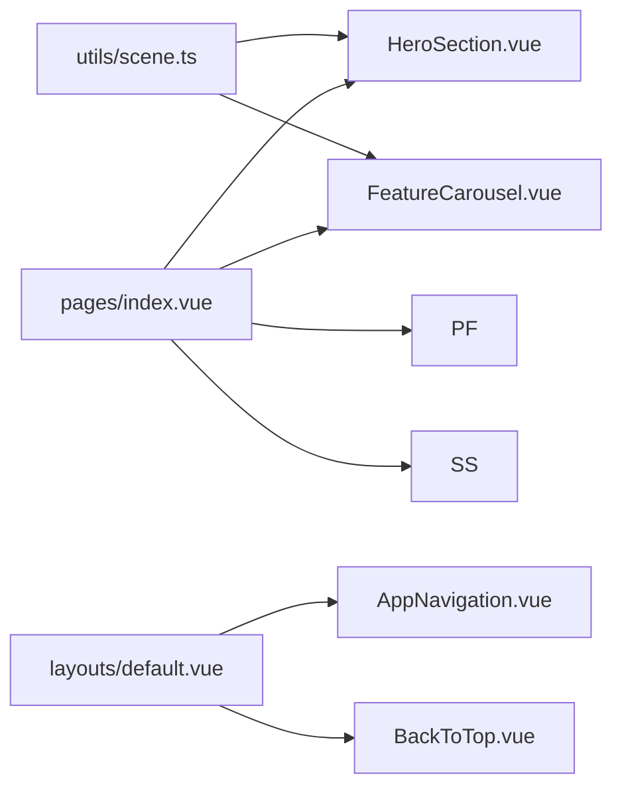

# 组件通信与高级API

<cite>
**本文引用的文件**
- [HeroSection.vue](file://components/landing/HeroSection.vue)
- [AppNavigation.vue](file://components/AppNavigation.vue)
- [FeatureCarousel.vue](file://components/landing/FeatureCarousel.vue)
- [ProductFeatures.vue](file://components/landing/ProductFeatures.vue)
- [ScenarioSection.vue](file://components/landing/ScenarioSection.vue)
- [scene.ts](file://utils/scene.ts)
- [index.vue](file://pages/index.vue)
- [default.vue](file://layouts/default.vue)
- [BackToTop.vue](file://components/BackToTop.vue)
</cite>

## 目录
1. [简介](#简介)
2. [项目结构](#项目结构)
3. [核心组件](#核心组件)
4. [架构总览](#架构总览)
5. [详细组件分析](#详细组件分析)
6. [依赖关系分析](#依赖关系分析)
7. [性能考量](#性能考量)
8. [故障排查指南](#故障排查指南)
9. [结论](#结论)
10. [附录](#附录)

## 简介
本文件聚焦于智言万象项目中的组件通信机制与高级API应用，围绕props、emits、slots在复杂组件中的实践展开，结合HeroSection与AppNavigation的实际实现，系统阐述：
- 如何通过props实现UI定制化配置与行为开关
- 如何利用emits实现父子组件通信与事件上行
- 动态插槽分发与属性透传的高级模式
- 通过provide/inject实现跨层级状态共享
- 在Nuxt 4中的SSR兼容性处理要点
- 类型安全与最佳实践

## 项目结构
本项目采用按功能域划分的组件组织方式，页面通过布局层组合多个landing组件，形成完整的首页内容区块。HeroSection、FeatureCarousel、ProductFeatures、ScenarioSection等landing组件均通过props接收配置，通过插槽暴露可定制内容，配合AppNavigation完成导航与交互。

**图表来源**
- [default.vue](file://layouts/default.vue#L1-L25)
- [index.vue](file://pages/index.vue#L1-L28)
- [HeroSection.vue](file://components/landing/HeroSection.vue#L1-L190)
- [FeatureCarousel.vue](file://components/landing/FeatureCarousel.vue#L1-L120)
- [ProductFeatures.vue](file://components/landing/ProductFeatures.vue#L1-L163)
- [ScenarioSection.vue](file://components/landing/ScenarioSection.vue#L1-L70)
- [scene.ts](file://utils/scene.ts#L1-L122)

**章节来源**
- [default.vue](file://layouts/default.vue#L1-L25)
- [index.vue](file://pages/index.vue#L1-L28)

## 核心组件
本节从组件通信与高级API角度，提炼关键实现点与最佳实践。

- HeroSection：通过props提供UI定制化配置，通过具名插槽实现标题、描述、链接等区域的动态分发；内部使用响应式状态与生命周期钩子实现打字机与跑马灯等复杂交互。
- AppNavigation：通过props与计算属性驱动UI状态，通过路由监听与滚动优化实现导航透明/实体切换与移动端菜单行为；未直接使用emits，但其与父布局的协作体现了事件上行与状态共享的典型模式。
- FeatureCarousel：通过props与具名插槽实现卡片内容的动态渲染；内部使用拖拽、自动滚动与无限循环算法，体现复杂交互与性能优化。
- ProductFeatures：通过动态图标组件与具名插槽实现功能特性展示；内部使用组件动态渲染与CSS类名策略，体现可维护性的设计。
- ScenarioSection：通过具名插槽与动态数据绑定实现场景卡片展示；强调内容与样式的解耦。
- BackToTop：通过事件监听与自定义事件实现跨组件交互（如触发二维码弹窗），体现事件驱动的通信模式。

**章节来源**
- [HeroSection.vue](file://components/landing/HeroSection.vue#L1-L190)
- [AppNavigation.vue](file://components/AppNavigation.vue#L1-L140)
- [FeatureCarousel.vue](file://components/landing/FeatureCarousel.vue#L1-L120)
- [ProductFeatures.vue](file://components/landing/ProductFeatures.vue#L1-L163)
- [ScenarioSection.vue](file://components/landing/ScenarioSection.vue#L1-L70)
- [BackToTop.vue](file://components/BackToTop.vue#L200-L275)

## 架构总览
以下序列图展示了页面与布局、landing组件之间的典型调用链与事件流，突出props注入、插槽分发与事件上行的协作。

**图表来源**
- [index.vue](file://pages/index.vue#L1-L28)
- [default.vue](file://layouts/default.vue#L1-L25)
- [HeroSection.vue](file://components/landing/HeroSection.vue#L1-L190)
- [FeatureCarousel.vue](file://components/landing/FeatureCarousel.vue#L1-L120)
- [ProductFeatures.vue](file://components/landing/ProductFeatures.vue#L1-L163)
- [ScenarioSection.vue](file://components/landing/ScenarioSection.vue#L1-L70)
- [scene.ts](file://utils/scene.ts#L1-L122)

## 详细组件分析

### HeroSection 组件：props与插槽的UI定制化实践
- props设计
  - orientation：控制组件方向（水平/垂直），用于布局适配
  - ui：对象型props，提供容器、标题、描述、链接、左侧内容、右侧图片展示区等样式类名的默认值与覆盖入口
  - 使用withDefaults为ui提供默认值，确保在父组件未传入时仍具备合理外观
- 插槽分发
  - 通过具名插槽(title/description/links)允许父组件覆盖默认内容与样式
  - 插槽作用域传递props.ui.links，便于父组件在不破坏默认结构的情况下微调链接区域
- 数据与交互
  - 通过utils/scene.ts提供的sceneApps数据生成跑马灯图片集合，实现内容与UI的解耦
  - 响应式检测设备宽度，动态切换移动端/桌面端展示策略
  - 打字机效果与定时器清理，体现生命周期与内存管理的最佳实践

**图表来源**
- [HeroSection.vue](file://components/landing/HeroSection.vue#L200-L355)
- [scene.ts](file://utils/scene.ts#L1-L122)

**章节来源**
- [HeroSection.vue](file://components/landing/HeroSection.vue#L200-L355)
- [scene.ts](file://utils/scene.ts#L1-L122)

### AppNavigation 组件：父子组件通信与UI状态管理
- props与计算属性
  - 通过计算属性isTransparent/headerClasses根据透明/实体状态切换样式类名
  - 通过navigationMenuUi/mobileNavigationMenuUi在不同状态下输出不同的UI配置
- 事件与生命周期
  - 监听滚动事件，使用requestAnimationFrame优化滚动处理
  - 监听路由变化，关闭移动端菜单
  - 监听移动端菜单开关，控制body滚动锁定
- 事件上行模式
  - 该组件未显式定义emits，但其与父布局(default.vue)的协作体现了事件上行与状态共享的典型模式：父布局通过路由与滚动状态影响子组件的UI表现

**图表来源**
- [AppNavigation.vue](file://components/AppNavigation.vue#L267-L308)
- [default.vue](file://layouts/default.vue#L1-L25)

**章节来源**
- [AppNavigation.vue](file://components/AppNavigation.vue#L220-L308)
- [default.vue](file://layouts/default.vue#L1-L25)

### FeatureCarousel 组件：复杂交互与插槽分发
- props与插槽
  - 通过数据源scene.ts生成卡片列表，支持复制多份以实现无限滚动
  - 通过具名插槽与动态内容绑定实现卡片内容的可定制化
- 复杂交互
  - 拖拽与触摸事件处理，结合requestAnimationFrame优化滚动性能
  - 自动滚动与可见性感知（页面隐藏时停止自动滚动）
  - 无限滚动边界检测与重定位，保证视觉连续性
- 性能优化
  - 使用transform/opacity而非频繁重排DOM
  - 使用累加器解决sub-pixel滚动精度问题

**图表来源**
- [FeatureCarousel.vue](file://components/landing/FeatureCarousel.vue#L120-L309)
- [scene.ts](file://utils/scene.ts#L1-L122)

**章节来源**
- [FeatureCarousel.vue](file://components/landing/FeatureCarousel.vue#L120-L309)
- [scene.ts](file://utils/scene.ts#L1-L122)

### ProductFeatures 组件：动态插槽与组件动态渲染
- 动态图标组件
  - 通过h函数动态创建SVG图标，减少重复模板与样式代码
- 插槽与数据绑定
  - 通过具名插槽与动态数据绑定实现功能特性展示
  - 使用颜色类名策略提升视觉一致性与可维护性

**章节来源**
- [ProductFeatures.vue](file://components/landing/ProductFeatures.vue#L75-L163)

### ScenarioSection 组件：插槽与动态数据
- 具名插槽
  - 通过具名插槽与动态数据绑定实现场景卡片展示
  - 结合布局类名实现奇偶行反向展示

**章节来源**
- [ScenarioSection.vue](file://components/landing/ScenarioSection.vue#L1-L70)

### BackToTop 组件：事件驱动的跨组件通信
- 事件监听
  - 监听滚动事件，控制按钮显示/隐藏
  - 监听自定义事件showQRCodeModal，实现跨组件触发二维码弹窗
- 事件上行
  - 通过window.addEventListener注册自定义事件，供其他组件触发
  - 通过点击按钮触发滚动至顶部的行为

**图表来源**
- [BackToTop.vue](file://components/BackToTop.vue#L234-L275)

**章节来源**
- [BackToTop.vue](file://components/BackToTop.vue#L234-L275)

## 依赖关系分析
- 组件间依赖
  - HeroSection与FeatureCarousel均依赖utils/scene.ts提供的应用数据，实现内容与UI解耦
  - 页面index.vue组合多个landing组件，布局default.vue承载导航与页脚等通用UI
- 外部依赖
  - Nuxt 4生态（@nuxt/ui等）广泛使用defineEmits、provide/inject、useSlots/useAttrs等API，体现现代Vue组件通信范式
  - SSR兼容性方面，Nuxt 4基于Nitro运行时，组件需避免在服务端访问浏览器全局对象（如window/document），并在客户端挂载时进行条件判断

**图表来源**
- [scene.ts](file://utils/scene.ts#L1-L122)
- [HeroSection.vue](file://components/landing/HeroSection.vue#L1-L190)
- [FeatureCarousel.vue](file://components/landing/FeatureCarousel.vue#L1-L120)
- [index.vue](file://pages/index.vue#L1-L28)
- [default.vue](file://layouts/default.vue#L1-L25)

**章节来源**
- [scene.ts](file://utils/scene.ts#L1-L122)
- [HeroSection.vue](file://components/landing/HeroSection.vue#L1-L190)
- [FeatureCarousel.vue](file://components/landing/FeatureCarousel.vue#L1-L120)
- [index.vue](file://pages/index.vue#L1-L28)
- [default.vue](file://layouts/default.vue#L1-L25)

## 性能考量
- 滚动与动画
  - 使用requestAnimationFrame优化滚动与3D变换，避免主线程阻塞
  - 通过transform/opacity替代布局重排，减少重绘与回流
- 内存与生命周期
  - 在onUnmounted中清理定时器与事件监听，防止内存泄漏
  - 对自动滚动使用累加器解决sub-pixel滚动精度问题
- SSR与浏览器API
  - 在服务端避免直接访问window/document，仅在客户端挂载时执行相关逻辑
  - 对可见性变化与滚动事件进行防抖/节流处理，降低CPU占用

[本节为通用指导，无需具体文件引用]

## 故障排查指南
- 插槽未生效
  - 确认父组件是否正确使用具名插槽与作用域插槽
  - 检查插槽命名与作用域变量是否一致
- props未生效
  - 检查props类型定义与默认值合并逻辑
  - 确保父组件传入的props与组件期望类型一致
- 事件未触发
  - 检查自定义事件名称与监听器是否匹配
  - 确认事件在客户端触发，避免在服务端执行
- SSR相关错误
  - 避免在服务端访问window/document，使用条件判断仅在客户端执行
  - 对依赖浏览器API的逻辑进行延迟初始化

**章节来源**
- [BackToTop.vue](file://components/BackToTop.vue#L234-L275)
- [HeroSection.vue](file://components/landing/HeroSection.vue#L330-L355)
- [FeatureCarousel.vue](file://components/landing/FeatureCarousel.vue#L260-L309)

## 结论
本项目通过props、插槽与计算属性实现了UI的高度可定制化与内容的解耦；通过事件监听与自定义事件实现了跨组件通信；通过数据源与响应式状态管理提升了复杂交互的性能与稳定性。在Nuxt 4环境下，遵循SSR兼容性原则，避免在服务端访问浏览器API，确保组件在服务端与客户端的一致性与可靠性。

[本节为总结性内容，无需具体文件引用]

## 附录
- 高级API使用场景建议
  - useSlots/useAttrs：在需要动态分发插槽或透传属性时，优先使用useSlots与useAttrs，确保父组件的插槽与属性能够被正确透传到子树
  - provide/inject：在跨层级组件共享状态时，使用provide/inject，避免深层嵌套的props钻取
  - defineEmits：在需要向上游组件发出事件时，明确声明emits并规范事件命名，确保父子组件契约清晰
  - 类型安全：为props与emits定义明确的类型，结合TS类型推断与接口约束，提升开发体验与可维护性

[本节为通用指导，无需具体文件引用]