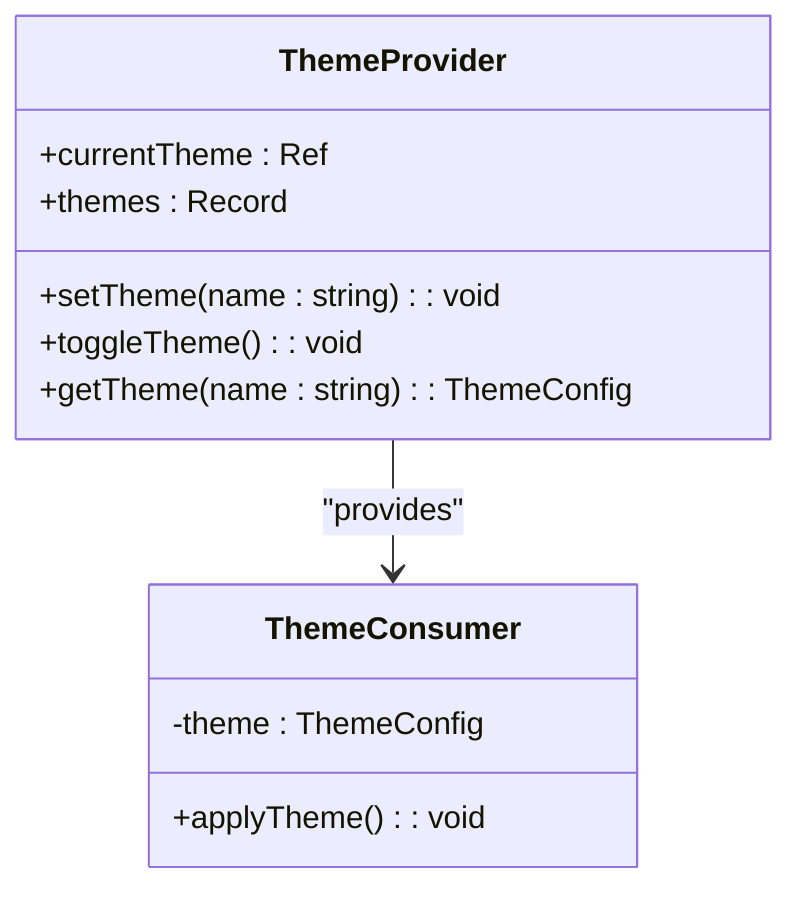
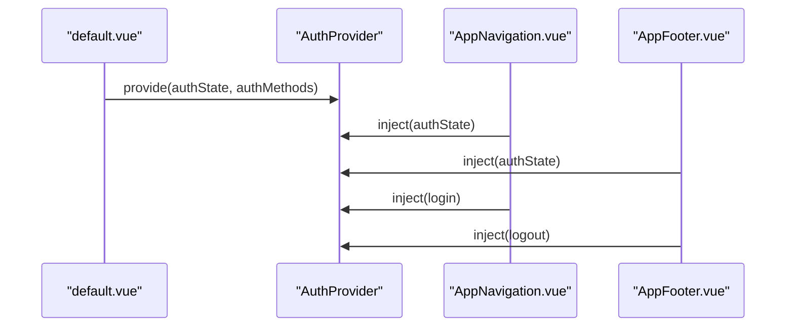
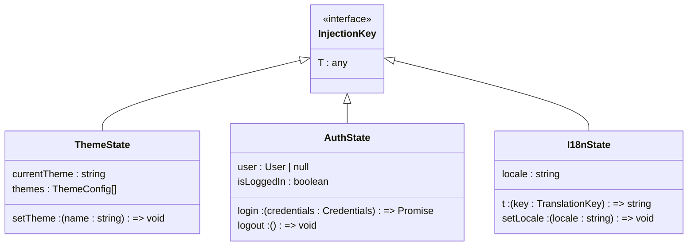

# 跨层级状态共享（Provide/Inject）

<cite>
**本文档引用文件**  
- [app.vue](file://app.vue)
- [layouts/default.vue](file://layouts/default.vue)
- [components/AppNavigation.vue](file://components/AppNavigation.vue)
- [app.config.ts](file://app.config.ts)
- [nuxt.config.ts](file://nuxt.config.ts)
- [assets/css/main.css](file://assets/css/main.css)
</cite>

## 目录
1. [项目结构与状态管理现状](#项目结构与状态管理现状)
2. [Provide/Inject 机制概述](#provideinject-机制概述)
3. [在 BuidAI 项目中应用 Provide/Inject](#在-buidai-项目中应用-provideinject)
4. [主题切换状态共享方案](#主题切换状态共享方案)
5. [用户认证状态共享方案](#用户认证状态共享方案)
6. [国际化配置共享方案](#国际化配置共享方案)
7. [与 TypeScript 类型推断的集成](#与-typescript-类型推断的集成)
8. [与 Vuex/Pinia 的对比分析](#与-vuexpinia-的对比分析)
9. [轻量级跨层级通信最佳实践](#轻量级跨层级通信最佳实践)
10. [总结与建议](#总结与建议)

## 项目结构与状态管理现状

BuidAI 项目采用 Nuxt 3 框架构建，整体架构遵循 Vue 3 的 Composition API 设计模式。项目通过 `app.vue` 作为根组件，使用 `NuxtLayout` 和 `NuxtPage` 实现布局与页面的动态渲染。核心布局组件 `default.vue` 包含导航、页脚和返回顶部等全局 UI 组件。

当前项目未显式使用 Vuex 或 Pinia 等全局状态管理库，而是依赖 Nuxt 提供的模块化配置和组件间通信机制。`app.config.ts` 文件用于配置全局 UI 样式和图标映射，而 `nuxt.config.ts` 则定义了模块加载、预渲染和颜色模式等核心配置。

项目中的状态管理主要体现在组件内部的响应式数据（如 `AppNavigation.vue` 中的 `mobileMenuOpen` 和 `isScrolled`），以及通过 CSS 变量和 Tailwind CSS 实现的主题切换功能。这种轻量级的状态管理模式适合当前项目规模，但随着功能复杂度增加，跨层级组件通信需求将日益凸显。

**Section sources**
- [app.vue](file://app.vue#L1-L12)
- [layouts/default.vue](file://layouts/default.vue#L1-L25)
- [nuxt.config.ts](file://nuxt.config.ts#L1-L91)

## Provide/Inject 机制概述

`provide` 和 `inject` 是 Vue 3 提供的依赖注入机制，允许祖先组件向其后代组件提供数据或方法，而无需通过 props 逐层传递。这一机制特别适用于跨多层级组件的状态共享场景。

`provide` 函数在祖先组件中调用，接收一个键和要提供的值。`inject` 函数在后代组件中调用，通过相同的键来获取提供的值。提供的值是响应式的，当其发生变化时，所有注入该值的组件都会自动更新。

该机制的优势在于：
- 避免了"props drilling"（属性层层传递）问题
- 提供了清晰的依赖关系声明
- 支持响应式数据传递
- 与 TypeScript 类型系统良好集成

在复杂导航结构中，`provide/inject` 可以作为轻量级的状态管理方案，适用于主题切换、用户认证状态、国际化配置等全局状态的共享。

## 在 BuidAI 项目中应用 Provide/Inject

尽管当前 `AppNavigation.vue` 组件未显式使用 `provide/inject`，但该机制可前瞻性地应用于多个全局状态管理场景。通过在根组件或布局组件中提供响应式状态，在深层嵌套的 UI 组件中安全消费，可以有效解决跨层级通信问题。

在 BuidAI 项目中，`default.vue` 布局组件是理想的 `provide` 注入点，因为它位于大多数功能组件的祖先位置。通过在此处提供全局状态，所有页面和功能组件都可以通过 `inject` 安全地访问这些状态。

对于类型安全，建议使用 Symbol 作为 `provide/inject` 的键，避免命名冲突，并结合 TypeScript 的泛型能力实现完整的类型推断。这种方式既能保证代码的可维护性，又能充分利用 Vue 3 的响应式系统优势。

**Section sources**
- [layouts/default.vue](file://layouts/default.vue#L1-L25)
- [components/AppNavigation.vue](file://components/AppNavigation.vue#L1-L309)

## 主题切换状态共享方案

主题切换是典型的全局状态管理需求。在 BuidAI 项目中，当前通过 CSS 变量和 `dark` 类实现主题切换，但缺乏统一的状态管理。使用 `provide/inject` 机制可以创建一个集中式的主题管理方案。



**Diagram sources**
- [app.config.ts](file://app.config.ts#L1-L83)
- [assets/css/main.css](file://assets/css/main.css#L1-L39)

在 `default.vue` 中，可以创建一个 `ThemeProvider` 服务，通过 `provide` 暴露主题状态和操作方法。深层组件如 `AppNavigation.vue` 可以通过 `inject` 获取主题状态，并根据当前主题动态调整 UI 样式。

该方案的优势在于：
- 集中管理主题配置，避免分散的 CSS 变量定义
- 提供统一的 API 进行主题切换
- 支持运行时动态添加新主题
- 与 Nuxt 的 `colorMode` 配置无缝集成

## 用户认证状态共享方案

用户认证状态是另一个适合 `provide/inject` 的应用场景。在 BuidAI 项目中，登录状态需要在多个组件（如导航、页脚、功能按钮）之间共享。



**Diagram sources**
- [layouts/default.vue](file://layouts/default.vue#L1-L25)
- [components/AppNavigation.vue](file://components/AppNavigation.vue#L1-L309)
- [components/AppFooter.vue](file://components/AppFooter.vue#L1-L207)

通过在根布局中提供认证状态，所有需要显示用户信息或控制访问权限的组件都可以直接注入该状态。这避免了在每个需要认证信息的组件中重复调用 API 或从 Vuex 获取状态。

认证状态应包含用户基本信息、权限级别、会话有效期等，并提供登录、登出、刷新令牌等方法。通过响应式引用（`ref` 或 `reactive`）包装，确保状态变化时所有消费者组件都能及时更新。

## 国际化配置共享方案

国际化（i18n）配置是第三个典型的全局状态场景。虽然 Nuxt 提供了内置的国际化支持，但通过 `provide/inject` 可以创建更灵活的本地化方案。

在 `app.vue` 或 `default.vue` 中，可以提供一个包含当前语言、翻译函数和语言切换方法的对象。深层组件通过注入获取这些信息，实现动态内容本地化。

该方案的优势包括：
- 统一的翻译函数接口，避免不同组件使用不同的 i18n 库
- 支持运行时语言切换
- 可以与 Nuxt 的 `@nuxtjs/i18n` 模块集成
- 提供类型安全的翻译键访问

对于类型安全，可以定义一个包含所有翻译键的 TypeScript 接口，确保在使用 `inject` 获取翻译函数时获得完整的类型推断和自动补全。

**Section sources**
- [app.vue](file://app.vue#L1-L12)
- [layouts/default.vue](file://layouts/default.vue#L1-L25)

## 与 TypeScript 类型推断的集成

`provide/inject` 与 TypeScript 的集成是确保类型安全的关键。在 BuidAI 项目中，应采用以下模式实现完整的类型推断：



**Diagram sources**
- [app.config.ts](file://app.config.ts#L1-L83)
- [tsconfig.json](file://tsconfig.json#L1-L17)

首先，为每个 `provide/inject` 对创建唯一的 Symbol 作为键，避免命名冲突：

```typescript
const themeKey = Symbol() as InjectionKey<ThemeState>
```

然后，在 `provide` 时指定类型：

```typescript
provide<ThemeState>(themeKey, reactive(themeState))
```

在 `inject` 时，TypeScript 能够自动推断出返回值的类型：

```typescript
const theme = inject(themeKey)!
```

这种模式确保了从提供到消费的整个链条都具有完整的类型安全，同时保持了代码的简洁性。

## 与 Vuex/Pinia 的对比分析

`provide/inject` 与 Vuex/Pinia 等状态管理库各有适用场景，选择应基于项目需求和复杂度。

| 特性 | Provide/Inject | Vuex/Pinia |
|------|---------------|----------|
| **复杂度** | 轻量级，适合简单状态共享 | 重量级，适合复杂状态管理 |
| **学习曲线** | 低，Vue 3 内置 API | 中，需要学习特定概念 |
| **调试工具** | 有限，依赖 Vue DevTools | 完善，专用开发工具 |
| **类型安全** | 优秀，与 TypeScript 深度集成 | 良好，但需要额外配置 |
| **持久化** | 需手动实现 | 内置或插件支持 |
| **适用场景** | 跨层级组件通信、主题、i18n | 复杂业务逻辑、多模块状态 |

对于 BuidAI 项目，`provide/inject` 更适合当前的轻量级需求。它避免了引入额外依赖的开销，同时提供了足够的功能来管理全局状态。只有当状态逻辑变得非常复杂，需要时间旅行调试或模块化状态管理时，才应考虑迁移到 Pinia。

**Section sources**
- [package.json](file://package.json)
- [nuxt.config.ts](file://nuxt.config.ts#L1-L91)

## 轻量级跨层级通信最佳实践

基于 BuidAI 项目的分析，以下是使用 `provide/inject` 的最佳实践建议：

1. **选择合适的注入点**：在 `default.vue` 或 `app.vue` 等高层级组件中提供全局状态，确保大多数消费者组件都能访问。

2. **使用 Symbol 作为键**：避免字符串键的命名冲突风险，确保类型安全。

3. **提供响应式对象**：使用 `reactive` 或 `ref` 包装提供的状态，确保变化能被正确追踪。

4. **定义清晰的接口**：为提供的状态和方法定义 TypeScript 接口，提高代码可维护性。

5. **避免过度使用**：仅在真正需要跨多层级通信时使用，简单父子通信仍应使用 props 和 emits。

6. **文档化注入契约**：在组件文档中明确说明提供了哪些状态，以及如何正确消费。

7. **考虑默认值**：在 `inject` 时提供合理的默认值，避免在测试或孤立组件中出现错误。

8. **性能优化**：对于大型状态对象，考虑使用 `shallowRef` 或 `markRaw` 避免不必要的响应式转换。

这些实践确保了 `provide/inject` 机制在项目中的有效和安全使用，同时保持了代码的可维护性和可测试性。

## 总结与建议

`provide/inject` 机制为 BuidAI 项目提供了一种优雅的跨层级状态管理方案。尽管当前组件未显式使用该机制，但其在主题切换、用户认证和国际化等场景中具有显著优势。

建议在项目演进过程中，逐步引入 `provide/inject` 来管理全局状态，特别是在以下情况：
- 需要跨 3 层以上组件传递状态
- 多个不相关的组件需要访问相同的状态
- 状态变化需要触发多个分散组件的更新

通过结合 TypeScript 的类型系统，`provide/inject` 能够提供既灵活又安全的状态管理解决方案，避免了引入重量级状态库的复杂性。这种轻量级模式特别适合 BuidAI 当前的项目规模和架构风格。

最终，`provide/inject` 应被视为 Vue 3 生态中不可或缺的工具，与 Composition API 协同工作，共同构建可维护、可扩展的前端应用。