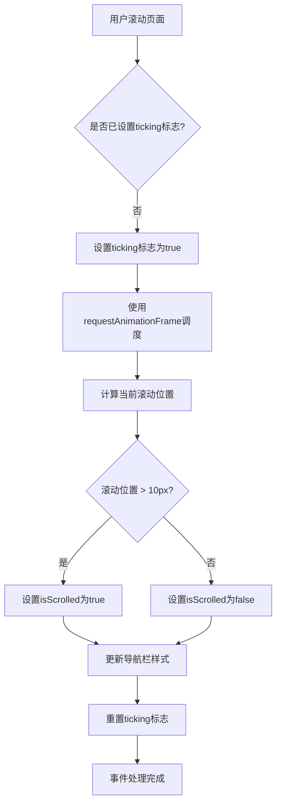
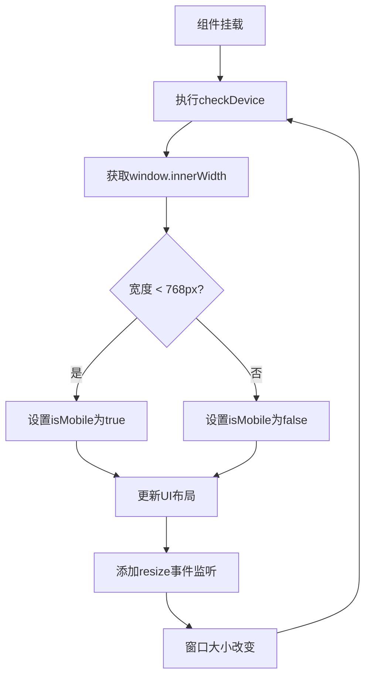

# 常用组合式函数实现示例

<cite>
**本文档引用的文件**
- [AppNavigation.vue](file://components\AppNavigation.vue)
- [HeroSection.vue](file://components\landing\HeroSection.vue)
</cite>

## 目录
1. [简介](#简介)
2. [核心组件分析](#核心组件分析)
3. [useScroll在导航栏透明度切换中的应用](#usescroll在导航栏透明度切换中的应用)
4. [useDevice在响应式布局控制中的实现](#usedevice在响应式布局控制中的实现)
5. [性能优化与复用性](#性能优化与复用性)
6. [结论](#结论)

## 简介
本文档基于`AppNavigation.vue`和`HeroSection.vue`的实际代码，深入解析常用组合式函数的实现方式。重点分析`useScroll`在导航栏透明度动态切换中的应用，以及`useDevice`在响应式布局控制中的实现机制。通过详细的代码分析，展示如何封装window事件监听、resize处理和scroll优化（使用requestAnimationFrame），并说明这些组合式函数如何在不同组件间复用，同时保持状态独立性和性能优化。

## 核心组件分析

本文档的核心分析基于两个关键组件：`AppNavigation.vue`和`HeroSection.vue`。`AppNavigation.vue`实现了导航栏的动态透明度切换，而`HeroSection.vue`则展示了响应式布局的控制逻辑。通过对这两个组件的分析，我们可以提取出可复用的组合式函数模式。

**组件来源**
- [AppNavigation.vue](file://components\AppNavigation.vue#L1-L309)
- [HeroSection.vue](file://components\landing\HeroSection.vue#L1-L392)

## useScroll在导航栏透明度切换中的应用

`useScroll`组合式函数的核心思想是通过优化的滚动事件处理，实现导航栏透明度的平滑切换。在`AppNavigation.vue`中，该逻辑通过`onScroll`函数和`requestAnimationFrame`来实现。

**图表来源**
- [AppNavigation.vue](file://components\AppNavigation.vue#L267-L284)

该实现的关键在于使用`requestAnimationFrame`进行性能优化，避免了在高频率滚动事件中频繁触发DOM操作。通过`ticking`标志位，确保在每一帧中最多只执行一次滚动处理，从而显著提升了性能。

**组件来源**
- [AppNavigation.vue](file://components\AppNavigation.vue#L159-L160)
- [AppNavigation.vue](file://components\AppNavigation.vue#L269-L284)

## useDevice在响应式布局控制中的实现

`useDevice`组合式函数用于检测设备类型并相应地调整UI布局。在`HeroSection.vue`中，该功能通过`checkDevice`函数和`window.innerWidth`的监听来实现。

**图表来源**
- [HeroSection.vue](file://components\landing\HeroSection.vue#L330-L343)

该实现通过监听`resize`事件来动态检测设备类型变化。当窗口宽度小于768px时，认为是移动端设备，从而调整UI布局以适应小屏幕。这种响应式设计确保了在不同设备上都能提供良好的用户体验。

**组件来源**
- [HeroSection.vue](file://components\landing\HeroSection.vue#L253-L254)
- [HeroSection.vue](file://components\landing\HeroSection.vue#L345-L349)

## 性能优化与复用性

上述组合式函数的设计充分考虑了性能优化和复用性。`useScroll`通过`requestAnimationFrame`和`ticking`标志位避免了不必要的重绘，而`useDevice`则通过事件监听实现了动态响应。

这些函数可以轻松地在其他组件中复用，只需导入并调用相应的逻辑即可。例如，`useScroll`可以用于任何需要根据滚动位置改变样式的组件，而`useDevice`则适用于所有需要响应式布局的场景。

**组件来源**
- [AppNavigation.vue](file://components\AppNavigation.vue#L288-L295)
- [HeroSection.vue](file://components\landing\HeroSection.vue#L347-L348)

## 结论
通过对`AppNavigation.vue`和`HeroSection.vue`的分析，我们展示了如何实现和应用`useScroll`和`useDevice`组合式函数。这些函数不仅提高了代码的复用性，还通过合理的性能优化确保了应用的流畅性。在实际开发中，建议将这些逻辑封装为独立的组合式函数，以便在项目中广泛使用。