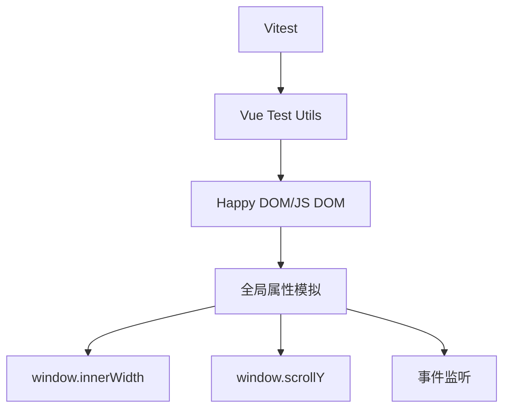

# 组合式函数测试策略

<cite>
**本文档引用文件**   
- [HeroSection.vue](file://components/landing/HeroSection.vue#L330-L354)
- [FeatureCarousel.vue](file://components/landing/FeatureCarousel.vue#L230-L246)
- [package.json](file://package.json#L20-L21)
- [package.json](file://package.json#L25-L26)
- [package.json](file://package.json#L33)
</cite>

## 目录
1. [引言](#引言)
2. [项目结构分析](#项目结构分析)
3. [核心组合式函数识别](#核心组合式函数识别)
4. [测试环境配置](#测试环境配置)
5. [useDevice测试策略](#usedevice测试策略)
6. [useScroll测试策略](#usescroll测试策略)
7. [事件监听器测试](#事件监听器测试)
8. [测试用例设计](#测试用例设计)
9. [结论](#结论)

## 引言
本测试策略文档旨在为buidai项目中的核心组合式函数（如useScroll、useDevice）设计全面的单元测试方案。通过分析现有代码实现，我们将基于Vue Test Utils和Vitest构建可靠的测试框架，重点解决依赖DOM事件和全局属性（如window.scrollY、window.innerWidth）的测试难题。文档将提供具体的测试用例设计，确保滚动状态变化、设备尺寸检测功能的正确性，以及事件监听器的正确绑定与清理。

## 项目结构分析
项目采用Nuxt框架构建，主要组件分布在components目录下。分析显示，虽然项目中未发现独立的composables目录，但设备检测和滚动相关的逻辑已内置于多个Vue组件中。核心功能主要集中在landing子目录的组件中，如HeroSection.vue和FeatureCarousel.vue。项目已配置Vitest作为测试框架，并使用Vue Test Utils进行组件测试，为组合式函数的单元测试提供了良好的基础环境。

## 核心组合式函数识别
通过对代码库的分析，我们识别出两个关键的组合式函数模式：

1. **设备检测逻辑**：在HeroSection.vue中实现的`checkDevice`函数，通过监听window.resize事件并检查window.innerWidth来判断设备类型。
2. **自动滚动逻辑**：在FeatureCarousel.vue中实现的`autoScrollLoop`函数，使用requestAnimationFrame处理连续滚动，并依赖window.scrollY相关属性。

这些逻辑虽然目前直接嵌入组件中，但具备提取为独立组合式函数（useDevice、useScroll）的潜力，因此其测试策略具有重要参考价值。

**Section sources**
- [HeroSection.vue](file://components/landing/HeroSection.vue#L330-L343)
- [FeatureCarousel.vue](file://components/landing/FeatureCarousel.vue#L230-L246)

## 测试环境配置
项目已正确配置Vitest和Vue Test Utils作为测试工具链。package.json中明确列出了`@nuxt/test-utils`、`@vue/test-utils`和`vitest`作为开发依赖，表明项目支持全面的单元测试。测试环境支持使用happy-dom或jsdom作为测试运行器，能够模拟浏览器环境，这对于测试依赖全局DOM属性的组合式函数至关重要。

**Diagram sources**
- [package.json](file://package.json#L20-L21)
- [package.json](file://package.json#L25-L26)
- [package.json](file://package.json#L33)

## useDevice测试策略
针对设备检测功能，我们需要模拟window.innerWidth的变化并验证响应式状态的正确更新。测试策略包括：

1. **全局属性stub**：使用vi.stubGlobal方法模拟window.innerWidth，避免真实浏览器环境的依赖。
2. **事件模拟**：通过dispatchEvent模拟resize事件，测试事件监听器的响应。
3. **断言验证**：验证isMobile状态在不同屏幕宽度下的正确性。

测试应覆盖移动端（<768px）和桌面端（≥768px）的切换场景，确保状态变化的准确性和事件监听器的正确绑定与清理。

**Section sources**
- [HeroSection.vue](file://components/landing/HeroSection.vue#L335-L343)

## useScroll测试策略
对于滚动相关的组合式函数，测试重点在于requestAnimationFrame的模拟和滚动状态的验证。策略包括：

1. **requestAnimationFrame模拟**：使用vi.useFakeTimers()和vi.runAllTimers()控制动画帧的执行。
2. **滚动属性模拟**：stub window.scrollY等属性，模拟不同滚动位置。
3. **性能优化验证**：针对FeatureCarousel.vue中的scrollAccumulator模式，验证小数滚动的累积处理逻辑。

测试需要确保自动滚动循环的正确启动、暂停，以及在不同滚动速度下的行为一致性。

**Section sources**
- [FeatureCarousel.vue](file://components/landing/FeatureCarousel.vue#L234-L246)

## 事件监听器测试
事件监听器的正确管理是组合式函数测试的关键。测试策略应包括：

1. **onMounted验证**：确保在组件挂载时正确添加事件监听器。
2. **onUnmounted验证**：确保在组件卸载时正确移除事件监听器，防止内存泄漏。
3. **监听器计数**：通过jest.spyOn或vi.spyOn监控addEventListener和removeEventListener的调用次数和参数。

对于HeroSection.vue中的resize事件监听，需要验证其在组件生命周期内的正确绑定和解绑。

**Section sources**
- [HeroSection.vue](file://components/landing/HeroSection.vue#L347-L352)

## 测试用例设计
基于上述策略，设计以下核心测试用例：

1. **设备检测用例**：
   - 当window.innerWidth < 768时，isMobile应为true
   - 当window.innerWidth ≥ 768时，isMobile应为false
   - resize事件应触发设备检测逻辑

2. **滚动用例**：
   - autoScrollLoop应持续执行动画帧
   - scrollAccumulator应正确处理小数滚动
   - 滚动状态应根据accumulated值正确更新

3. **生命周期用例**：
   - 组件挂载时应添加resize监听器
   - 组件卸载时应移除resize监听器
   - 监听器添加和移除次数应匹配

这些用例将使用Vitest的describe、test、expect等API实现，并结合Vue Test Utils的挂载功能进行验证。

## 结论
尽管buidai项目目前未将useScroll和useDevice实现为独立的组合式函数，但现有组件中的相关逻辑为测试策略提供了明确的参考。通过Vitest和Vue Test Utils，我们可以有效模拟全局DOM属性和事件，构建可靠的单元测试。建议将这些通用逻辑重构为独立的组合式函数，以便在项目中复用并集中测试，提高代码质量和可维护性。测试策略的成功实施将确保响应式功能在不同设备和用户交互下的稳定性和可靠性。