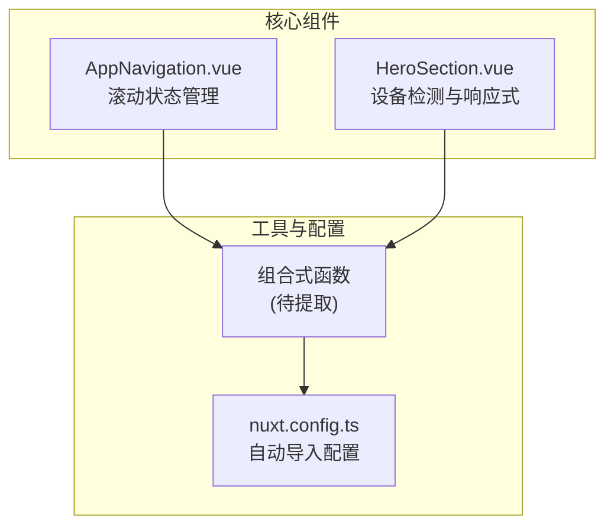
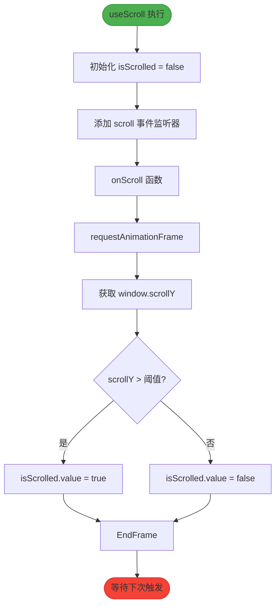
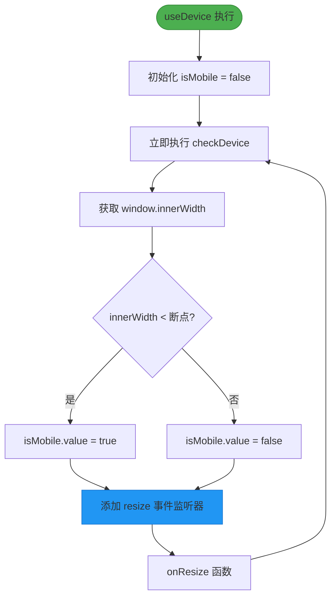

# 组合式函数设计原则

<cite>
**本文档引用文件**  
- [AppNavigation.vue](file://components/AppNavigation.vue)
- [HeroSection.vue](file://components/landing/HeroSection.vue)
- [nuxt.config.ts](file://nuxt.config.ts)
- [package.json](file://package.json)
</cite>

## 目录
1. [引言](#引言)
2. [项目结构](#项目结构)
3. [核心组件分析](#核心组件分析)
4. [组合式函数抽象逻辑](#组合式函数抽象逻辑)
5. [参数与返回值设计规范](#参数与返回值设计规范)
6. [副作用清理机制](#副作用清理机制)
7. [关注点分离与复用性提升](#关注点分离与复用性提升)
8. [Nuxt 4 自动导入配置](#nuxt-4-自动导入配置)
9. [可测试性设计](#可测试性设计)
10. [结论](#结论)

## 引言

在 智言万象 项目中，组合式函数（Composable Functions）作为 Vue 3 Composition API 的核心实践，承担着逻辑复用与状态管理的关键职责。本设计原则文档聚焦于 `useScroll` 和 `useDevice` 等自定义 Hook 的抽象逻辑，旨在通过分析 `AppNavigation.vue` 中的滚动监听逻辑与 `HeroSection.vue` 中的设备检测逻辑，提炼出可复用的组合式函数设计模式。文档将详细阐述参数类型定义、返回值结构设计、副作用清理机制的最佳实践，并说明如何通过组合式函数实现关注点分离，提升代码复用性与可测试性，同时提供在 Nuxt 4 中的自动导入配置方案。

## 项目结构

智言万象 项目采用基于 Nuxt 4 的模块化架构，遵循清晰的目录划分原则。核心功能组件集中于 `components/` 目录下，其中 `landing/` 子目录存放首页营销组件，`AppNavigation.vue` 作为全局导航组件独立存在。逻辑复用需求主要来源于这些 UI 组件内部的状态管理与浏览器 API 交互。

**Diagram sources**
- [AppNavigation.vue](file://components/AppNavigation.vue#L157-L308)
- [HeroSection.vue](file://components/landing/HeroSection.vue#L253-L354)

**Section sources**
- [AppNavigation.vue](file://components/AppNavigation.vue#L1-L309)
- [HeroSection.vue](file://components/landing/HeroSection.vue#L1-L392)

## 核心组件分析

### AppNavigation.vue 滚动逻辑分析

`AppNavigation.vue` 组件实现了基于滚动位置的动态导航栏效果。其核心逻辑在于监听 `window` 的 `scroll` 事件，判断当前滚动距离以切换导航栏的透明/实色背景状态。该逻辑通过 `onMounted` 和 `onUnmounted` 生命周期钩子进行事件监听的注册与销毁，使用 `requestAnimationFrame` 进行性能优化，避免频繁触发。

**Section sources**
- [AppNavigation.vue](file://components/AppNavigation.vue#L267-L308)

### HeroSection.vue 设备检测逻辑分析

`HeroSection.vue` 组件根据设备类型（移动端或桌面端）调整 UI 展示，如跑马灯方向与图片数量。其设备检测逻辑依赖于 `window.innerWidth` 的值，通过 `resize` 事件监听窗口尺寸变化。该逻辑同样在 `onMounted` 时注册事件监听器，并在 `onUnmounted` 时进行清理，确保不会造成内存泄漏。

**Section sources**
- [HeroSection.vue](file://components/landing/HeroSection.vue#L335-L354)

## 组合式函数抽象逻辑

为提升代码复用性与可维护性，应将上述组件中的通用逻辑抽象为独立的组合式函数。

### useScroll 组合式函数设计

`useScroll` 函数旨在封装窗口滚动状态的监听与管理。它应返回一个响应式引用 `isScrolled`，表示当前是否已滚动超过指定阈值（如 10px）。函数内部使用 `useEventListener`（来自 `@vueuse/core` 或自定义）来注册 `scroll` 事件监听器，并利用 `requestAnimationFrame` 优化性能。该函数可接受一个可选参数 `threshold` 以自定义滚动阈值。

**Diagram sources**
- [AppNavigation.vue](file://components/AppNavigation.vue#L267-L284)

### useDevice 组合式函数设计

`useDevice` 函数负责检测当前设备类型。它应返回一个响应式引用 `isMobile`，表示当前是否为移动设备。函数通过 `window.innerWidth` 与预设的断点（如 768px）进行比较来判断。同时，它需要监听 `resize` 事件，以便在窗口尺寸变化时更新 `isMobile` 的值。该函数可接受一个可选参数 `breakpoint` 以自定义移动设备的断点。

**Diagram sources**
- [HeroSection.vue](file://components/landing/HeroSection.vue#L335-L343)

## 参数与返回值设计规范

### 参数类型定义

组合式函数的参数应使用 TypeScript 接口进行严格定义，以提高代码的健壮性和可读性。
- `useScroll` 可定义 `UseScrollOptions` 接口，包含 `threshold?: number` 属性。
- `useDevice` 可定义 `UseDeviceOptions` 接口，包含 `breakpoint?: number` 属性。
所有参数均应为可选，提供合理的默认值（如 `threshold = 10`, `breakpoint = 768`），以简化调用。

### 返回值结构设计

返回值应是一个包含所有相关响应式状态和方法的解构对象。
- `useScroll` 应返回 `{ isScrolled: Ref<boolean> }`。
- `useDevice` 应返回 `{ isMobile: Ref<boolean> }`。
这种扁平化的结构便于在组件中直接解构使用，符合 Vue 组合式 API 的惯例。

**Section sources**
- [HeroSection.vue](file://components/landing/HeroSection.vue#L253-L254)
- [AppNavigation.vue](file://components/AppNavigation.vue#L159-L160)

## 副作用清理机制

组合式函数中涉及的浏览器原生事件监听是典型的副作用，必须在组件卸载时进行清理，以防止内存泄漏和意外行为。

### 清理策略

在 `useScroll` 和 `useDevice` 函数内部，应利用 `onUnmounted` 钩子（通过 `getCurrentInstance` 获取）或返回一个清理函数。推荐做法是在函数内部直接调用 `onUnmounted`，并在其中移除对应的事件监听器。
- `useScroll` 在 `onUnmounted` 中调用 `window.removeEventListener('scroll', onScroll)`。
- `useDevice` 在 `onUnmounted` 中调用 `window.removeEventListener('resize', checkDevice)`。
此机制确保了每当使用该组合式函数的组件被销毁时，相关的事件监听器也会被自动移除。

**Section sources**
- [AppNavigation.vue](file://components/AppNavigation.vue#L293-L295)
- [HeroSection.vue](file://components/landing/HeroSection.vue#L351-L353)

## 关注点分离与复用性提升

通过将 `AppNavigation.vue` 的滚动逻辑和 `HeroSection.vue` 的设备检测逻辑分别抽象为 `useScroll` 和 `useDevice` 组合式函数，实现了清晰的关注点分离（Separation of Concerns）。UI 组件（如 `AppNavigation.vue`）从此只关注其自身的模板渲染和业务逻辑，而将通用的状态管理逻辑委托给专门的组合式函数。这极大地提升了代码的复用性，未来任何需要检测滚动或设备类型的组件，只需简单地导入并调用相应的组合式函数即可，无需重复编写事件监听和状态管理代码，从而降低了维护成本，提高了开发效率。

## Nuxt 4 自动导入配置

Nuxt 4 提供了强大的自动导入功能，可以自动扫描指定目录下的文件，并将其中的导出项（如组件、组合式函数、工具函数等）全局可用，无需手动 `import`。

### 配置方案

在 `nuxt.config.ts` 的 `modules` 配置中，`@nuxt/ui` 模块已启用。项目中使用了 `unplugin-auto-import` 插件（见 `package.json` 依赖），这是实现自动导入的关键。标准的 Nuxt 4 配置通常会在 `nuxt.config.ts` 中通过 `imports` 或 `autoImports` 选项来配置。虽然当前配置文件未显式写出，但根据 `package.json` 中的 `unplugin-auto-import` 依赖及其对 `@nuxt/kit` 的 peer dependency，可以推断项目已配置自动导入。最佳实践是创建 `composables/` 目录，并将 `useScroll` 和 `useDevice` 等函数存放于此。Nuxt 会自动扫描此目录，使得这些函数在项目任何 `.vue` 文件中都能被直接使用。

**Section sources**
- [nuxt.config.ts](file://nuxt.config.ts#L1-L91)
- [package.json](file://package.json#L1-L48)

## 可测试性设计

组合式函数因其逻辑独立、依赖明确的特点，天然具备良好的可测试性。`useScroll` 和 `useDevice` 函数的逻辑主要依赖于模拟的浏览器环境（`window` 对象）。在单元测试中，可以使用 Jest 或 Vitest 等测试框架，结合 `happy-dom` 或 `jsdom` 等库来模拟浏览器环境。通过手动设置 `window.scrollY` 或 `window.innerWidth` 的值，并触发相应的事件（`scroll` 或 `resize`），可以断言 `isScrolled` 或 `isMobile` 的响应式引用是否按预期更新。这种隔离测试的方式，不依赖于任何具体的 UI 组件，能够快速、准确地验证组合式函数的核心逻辑。

## 结论

通过对 `AppNavigation.vue` 和 `HeroSection.vue` 中的通用逻辑进行分析与抽象，我们确立了在 智言万象 项目中设计组合式函数的核心原则：将状态管理与副作用处理封装在独立的函数中，通过清晰的参数和返回值接口暴露功能，并利用 Nuxt 4 的自动导入机制实现无缝集成。遵循这些原则，不仅能有效提升代码的复用性和可维护性，还能显著增强应用的可测试性，为构建高质量、可扩展的前端应用奠定坚实基础。