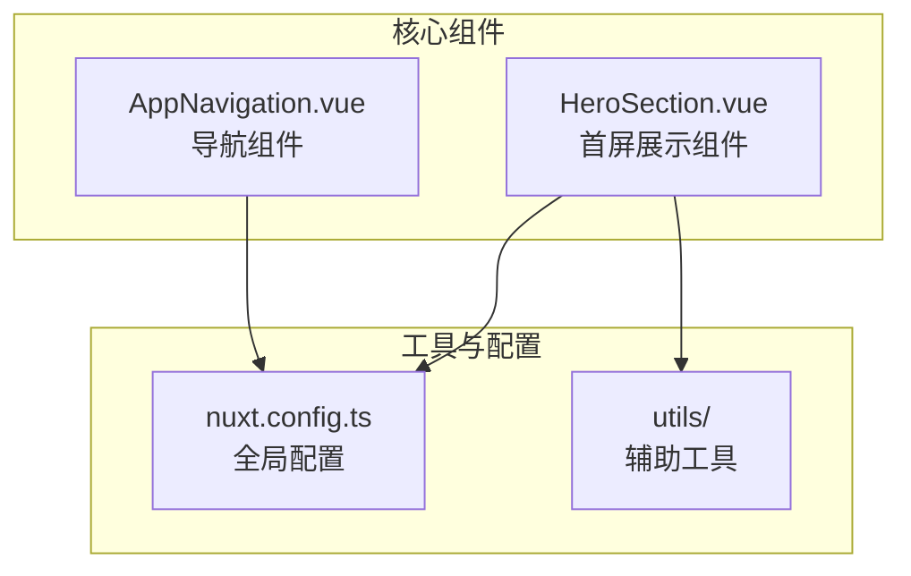
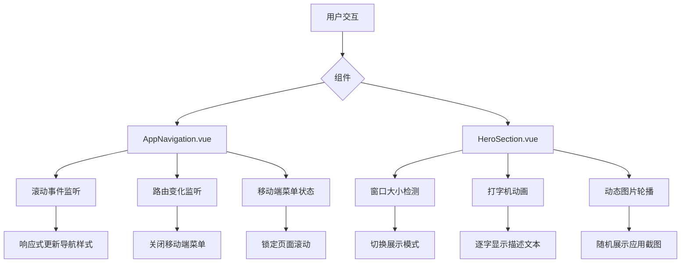
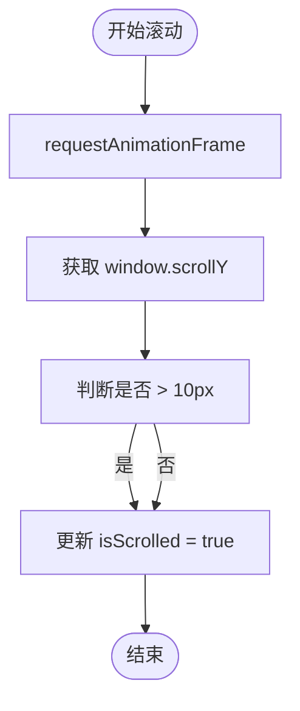
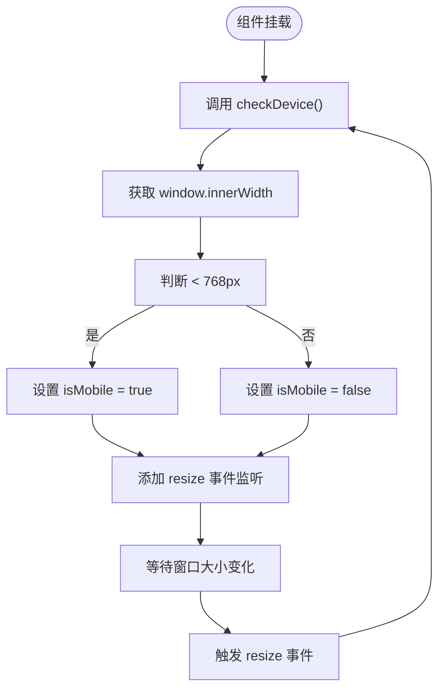

# 自定义组合式函数

<cite>
**本文档引用文件**  
- [AppNavigation.vue](file://components/AppNavigation.vue)
- [HeroSection.vue](file://components/landing/HeroSection.vue)
- [nuxt.config.ts](file://nuxt.config.ts)
</cite>

## 目录
1. [简介](#简介)
2. [项目结构](#项目结构)
3. [核心组件](#核心组件)
4. [架构概述](#架构概述)
5. [详细组件分析](#详细组件分析)
6. [依赖分析](#依赖分析)
7. [性能考量](#性能考量)
8. [故障排除指南](#故障排除指南)
9. [结论](#结论)

## 简介
本文档深入解析智言万象项目中自定义组合式函数的设计与实现，重点聚焦于`useNavigation`和`useDevice`等自定义Hook的工程实践。通过分析`AppNavigation.vue`和`HeroSection.vue`中的具体实现，阐述如何将滚动监听、设备检测等通用逻辑封装为可复用的组合式函数。文档还涵盖组合式函数的设计规范、关注点分离原则、代码复用性与可测试性提升策略，以及在Nuxt 4中的自动导入配置与最佳实践。

## 项目结构
智言万象项目采用基于Nuxt 4的模块化架构，核心功能组件集中于`components`目录下，按功能划分为通用组件与落地页专用组件。自定义逻辑主要通过组合式API在Vue组件内部实现，而非独立的组合式函数文件。项目利用Nuxt的自动导入机制，实现了对Vue、Nuxt UI及自定义API的无缝调用。



**图示来源**  
- [AppNavigation.vue](file://components/AppNavigation.vue)
- [HeroSection.vue](file://components/landing/HeroSection.vue)
- [nuxt.config.ts](file://nuxt.config.ts)

**本节来源**  
- [AppNavigation.vue](file://components/AppNavigation.vue)
- [HeroSection.vue](file://components/landing/HeroSection.vue)
- [nuxt.config.ts](file://nuxt.config.ts)

## 核心组件
本项目的核心组件`AppNavigation.vue`和`HeroSection.vue`均采用`<script setup>`语法糖，充分利用Vue 3的组合式API来组织逻辑。尽管未显式定义独立的`useNavigation`或`useDevice`函数，但其内部实现了等效的组合式逻辑，将状态管理、生命周期钩子和副作用处理封装在组件内部，体现了组合式函数的核心思想。

**本节来源**  
- [AppNavigation.vue](file://components/AppNavigation.vue#L140-L308)
- [HeroSection.vue](file://components/landing/HeroSection.vue#L193-L354)

## 架构概述
智言万象项目的前端架构遵循现代Vue应用的最佳实践，采用响应式数据驱动视图更新。`AppNavigation.vue`负责全局导航状态管理，包括滚动位置检测、移动端菜单切换和路由监听。`HeroSection.vue`则专注于首屏用户体验，实现了设备类型检测、打字机动画和动态内容展示。两者均通过`computed`属性和`watch`监听器实现复杂的状态逻辑，确保UI与数据的同步。



**图示来源**  
- [AppNavigation.vue](file://components/AppNavigation.vue#L267-L307)
- [HeroSection.vue](file://components/landing/HeroSection.vue#L330-L349)

## 详细组件分析

### AppNavigation.vue 分析
`AppNavigation.vue`组件封装了复杂的导航逻辑，包括滚动监听、透明度切换和移动端菜单管理。其核心是`onScroll`函数，采用`requestAnimationFrame`进行性能优化，避免了高频滚动事件对UI线程的阻塞。通过`isScrolled`响应式变量，实现了导航栏在滚动后的视觉状态切换。

#### 滚动监听逻辑


**图示来源**  
- [AppNavigation.vue](file://components/AppNavigation.vue#L267-L283)

#### 生命周期与事件监听
组件在`onMounted`时添加滚动事件监听器，并在`onUnmounted`时移除，确保了内存安全。同时，通过`watch`监听路由变化，自动关闭移动端菜单，提升了用户体验。

**本节来源**  
- [AppNavigation.vue](file://components/AppNavigation.vue#L288-L307)

### HeroSection.vue 分析
`HeroSection.vue`组件实现了设备检测和打字机动画两大核心功能。`checkDevice`函数通过监听`window.innerWidth`来判断当前设备类型，并据此调整UI展示模式。打字机效果通过递归的`setTimeout`实现，模拟了文本逐字输入的动画。

#### 设备检测实现原理


**图示来源**  
- [HeroSection.vue](file://components/landing/HeroSection.vue#L335-L347)

#### 打字机效果逻辑
打字机效果通过控制`typeWriterText`响应式变量的值来实现。函数根据当前字符索引和删除状态，逐步增加或减少显示的文本内容，并通过`typeTimeout`控制动画速度，实现了流畅的输入效果。

**本节来源**  
- [HeroSection.vue](file://components/landing/HeroSection.vue#L268-L292)

## 依赖分析
项目依赖主要分为三类：Nuxt框架核心模块、UI组件库和辅助工具。`nuxt.config.ts`中配置了`@nuxt/ui`和`@nuxt/content`模块，提供了丰富的UI组件和内容管理功能。`package-lock.json`显示项目使用了`@vueuse/core`，这是一个包含大量实用组合式函数的库，暗示项目可能间接利用了这些现成的Hook。

```mermaid
graph LR
A[智言万象项目] --> B[@nuxt/ui]
A --> C[@nuxt/content]
A --> D[@vueuse/core]
B --> E[UNavigationMenu]
B --> F[UButton]
C --> G[内容查询API]
D --> H[useScroll]
D --> I[useWindowSize]
```

**图示来源**  
- [nuxt.config.ts](file://nuxt.config.ts#L18-L21)
- [package-lock.json](file://package-lock.json#L18147-L18155)

**本节来源**  
- [nuxt.config.ts](file://nuxt.config.ts)
- [package-lock.json](file://package-lock.json)

## 性能考量
`AppNavigation.vue`中的滚动监听采用了`requestAnimationFrame`和节流机制（通过`ticking`标志位），有效避免了在快速滚动时触发过多的DOM更新，保证了页面的流畅性。`HeroSection.vue`中的`shuffleArray`函数实现了Fisher-Yates洗牌算法，确保了图片轮播的随机性，同时计算量较小，对性能影响微乎其微。

## 故障排除指南
- **移动端菜单无法关闭**：检查`watch`路由变化的逻辑是否正常执行，确保`mobileMenuOpen`变量被正确重置。
- **滚动监听失效**：确认`onMounted`和`onUnmounted`钩子是否正确添加和移除了事件监听器，避免内存泄漏。
- **打字机效果卡顿**：检查`typeTimeout`是否被正确清除，防止多个定时器同时运行。

**本节来源**  
- [AppNavigation.vue](file://components/AppNavigation.vue#L297-L300)
- [HeroSection.vue](file://components/landing/HeroSection.vue#L351-L353)

## 结论
虽然智言万象项目中未显式创建独立的`useNavigation`或`useDevice`组合式函数文件，但其组件内部的实现完全遵循了组合式API的设计理念。通过将`ref`、`computed`、`watch`和生命周期钩子有机组合，实现了高内聚、低耦合的逻辑封装。建议未来可将`checkDevice`等通用逻辑提取为独立的组合式函数，放置于`composables`目录下，以进一步提升代码的复用性和可维护性。同时，充分利用Nuxt 4的自动导入特性，可以简化代码，提高开发效率。