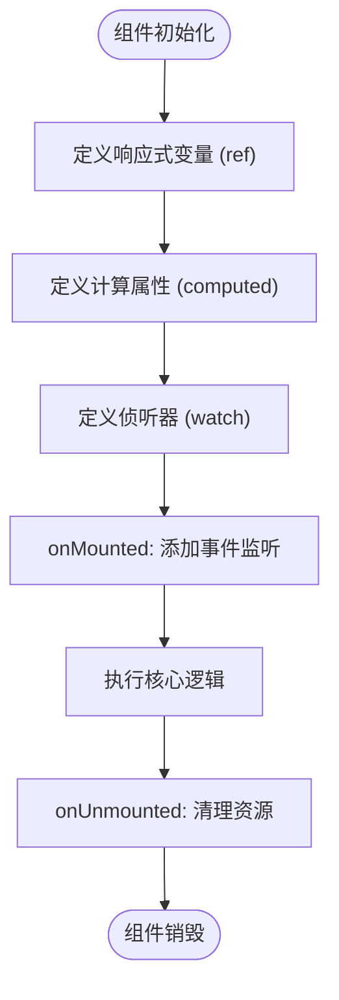

# 前端技术栈

<cite>
**本文档引用的文件**   
- [app.vue](file://app.vue)
- [default.vue](file://layouts/default.vue)
- [tsconfig.json](file://tsconfig.json)
- [nuxt.config.ts](file://nuxt.config.ts)
- [package.json](file://package.json)
- [index.vue](file://pages/index.vue)
- [AppNavigation.vue](file://components/AppNavigation.vue)
- [AppFooter.vue](file://components/AppFooter.vue)
- [HeroSection.vue](file://components/landing/HeroSection.vue)
- [getDocsRoutes.ts](file://utils/getDocsRoutes.ts)
- [pluginData.ts](file://utils/pluginData.ts)
- [scene.ts](file://utils/scene.ts)
- [blog/[...slug].vue](file://pages/blog/[...slug].vue)
</cite>

## 目录
1. [项目结构与核心文件](#项目结构与核心文件)
2. [Vue 3 组合式API应用](#vue-3-组合式api应用)
3. [TypeScript配置与类型安全](#typescript配置与类型安全)
4. [Vue组件结构与布局系统](#vue组件结构与布局系统)
5. [Nuxt约定式路由机制](#nuxt约定式路由机制)
6. [状态管理与响应式数据](#状态管理与响应式数据)
7. [组件通信与最佳实践](#组件通信与最佳实践)
8. [错误处理与开发体验](#错误处理与开发体验)

## 项目结构与核心文件

buidai项目采用Nuxt 4框架构建，遵循约定优于配置的原则。项目根目录包含`app.vue`作为应用入口，`layouts/default.vue`定义全局布局，`pages`目录下的文件自动生成路由。`components`目录存放可复用的UI组件，`utils`目录包含工具函数如`getDocsRoutes.ts`用于动态生成文档路由。`tsconfig.json`配置TypeScript编译选项，`nuxt.config.ts`定义Nuxt模块和构建配置。

**Section sources**
- [app.vue](file://app.vue#L1-L12)
- [default.vue](file://layouts/default.vue#L1-L25)
- [nuxt.config.ts](file://nuxt.config.ts#L1-L91)
- [package.json](file://package.json#L1-L48)

## Vue 3 组合式API应用

项目广泛使用Vue 3组合式API，通过`<script setup>`语法糖简化组件逻辑。在`AppNavigation.vue`中，使用`ref`创建响应式状态`mobileMenuOpen`和`isScrolled`，通过`computed`计算`headerClasses`和`navigationMenuUi`等动态样式。`onMounted`和`onUnmounted`生命周期钩子用于添加和移除滚动事件监听器。`watch`监听路由变化以关闭移动端菜单。`HeroSection.vue`中实现打字机动画，通过`typeWriter`函数控制文本逐字显示，利用`setTimeout`实现打字和删除效果。



**Diagram sources**
- [AppNavigation.vue](file://components/AppNavigation.vue#L140-L308)
- [HeroSection.vue](file://components/landing/HeroSection.vue#L192-L354)

## TypeScript配置与类型安全

`tsconfig.json`配置`moduleResolution: "Bundler"`，与Nuxt 4的打包机制集成，支持现代ESM特性。`extends`继承`.nuxt/tsconfig.json`的框架默认配置。`include`包含所有源文件和故事文件。`compilerOptions.types`指定`node`和`vitest/globals`类型定义。在组件中广泛使用TypeScript接口定义props，如`HeroSectionProps`包含`orientation`和`ui`配置。`pluginData.ts`定义`AppData`和`Category`接口确保数据结构类型安全。泛型在`getDocsRoutes`函数中用于返回`string[]`数组。

**Section sources**
- [tsconfig.json](file://tsconfig.json#L1-L17)
- [nuxt.config.ts](file://nuxt.config.ts#L11-L15)
- [pluginData.ts](file://utils/pluginData.ts#L26-L44)
- [HeroSection.vue](file://components/landing/HeroSection.vue#L203-L250)

## Vue组件结构与布局系统

`app.vue`作为应用根实例，使用`<NuxtLayout>`和`<NuxtPage />`实现布局系统。`layouts/default.vue`提供默认布局，包含`AppBanner`、`AppNavigation`、`AppFooter`和`BackToTop`等全局组件。`<slot />`定义内容插槽，允许页面组件注入内容。`index.vue`通过`definePageMeta`设置布局为`default`，并使用`useSeoMeta`配置SEO元信息。组件采用模块化设计，如`AppNavigation.vue`包含桌面端导航菜单和移动端折叠菜单，通过`UNavigationMenu`组件实现多级菜单结构。

```mermaid
graph TD
App[app.vue] --> Layout[layouts/default.vue]
Layout --> Header[AppNavigation]
Layout --> Main[<slot />]
Layout --> Footer[AppFooter]
Index[pages/index.vue] --> Main
Blog[pages/blog/[...slug].vue] --> Main
Docs[pages/docs/[...slug].vue] --> Main
```

**Diagram sources**
- [app.vue](file://app.vue#L1-L12)
- [default.vue](file://layouts/default.vue#L1-L25)
- [index.vue](file://pages/index.vue#L1-L28)

## Nuxt约定式路由机制

Nuxt 4基于`pages`目录结构自动生成路由。`pages/index.vue`对应根路径`/`，`pages/blog/index.vue`对应`/blog`，`pages/blog/[...slug].vue`处理动态路由。`nuxt.config.ts`中配置`nitro.prerender.routes`调用`getDocsRoutes()`函数递归扫描`content/docs`目录，生成静态路由列表。`definePageMeta`在页面组件中设置元数据，如布局、SEO信息。`useAsyncData`在`blog/[...slug].vue`中异步获取博客文章数据，`queryCollection`查询内容集合。`useRoute`获取当前路由信息用于导航状态管理。

**Section sources**
- [nuxt.config.ts](file://nuxt.config.ts#L40-L51)
- [getDocsRoutes.ts](file://utils/getDocsRoutes.ts#L1-L58)
- [blog/[...slug].vue](file://pages/blog/[...slug].vue#L221-L240)
- [index.vue](file://pages/index.vue#L15-L17)

## 状态管理与响应式数据

项目使用Vue 3的响应式系统管理状态。`ref`用于创建基本类型响应式数据，如`mobileMenuOpen`布尔值。`computed`定义派生状态，如`headerClasses`根据滚动位置和透明度计算CSS类。`watch`监听路由变化和移动端状态，如`watch(route.path)`关闭移动端菜单，`watch(mobileMenuOpen)`锁定页面滚动。在`HeroSection.vue`中，`marqueeImageGroups`计算属性根据`isMobile`状态返回不同数量的图片。`allPluginImages`计算属性从`scene.ts`导入的应用数据中提取图片URL。

```mermaid
classDiagram
class HeroSection {
+isMobile : Ref<boolean>
+typeWriterText : Ref<string>
+sentenceIndex : number
+charIndex : number
+isDeleting : boolean
+typeTimeout : NodeJS.Timeout | null
+typeWriter() : void
+checkDevice() : void
}
class AppNavigation {
+mobileMenuOpen : Ref<boolean>
+isScrolled : Ref<boolean>
+items : ComputedRef<NavigationMenuItem[][]>
+isTransparent : ComputedRef<boolean>
+headerClasses : ComputedRef<string>
+navigationMenuUi : ComputedRef<object>
+onScroll() : void
+checkDevice() : void
}
HeroSection --> AppNavigation : "使用"
HeroSection --> "scene.ts" : "导入"
AppNavigation --> "vue-router" : "依赖"
```

**Diagram sources**
- [HeroSection.vue](file://components/landing/HeroSection.vue#L253-L354)
- [AppNavigation.vue](file://components/AppNavigation.vue#L158-L284)

## 组件通信与最佳实践

组件间通过props和事件进行通信。`HeroSection.vue`定义`HeroSectionProps`接口，支持`orientation`和`ui`配置。`AppNavigation.vue`使用`NuxtLink`和`UButton`实现导航跳转。`AppFooter.vue`通过`v-for`循环渲染`footerLinks`数据，支持移动端折叠。`blog/[...slug].vue`使用`ContentRenderer`渲染Markdown内容，`useSeoMeta`注入SEO元信息。最佳实践包括：使用`<script setup lang="ts">`启用TypeScript支持，`defineProps`进行类型推断，`computed`优化性能，`onMounted`和`onUnmounted`管理生命周期，`watch`响应状态变化。

**Section sources**
- [HeroSection.vue](file://components/landing/HeroSection.vue#L203-L250)
- [AppNavigation.vue](file://components/AppNavigation.vue#L140-L308)
- [AppFooter.vue](file://components/AppFooter.vue#L130-L205)
- [blog/[...slug].vue](file://pages/blog/[...slug].vue#L205-L336)

## 错误处理与开发体验

项目通过TypeScript静态类型检查提升代码质量，`nuxt.config.ts`中`typescript.typeCheck: false`禁用构建时类型检查以提高构建速度，建议通过`npm run typecheck`单独运行。`env.d.ts`声明全局类型，`/// <reference types="vite/client" />`支持Vite特性。`package.json`中`scripts`包含`dev`、`build`、`preview`和`typecheck`命令。`@nuxt/devtools`提供开发工具支持。`vitest`用于单元测试，`@storybook/vue3`支持组件文档化。错误处理通过`try-catch`和Promise链式调用，如`getDocsRoutes.ts`中检查目录是否存在。

**Section sources**
- [nuxt.config.ts](file://nuxt.config.ts#L11-L15)
- [package.json](file://package.json#L6-L11)
- [env.d.ts](file://env.d.ts#L1-L3)
- [getDocsRoutes.ts](file://utils/getDocsRoutes.ts#L21-L22)