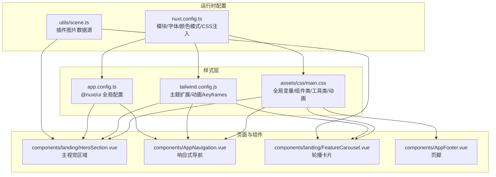
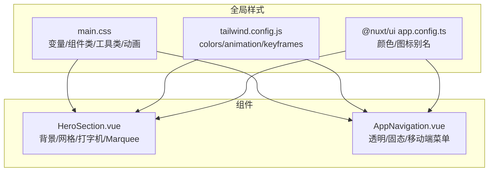
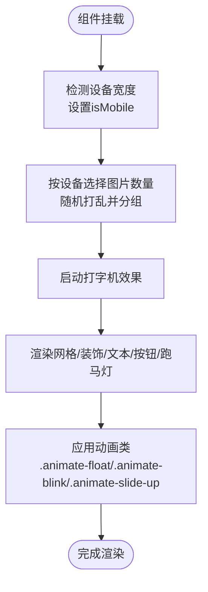
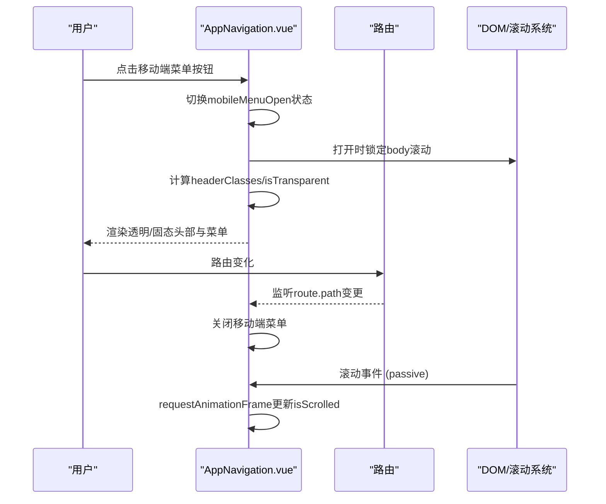
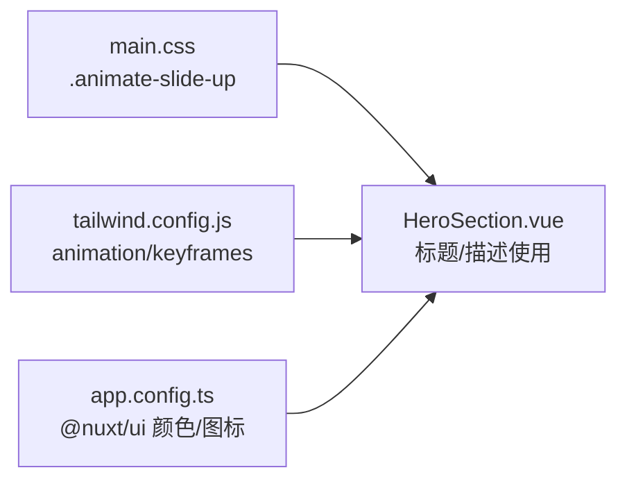
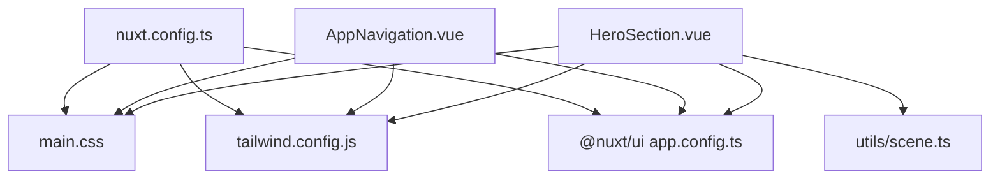

# UI组件样式实现

<cite>
**本文引用的文件**
- [components/landing/HeroSection.vue](file://components/landing/HeroSection.vue)
- [components/AppNavigation.vue](file://components/AppNavigation.vue)
- [assets/css/main.css](file://assets/css/main.css)
- [tailwind.config.js](file://tailwind.config.js)
- [app.config.ts](file://app.config.ts)
- [nuxt.config.ts](file://nuxt.config.ts)
- [utils/scene.ts](file://utils/scene.ts)
- [components/landing/FeatureCarousel.vue](file://components/landing/FeatureCarousel.vue)
- [components/AppFooter.vue](file://components/AppFooter.vue)
</cite>

## 目录
1. [简介](#简介)
2. [项目结构](#项目结构)
3. [核心组件](#核心组件)
4. [架构总览](#架构总览)
5. [组件详解](#组件详解)
6. [依赖关系分析](#依赖关系分析)
7. [性能考量](#性能考量)
8. [故障排查指南](#故障排查指南)
9. [结论](#结论)
10. [附录](#附录)

## 简介
本文件围绕两个关键UI组件的样式实现进行系统化文档化：HeroSection.vue（响应式主视觉区域）、AppNavigation.vue（响应式导航栏）。重点阐述：
- 如何使用Tailwind实用类构建背景渐变、网格布局、文本排版与交互动画
- 与main.css中自定义动画类（如.animate-slide-up）的集成方式
- 响应式导航栏的移动优先断点控制、暗色模式切换按钮的实现逻辑、导航项的悬停与焦点状态样式
- 通过props接收配置并动态应用Tailwind类的模式
- 组件级样式复用、响应式设计模式、无障碍访问（ARIA）支持与性能优化（减少重绘）
- 常见布局问题（如Z-index冲突、响应式断点失效）的排查与解决方案

## 项目结构
该项目采用Nuxt 4 + Tailwind CSS + @nuxt/ui的组合，样式体系由全局CSS与Tailwind配置共同驱动，组件通过props与UI配置对象实现样式复用与主题一致性。

**图表来源**
- [assets/css/main.css](file://assets/css/main.css#L1-L145)
- [tailwind.config.js](file://tailwind.config.js#L1-L86)
- [app.config.ts](file://app.config.ts#L1-L83)
- [nuxt.config.ts](file://nuxt.config.ts#L1-L91)
- [utils/scene.ts](file://utils/scene.ts#L1-L122)
- [components/landing/HeroSection.vue](file://components/landing/HeroSection.vue#L1-L392)
- [components/AppNavigation.vue](file://components/AppNavigation.vue#L1-L309)
- [components/landing/FeatureCarousel.vue](file://components/landing/FeatureCarousel.vue#L1-L328)
- [components/AppFooter.vue](file://components/AppFooter.vue#L1-L207)

**章节来源**
- [nuxt.config.ts](file://nuxt.config.ts#L1-L91)
- [assets/css/main.css](file://assets/css/main.css#L1-L145)
- [tailwind.config.js](file://tailwind.config.js#L1-L86)
- [app.config.ts](file://app.config.ts#L1-L83)

## 核心组件
本节聚焦HeroSection与AppNavigation两大组件的样式实现要点与最佳实践。

**章节来源**
- [components/landing/HeroSection.vue](file://components/landing/HeroSection.vue#L1-L392)
- [components/AppNavigation.vue](file://components/AppNavigation.vue#L1-L309)

## 架构总览
整体样式架构由“全局CSS层”和“Tailwind配置层”组成，组件通过props与UI配置对象实现样式复用；@nuxt/ui提供统一的组件语义与主题变量，nuxt.config.ts负责注入全局CSS与模块配置。

**图表来源**
- [assets/css/main.css](file://assets/css/main.css#L1-L145)
- [tailwind.config.js](file://tailwind.config.js#L1-L86)
- [app.config.ts](file://app.config.ts#L1-L83)
- [components/landing/HeroSection.vue](file://components/landing/HeroSection.vue#L1-L392)
- [components/AppNavigation.vue](file://components/AppNavigation.vue#L1-L309)

## 组件详解

### HeroSection.vue：响应式主视觉区域
- 响应式容器与网格布局
  - 使用容器与网格类实现左右分栏，配合断点类在不同屏幕尺寸下调整间距与对齐。
  - 通过props.ui接收外部配置，动态拼接到容器、标题、描述、链接与图片区域，实现组件级样式复用。
- 背景渐变与装饰
  - 使用线性渐变与径向渐变背景，叠加混合模式与模糊效果，营造科技感与层次感。
  - 通过绝对定位与z-index层级控制装饰元素的前后关系，避免遮挡主要内容。
- 文本排版与可读性
  - 使用Tailwind排版类控制字号、行高、字重与字距，确保在不同断点下保持可读性。
  - 通过工具类实现文本平衡换行，减少标题孤儿词。
- 交互动画与微动效
  - 组件内定义浮动与闪烁动画，结合打字机动画实现动态文案效果。
  - 与全局动画类（如.animate-slide-up）协同，通过类名组合实现进入动画。
- 数据驱动的跑马灯
  - 通过utils/scene.ts提供的插件图片数据，动态生成两组跑马灯图片，移动端与桌面端分别采用水平/垂直滚动，优化性能与体验。
- 性能优化
  - 使用懒加载与异步解码，减少首屏阻塞。
  - 在移动端禁用复杂悬停效果，降低重绘与GPU压力。

**图表来源**
- [components/landing/HeroSection.vue](file://components/landing/HeroSection.vue#L1-L392)
- [assets/css/main.css](file://assets/css/main.css#L112-L144)
- [utils/scene.ts](file://utils/scene.ts#L1-L122)

**章节来源**
- [components/landing/HeroSection.vue](file://components/landing/HeroSection.vue#L1-L392)
- [assets/css/main.css](file://assets/css/main.css#L1-L145)
- [utils/scene.ts](file://utils/scene.ts#L1-L122)

### AppNavigation.vue：响应式导航栏
- 响应式断点与透明/固态状态
  - 使用移动优先断点类控制桌面与移动端布局；通过计算属性根据透明状态与滚动位置动态切换头部样式。
- 暗色模式与透明背景
  - 透明状态下，导航项的文本与悬停态在浅色/深色模式下分别适配，确保可读性与对比度。
- 导航项状态样式
  - 通过UI配置对象动态生成链接、激活态与图标类，实现悬停与焦点状态的一致性。
- 移动端菜单与过渡
  - 使用Transition组件实现菜单展开/收起的平滑过渡；移动端菜单面板使用绝对定位与安全区适配，避免遮挡。
- 无障碍支持
  - 为移动端菜单按钮提供ARIA属性（aria-label、aria-expanded），提升可访问性。
- 性能优化
  - 使用requestAnimationFrame优化滚动事件处理，避免频繁重绘。
  - 在移动端打开菜单时锁定body滚动，改善交互体验。

**图表来源**
- [components/AppNavigation.vue](file://components/AppNavigation.vue#L1-L309)

**章节来源**
- [components/AppNavigation.vue](file://components/AppNavigation.vue#L1-L309)

### 与main.css的动画类集成
- 自定义动画类
  - 在main.css中定义.animate-slide-up与.animation-delay-*工具类，配合@keyframes slideUp实现进入动画。
- 组件内使用
  - HeroSection.vue通过类名组合使用.animate-slide-up，实现标题与描述的逐层进入效果。
- Tailwind动画扩展
  - tailwind.config.js扩展了animation与keyframes，提供.slide-up、.fade-in、.bounce-gentle等动画，供组件直接使用。

**图表来源**
- [assets/css/main.css](file://assets/css/main.css#L112-L144)
- [tailwind.config.js](file://tailwind.config.js#L58-L81)
- [app.config.ts](file://app.config.ts#L1-L83)
- [components/landing/HeroSection.vue](file://components/landing/HeroSection.vue#L1-L392)

**章节来源**
- [assets/css/main.css](file://assets/css/main.css#L1-L145)
- [tailwind.config.js](file://tailwind.config.js#L1-L86)
- [app.config.ts](file://app.config.ts#L1-L83)
- [components/landing/HeroSection.vue](file://components/landing/HeroSection.vue#L1-L392)

### 组件级样式复用与主题一致性
- 变量与主题
  - main.css通过CSS变量定义主品牌色与圆角半径，@nuxt/ui app.config.ts定义主色与图标别名，确保全站一致。
- 组件配置对象
  - HeroSection与AppNavigation均通过props.ui接收样式配置，组件内部根据配置动态拼接类名，实现样式复用与定制。
- 组件类与工具类
  - main.css提供.text-ui-primary、.bg-ui-primary、.btn-primary等组件类，简化常用样式书写。

**章节来源**
- [assets/css/main.css](file://assets/css/main.css#L1-L145)
- [app.config.ts](file://app.config.ts#L1-L83)
- [components/landing/HeroSection.vue](file://components/landing/HeroSection.vue#L200-L250)
- [components/AppNavigation.vue](file://components/AppNavigation.vue#L240-L266)

### 响应式设计模式
- 断点策略
  - 使用sm/md/lg等断点类控制布局与间距；移动端优先，桌面端增强细节。
- 设备检测
  - HeroSection通过窗口宽度判断移动端，动态调整跑马灯图片数量与动画强度。
- 视口与安全区
  - AppNavigation在移动端菜单面板使用env(safe-area-inset-bottom)适配刘海屏与底部安全区。

**章节来源**
- [components/landing/HeroSection.vue](file://components/landing/HeroSection.vue#L330-L355)
- [components/AppNavigation.vue](file://components/AppNavigation.vue#L92-L103)

### 无障碍访问（ARIA）支持
- AppNavigation为移动端菜单按钮提供aria-label与aria-expanded，便于屏幕阅读器识别当前状态。
- Footer中使用sr-only类为社交链接提供可读性文本，同时不影响视觉呈现。

**章节来源**
- [components/AppNavigation.vue](file://components/AppNavigation.vue#L66-L78)
- [components/AppFooter.vue](file://components/AppFooter.vue#L1-L207)

## 依赖关系分析
- 样式依赖
  - HeroSection与AppNavigation依赖main.css的变量、组件类与动画类；同时受益于tailwind.config.js的扩展动画与keyframes。
- 运行时配置
  - nuxt.config.ts注入全局CSS并启用@nuxt/ui与@nuxt/content模块；app.config.ts定义@nuxt/ui的颜色与图标映射。
- 数据依赖
  - HeroSection依赖utils/scene.ts提供的插件图片数据，驱动跑马灯与打字机效果。

**图表来源**
- [components/landing/HeroSection.vue](file://components/landing/HeroSection.vue#L1-L392)
- [components/AppNavigation.vue](file://components/AppNavigation.vue#L1-L309)
- [assets/css/main.css](file://assets/css/main.css#L1-L145)
- [tailwind.config.js](file://tailwind.config.js#L1-L86)
- [app.config.ts](file://app.config.ts#L1-L83)
- [nuxt.config.ts](file://nuxt.config.ts#L1-L91)
- [utils/scene.ts](file://utils/scene.ts#L1-L122)

**章节来源**
- [nuxt.config.ts](file://nuxt.config.ts#L1-L91)
- [assets/css/main.css](file://assets/css/main.css#L1-L145)
- [tailwind.config.js](file://tailwind.config.js#L1-L86)
- [app.config.ts](file://app.config.ts#L1-L83)
- [utils/scene.ts](file://utils/scene.ts#L1-L122)

## 性能考量
- 减少重绘与重排
  - 使用transform与opacity动画替代布局变化；HeroSection在移动端禁用复杂悬停效果。
  - 使用will-change与requestAnimationFrame优化滚动与拖拽交互。
- 资源加载优化
  - 图片懒加载与异步解码，降低首屏阻塞。
- 动画与过渡
  - 合理使用硬件加速属性（如perspective、transform3d），避免不必要的布局抖动。
- 组件内样式隔离
  - 使用scoped样式与局部动画，避免全局样式污染与冲突。

[本节为通用指导，无需特定文件引用]

## 故障排查指南
- Z-index冲突
  - 症状：装饰元素遮挡内容或菜单被覆盖。
  - 排查：检查组件内绝对定位元素的z-index层级，确保内容区z-index高于装饰层。
  - 解决：为装饰元素添加负z-index或为内容区提升层级，必要时使用相对定位包裹。
- 响应式断点失效
  - 症状：在特定设备上布局异常。
  - 排查：确认断点类使用是否正确；检查nuxt.config.ts中字体与预连接配置是否影响渲染时机。
  - 解决：优先使用sm/md/lg等断点类；在关键布局处增加媒体查询或条件渲染。
- 动画不生效
  - 症状：进入动画或打字机效果未出现。
  - 排查：确认main.css与tailwind.config.js中动画类与keyframes已正确加载；检查组件是否正确拼接类名。
  - 解决：确保类名拼接顺序正确；在组件挂载后触发动画初始化逻辑。
- 移动端滚动穿透
  - 症状：打开菜单后页面仍可滚动。
  - 排查：确认移动端打开菜单时是否锁定body滚动。
  - 解决：在打开菜单时设置body.overflow='hidden'，关闭时恢复。

[本节为通用指导，无需特定文件引用]

## 结论
本项目通过“全局CSS + Tailwind配置 + @nuxt/ui”的组合，实现了高度一致且可复用的UI样式体系。HeroSection与AppNavigation分别展示了响应式主视觉区域与导航栏的完整实现路径：从背景渐变与网格布局，到文本排版与交互动画；从移动优先断点控制，到暗色模式与无障碍支持。通过props配置与UI对象，组件实现了灵活的样式复用与主题一致性；借助性能优化策略，兼顾了用户体验与渲染效率。

[本节为总结性内容，无需特定文件引用]

## 附录
- 相关组件参考
  - FeatureCarousel.vue展示了3D轮播与无限滚动的实现思路，可借鉴其性能优化与交互细节。
  - AppFooter.vue体现了移动端折叠与无障碍标签的实践。

**章节来源**
- [components/landing/FeatureCarousel.vue](file://components/landing/FeatureCarousel.vue#L1-L328)
- [components/AppFooter.vue](file://components/AppFooter.vue#L1-L207)