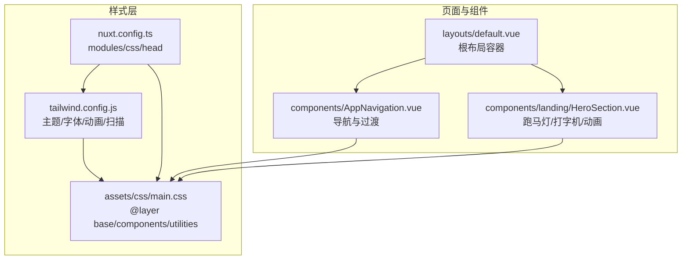
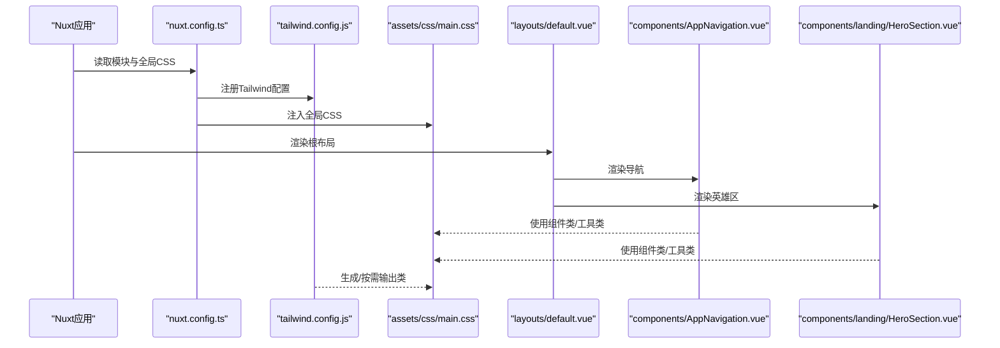
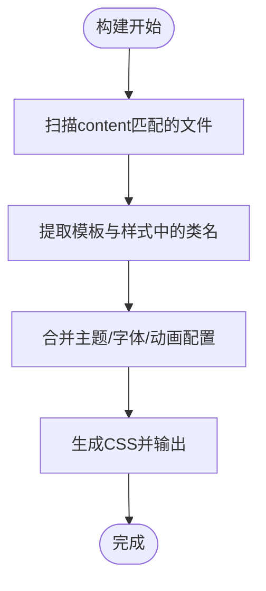
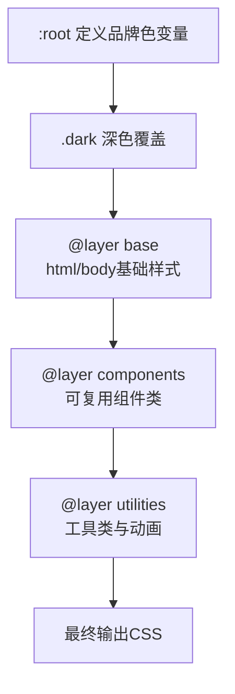
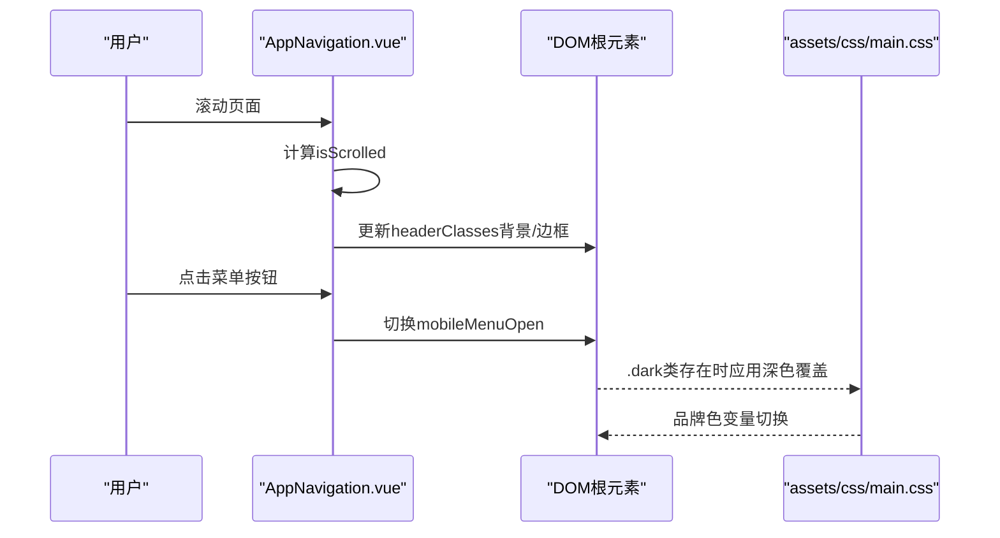
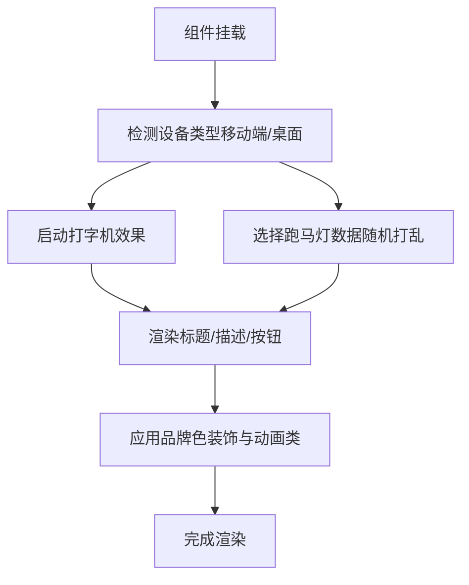
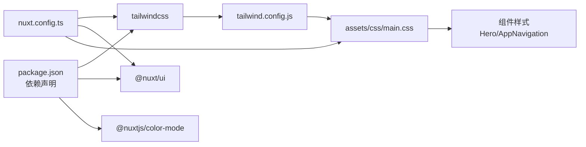

# 样式与UI系统

<cite>
**本文引用的文件**
- [tailwind.config.js](file://tailwind.config.js)
- [main.css](file://assets/css/main.css)
- [nuxt.config.ts](file://nuxt.config.ts)
- [HeroSection.vue](file://components/landing/HeroSection.vue)
- [AppNavigation.vue](file://components/AppNavigation.vue)
- [default.vue](file://layouts/default.vue)
- [package.json](file://package.json)
</cite>

## 目录
1. [简介](#简介)
2. [项目结构](#项目结构)
3. [核心组件](#核心组件)
4. [架构总览](#架构总览)
5. [详细组件分析](#详细组件分析)
6. [依赖关系分析](#依赖关系分析)
7. [性能考量](#性能考量)
8. [故障排查指南](#故障排查指南)
9. [结论](#结论)

## 简介
本文件系统性梳理buidai项目的样式架构与UI实现体系，重点阐释Tailwind CSS实用优先（utility-first）理念在项目中的落地方式，涵盖：
- 在tailwind.config.js中自定义主题色（primary、accent、secondary）、字体族（Inter）与动画（fade-in、slide-up、bounce-gentle、marquee-vertical）的配置流程
- content字段如何扫描源文件以启用类名
- 结合main.css文件，说明全局样式注入机制与自定义CSS的整合策略
- 通过HeroSection.vue与AppNavigation.vue等组件，展示如何使用Tailwind类构建响应式布局、暗色模式（darkMode: 'class'）切换与交互动画
- 提供组件级样式复用、媒体查询处理与性能优化（减少未使用类）的实践指南，并列举常见布局问题的排查方法

## 项目结构
项目采用“实用优先”的样式组织方式，配合Nuxt UI组件库与Nuxt内容模块，形成统一的UI风格与交互体验。样式层主要由以下部分构成：
- Tailwind CSS配置：集中定义主题色、字体、动画与扫描范围
- 全局CSS：通过@layer机制注入基础、组件与工具类，统一品牌色与交互细节
- Nuxt配置：注册UI组件库、字体与全局CSS入口
- 页面与组件：以Tailwind类为主进行布局与交互，少量scoped样式补充局部动画

**图表来源**
- [tailwind.config.js](file://tailwind.config.js#L1-L86)
- [main.css](file://assets/css/main.css#L1-L145)
- [nuxt.config.ts](file://nuxt.config.ts#L1-L91)
- [default.vue](file://layouts/default.vue#L1-L25)
- [AppNavigation.vue](file://components/AppNavigation.vue#L1-L309)
- [HeroSection.vue](file://components/landing/HeroSection.vue#L1-L392)

**章节来源**
- [tailwind.config.js](file://tailwind.config.js#L1-L86)
- [main.css](file://assets/css/main.css#L1-L145)
- [nuxt.config.ts](file://nuxt.config.ts#L1-L91)
- [default.vue](file://layouts/default.vue#L1-L25)

## 核心组件
- Tailwind配置：定义content扫描路径、darkMode为class、扩展字体、颜色与动画；为后续按需生成CSS提供依据
- 全局CSS：通过@layer base/components/utilities分层注入基础样式、可复用组件类与工具类，统一品牌色与交互细节
- Nuxt配置：启用@nuxt/ui与@nuxt/content，注册全局CSS，配置字体与Head信息
- 页面布局：default.vue作为根容器，承载导航、内容与页脚，统一背景与过渡
- 导航组件：AppNavigation.vue演示响应式布局、透明/实体背景切换、移动端菜单过渡与图标集成
- 英雄区组件：HeroSection.vue展示复杂布局、品牌色装饰、打字机效果、Marquee跑马灯与多种动画

**章节来源**
- [tailwind.config.js](file://tailwind.config.js#L1-L86)
- [main.css](file://assets/css/main.css#L1-L145)
- [nuxt.config.ts](file://nuxt.config.ts#L1-L91)
- [default.vue](file://layouts/default.vue#L1-L25)
- [AppNavigation.vue](file://components/AppNavigation.vue#L1-L309)
- [HeroSection.vue](file://components/landing/HeroSection.vue#L1-L392)

## 架构总览
下图展示了样式与UI系统的整体交互：Nuxt启动时加载全局CSS与Tailwind配置，组件通过Tailwind类与Nuxt UI组件实现一致的视觉与交互体验，darkMode通过class切换影响全局样式。

**图表来源**
- [nuxt.config.ts](file://nuxt.config.ts#L1-L91)
- [tailwind.config.js](file://tailwind.config.js#L1-L86)
- [main.css](file://assets/css/main.css#L1-L145)
- [default.vue](file://layouts/default.vue#L1-L25)
- [AppNavigation.vue](file://components/AppNavigation.vue#L1-L309)
- [HeroSection.vue](file://components/landing/HeroSection.vue#L1-L392)

## 详细组件分析

### Tailwind配置与按需生成
- content扫描范围：components、layouts、pages、plugins、app.vue与error.vue，确保所有模板中的类名被纳入构建
- darkMode: 'class'：通过根元素class切换实现深浅色主题
- 主题色扩展：primary、accent、secondary均提供多阶色值，便于在组件中按需使用
- 字体族：sans使用Inter，配合全局CSS中的var(--font-sans)与字体特性设置
- 动画与关键帧：扩展了fade-in、slide-up、bounce-gentle、marquee-vertical等动画，配合组件使用

**图表来源**
- [tailwind.config.js](file://tailwind.config.js#L1-L86)

**章节来源**
- [tailwind.config.js](file://tailwind.config.js#L1-L86)

### 全局样式注入与自定义CSS整合
- @import "tailwindcss"与"@nuxt/ui"：确保Tailwind基础与Nuxt UI组件样式优先
- :root与.dark：定义品牌主色变量与深色模式覆盖，保证组件与工具类一致性
- @layer base：统一html/body的基础行为（平滑滚动、字体、默认前景/背景）
- @layer components：定义可复用组件类（文本/边框/背景/环/按钮/卡片等），通过@apply简化类组合
- @layer utilities：提供工具类（文本平衡、上滑动画、动画延迟等），并与Tailwind动画协同

**图表来源**
- [main.css](file://assets/css/main.css#L1-L145)

**章节来源**
- [main.css](file://assets/css/main.css#L1-L145)

### Nuxt配置与全局入口
- modules：启用@nuxt/ui与@nuxt/content，获得UI组件与内容渲染能力
- fonts：禁用自动下载Google Fonts，通过Head预连接与加载外部字体
- colorMode：classSuffix为空，使用"dark"类名
- app.head：设置标题、Meta与链接（字体、图标）
- css：注册全局CSS入口，确保main.css在Tailwind之后生效

**章节来源**
- [nuxt.config.ts](file://nuxt.config.ts#L1-L91)

### 响应式布局与暗色模式切换（AppNavigation.vue）
- 响应式断点：通过sm、md、lg等Tailwind断点控制布局与间距
- 透明/实体背景切换：根据滚动状态动态计算headerClasses，实现背景与边框的渐变
- 移动端菜单：使用Transition与enter/leave类实现上下滑动过渡
- 深色模式：根容器包含dark类，配合main.css中的变量覆盖实现主题切换

**图表来源**
- [AppNavigation.vue](file://components/AppNavigation.vue#L1-L309)
- [main.css](file://assets/css/main.css#L1-L145)
- [default.vue](file://layouts/default.vue#L1-L25)

**章节来源**
- [AppNavigation.vue](file://components/AppNavigation.vue#L1-L309)
- [default.vue](file://layouts/default.vue#L1-L25)

### 复杂布局与交互动画（HeroSection.vue）
- 响应式网格：使用lg:grid-cols-2与gap控制桌面/移动布局
- 品牌装饰：通过背景渐变、混合模式与模糊效果营造科技感
- 打字机效果：通过定时器与字符串截取实现循环文案
- 跑马灯：桌面端双列垂直跑马灯，移动端横向跑马灯，使用懒加载与异步解码优化性能
- 动画：内置float、blink等scoped动画，同时复用Tailwind动画（如slide-up）

**图表来源**
- [HeroSection.vue](file://components/landing/HeroSection.vue#L1-L392)

**章节来源**
- [HeroSection.vue](file://components/landing/HeroSection.vue#L1-L392)

### 组件级样式复用与媒体查询
- 组件类复用：通过@layer components定义.btn-primary、.btn-secondary、.card、.card-hover等，避免重复书写
- 媒体查询：利用Tailwind断点（sm、md、lg等）在组件类中直接声明不同屏幕下的样式
- 工具类：使用.text-balance、.section-padding、.container-padding等工具类统一排版

**章节来源**
- [main.css](file://assets/css/main.css#L1-L145)
- [HeroSection.vue](file://components/landing/HeroSection.vue#L1-L392)
- [AppNavigation.vue](file://components/AppNavigation.vue#L1-L309)

## 依赖关系分析
- Tailwind与Nuxt UI：tailwind.config.js与nuxt.config.ts共同决定类名生成与UI组件可用性
- 全局CSS：main.css在nuxt.config.ts中注册，先于组件样式生效，确保@layer覆盖顺序正确
- 深色模式：nuxt.config.ts的colorMode配置与main.css的.dark规则协同工作
- 动画与关键帧：tailwind.config.js扩展动画与keyframes，main.css提供补充工具类与关键帧

**图表来源**
- [package.json](file://package.json#L1-L48)
- [nuxt.config.ts](file://nuxt.config.ts#L1-L91)
- [tailwind.config.js](file://tailwind.config.js#L1-L86)
- [main.css](file://assets/css/main.css#L1-L145)

**章节来源**
- [package.json](file://package.json#L1-L48)
- [nuxt.config.ts](file://nuxt.config.ts#L1-L91)
- [tailwind.config.js](file://tailwind.config.js#L1-L86)
- [main.css](file://assets/css/main.css#L1-L145)

## 性能考量
- 减少未使用类：通过tailwind.config.js的content精确扫描，确保仅生成实际使用的类，避免冗余CSS体积
- 懒加载与异步解码：HeroSection.vue对跑马灯图片使用懒加载与异步解码，降低首屏压力
- 动画优化：使用硬件加速的关键帧（transform/opacity）与合理的动画时长，避免布局抖动
- 字体加载：禁用自动下载Google Fonts并通过Head预连接与加载，减少阻塞
- 组件类复用：通过@layer components与@apply减少重复类，降低CSS体积与维护成本

**章节来源**
- [tailwind.config.js](file://tailwind.config.js#L1-L86)
- [HeroSection.vue](file://components/landing/HeroSection.vue#L1-L392)
- [nuxt.config.ts](file://nuxt.config.ts#L1-L91)
- [main.css](file://assets/css/main.css#L1-L145)

## 故障排查指南
- 类名未生效
  - 检查tailwind.config.js的content是否包含当前组件文件路径
  - 确认nuxt.config.ts已注册assets/css/main.css
  - 验证组件类名拼写与断点前缀是否正确
- 深色模式不生效
  - 确认nuxt.config.ts的colorMode.classSuffix为空，使用"dark"类名
  - 检查根容器是否包含dark类（例如通过路由或用户偏好）
- 动画异常
  - 确认tailwind.config.js中动画名称与keyframes定义一致
  - 检查main.css中的工具类与关键帧是否冲突
- 响应式布局错位
  - 使用Tailwind断点（sm/md/lg）逐级调试，确认容器与网格类使用是否正确
  - 检查组件内scoped样式是否覆盖了全局@layer规则
- 字体显示异常
  - 确认nuxt.config.ts中fonts.providers禁用自动下载，并通过Head加载外部字体

**章节来源**
- [tailwind.config.js](file://tailwind.config.js#L1-L86)
- [main.css](file://assets/css/main.css#L1-L145)
- [nuxt.config.ts](file://nuxt.config.ts#L1-L91)
- [AppNavigation.vue](file://components/AppNavigation.vue#L1-L309)
- [HeroSection.vue](file://components/landing/HeroSection.vue#L1-L392)

## 结论
buidai项目以Tailwind CSS实用优先为核心，结合Nuxt UI组件库与全局CSS分层策略，实现了统一的品牌色、一致的组件样式与流畅的交互动画。通过精确的content扫描与按需生成，兼顾了开发效率与性能表现。AppNavigation与HeroSection等组件充分体现了响应式布局、暗色模式切换与复杂动画的落地实践，为后续组件扩展提供了清晰的样式与交互范式。