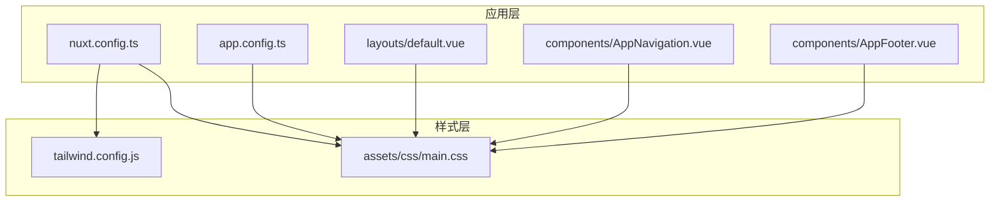
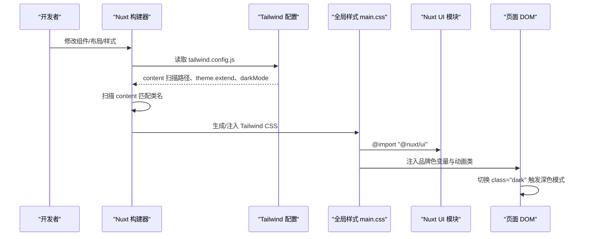
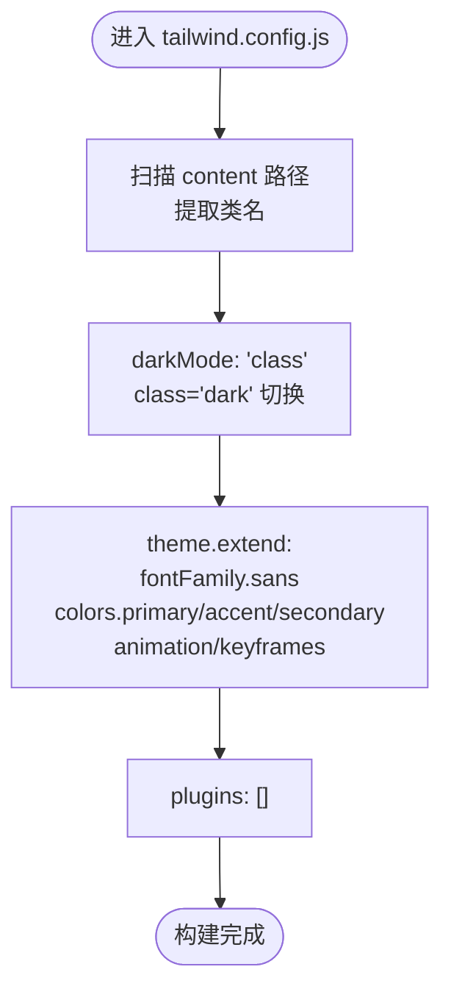
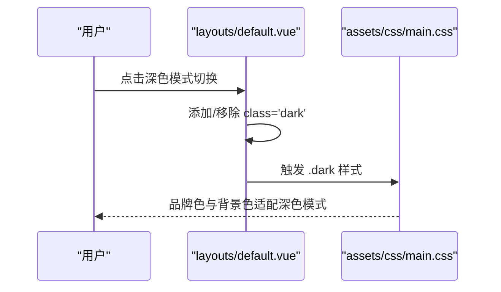
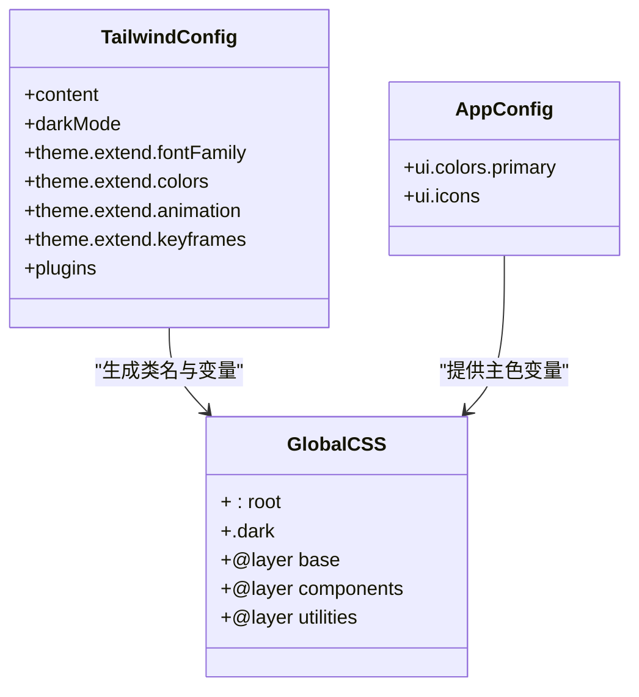
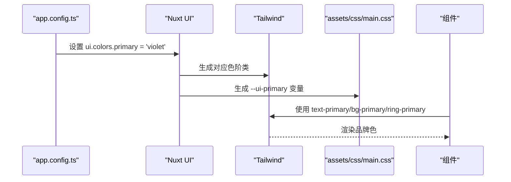
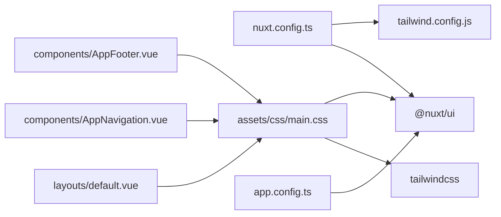

# 样式系统配置

<cite>
**本文引用的文件**
- [tailwind.config.js](file://tailwind.config.js)
- [app.config.ts](file://app.config.ts)
- [nuxt.config.ts](file://nuxt.config.ts)
- [assets/css/main.css](file://assets/css/main.css)
- [layouts/default.vue](file://layouts/default.vue)
- [components/AppNavigation.vue](file://components/AppNavigation.vue)
- [components/AppFooter.vue](file://components/AppFooter.vue)
</cite>

## 目录
1. [简介](#简介)
2. [项目结构](#项目结构)
3. [核心组件](#核心组件)
4. [架构总览](#架构总览)
5. [详细组件分析](#详细组件分析)
6. [依赖关系分析](#依赖关系分析)
7. [性能考量](#性能考量)
8. [故障排查指南](#故障排查指南)
9. [结论](#结论)
10. [附录](#附录)

## 简介
本文件系统性梳理并文档化 budi.ai 项目的 Tailwind CSS 样式体系，重点围绕以下方面：
- tailwind.config.js 的 content 字段扫描路径配置，确保构建时正确提取类名；
- darkMode: 'class' 的实现机制与 CSS 类切换深色模式；
- theme.extend 中的自定义设计变量：primary、accent、secondary 三组颜色色阶、Inter 字体家族、以及 animation/keyframes 中的动画配置；
- 结合 app.config.ts 的 Nuxt UI 模块全局颜色配置，说明 ui.colors.primary 如何与 Tailwind 配置协同工作；
- 提供配置冲突解决指南与最佳实践。

## 项目结构
样式相关的关键文件分布如下：
- Tailwind 配置：tailwind.config.js
- 应用级 UI 配置：app.config.ts
- Nuxt 构建与模块配置：nuxt.config.ts
- 全局样式入口：assets/css/main.css
- 页面布局与深色模式开关：layouts/default.vue
- 组件示例（导航/页脚）展示品牌色与交互样式使用：components/AppNavigation.vue、components/AppFooter.vue

**图表来源**
- [tailwind.config.js](file://tailwind.config.js#L1-L86)
- [app.config.ts](file://app.config.ts#L1-L83)
- [nuxt.config.ts](file://nuxt.config.ts#L1-L91)
- [assets/css/main.css](file://assets/css/main.css#L1-L145)
- [layouts/default.vue](file://layouts/default.vue#L1-L25)
- [components/AppNavigation.vue](file://components/AppNavigation.vue#L240-L362)
- [components/AppFooter.vue](file://components/AppFooter.vue#L1-L127)

**章节来源**
- [tailwind.config.js](file://tailwind.config.js#L1-L86)
- [app.config.ts](file://app.config.ts#L1-L83)
- [nuxt.config.ts](file://nuxt.config.ts#L1-L91)
- [assets/css/main.css](file://assets/css/main.css#L1-L145)
- [layouts/default.vue](file://layouts/default.vue#L1-L25)
- [components/AppNavigation.vue](file://components/AppNavigation.vue#L240-L362)
- [components/AppFooter.vue](file://components/AppFooter.vue#L1-L127)

## 核心组件
- Tailwind 配置（tailwind.config.js）
  - content 扫描路径：确保构建时从组件、布局、页面、插件、根组件等位置提取类名；
  - darkMode: 'class'：通过在根元素添加 class="dark" 实现深色模式；
  - theme.extend：
    - fontFamily.sans：Inter 字体族与回退机制；
    - colors.primary/accent/secondary：品牌三组色阶；
    - animation/keyframes：fade-in、slide-up、bounce-gentle、marquee-vertical 等动画；
  - plugins：当前为空，预留扩展。

- 应用配置（app.config.ts）
  - ui.colors.primary：定义主品牌色为 violet，Nuxt UI 会据此生成色阶并在组件中生效；
  - ui.icons：图标别名映射，便于统一使用 Phosphor Icons 风格。

- 全局样式（assets/css/main.css）
  - @import "tailwindcss"; @import "@nuxt/ui";：引入 Tailwind 与 Nuxt UI；
  - :root 与 .dark：通过 CSS 变量控制主品牌色与圆角半径；
  - @layer base/components/utilities：基础重置、可复用组件类与工具类；
  - 自定义动画工具类与关键帧（如 animate-slide-up、@keyframes slideUp）。

- 深色模式开关（layouts/default.vue）
  - 根元素容器使用 dark:bg-gray-900，并在切换时通过 class="dark" 切换深色模式。

- 组件示例（components/AppNavigation.vue、components/AppFooter.vue）
  - 导航与页脚中广泛使用 text-primary、bg-primary、ring-primary 等品牌色类；
  - hover 状态与交互态体现品牌色的应用一致性。

**章节来源**
- [tailwind.config.js](file://tailwind.config.js#L1-L86)
- [app.config.ts](file://app.config.ts#L1-L83)
- [assets/css/main.css](file://assets/css/main.css#L1-L145)
- [layouts/default.vue](file://layouts/default.vue#L1-L25)
- [components/AppNavigation.vue](file://components/AppNavigation.vue#L240-L362)
- [components/AppFooter.vue](file://components/AppFooter.vue#L1-L127)

## 架构总览
Tailwind 样式体系由“配置—构建—运行”三层构成：
- 配置层：tailwind.config.js 定义扫描路径、主题扩展与暗色模式策略；
- 构建层：Nuxt 与 Tailwind 在构建时扫描 content、生成 CSS；
- 运行层：assets/css/main.css 引入 Tailwind 与 Nuxt UI，配合 app.config.ts 的 ui.colors.primary 与布局中的 class="dark" 实现品牌色与深色模式。

**图表来源**
- [tailwind.config.js](file://tailwind.config.js#L1-L86)
- [nuxt.config.ts](file://nuxt.config.ts#L1-L91)
- [assets/css/main.css](file://assets/css/main.css#L1-L145)
- [layouts/default.vue](file://layouts/default.vue#L1-L25)

## 详细组件分析

### Tailwind 配置（tailwind.config.js）
- content 扫描路径
  - 覆盖 components/**/*.{js,vue,ts}、layouts/**/*.vue、pages/**/*.vue、plugins/**/*.{js,ts}、app.vue、error.vue；
  - 确保构建时从这些位置提取类名，避免遗漏；
  - 若新增模板或组件目录，需同步更新 content 路径以保证类名提取完整。

- darkMode: 'class'
  - 通过在根元素添加 class="dark" 切换深色模式；
  - 与 nuxt.config.ts 的 colorMode.classSuffix: '' 配合，使用纯 "dark" 类名；
  - 布局根容器已使用 dark:bg-gray-900，确保深色背景与文本对比度。

- theme.extend
  - fontFamily.sans：Inter 作为首选字体，回退至 sans-serif；
  - colors.primary/accent/secondary：定义 50-950 色阶，用于品牌主色、强调色与中性色；
  - animation/keyframes：
    - fade-in：渐显动画；
    - slide-up：上滑出现动画；
    - bounce-gentle：轻微弹跳循环；
    - marquee-vertical：垂直滚动长文本动画。

- plugins
  - 当前为空，后续可扩展自定义插件。

**图表来源**
- [tailwind.config.js](file://tailwind.config.js#L1-L86)

**章节来源**
- [tailwind.config.js](file://tailwind.config.js#L1-L86)
- [nuxt.config.ts](file://nuxt.config.ts#L53-L56)
- [layouts/default.vue](file://layouts/default.vue#L1-L25)

### 深色模式实现机制
- 策略：class 切换
  - 在根元素添加 class="dark" 切换深色模式；
  - nuxt.config.ts 中 colorMode.classSuffix: '' 确保类名为 "dark"；
  - assets/css/main.css 中 .dark 覆盖 --ui-primary 等变量，实现品牌色在深色模式下的适配。

- 效果验证
  - 布局根容器使用 dark:bg-gray-900，确保深色背景；
  - 组件中使用 text-primary、bg-primary 等类，在深色模式下通过 CSS 变量保持一致的品牌视觉。

**图表来源**
- [layouts/default.vue](file://layouts/default.vue#L1-L25)
- [assets/css/main.css](file://assets/css/main.css#L1-L20)
- [nuxt.config.ts](file://nuxt.config.ts#L53-L56)

**章节来源**
- [layouts/default.vue](file://layouts/default.vue#L1-L25)
- [assets/css/main.css](file://assets/css/main.css#L1-L20)
- [nuxt.config.ts](file://nuxt.config.ts#L53-L56)

### 主题扩展：颜色与字体
- colors.primary/accent/secondary
  - 定义完整的色阶（50-950），用于品牌主色、强调色与中性背景；
  - 组件中通过 text-primary、bg-primary、ring-primary 等类使用；
  - 与 app.config.ts 的 ui.colors.primary: 'violet' 协同，Nuxt UI 会基于该主色生成色阶并在组件中生效。

- fontFamily.sans
  - Inter 作为首选字体，回退至 sans-serif；
  - nuxt.config.ts 中通过 head.link 引入 Inter 字体资源，确保字体可用；
  - assets/css/main.css 中 body 使用 var(--font-sans)，保证字体变量生效。

- 动画与关键帧
  - tailwind.config.js 定义 animation 与 keyframes；
  - assets/css/main.css 中补充了 animate-slide-up 与 @keyframes slideUp，形成双通道动画能力；
  - 组件中可直接使用 animate-fade-in、animate-slide-up 等类。

**图表来源**
- [tailwind.config.js](file://tailwind.config.js#L1-L86)
- [app.config.ts](file://app.config.ts#L1-L83)
- [assets/css/main.css](file://assets/css/main.css#L1-L145)

**章节来源**
- [tailwind.config.js](file://tailwind.config.js#L1-L86)
- [app.config.ts](file://app.config.ts#L1-L83)
- [assets/css/main.css](file://assets/css/main.css#L1-L145)
- [nuxt.config.ts](file://nuxt.config.ts#L80-L84)

### Nuxt UI 模块与 Tailwind 配置协同
- app.config.ts 的 ui.colors.primary: 'violet'
  - Nuxt UI 会基于该主色生成色阶（50-950），并在组件中自动应用；
  - assets/css/main.css 中通过 :root 与 .dark 覆盖 --ui-primary，确保品牌色在浅/深色模式下一致。

- 组件中的品牌色使用
  - 导航与页脚组件广泛使用 text-primary、bg-primary、ring-primary 等类；
  - 通过 Tailwind 生成的类与 Nuxt UI 的变量共同作用，形成统一的品牌视觉。

**图表来源**
- [app.config.ts](file://app.config.ts#L1-L83)
- [assets/css/main.css](file://assets/css/main.css#L1-L20)
- [components/AppNavigation.vue](file://components/AppNavigation.vue#L240-L362)
- [components/AppFooter.vue](file://components/AppFooter.vue#L1-L127)

**章节来源**
- [app.config.ts](file://app.config.ts#L1-L83)
- [assets/css/main.css](file://assets/css/main.css#L1-L20)
- [components/AppNavigation.vue](file://components/AppNavigation.vue#L240-L362)
- [components/AppFooter.vue](file://components/AppFooter.vue#L1-L127)

## 依赖关系分析
- 模块依赖
  - nuxt.config.ts 启用 @nuxt/ui 与 @nuxt/content；
  - assets/css/main.css 通过 @import 引入 tailwindcss 与 @nuxt/ui；
  - tailwind.config.js 为 Tailwind 提供扫描路径与主题扩展；
  - app.config.ts 为 Nuxt UI 提供全局颜色配置。

- 潜在耦合点
  - content 扫描路径需与实际文件结构保持一致；
  - 深色模式 class 名称需与 colorMode.classSuffix 保持一致；
  - 主品牌色变量 --ui-primary 与 Tailwind colors.primary 需保持语义一致。

**图表来源**
- [nuxt.config.ts](file://nuxt.config.ts#L1-L91)
- [tailwind.config.js](file://tailwind.config.js#L1-L86)
- [assets/css/main.css](file://assets/css/main.css#L1-L145)
- [app.config.ts](file://app.config.ts#L1-L83)
- [layouts/default.vue](file://layouts/default.vue#L1-L25)
- [components/AppNavigation.vue](file://components/AppNavigation.vue#L240-L362)
- [components/AppFooter.vue](file://components/AppFooter.vue#L1-L127)

**章节来源**
- [nuxt.config.ts](file://nuxt.config.ts#L1-L91)
- [tailwind.config.js](file://tailwind.config.js#L1-L86)
- [assets/css/main.css](file://assets/css/main.css#L1-L145)
- [app.config.ts](file://app.config.ts#L1-L83)
- [layouts/default.vue](file://layouts/default.vue#L1-L25)
- [components/AppNavigation.vue](file://components/AppNavigation.vue#L240-L362)
- [components/AppFooter.vue](file://components/AppFooter.vue#L1-L127)

## 性能考量
- content 扫描范围
  - 保持 content 路径最小化，避免扫描无关目录，减少构建时间；
  - 新增模板或组件目录时，及时更新 tailwind.config.js 的 content。

- 动画与关键帧
  - 合理使用 animation 与 keyframes，避免过度复杂的关键帧导致渲染压力；
  - 在移动端谨慎启用重动画，必要时通过媒体查询降级。

- 字体加载
  - nuxt.config.ts 中已预连接与预加载 Inter 字体，确保首屏字体可用；
  - 如需进一步优化，可考虑字体子集化与字体显示策略。

[本节为通用指导，无需特定文件引用]

## 故障排查指南
- 类名未生效
  - 检查 tailwind.config.js 的 content 路径是否包含目标文件；
  - 确认组件中使用的类名存在于 Tailwind 配置或 Nuxt UI 生成的类中。

- 深色模式无效
  - 确认根元素存在 class="dark"；
  - 检查 nuxt.config.ts 的 colorMode.classSuffix 是否为 ''；
  - 确认 assets/css/main.css 中 .dark 样式已正确覆盖 --ui-primary。

- 品牌色不一致
  - 检查 app.config.ts 的 ui.colors.primary 是否与 Tailwind colors.primary 语义一致；
  - 确认 assets/css/main.css 中 :root 与 .dark 的 --ui-primary 值符合预期。

- 动画异常
  - 检查 tailwind.config.js 的 animation/keyframes 与 assets/css/main.css 的自定义动画是否冲突；
  - 确认组件中使用的动画类名拼写正确。

**章节来源**
- [tailwind.config.js](file://tailwind.config.js#L1-L86)
- [nuxt.config.ts](file://nuxt.config.ts#L53-L56)
- [assets/css/main.css](file://assets/css/main.css#L1-L145)
- [layouts/default.vue](file://layouts/default.vue#L1-L25)

## 结论
本项目通过 tailwind.config.js 的精准 content 扫描、darkMode: 'class' 的深色模式策略、theme.extend 的品牌色与字体扩展，以及 app.config.ts 的 Nuxt UI 全局颜色配置，形成了统一且可维护的样式体系。assets/css/main.css 作为全局入口，将 Tailwind 与 Nuxt UI 的能力整合，配合组件中的品牌色使用，实现了从配置到运行的一致性体验。建议在新增模板或组件时同步更新 content 路径，并保持品牌色与动画配置的语义一致性，以确保构建效率与视觉质量。

[本节为总结性内容，无需特定文件引用]

## 附录
- 配置要点清单
  - content 扫描路径：components/**/*.{js,vue,ts}、layouts/**/*.vue、pages/**/*.vue、plugins/**/*.{js,ts}、app.vue、error.vue；
  - darkMode: 'class' 与 classSuffix: ''；
  - fontFamily.sans: Inter；
  - colors.primary/accent/secondary：完整色阶；
  - animation/keyframes：fade-in、slide-up、bounce-gentle、marquee-vertical；
  - ui.colors.primary: 'violet'；
  - 全局 CSS 变量：--ui-primary、--ui-radius。

[本节为概览性内容，无需特定文件引用]