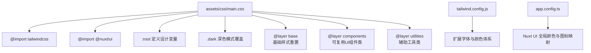
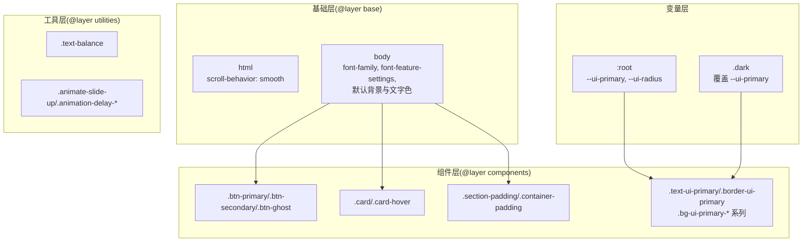
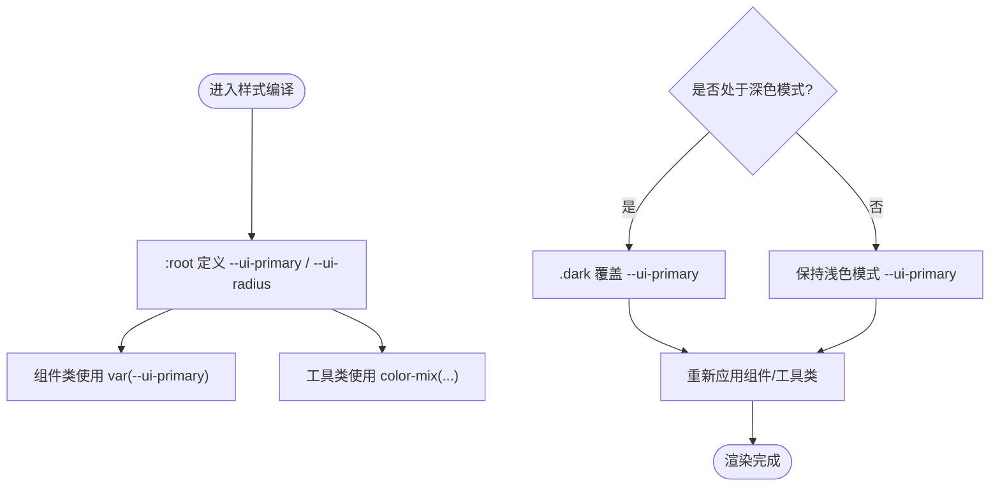
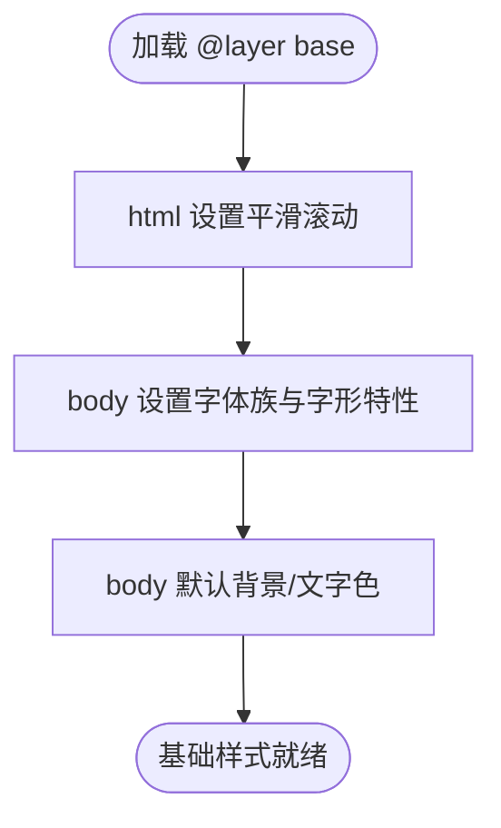
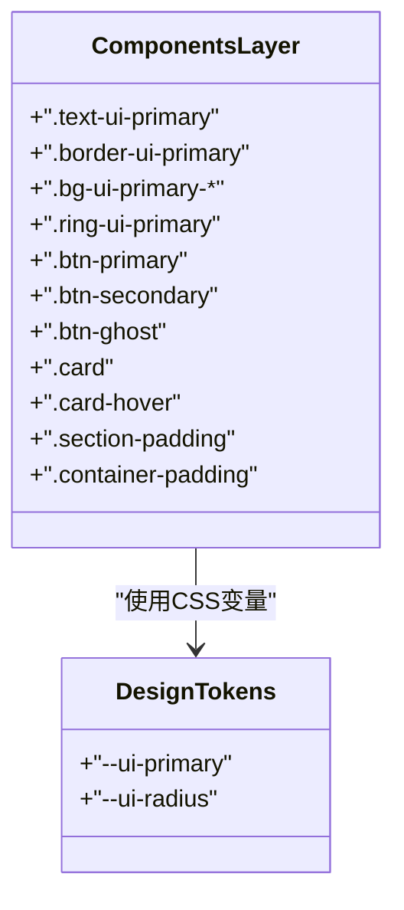
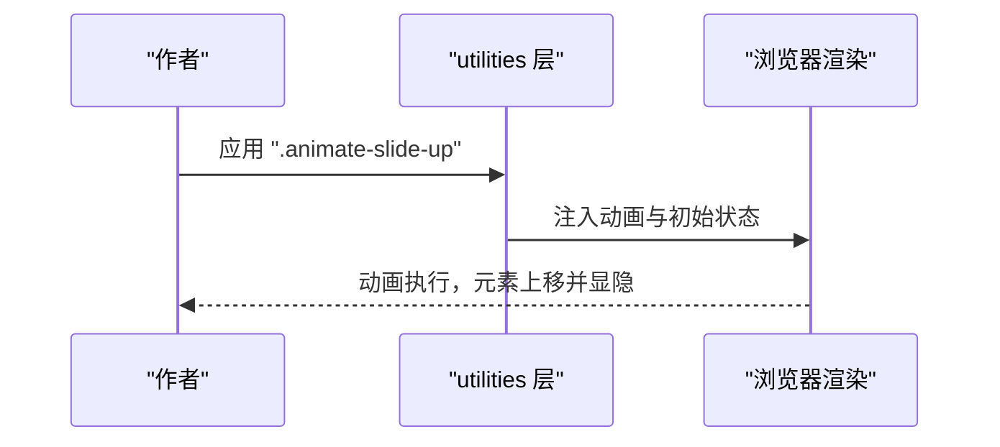
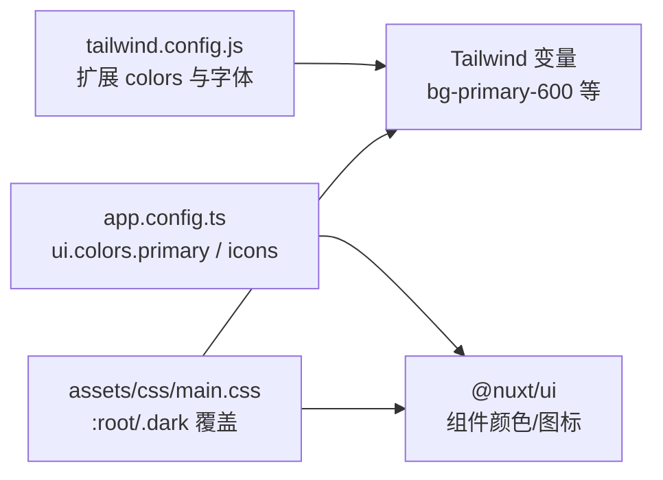
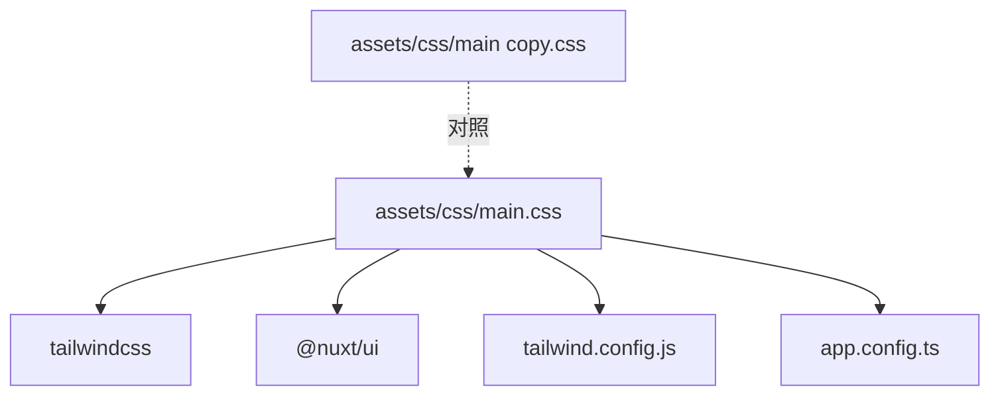

# 设计变量与主题

<cite>
**本文引用的文件**
- [assets/css/main.css](file://assets/css/main.css)
- [assets/css/main copy.css](file://assets/css/main copy.css)
- [tailwind.config.js](file://tailwind.config.js)
- [app.config.ts](file://app.config.ts)
</cite>

## 目录
1. [简介](#简介)
2. [项目结构](#项目结构)
3. [核心组件](#核心组件)
4. [架构总览](#架构总览)
5. [详细组件分析](#详细组件分析)
6. [依赖关系分析](#依赖关系分析)
7. [性能考量](#性能考量)
8. [故障排查指南](#故障排查指南)
9. [结论](#结论)
10. [附录](#附录)

## 简介
本文件系统化梳理 智言万象 项目的“设计变量体系”与“主题管理机制”。围绕 main.css 中的 :root 与 .dark 两类 CSS 选择器，解释其通过 CSS 自定义属性（如 --ui-primary、--ui-radius）实现设计令牌的定义与深色模式覆盖；同时说明全局字体、圆角、阴影等设计语言的标准化过程，并深入分析 @layer base、@layer components、@layer utilities 的分层组织方式与职责边界。最后给出设计变量扩展、主题定制与 CSS 变量性能优化的实践建议。

## 项目结构
本项目采用“分层样式”的组织方式：
- 顶层样式入口：assets/css/main.css
- Tailwind 与 Nuxt UI 的导入与覆盖：在 main.css 中统一引入并进行变量覆盖
- 主题与颜色体系：由 tailwind.config.js 与 app.config.ts 共同定义
- 备用样式文件：assets/css/main copy.css 作为早期或对比版本的参考

图表来源
- [assets/css/main.css](file://assets/css/main.css#L1-L145)
- [tailwind.config.js](file://tailwind.config.js#L1-L86)
- [app.config.ts](file://app.config.ts#L1-L83)

章节来源
- [assets/css/main.css](file://assets/css/main.css#L1-L145)
- [tailwind.config.js](file://tailwind.config.js#L1-L86)
- [app.config.ts](file://app.config.ts#L1-L83)

## 核心组件
- 设计变量与主题令牌
  - :root 在浅色模式下定义主品牌色与圆角半径等基础令牌
  - .dark 在深色模式下覆盖主品牌色，实现主题切换
- 基础层（@layer base）
  - 对 html/body 进行全局行为与排版优化，包含平滑滚动与字体特性设置
- 组件层（@layer components）
  - 抽象可复用 UI 组件类，如按钮、卡片、容器内边距等
- 工具层（@layer utilities）
  - 提供单一职责的辅助类，如文本平衡、上滑淡入动画与动画延迟

章节来源
- [assets/css/main.css](file://assets/css/main.css#L8-L145)

## 架构总览
整体架构围绕“变量驱动 + 分层组织”的思路构建：
- 变量层：:root 与 .dark 定义与覆盖设计令牌
- 基础层：@layer base 统一页面级行为与排版
- 组件层：@layer components 抽象 UI 组件样式
- 工具层：@layer utilities 提供原子化辅助能力
- 颜色与字体：tailwind.config.js 与 app.config.ts 提供颜色与字体扩展

图表来源
- [assets/css/main.css](file://assets/css/main.css#L8-L145)
- [tailwind.config.js](file://tailwind.config.js#L1-L86)
- [app.config.ts](file://app.config.ts#L1-L83)

## 详细组件分析

### 设计变量体系与主题管理
- :root 定义
  - 主品牌色：用于语义化强调与高亮状态
  - 圆角半径：统一映射到组件默认圆角，确保视觉一致性
- .dark 覆盖
  - 在深色模式下将主品牌色切换为高对比度色，保证可读性与对比度
- 设计令牌的使用
  - 组件与工具类通过 var(--ui-primary) 引用主品牌色
  - 颜色混合函数生成弱/中/强光效背景，形成层次化的强调与装饰

图表来源
- [assets/css/main.css](file://assets/css/main.css#L8-L145)

章节来源
- [assets/css/main.css](file://assets/css/main.css#L8-L145)

### 基础样式重置（@layer base）
- html
  - 设置 scroll-behavior: smooth，提升导航体验
- body
  - 使用 var(--font-sans) 作为全局字体族
  - 通过 font-feature-settings 优化字形特性（如连字、旧体小写等）
  - 默认背景与文字色通过 @apply 统一，便于后续主题覆盖

图表来源
- [assets/css/main.css](file://assets/css/main.css#L25-L39)

章节来源
- [assets/css/main.css](file://assets/css/main.css#L25-L39)

### 可复用 UI 组件类（@layer components）
- 文本与边框强调
  - .text-ui-primary、.border-ui-primary、.ring-ui-primary
- 背景强调
  - .bg-ui-primary-weak / .bg-ui-primary-glow-weak / .bg-ui-primary-glow-medium / .bg-ui-primary-glow-strong / .bg-ui-primary
- 按钮组
  - .btn-primary、.btn-secondary、.btn-ghost，统一尺寸、圆角、阴影与过渡
- 卡片组
  - .card、.card-hover，统一背景、边框、阴影与悬停位移
- 区块与容器内边距
  - .section-padding、.container-padding，按断点统一间距

图表来源
- [assets/css/main.css](file://assets/css/main.css#L45-L106)

章节来源
- [assets/css/main.css](file://assets/css/main.css#L45-L106)

### 辅助工具类（@layer utilities）
- 文本平衡
  - .text-balance 使用 text-wrap: balance，避免标题出现“孤儿词”
- 动画与延迟
  - .animate-slide-up 定义上滑淡入动画
  - .animation-delay-200、.animation-delay-400 控制动画时序
- 关键帧
  - @keyframes slideUp 实现从偏移与透明到归位与可见的过渡

图表来源
- [assets/css/main.css](file://assets/css/main.css#L112-L144)

章节来源
- [assets/css/main.css](file://assets/css/main.css#L112-L144)

### 颜色与字体体系
- Tailwind 颜色扩展
  - 在 tailwind.config.js 中扩展 primary、accent、secondary 等颜色层级，支持 50–950 的色阶
- 字体家族
  - tailwind.config.js 扩展 sans 字体族，配合 var(--font-sans) 使用
- Nuxt UI 颜色与图标
  - app.config.ts 中定义 ui.colors.primary 与图标别名，影响 Nuxt UI 组件的颜色与图标呈现

图表来源
- [tailwind.config.js](file://tailwind.config.js#L1-L86)
- [app.config.ts](file://app.config.ts#L1-L83)
- [assets/css/main.css](file://assets/css/main.css#L8-L145)

章节来源
- [tailwind.config.js](file://tailwind.config.js#L1-L86)
- [app.config.ts](file://app.config.ts#L1-L83)
- [assets/css/main.css](file://assets/css/main.css#L8-L145)

## 依赖关系分析
- main.css 依赖
  - @import "tailwindcss" 与 @import "@nuxt/ui" 提供基础能力
  - :root 与 .dark 覆盖 Nuxt UI 默认 CSS 变量
  - @layer base/components/utilities 形成分层组织
- Tailwind 与 Nuxt UI
  - tailwind.config.js 与 app.config.ts 为变量与颜色体系提供支撑
- 备用样式
  - main copy.css 保留了早期变量与基础层的简化实现，便于对照与回退

图表来源
- [assets/css/main.css](file://assets/css/main.css#L1-L145)
- [assets/css/main copy.css](file://assets/css/main copy.css#L1-L80)
- [tailwind.config.js](file://tailwind.config.js#L1-L86)
- [app.config.ts](file://app.config.ts#L1-L83)

章节来源
- [assets/css/main.css](file://assets/css/main.css#L1-L145)
- [assets/css/main copy.css](file://assets/css/main copy.css#L1-L80)
- [tailwind.config.js](file://tailwind.config.js#L1-L86)
- [app.config.ts](file://app.config.ts#L1-L83)

## 性能考量
- CSS 变量的使用
  - 通过 var(--ui-primary) 与 color-mix(...) 实现主题与强调色的动态组合，减少重复样式定义
- 动画与过渡
  - 使用 transform 与 opacity 的硬件加速友好属性，配合缓动曲线与延迟控制，降低主线程压力
- 字体与排版
  - font-feature-settings 与 text-wrap: balance 提升阅读体验，但需注意字体文件体积与加载策略
- 分层组织
  - @layer base/components/utilities 将样式拆分为基础、组件与工具三类，有利于 Tree Shaking 与按需加载

[本节为通用性能建议，不直接分析具体文件]

## 故障排查指南
- 深色模式未生效
  - 检查 .dark 是否正确覆盖 --ui-primary，以及页面根元素是否添加了 .dark 类
- 主题切换后颜色异常
  - 确认 :root 与 .dark 的变量覆盖顺序与作用域
- 字体显示异常
  - 检查 var(--font-sans) 是否被正确解析，以及 tailwind.config.js 中的字体扩展是否生效
- 动画不触发
  - 确认 .animate-slide-up 是否被正确应用，且未被其他样式覆盖
- 复用组件样式未生效
  - 检查 @layer components 的优先级与类名拼写

章节来源
- [assets/css/main.css](file://assets/css/main.css#L8-L145)
- [tailwind.config.js](file://tailwind.config.js#L1-L86)
- [app.config.ts](file://app.config.ts#L1-L83)

## 结论
智言万象 项目通过 :root 与 .dark 的变量体系，结合 @layer base/components/utilities 的分层组织，实现了设计令牌的集中管理与主题的灵活切换。Tailwind 与 Nuxt UI 的配置进一步强化了颜色与字体的标准化。建议在实际开发中遵循“变量优先、分层清晰、按需扩展”的原则，持续优化变量命名与覆盖策略，以获得更好的可维护性与性能表现。

[本节为总结性内容，不直接分析具体文件]

## 附录

### 设计变量扩展与主题定制实践
- 新增设计令牌
  - 在 :root 中新增 --ui-* 变量，确保浅/深色模式均有对应覆盖
- 组件抽象
  - 将常用样式抽象为组件类，统一使用 CSS 变量，避免硬编码颜色与尺寸
- 工具类规范
  - 工具类应单一职责，避免复杂组合，必要时通过组合类实现
- 主题扩展
  - 如需引入新品牌色，优先通过变量覆盖而非直接修改组件类
- 性能优化
  - 减少不必要的 color-mix(...) 计算，优先使用预设颜色
  - 合理使用动画延迟，避免过度重绘

[本节为通用实践建议，不直接分析具体文件]