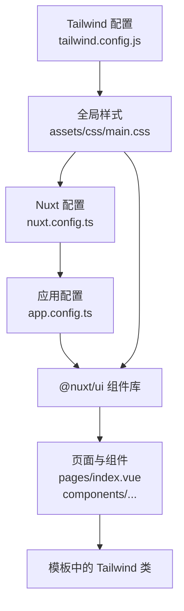
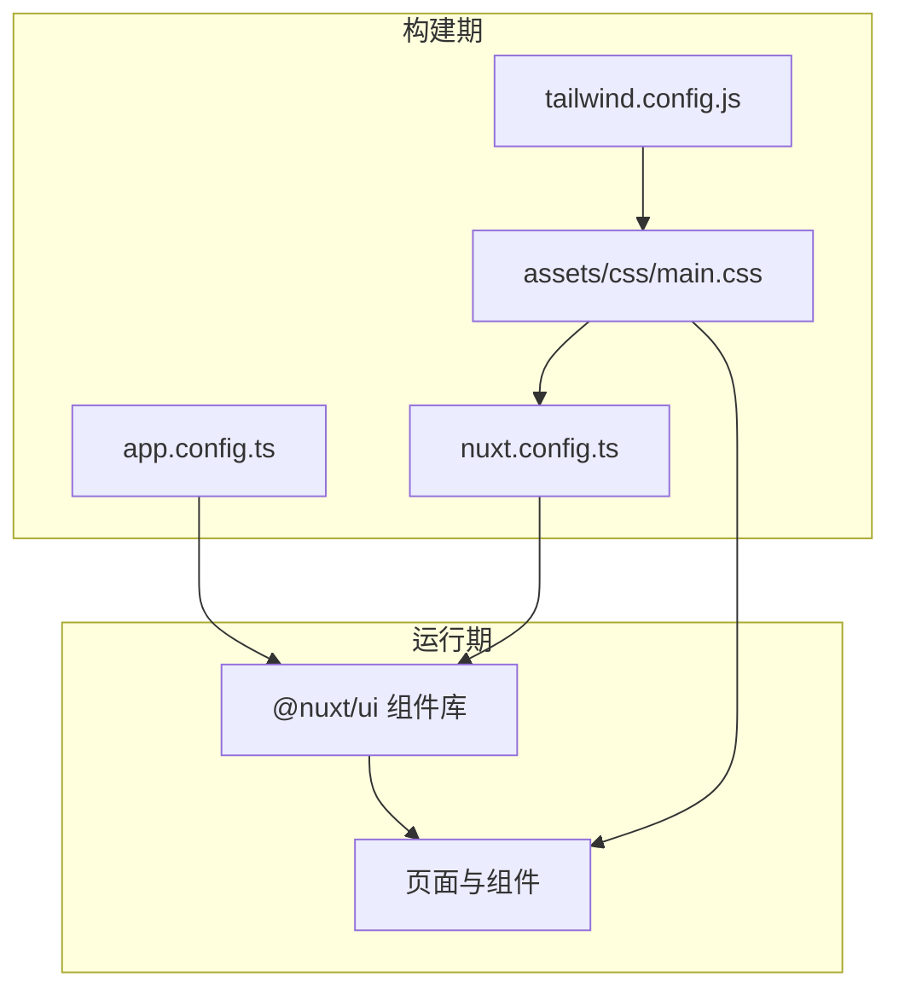
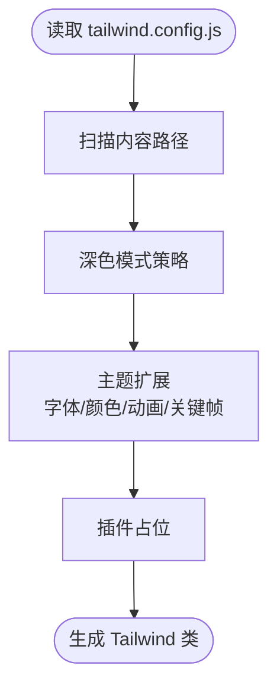
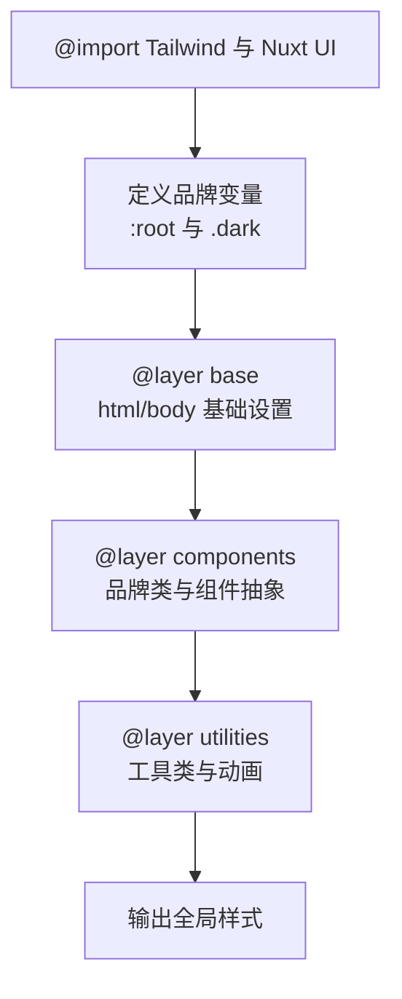
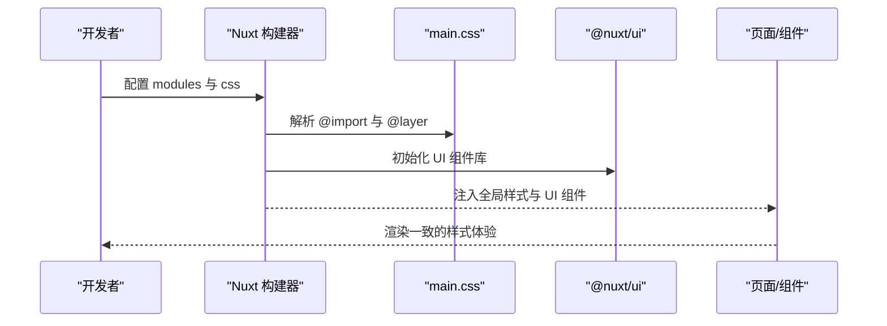
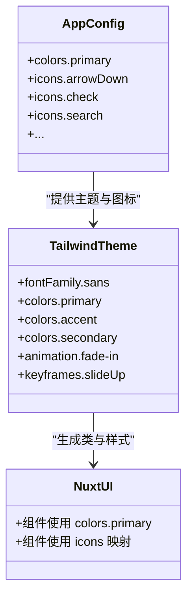
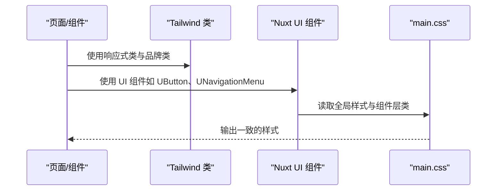
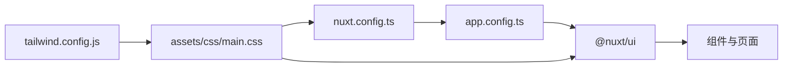

# 样式系统

<cite>
**本文引用的文件**
- [tailwind.config.js](file://tailwind.config.js)
- [main.css](file://assets/css/main.css)
- [nuxt.config.ts](file://nuxt.config.ts)
- [app.config.ts](file://app.config.ts)
- [HeroSection.vue](file://components/landing/HeroSection.vue)
- [AppNavigation.vue](file://components/AppNavigation.vue)
- [index.vue](file://pages/index.vue)
</cite>

## 目录
1. [简介](#简介)
2. [项目结构](#项目结构)
3. [核心组件](#核心组件)
4. [架构总览](#架构总览)
5. [详细组件分析](#详细组件分析)
6. [依赖关系分析](#依赖关系分析)
7. [性能考量](#性能考量)
8. [故障排查指南](#故障排查指南)
9. [结论](#结论)
10. [附录](#附录)

## 简介
本指南围绕项目中的样式系统展开，重点阐释 Tailwind CSS 在本项目中的工作原理、与 Nuxt UI 的集成方式、主题与插件扩展、全局样式文件的职责与组织、@apply 指令的复用策略、响应式断点的使用实践，以及在组件中使用 Tailwind 类的最佳实践与冲突规避方法。同时，说明如何通过 nuxt.config.ts 中的 css 配置加载全局样式文件，确保样式体系的一致性与可维护性。

## 项目结构
样式系统由以下关键部分组成：
- Tailwind 配置：集中定义内容扫描范围、深色模式策略、主题扩展（字体、颜色、动画、关键帧）、插件占位。
- 全局样式文件：通过 @import 引入 Tailwind 与 Nuxt UI，定义基础层、组件层、工具层，使用 @apply 复用 Tailwind 类，统一品牌色变量与动画。
- Nuxt 配置：启用 @nuxt/ui 模块与 @nuxt/content 模块，配置字体与颜色模式，通过 css 数组加载全局样式文件。
- 应用配置：通过 app.config.ts 对 Nuxt UI 的全局颜色与图标进行映射，使 UI 组件与 Tailwind 主题保持一致。
- 组件与页面：在模板中直接使用 Tailwind 类与 Nuxt UI 组件，配合响应式断点实现跨设备一致体验。

**图表来源**
- [tailwind.config.js](file://tailwind.config.js#L1-L86)
- [main.css](file://assets/css/main.css#L1-L145)
- [nuxt.config.ts](file://nuxt.config.ts#L1-L91)
- [app.config.ts](file://app.config.ts#L1-L83)
- [index.vue](file://pages/index.vue#L1-L28)

**章节来源**
- [tailwind.config.js](file://tailwind.config.js#L1-L86)
- [main.css](file://assets/css/main.css#L1-L145)
- [nuxt.config.ts](file://nuxt.config.ts#L1-L91)
- [app.config.ts](file://app.config.ts#L1-L83)
- [index.vue](file://pages/index.vue#L1-L28)

## 核心组件
- Tailwind 主题与扩展
  - 内容扫描范围：包含组件、布局、页面、插件、根组件与错误页，确保按需生成样式。
  - 深色模式：采用类名策略，便于与 Nuxt colorMode 配置协同。
  - 主题扩展：定义字体族、品牌主色/强调色/次级色、动画与关键帧，形成统一的视觉语言。
- 全局样式文件
  - 基础层（@layer base）：重置与全局元素设置，启用平滑滚动、默认字体与文字特性、默认背景与文字色。
  - 组件层（@layer components）：定义可复用的 UI 抽象类（如文本、边框、背景、环形高光、按钮、卡片、段落与容器内边距），大量使用 @apply 复用 Tailwind 类。
  - 工具层（@layer utilities）：提供单一功能的工具类（如文本平衡、装饰色、上滑淡入动画、动画延迟等）。
  - 品牌变量：在 :root 与 .dark 中定义 --ui-primary 与圆角半径，覆盖 Nuxt UI 默认 CSS 变量。
- Nuxt 配置
  - 启用 @nuxt/ui 与 @nuxt/content 模块，禁用自动下载 Google Fonts，手动引入字体。
  - colorMode 配置移除类名后缀，统一深色模式类名。
  - 通过 css 数组加载全局样式文件，保证样式在应用启动时生效。
- 应用配置（Nuxt UI）
  - 设置主品牌色 primary，并映射图标别名，使 UI 组件与 Tailwind 主题一致。

**章节来源**
- [tailwind.config.js](file://tailwind.config.js#L1-L86)
- [main.css](file://assets/css/main.css#L1-L145)
- [nuxt.config.ts](file://nuxt.config.ts#L1-L91)
- [app.config.ts](file://app.config.ts#L1-L83)

## 架构总览
下图展示了样式系统在项目中的整体流向：Tailwind 通过配置生成所需类，全局样式文件在构建阶段被引入，Nuxt UI 组件与 Tailwind 类协同工作，最终在页面与组件中呈现一致的视觉风格。

**图表来源**
- [tailwind.config.js](file://tailwind.config.js#L1-L86)
- [main.css](file://assets/css/main.css#L1-L145)
- [nuxt.config.ts](file://nuxt.config.ts#L1-L91)
- [app.config.ts](file://app.config.ts#L1-L83)
- [index.vue](file://pages/index.vue#L1-L28)

## 详细组件分析

### Tailwind 配置与主题扩展
- 内容扫描范围：确保组件、布局、页面、插件、根组件与错误页均被扫描，避免未使用的样式被移除。
- 深色模式：采用类名策略，与 Nuxt colorMode 配置相辅相成。
- 主题扩展：
  - 字体：定义 sans 字体族，配合全局样式中的字体变量使用。
  - 颜色：定义 primary、accent、secondary 三套品牌色阶，供组件与工具类使用。
  - 动画与关键帧：定义 fade-in、slide-up、bounce-gentle、marquee-vertical 等动画，配合组件使用。
- 插件：当前为空，预留扩展空间。

**图表来源**
- [tailwind.config.js](file://tailwind.config.js#L1-L86)

**章节来源**
- [tailwind.config.js](file://tailwind.config.js#L1-L86)

### 全局样式文件：main.css 的职责与组织
- @import 引入：引入 Tailwind 与 Nuxt UI，确保基础样式与 UI 组件样式可用。
- 品牌变量：
  - :root 定义浅色模式下的主品牌色与圆角半径。
  - .dark 覆盖深色模式下的主品牌色，保证暗色主题一致性。
- 基础层（@layer base）：
  - html：启用平滑滚动。
  - body：设置字体族、字体特性、默认背景与文字色，使用 @apply 复用 Tailwind 类。
- 组件层（@layer components）：
  - 文本、边框、背景、环形高光等品牌相关类，统一文案与交互风格。
  - 按钮类：btn-primary、btn-secondary、btn-ghost，统一尺寸、圆角、阴影、过渡与焦点环。
  - 卡片类：card、card-hover，统一背景、边框、阴影与悬停效果。
  - 设计工具类：section-padding、container-padding，统一段落与容器内边距。
- 工具层（@layer utilities）：
  - 文本平衡、装饰色、上滑淡入动画、动画延迟等工具类，减少重复样式。
- 动画：在工具层中定义 slideUp 关键帧与动画类，配合组件使用。

**图表来源**
- [main.css](file://assets/css/main.css#L1-L145)

**章节来源**
- [main.css](file://assets/css/main.css#L1-L145)

### Nuxt 配置与全局样式加载
- 模块启用：@nuxt/ui 与 @nuxt/content，前者提供基于 Tailwind 的 UI 组件库，后者提供 Markdown 内容管理能力。
- 字体与颜色模式：禁用自动下载 Google Fonts，手动引入字体；colorMode 移除类名后缀，统一深色模式类名。
- 全局样式加载：通过 css 数组加载 ~/assets/css/main.css，确保样式在应用启动时生效。

**图表来源**
- [nuxt.config.ts](file://nuxt.config.ts#L1-L91)
- [main.css](file://assets/css/main.css#L1-L145)

**章节来源**
- [nuxt.config.ts](file://nuxt.config.ts#L1-L91)

### 应用配置（Nuxt UI）与主题一致性
- 主品牌色：设置 primary 为 'violet'，Nuxt UI 将自动生成色阶并在组件中应用。
- 图标映射：将 UI 组件内部逻辑图标名称映射到 Phosphor Icons（i-ph-*）风格，保证图标风格一致。
- 与 Tailwind 的协同：通过 app.config.ts 的颜色与图标配置，确保 UI 组件与 Tailwind 主题保持一致。

**图表来源**
- [app.config.ts](file://app.config.ts#L1-L83)
- [tailwind.config.js](file://tailwind.config.js#L1-L86)

**章节来源**
- [app.config.ts](file://app.config.ts#L1-L83)
- [tailwind.config.js](file://tailwind.config.js#L1-L86)

### 组件中的 Tailwind 类使用与响应式实践
- HeroSection 示例：
  - 使用容器与内容区域的响应式类（sm:、md:、lg:）控制间距与排版。
  - 使用品牌变量类（如 text-ui-primary、bg-ui-primary）与 UI 组件（如 UButton、UIcon）组合。
  - 使用工具类（如 text-balance、animate-slide-up）提升文案可读性与动效表现。
- AppNavigation 示例：
  - 使用 sticky、top-0、inset-x-0、z-50 等定位类，配合过渡类实现头部粘滞与过渡效果。
  - 使用响应式类（md:、sm:）在桌面与移动之间切换导航布局与按钮尺寸。
  - 使用 UI 组件（UNavigationMenu、UButton）与图标（Heroicons）实现导航与交互。
- 页面入口：
  - index.vue 作为页面入口，承载多个 Landing 组件，体现统一的样式风格与响应式布局。

**图表来源**
- [HeroSection.vue](file://components/landing/HeroSection.vue#L1-L190)
- [AppNavigation.vue](file://components/AppNavigation.vue#L1-L138)
- [main.css](file://assets/css/main.css#L1-L145)

**章节来源**
- [HeroSection.vue](file://components/landing/HeroSection.vue#L1-L190)
- [AppNavigation.vue](file://components/AppNavigation.vue#L1-L138)
- [index.vue](file://pages/index.vue#L1-L28)

## 依赖关系分析
- Tailwind 配置与全局样式文件：
  - tailwind.config.js 决定类生成范围与主题扩展，main.css 通过 @layer 与 @apply 将 Tailwind 类组织为可复用的组件与工具类。
- Nuxt 配置与 UI 组件：
  - nuxt.config.ts 启用 @nuxt/ui 并加载全局样式，app.config.ts 为 UI 组件提供主题与图标映射。
- 组件与样式：
  - 组件模板中直接使用 Tailwind 类与 UI 组件，响应式断点与品牌类在构建期由 Tailwind 生成，在运行期由组件消费。

**图表来源**
- [tailwind.config.js](file://tailwind.config.js#L1-L86)
- [main.css](file://assets/css/main.css#L1-L145)
- [nuxt.config.ts](file://nuxt.config.ts#L1-L91)
- [app.config.ts](file://app.config.ts#L1-L83)

**章节来源**
- [tailwind.config.js](file://tailwind.config.js#L1-L86)
- [main.css](file://assets/css/main.css#L1-L145)
- [nuxt.config.ts](file://nuxt.config.ts#L1-L91)
- [app.config.ts](file://app.config.ts#L1-L83)

## 性能考量
- 按需生成：tailwind.config.js 的 content 配置确保仅生成实际使用的类，减少 CSS 体积。
- 层级组织：通过 @layer base、components、utilities 将样式分层，便于维护与按需加载。
- 组件复用：使用 @apply 将常用样式抽象为可复用类，减少模板中的重复类，提升渲染效率。
- 动画与关键帧：在工具层定义动画与关键帧，避免在组件中重复声明，降低样式冗余。
- 字体与图标：禁用自动下载 Google Fonts，手动引入字体；UI 图标使用图标库类名，减少额外资源请求。

[本节为通用指导，不直接分析具体文件]

## 故障排查指南
- 样式未生效
  - 检查 nuxt.config.ts 中是否正确配置 css 数组加载 main.css。
  - 确认 main.css 是否存在 @import 引入 Tailwind 与 Nuxt UI。
- 品牌色不一致
  - 检查 app.config.ts 中 colors.primary 与 main.css 中 :root/.dark 的 --ui-primary 是否一致。
- 响应式断点无效
  - 确认组件中使用了正确的断点前缀（sm:/md:/lg: 等），并检查 tailwind.config.js 的 content 范围是否包含对应组件。
- 动画或工具类不生效
  - 检查 main.css 中工具层类与关键帧是否正确定义，组件是否正确引用相应类名。
- UI 组件样式异常
  - 检查 app.config.ts 中图标映射是否正确，UI 组件是否使用了正确的颜色与尺寸类。

**章节来源**
- [nuxt.config.ts](file://nuxt.config.ts#L1-L91)
- [main.css](file://assets/css/main.css#L1-L145)
- [app.config.ts](file://app.config.ts#L1-L83)

## 结论
本项目通过 Tailwind CSS 与 Nuxt UI 的紧密协作，建立了统一且可扩展的样式体系。tailwind.config.js 提供主题与内容扫描配置，main.css 通过 @layer 与 @apply 将 Tailwind 类组织为可复用的组件与工具类，nuxt.config.ts 与 app.config.ts 则确保全局样式与 UI 组件的主题一致性。组件与页面通过响应式断点与品牌类实现跨设备一致体验，@apply 指令有效避免了重复样式与冲突，整体方案具备良好的可维护性与性能表现。

[本节为总结性内容，不直接分析具体文件]

## 附录
- 响应式断点使用建议
  - 在组件中优先使用 sm:/md:/lg:/xl:/2xl: 前缀控制布局与间距。
  - 避免在同一元素上叠加过多断点类，必要时通过组合类简化。
- 最佳实践
  - 使用 main.css 中的组件层与工具层类，减少模板中的重复类。
  - 通过 app.config.ts 与 tailwind.config.js 的 colors.primary 保持品牌色一致。
  - 在需要时扩展 tailwind.config.js 的 plugins 数组，引入 Tailwind 插件以增强功能。
- 样式冲突规避
  - 优先使用可复用类而非内联样式，减少特异性差异导致的冲突。
  - 在组件中使用 scoped 样式时，尽量避免覆盖全局类，必要时通过更明确的选择器限定作用域。

[本节为通用指导，不直接分析具体文件]