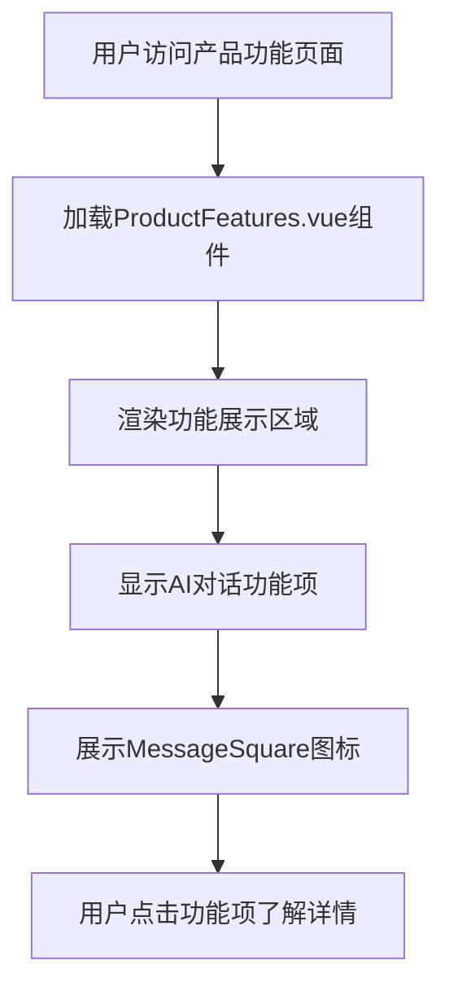
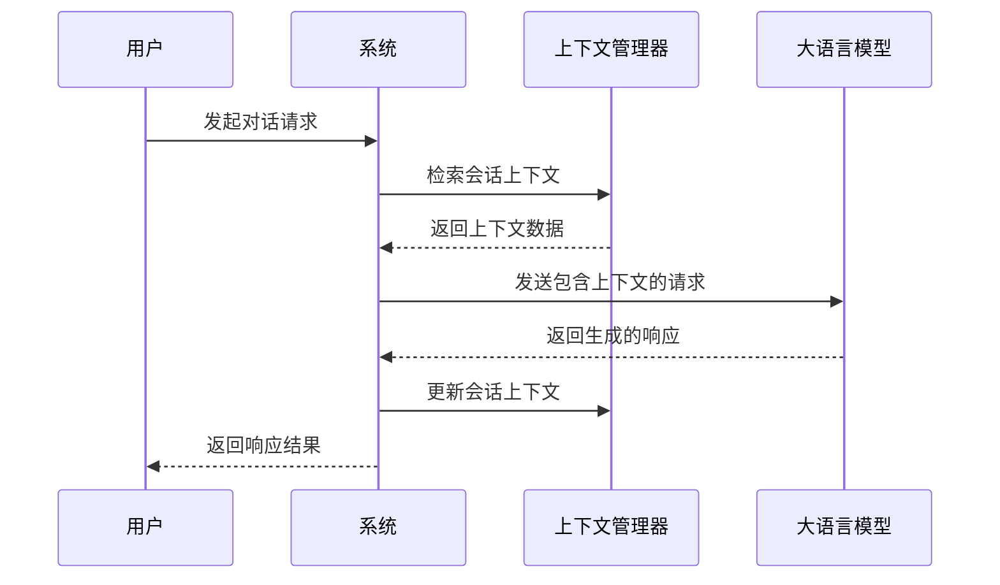
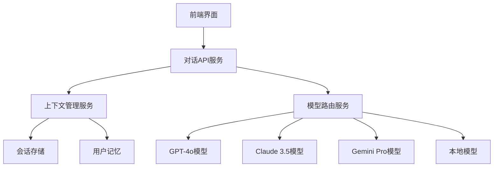
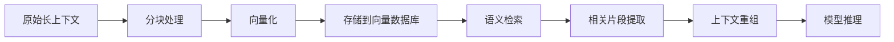
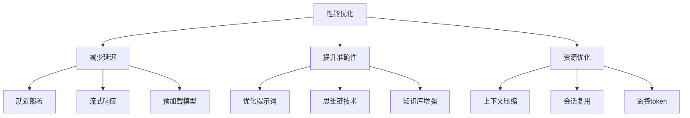

# AI对话

<cite>
**本文档引用文件**
- [ProductFeatures.vue](file://components/landing/ProductFeatures.vue)
- [buidai.vue](file://pages/buidai.vue)
- [demo.vue](file://pages/demo.vue)
- [agent.vue](file://pages/agent.vue)
- [pricing.vue](file://pages/pricing.vue)
</cite>

## 目录
1. [AI对话功能概述](#ai对话功能概述)
2. [用户界面呈现与交互设计](#用户界面呈现与交互设计)
3. [多轮对话与上下文理解机制](#多轮对话与上下文理解机制)
4. [后端模型服务集成](#后端模型服务集成)
5. [超长上下文支持技术实现](#超长上下文支持技术实现)
6. [实际使用示例](#实际使用示例)
7. [性能优化建议](#性能优化建议)
8. [常见问题排查](#常见问题排查)

## AI对话功能概述

AI对话功能是buidai平台的核心能力之一，基于大语言模型（LLM）实现智能对话与文本生成。该功能支持多模态模型调用，能够处理复杂的自然语言交互任务。平台集成了GPT-4o、Claude 3.5、Gemini Pro等主流大语言模型，为用户提供稳定、高速的API调用服务。

AI对话系统不仅限于简单的问答，还支持多轮对话、上下文理解与意图识别。通过可视化工作流编排，用户可以将对话功能与其他AI组件（如知识库、MCP服务）连接，构建复杂的业务流程。该功能适用于智能客服、内容创作、数据分析等多种场景。

**Section sources**
- [buidai.vue](file://pages/buidai.vue#L721-L726)
- [demo.vue](file://pages/demo.vue#L35-L37)

## 用户界面呈现与交互设计

AI对话功能在用户界面中通过"MessageSquare"图标进行展示，该图标位于产品功能展示区域的显著位置。在ProductFeatures.vue组件中，通过自定义SVG路径定义了MessageSquare图标，并将其与"AI对话"功能项关联。



**Diagram sources**
- [ProductFeatures.vue](file://components/landing/ProductFeatures.vue#L96)
- [ProductFeatures.vue](file://components/landing/ProductFeatures.vue#L124)

功能项采用卡片式设计，每个卡片包含图标、功能名称和背景色。AI对话功能的图标为蓝色系，背景色为bg-indigo-50，文字颜色为text-indigo-600，形成统一的视觉识别体系。用户可以通过点击卡片了解功能详情，或通过演示链接直接体验AI对话功能。

在demo.vue页面中，AI对话功能以"必创AI"产品形式展示，提供PC演示前台、WAP演示等多个访问入口，方便用户在不同设备上体验。

**Section sources**
- [ProductFeatures.vue](file://components/landing/ProductFeatures.vue#L1-L163)
- [demo.vue](file://pages/demo.vue#L32-L45)

## 多轮对话与上下文理解机制

AI对话系统通过维护会话上下文来实现多轮对话能力。系统在每次对话交互中都会保存用户和AI的历史消息，形成对话上下文。这个上下文信息会被作为输入的一部分传递给大语言模型，使模型能够理解对话的连贯性和上下文关系。

上下文管理采用分层存储策略：
1. 短期记忆：存储当前会话的对话历史
2. 长期记忆：存储用户偏好和历史交互模式
3. 知识库关联：链接相关知识库内容

系统通过对话状态跟踪（DST）技术识别用户意图和对话状态，确保在多轮对话中保持上下文一致性。当用户提出指代性问题（如"它怎么样？"）时，系统能够正确解析指代对象，提供准确的回复。



**Diagram sources**
- [buidai.vue](file://pages/buidai.vue#L721-L726)
- [agent.vue](file://pages/agent.vue#L334-L335)

## 后端模型服务集成

AI对话功能通过标准化的API接口与后端大语言模型服务集成。系统支持多种模型接入方式，包括商业模型API和本地模型部署。集成机制采用适配器模式，确保不同模型提供商的API能够统一调用。

系统架构采用微服务设计，对话服务与模型服务分离。当收到对话请求时，对话服务会进行预处理（如上下文组装、参数验证），然后通过HTTP或SSE（Server-Sent Events）协议调用后端模型服务。



**Diagram sources**
- [buidai.vue](file://pages/buidai.vue#L740-L744)
- [agent.vue](file://pages/agent.vue#L354-L356)

会话记忆存储采用混合存储方案：
- 内存缓存：存储活跃会话，确保低延迟访问
- 数据库存储：持久化存储会话历史，支持长期记忆
- 向量数据库：存储语义化上下文，支持上下文检索

系统支持SSE和StreamableHTTP两种流式传输方式，能够实时返回模型生成的文本，提供流畅的对话体验。

**Section sources**
- [buidai.vue](file://pages/buidai.vue#L740-L744)
- [agent.vue](file://pages/agent.vue#L354-L356)

## 超长上下文支持技术实现

为支持超长上下文对话，系统采用多项优化技术。首先，通过上下文压缩算法对历史对话进行摘要，保留关键信息的同时减少token消耗。其次，采用分块处理机制，将长上下文分割为多个片段，分别处理后再合并结果。

系统实现了上下文窗口管理功能，能够智能选择最相关的上下文片段参与模型推理。通过语义相似度计算，系统可以识别与当前问题最相关的对话历史，提高上下文利用效率。

对于超长文档处理，系统采用RAF（Retrieval-Augmented Framework）知识库技术，将文档分块向量化存储。在对话过程中，通过向量检索快速定位相关信息，避免将整个文档作为上下文输入。



**Diagram sources**
- [agent.vue](file://pages/agent.vue#L340-L342)
- [buidai.vue](file://pages/buidai.vue#L734-L737)

此外，系统支持上下文滑动窗口机制，自动管理上下文长度。当对话历史超过预设阈值时，系统会根据重要性评分自动清理较不重要的历史记录，确保上下文在模型限制范围内。

**Section sources**
- [agent.vue](file://pages/agent.vue#L340-L342)
- [buidai.vue](file://pages/buidai.vue#L734-L737)

## 实际使用示例

### 参数配置
AI对话功能的调用需要配置以下参数：
- model：指定使用的大语言模型
- temperature：控制生成文本的随机性
- max_tokens：限制生成文本长度
- context_length：设置上下文窗口大小
- stream：启用流式响应

### 调用方式
通过REST API或SDK调用AI对话功能：
```javascript
// API调用示例
POST /api/v1/chat
{
  "model": "gpt-4o",
  "messages": [
    {"role": "user", "content": "你好"},
    {"role": "assistant", "content": "您好，有什么可以帮助您？"}
  ],
  "temperature": 0.7
}
```

### 响应处理
系统返回结构化响应，包含生成文本、token使用统计和处理时间等信息。前端应用可以根据需要解析响应，实现文本流式显示、加载状态提示等功能。

**Section sources**
- [demo.vue](file://pages/demo.vue#L39-L44)
- [pricing.vue](file://pages/pricing.vue#L70-L94)

## 性能优化建议

为提升AI对话功能的性能，建议采取以下策略：

### 减少延迟
1. 使用就近部署的模型服务节点
2. 启用流式响应（SSE）实现渐进式输出
3. 优化网络连接，减少往返延迟
4. 预加载常用模型，减少冷启动时间

### 提升响应准确性
1. 精心设计系统提示词（system prompt）
2. 采用思维链（Chain-of-Thought）提示技术
3. 结合知识库增强生成（RAG）
4. 设置合理的temperature参数

### 资源利用优化
1. 合理设置max_tokens限制
2. 采用上下文压缩技术
3. 实现会话复用，避免重复计算
4. 监控token使用情况，优化成本



**Diagram sources**
- [pricing.vue](file://pages/pricing.vue#L70-L94)
- [agent.vue](file://pages/agent.vue#L389-L390)

**Section sources**
- [pricing.vue](file://pages/pricing.vue#L70-L94)
- [agent.vue](file://pages/agent.vue#L389-L390)

## 常见问题排查

### 对话中断
**现象**：对话过程中突然中断，无法继续。
**解决方案**：
1. 检查网络连接是否稳定
2. 确认API密钥是否有效
3. 查看模型服务是否正常运行
4. 检查是否达到调用频率限制

### 上下文丢失
**现象**：AI无法记住之前的对话内容。
**解决方案**：
1. 确认会话ID是否正确传递
2. 检查上下文存储服务是否正常
3. 验证上下文长度是否超过限制
4. 确认是否启用了上下文持久化

### 响应质量下降
**现象**：AI回复不相关或质量降低。
**解决方案**：
1. 检查系统提示词是否正确
2. 验证上下文相关性
3. 调整temperature等生成参数
4. 检查知识库内容是否准确

**Section sources**
- [agent.vue](file://pages/agent.vue#L432-L451)
- [demo.vue](file://pages/demo.vue#L121-L174)
