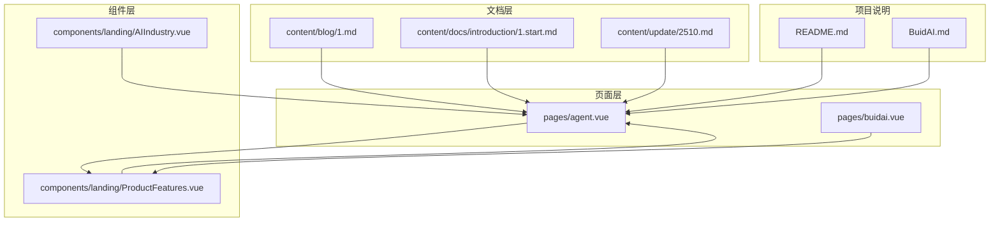
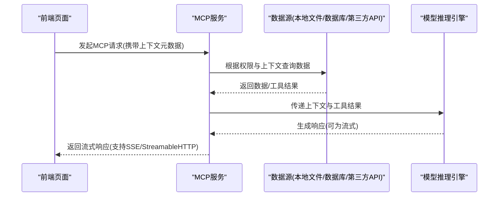
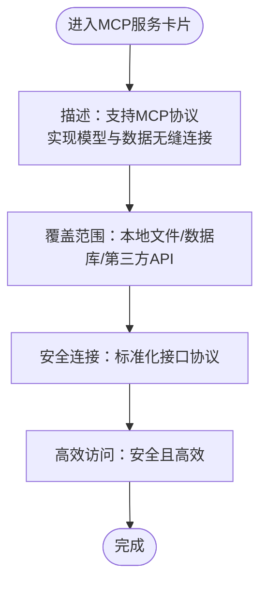
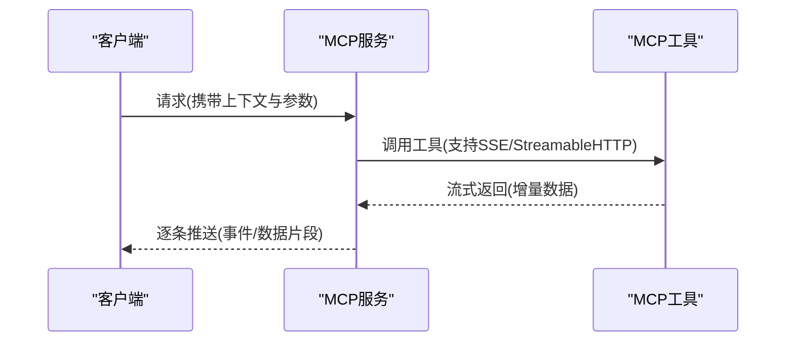
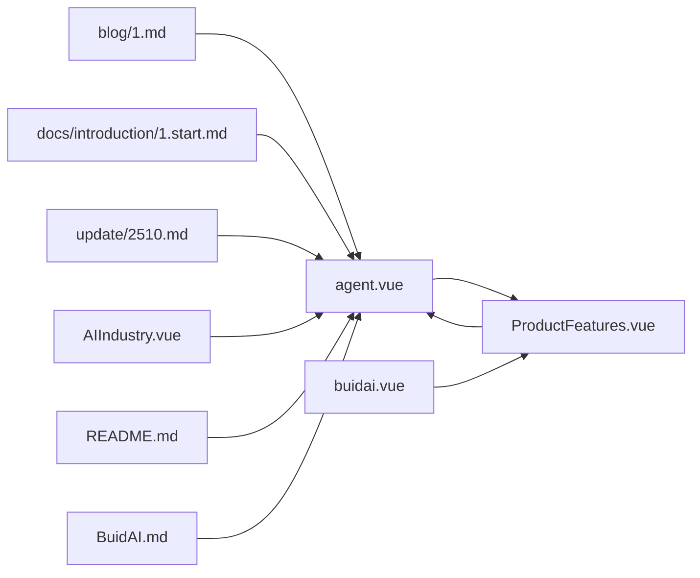

# MCP协议规范

<cite>
**本文引用的文件**
- [pages/agent.vue](file://pages/agent.vue)
- [pages/buidai.vue](file://pages/buidai.vue)
- [content/blog/1.md](file://content/blog/1.md)
- [content/docs/introduction/1.start.md](file://content/docs/introduction/1.start.md)
- [content/update/2510.md](file://content/update/2510.md)
- [components/landing/ProductFeatures.vue](file://components/landing/ProductFeatures.vue)
- [components/landing/AIIndustry.vue](file://components/landing/AIIndustry.vue)
- [README.md](file://README.md)
- [BuidAI.md](file://BuidAI.md)
</cite>

## 目录
1. [引言](#引言)
2. [项目结构](#项目结构)
3. [核心组件](#核心组件)
4. [架构总览](#架构总览)
5. [详细组件分析](#详细组件分析)
6. [依赖关系分析](#依赖关系分析)
7. [性能考量](#性能考量)
8. [故障排查指南](#故障排查指南)
9. [结论](#结论)
10. [附录](#附录)

## 引言
本文件围绕 Model Context Protocol（MCP）在本项目的定位与能力边界进行系统化梳理，重点说明其作为AI模型与外部数据源、工具之间标准化通信接口的作用，涵盖协议版本、消息格式（JSON Schema）、请求/响应结构、元数据定义，并结合页面与文档中的“MCP服务”功能卡片与描述，解释其在本地文件、数据库与第三方API安全连接方面的支持能力。同时，说明协议如何实现上下文感知、权限控制与调用链追踪，并提供实际请求示例与错误码说明。

## 项目结构
本仓库为基于 Nuxt 4 + Vue 3 的前端模板，MCP相关内容主要体现在页面与文档中对“MCP服务”的功能描述与能力展示，以及更新日志中对MCP兼容性的修复记录。项目结构与MCP相关的关键位置如下：
- 页面层：agent.vue、buidai.vue 中对“MCP服务”的功能卡片与描述
- 文档层：blog/1.md、docs/introduction/1.start.md 中对MCP能力的说明
- 更新日志：update/2510.md 中提及MCP兼容性修复
- 组件层：landing/ProductFeatures.vue、AIIndustry.vue 中对“MCP服务”的功能点展示

图表来源
- [pages/agent.vue](file://pages/agent.vue#L325-L358)
- [pages/buidai.vue](file://pages/buidai.vue#L717-L766)
- [content/blog/1.md](file://content/blog/1.md#L1-L108)
- [content/docs/introduction/1.start.md](file://content/docs/introduction/1.start.md#L1-L117)
- [content/update/2510.md](file://content/update/2510.md#L1-L67)
- [components/landing/ProductFeatures.vue](file://components/landing/ProductFeatures.vue#L119-L132)
- [components/landing/AIIndustry.vue](file://components/landing/AIIndustry.vue#L195-L200)
- [README.md](file://README.md#L1-L117)
- [BuidAI.md](file://BuidAI.md#L1-L200)

章节来源
- [README.md](file://README.md#L1-L117)
- [BuidAI.md](file://BuidAI.md#L1-L200)

## 核心组件
- MCP服务功能卡片：在 agent.vue 中，“MCP服务”卡片明确指出“全面支持 Model Context Protocol (MCP)，实现模型与数据的无缝连接。标准化的接口协议，让智能体能够安全、高效地访问本地文件、数据库及第三方 API 服务。”
- MCP调用能力描述：在 buidai.vue 中，功能列表包含“MCP调用”，并说明“支持以 SSE、StreamableHTTP 方式调用MCP工具”，体现协议在流式传输与可扩展HTTP上的支持。
- 文档与博客中的MCP能力说明：blog/1.md 与 docs/introduction/1.start.md 均强调MCP作为原生AI能力之一，贯穿智能体、工作流、知识库等模块。
- 更新日志中的MCP兼容性修复：update/2510.md 中明确提及“修复部分深度思考模型 MCP 兼容性问题”，表明项目在运行时对MCP协议存在兼容性层面的维护与修复。

章节来源
- [pages/agent.vue](file://pages/agent.vue#L325-L358)
- [pages/buidai.vue](file://pages/buidai.vue#L717-L766)
- [content/blog/1.md](file://content/blog/1.md#L1-L108)
- [content/docs/introduction/1.start.md](file://content/docs/introduction/1.start.md#L1-L117)
- [content/update/2510.md](file://content/update/2510.md#L1-L67)

## 架构总览
MCP在本项目中的角色是作为“模型上下文协议”，用于将AI模型与外部数据源（本地文件、数据库、第三方API）进行标准化连接。其典型工作流包括：
- 上下文感知：通过协议传递上下文元数据，使模型在推理过程中具备对数据源与工具的感知能力。
- 权限控制：通过协议的鉴权与授权机制，限制模型对特定数据源与工具的访问范围。
- 调用链追踪：通过协议的元数据与事件流，实现从模型到工具的调用链路追踪与可观测性。
- 流式传输：支持以SSE、StreamableHTTP等方式进行增量返回，提升用户体验与实时性。

图表来源
- [pages/buidai.vue](file://pages/buidai.vue#L717-L766)
- [pages/agent.vue](file://pages/agent.vue#L325-L358)

## 详细组件分析

### MCP服务功能卡片解析
- 功能定位：作为“协议标准”模块，强调“模型上下文”能力，支持本地文件、数据库与第三方API的安全连接。
- 能力边界：文档与页面描述均强调“标准化接口协议”，并明确“安全、高效”访问外部数据源。
- 与工作流/知识库的关系：MCP能力与智能体、工作流、RAF知识库等模块共同构成原生AI能力矩阵。

图表来源
- [pages/agent.vue](file://pages/agent.vue#L325-L358)

章节来源
- [pages/agent.vue](file://pages/agent.vue#L325-L358)

### MCP调用能力与流式传输
- 能力说明：buidai.vue 中“MCP调用”功能描述明确支持“SSE、StreamableHTTP方式调用MCP工具”，体现协议在流式传输与可扩展HTTP上的支持。
- 实际意义：流式传输有助于在长耗时任务中逐步返回中间结果，提升交互体验与可观测性。

图表来源
- [pages/buidai.vue](file://pages/buidai.vue#L717-L766)

章节来源
- [pages/buidai.vue](file://pages/buidai.vue#L717-L766)

### 文档与博客中的MCP能力说明
- blog/1.md 与 docs/introduction/1.start.md 均将MCP列为原生AI能力之一，贯穿智能体、工作流、知识库等模块，体现其在整体架构中的基础地位。
- 这些文档为理解MCP在整个产品能力矩阵中的作用提供了高层视角。

章节来源
- [content/blog/1.md](file://content/blog/1.md#L1-L108)
- [content/docs/introduction/1.start.md](file://content/docs/introduction/1.start.md#L1-L117)

### 更新日志中的MCP兼容性修复
- update/2510.md 中明确提及“修复部分深度思考模型 MCP 兼容性问题”，表明项目在运行时对MCP协议存在兼容性层面的维护与修复。
- 这意味着协议在实际部署与运行环境中需要持续的兼容性保障与问题修复。

章节来源
- [content/update/2510.md](file://content/update/2510.md#L1-L67)

## 依赖关系分析
- 页面与文档的耦合：agent.vue 与 pages/buidai.vue 作为前端页面，承载MCP能力的展示；blog/1.md 与 docs/introduction/1.start.md 作为文档内容，提供MCP能力的高层说明。
- 组件层的补充：landing/ProductFeatures.vue 与 landing/AIIndustry.vue 在功能列表中体现“MCP服务”，进一步强化MCP在产品能力矩阵中的可见性。
- 项目说明：README.md 与 BuidAI.md 提供项目整体背景与技术栈，为理解MCP在项目中的定位提供上下文。

图表来源
- [pages/agent.vue](file://pages/agent.vue#L325-L358)
- [pages/buidai.vue](file://pages/buidai.vue#L717-L766)
- [content/blog/1.md](file://content/blog/1.md#L1-L108)
- [content/docs/introduction/1.start.md](file://content/docs/introduction/1.start.md#L1-L117)
- [content/update/2510.md](file://content/update/2510.md#L1-L67)
- [components/landing/ProductFeatures.vue](file://components/landing/ProductFeatures.vue#L119-L132)
- [components/landing/AIIndustry.vue](file://components/landing/AIIndustry.vue#L195-L200)
- [README.md](file://README.md#L1-L117)
- [BuidAI.md](file://BuidAI.md#L1-L200)

章节来源
- [components/landing/ProductFeatures.vue](file://components/landing/ProductFeatures.vue#L119-L132)
- [components/landing/AIIndustry.vue](file://components/landing/AIIndustry.vue#L195-L200)
- [README.md](file://README.md#L1-L117)
- [BuidAI.md](file://BuidAI.md#L1-L200)

## 性能考量
- 流式传输：通过SSE与StreamableHTTP实现增量返回，有助于降低首屏等待时间并提升交互流畅度。
- 权限控制与上下文感知：在协议层实现细粒度的访问控制与上下文传递，避免不必要的数据往返，从而提升整体性能。
- 兼容性维护：更新日志中对MCP兼容性问题的修复表明，协议在运行时需要持续的稳定性保障，以避免性能退化与异常中断。

## 故障排查指南
- 兼容性问题：若遇到MCP调用失败或结果异常，可参考 update/2510.md 中的MCP兼容性修复记录，确认是否为特定模型或工具的兼容性问题。
- 流式传输异常：若SSE/StreamableHTTP返回不完整或中断，检查网络与代理配置，确保事件流通道畅通。
- 权限与上下文：若出现访问受限或上下文缺失，检查协议层的鉴权与上下文元数据是否正确传递。

章节来源
- [content/update/2510.md](file://content/update/2510.md#L1-L67)

## 结论
本项目将MCP定位为“模型上下文协议”，强调其在连接AI模型与外部数据源（本地文件、数据库、第三方API）方面的能力，并通过页面与文档明确其“安全、高效”的访问特性。同时，buidai.vue 中对SSE与StreamableHTTP的支持，体现了协议在流式传输与可扩展HTTP上的实践。更新日志中的MCP兼容性修复进一步说明协议在运行时需要持续的稳定性保障。综合来看，MCP在本项目中承担着标准化通信接口的角色，服务于上下文感知、权限控制与调用链追踪等关键能力。

## 附录
- 协议版本：本仓库未直接定义MCP协议版本号，具体版本以实际后端实现为准。
- 消息格式与请求/响应结构：本仓库未提供具体的JSON Schema与请求/响应结构定义，建议参考后端实现或官方MCP规范。
- 元数据定义：本仓库未给出元数据字段清单，建议结合后端实现与协议规范进行补充。
- 实际请求示例与错误码说明：本仓库未包含示例与错误码，建议在后端实现处补充并在此文档中引用。