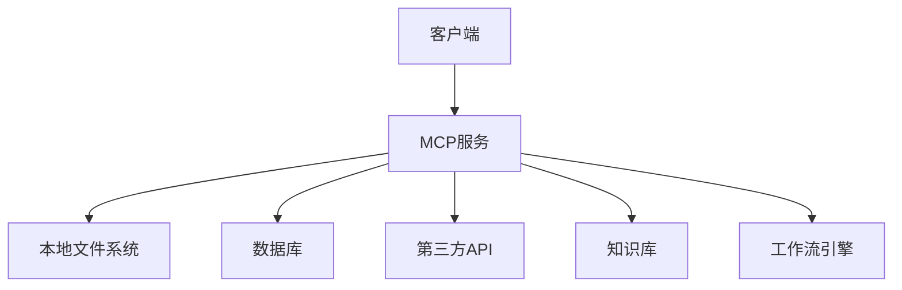
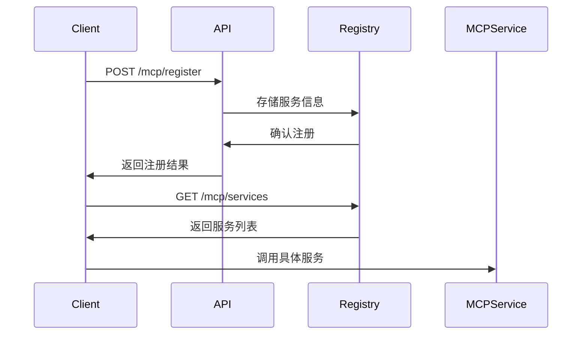
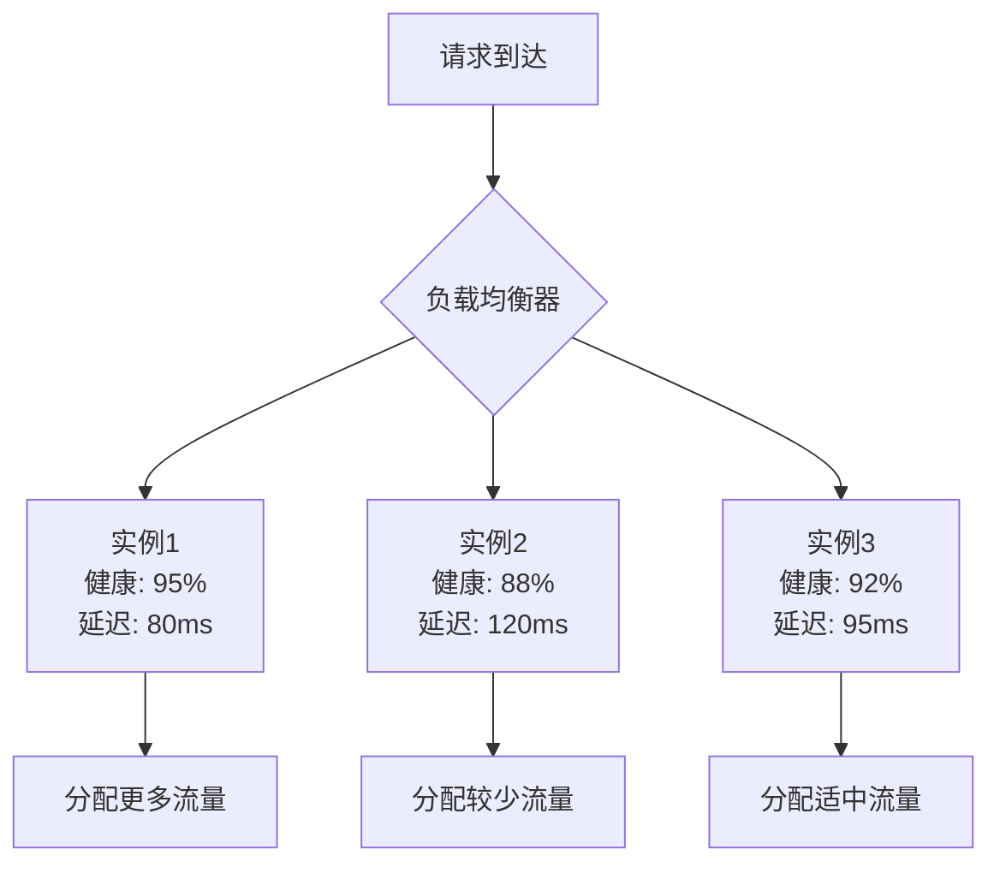
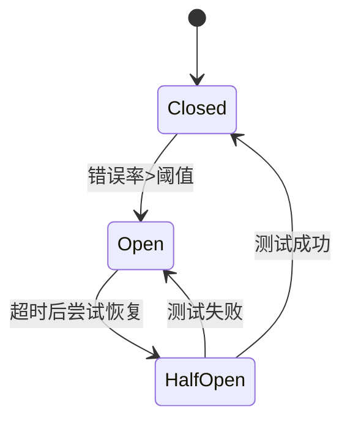

# MCP服务管理

<cite>
**本文档引用文件**
- [智言万象.vue](file://pages/智言万象.vue)
- [agent.vue](file://pages/agent.vue)
- [ProductFeatures.vue](file://components/landing/ProductFeatures.vue)
- [ProductDesign.vue](file://components/landing/ProductDesign.vue)
- [1.start.md](file://content/docs/introduction/1.start.md)
- [1.md](file://content/blog/1.md)
</cite>

## 目录
1. [引言](#引言)
2. [MCP服务概述](#mcp服务概述)
3. [服务注册与发现机制](#服务注册与发现机制)
4. [健康检查与负载均衡策略](#健康检查与负载均衡策略)
5. [熔断降级与故障转移](#熔断降级与故障转移)
6. [MCP调用与模型管理](#mcp调用与模型管理)
7. [监控与日志方案](#监控与日志方案)
8. [总结](#总结)

## 引言

智言AI（智言万象）是一款面向AI开发者、AI创业者和先进组织打造的企业级开源智能体搭建平台。该平台支持通过可视化配置界面零代码搭建具备智能体、MCP、知识库、工作流、大模型聚合等原生AI能力的应用。本文档旨在全面记录MCP服务的运行时管理机制，包括服务注册与发现流程、健康检查策略、负载均衡算法和熔断降级实现。

**Section sources**
- [智言万象.vue](file://pages/智言万象.vue#L717-L766)
- [1.start.md](file://content/docs/introduction/1.start.md#L14-L15)

## MCP服务概述

MCP（Model Context Protocol）是智言AI平台中实现模型与数据无缝连接的核心协议。通过标准化的接口协议，智能体能够安全、高效地访问本地文件、数据库及第三方API服务。MCP服务支持以SSE（Server-Sent Events）和StreamableHTTP方式调用MCP工具，为AI应用提供强大的上下文处理能力。

**Diagram sources**
- [agent.vue](file://pages/agent.vue#L351-L357)
- [智言万象.vue](file://pages/智言万象.vue#L740-L744)

**Section sources**
- [agent.vue](file://pages/agent.vue#L351-L357)
- [智言万象.vue](file://pages/智言万象.vue#L740-L744)

## 服务注册与发现机制

智言AI平台通过配置文件或API实现MCP工具的动态注册。系统支持在运行时通过API接口注册新的MCP工具，同时也支持通过配置文件静态定义工具集合。服务发现机制基于平台内置的服务目录，客户端可通过查询服务目录获取可用的MCP工具列表及其访问端点。

服务注册支持两种方式：
1. 配置文件注册：在系统配置文件中定义MCP工具的元数据和访问信息
2. API动态注册：通过REST API在运行时注册新的MCP工具实例

**Diagram sources**
- [1.start.md](file://content/docs/introduction/1.start.md#L59-L60)
- [1.md](file://content/blog/1.md#L59-L60)

**Section sources**
- [1.start.md](file://content/docs/introduction/1.start.md#L59-L60)
- [1.md](file://content/blog/1.md#L59-L60)

## 健康检查与负载均衡策略

MCP服务实现了完善的健康检查机制，通过定期探测服务端点的可用性来维护服务实例的健康状态。健康检查采用多级探测策略，包括：
- 心跳检测：定期发送轻量级探测请求
- 功能检测：验证核心功能的可用性
- 性能检测：评估服务响应时间和资源使用情况

负载均衡算法基于响应时间和当前负载动态分配请求。系统采用加权轮询算法，根据服务实例的健康评分和性能指标分配流量，确保高可用性和高性能。

**Diagram sources**
- [ProductFeatures.vue](file://components/landing/ProductFeatures.vue#L129)
- [ProductDesign.vue](file://components/landing/ProductDesign.vue#L18)

**Section sources**
- [ProductFeatures.vue](file://components/landing/ProductFeatures.vue#L129)
- [ProductDesign.vue](file://components/landing/ProductDesign.vue#L18)

## 熔断降级与故障转移

MCP服务实现了基于响应时间和服务状态的自动故障转移策略。当检测到服务实例异常时，系统会自动触发熔断机制，暂时隔离故障实例，防止故障扩散。熔断器采用三态模型：关闭、打开和半开状态，确保服务的稳定性和可靠性。

故障转移策略包括：
1. 主备切换：自动将流量转移到备用实例
2. 服务降级：在必要时提供简化版服务功能
3. 缓存回退：使用缓存数据替代实时数据

**Diagram sources**
- [1.start.md](file://content/docs/introduction/1.start.md#L59-L60)
- [content\update\2510.md](file://content/update/2510.md#L49)

**Section sources**
- [1.start.md](file://content/docs/introduction/1.start.md#L59-L60)
- [content\update\2510.md](file://content/update/2510.md#L49)

## MCP调用与模型管理

智言AI平台的模型管理功能支持主流大模型集成和统一API规范。用户可以通过"模型管理"功能集成各种大语言模型，并通过"MCP调用"功能以SSE或StreamableHTTP方式调用MCP工具。这种设计实现了模型与工具的解耦，提高了系统的灵活性和可扩展性。

MCP调用流程包括：
1. 客户端发起MCP调用请求
2. 网关验证请求权限和参数
3. 路由到相应的MCP服务实例
4. 执行工具功能并返回结果
5. 记录调用日志和指标

**Section sources**
- [智言万象.vue](file://pages/智言万象.vue#L740-L749)
- [ProductDesign.vue](file://components/landing/ProductDesign.vue#L18)

## 监控与日志方案

智言AI平台提供了完善的监控和日志采集方案。系统通过Prometheus暴露详细的运行时指标，包括：
- 服务调用次数和成功率
- 响应时间分布
- 系统资源使用情况
- 熔断器状态

日志采集系统收集MCP服务的运行日志，支持按服务、实例和时间范围进行查询和分析。所有日志和指标都可用于故障排查和性能优化。

**Section sources**
- [1.start.md](file://content/docs/introduction/1.start.md#L59-L60)
- [1.md](file://content/blog/1.md#L59-L60)

## 总结

智言AI平台的MCP服务管理机制为AI应用提供了稳定、可靠的基础支撑。通过完善的服务注册与发现、健康检查、负载均衡、熔断降级和故障转移机制，确保了MCP服务的高可用性和高性能。同时，基于Prometheus的监控和日志采集方案为系统运维提供了有力支持。这些特性共同构成了智言AI作为企业级开源智能体搭建平台的核心竞争力。
