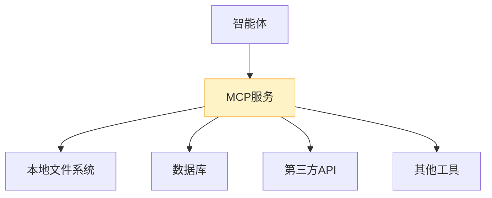

# MCP服务运行时

<cite>
**本文档引用文件**  
- [ProductFeatures.vue](file://components/landing/ProductFeatures.vue)
- [agent.vue](file://pages/agent.vue)
- [buidai.vue](file://pages/buidai.vue)
- [11.manual-installation.md](file://content/docs/introduction/11.manual-installation.md)
</cite>

## 目录
1. [引言](#引言)
2. [MCP服务概述](#mcp服务概述)
3. [调用模式实现](#调用模式实现)
4. [快速集成特性](#快速集成特性)
5. [服务治理机制](#服务治理机制)
6. [服务管理操作指南](#服务管理操作指南)
7. [结论](#结论)

## 引言
本文档详细记录buidai平台的MCP（Model Control Protocol）服务运行时环境。MCP服务作为AI模型与外部工具间的标准化接口，为智能体提供了安全、高效的资源访问能力。文档将深入解析其核心功能、调用模式、集成特性及服务治理机制，并提供完整的运维操作指南。

## MCP服务概述

MCP服务是buidai平台的核心协议标准，全称为Model Context Protocol（模型上下文协议）。它实现了模型与数据的无缝连接，为智能体提供了一个标准化的接口来安全、高效地访问本地文件、数据库及第三方API服务。

该服务在平台中扮演着关键角色，作为AI模型与外部世界交互的桥梁，使得智能体能够突破传统模型的封闭性，具备调用工具、读取文件、执行数据库操作等扩展能力，从而实现更复杂的任务自动化。

**Section sources**
- [agent.vue](file://pages/agent.vue#L351-L357)
- [buidai.vue](file://pages/buidai.vue#L739-L744)

## 调用模式实现

MCP服务支持两种主要的调用模式：SSE（Server-Sent Events）和StreamableHTTP，以满足不同场景下的流式数据传输需求。

**SSE（Server-Sent Events）模式**：该模式适用于服务器向客户端单向推送实时数据的场景。客户端通过建立一个持久的HTTP连接，服务器可以持续不断地将事件流推送给客户端，特别适合需要实时更新的AI对话或任务执行状态反馈。

**StreamableHTTP模式**：这是一种可流式的HTTP调用方式，允许在HTTP请求和响应过程中实现数据的分块传输。它结合了传统HTTP的通用性和流式传输的高效性，使得大模型在处理长文本生成或大数据量交互时能够实现边生成边传输，有效降低延迟并提升用户体验。

这两种模式共同构成了MCP服务灵活的通信基础，确保了AI应用在不同网络环境和业务需求下的稳定性和响应速度。

**Section sources**
- [buidai.vue](file://pages/buidai.vue#L740-L744)

## 快速集成特性

MCP服务的快速集成特性通过ProductFeatures.vue中的'Zap'图标进行直观展示。'Zap'图标象征着速度与能量，代表了MCP服务即插即用、快速赋能的特性。

在ProductFeatures.vue组件中，'MCP服务'功能项明确使用了`Icons.Zap`作为其视觉标识，其颜色配置为`bg-yellow-50`和`text-yellow-600`，在视觉上形成鲜明的警示和活力感，强调其作为平台核心加速器的地位。

这一设计不仅体现了MCP服务在平台功能矩阵中的重要性，也向用户传达了其“闪电般”快速集成和启用的特性，开发者可以像连接电源一样，迅速为智能体接入强大的外部工具能力，极大地降低了AI应用开发的复杂度。

**Diagram sources**
- [ProductFeatures.vue](file://components/landing/ProductFeatures.vue#L110-L130)

**Section sources**
- [ProductFeatures.vue](file://components/landing/ProductFeatures.vue#L110-L130)

## 服务治理机制

MCP服务运行时环境集成了完善的服务治理机制，确保服务的高可用性和稳定性。

**服务发现**：系统通过内置的服务注册与发现机制，动态管理MCP服务实例。当新的MCP工具被部署或现有实例发生变更时，服务注册中心会实时更新服务列表，确保智能体总能获取到最新的可用服务地址。

**负载均衡**：对于可水平扩展的MCP服务实例，系统采用负载均衡策略分发请求。通过轮询或基于权重的算法，将来自智能体的调用请求均匀分配到各个服务节点，避免单点过载，提升整体吞吐量和响应速度。

**熔断降级**：为防止故障扩散，MCP服务集成了熔断降级机制。当某个外部工具服务出现持续性故障或响应超时时，熔断器会自动触发，暂时切断对该服务的调用，并返回预设的降级响应（如默认值或缓存数据），保障智能体核心流程的正常运行，待服务恢复后再自动恢复调用。

这些机制共同构成了MCP服务的韧性保障体系，使其能够在复杂的生产环境中稳定运行。

## 服务管理操作指南

本节提供MCP服务注册、健康检查和性能监控的完整操作指南。

### 服务注册
1.  确保MCP服务实例已部署并运行。
2.  访问buidai平台管理后台，进入“插件”或“工具管理”页面。
3.  点击“注册新服务”，填写服务名称、描述、访问端点（Endpoint）和认证信息。
4.  选择服务支持的调用模式（SSE或StreamableHTTP）。
5.  提交注册，系统将自动将其纳入服务发现列表。

### 健康检查
-   **自动检查**：平台会定期向注册的MCP服务发送健康检查请求（如HTTP GET /health），根据响应状态码判断服务健康状况。
-   **手动检查**：在管理后台的服务列表中，可手动触发健康检查，实时查看服务状态。
-   **配置**：健康检查的频率和超时时间可在`11.manual-installation.md`等配置文件中进行调整。

### 性能监控
-   **指标收集**：监控系统会收集MCP服务的关键性能指标，包括请求延迟、吞吐量、错误率和资源使用率。
-   **可视化**：通过平台内置的监控面板，以图表形式展示各项指标的历史趋势和实时状态。
-   **告警**：可设置阈值告警，当延迟过高或错误率突增时，通过邮件或消息通知管理员。

**Section sources**
- [11.manual-installation.md](file://content/docs/introduction/11.manual-installation.md#L90-L237)

## 结论
MCP服务是buidai平台实现AI智能体能力扩展的核心基础设施。通过标准化的Model Context Protocol，它成功地将AI模型与丰富的外部工具生态连接起来。其支持的SSE和StreamableHTTP调用模式确保了高效的数据流传输，'Zap'图标所代表的快速集成特性极大地提升了开发效率。结合服务发现、负载均衡和熔断降级等治理机制，MCP服务为构建稳定、可靠的AI应用提供了坚实的运行时保障。遵循本文档的操作指南，可以有效管理和维护MCP服务，确保其在生产环境中的最佳性能。