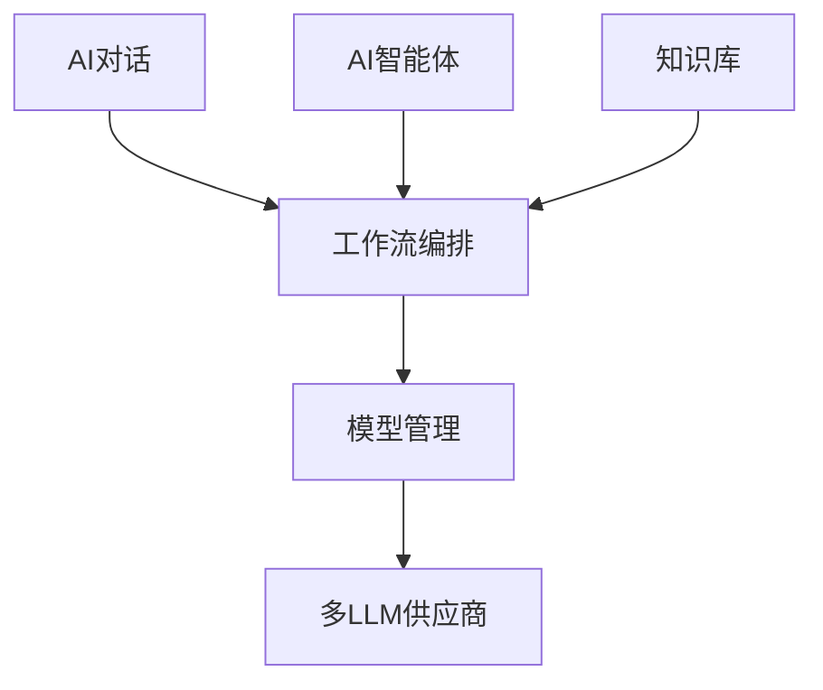
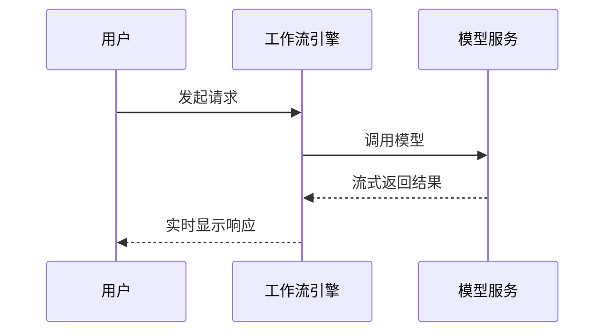
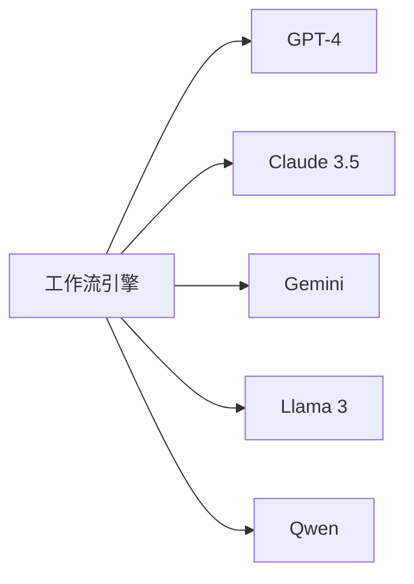

# 工作流与本地模型推理集成

<cite>
**本文档引用文件**
- [buidai.vue](file://pages/buidai.vue)
- [agent.vue](file://pages/agent.vue)
</cite>

## 目录
1. [介绍](#介绍)
2. [核心功能模块](#核心功能模块)
3. [模型调用接口规范](#模型调用接口规范)
4. [工作流节点封装机制](#工作流节点封装机制)
5. [流式响应处理](#流式响应处理)
6. [性能优化策略](#性能优化策略)
7. [错误处理与重试机制](#错误处理与重试机制)
8. [多LLM供应商接入](#多llm供应商接入)
9. [上下文管理](#上下文管理)
10. [安全与认证](#安全与认证)

## 介绍
必创AI平台提供了一套完整的AI应用开发解决方案，通过可视化工作流编排、知识库构建和多模型管理等功能，帮助开发者轻松构建强大的AI应用。平台支持私有化部署，确保数据安全，并提供企业级AI基础设施，助力业务数智化升级。

**Section sources**
- [buidai.vue](file://pages/buidai.vue#L30-L36)
- [buidai.vue](file://pages/buidai.vue#L463-L468)

## 核心功能模块
平台的核心功能包括AI对话、AI智能体、知识库、MCP调用、模型管理和拓展机制。这些功能模块通过可视化工作流进行编排，实现复杂的业务逻辑。

**Diagram sources**
- [buidai.vue](file://pages/buidai.vue#L720-L763)

**Section sources**
- [buidai.vue](file://pages/buidai.vue#L717-L766)

## 模型调用接口规范
平台支持主流商业模型（如GPT-4、Claude 3.5、Gemini）和开源模型（如Llama 3、Qwen、ChatGLM）。通过统一的API规范，实现对不同模型的集成和调用。

### 请求/响应数据结构
模型调用采用标准化的请求/响应格式，包含模型参数、输入文本和生成配置等信息。平台提供灵活的参数配置，满足不同场景的需求。

**Section sources**
- [buidai.vue](file://pages/buidai.vue#L983-L985)
- [agent.vue](file://pages/agent.vue#L333-L335)

## 工作流节点封装机制
工作流引擎通过节点化的方式封装模型调用逻辑。每个节点代表一个独立的功能单元，如模型调用、知识库查询或工具使用。节点之间通过数据流连接，形成完整的业务流程。

### AI智能体节点
AI智能体节点支持记忆、目标和工具使用能力，可实现自主任务执行。通过拖拽式界面，用户可以轻松构建复杂的智能体应用。

**Section sources**
- [buidai.vue](file://pages/buidai.vue#L727-L732)
- [agent.vue](file://pages/agent.vue#L347-L349)

## 流式响应处理
平台支持SSE（Server-Sent Events）和StreamableHTTP方式调用MCP工具，实现流式响应处理。用户可以实时获取模型生成的内容，提升交互体验。

**Diagram sources**
- [buidai.vue](file://pages/buidai.vue#L740-L744)

**Section sources**
- [buidai.vue](file://pages/buidai.vue#L740-L744)

## 性能优化策略
为提升系统性能，平台采用了连接池管理、并发控制和缓存策略等优化措施。这些策略有效降低了模型调用的延迟，提高了系统的吞吐量。

### 连接池管理
通过连接池复用网络连接，减少建立和断开连接的开销，提高资源利用率。

### 缓存策略
对频繁访问的数据进行缓存，减少重复计算，加快响应速度。

**Section sources**
- [buidai.vue](file://pages/buidai.vue#L983-L985)

## 错误处理与重试机制
平台实现了完善的错误处理和重试机制。当模型调用失败时，系统会自动进行重试，并根据错误类型采取相应的恢复策略。

### 超时控制
设置合理的超时时间，防止请求长时间挂起，影响系统稳定性。

**Section sources**
- [buidai.vue](file://pages/buidai.vue#L1036-L1045)

## 多LLM供应商接入
平台支持多种LLM供应商的统一接入，用户可以根据业务需求灵活切换不同的底层模型。这种设计提高了系统的灵活性和可扩展性。

**Diagram sources**
- [buidai.vue](file://pages/buidai.vue#L1113-L1115)
- [agent.vue](file://pages/agent.vue#L449-L451)

**Section sources**
- [buidai.vue](file://pages/buidai.vue#L1113-L1115)
- [agent.vue](file://pages/agent.vue#L449-L451)

## 上下文管理
平台通过RAF知识库和RAG增强生成技术，实现高效的上下文管理。支持PDF、Word、Markdown等多种格式文档导入，自动分段与向量化，确保AI能够理解业务上下文。

**Section sources**
- [buidai.vue](file://pages/buidai.vue#L733-L738)
- [agent.vue](file://pages/agent.vue#L340-L342)

## 安全与认证
平台支持私有化部署，数据完全存储在用户自己的服务器中。通过RBAC权限体系和多级权限审计，确保数据安全，满足企业级安全需求。

**Section sources**
- [buidai.vue](file://pages/buidai.vue#L1109-L1111)
- [agent.vue](file://pages/agent.vue#L445-L447)
