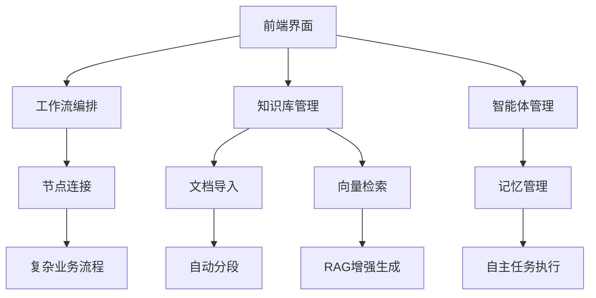
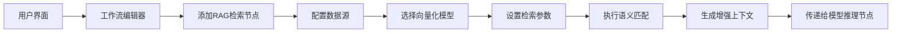
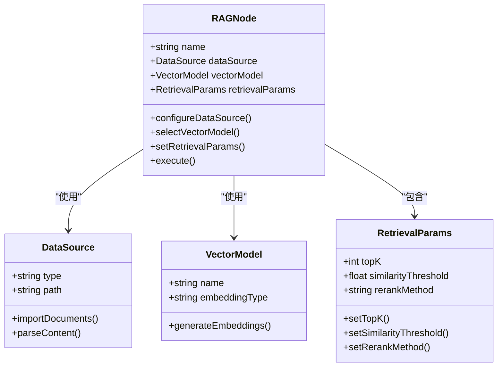
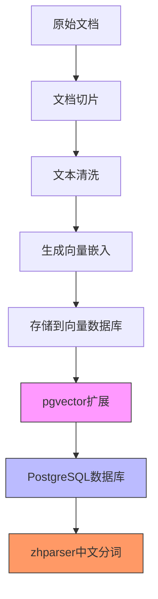
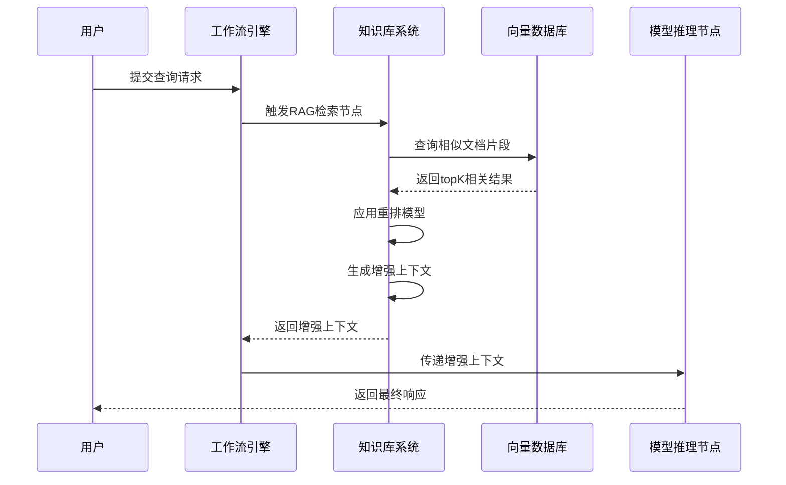
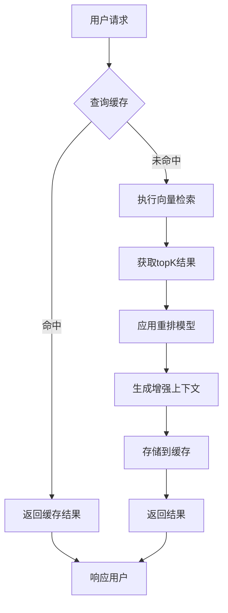
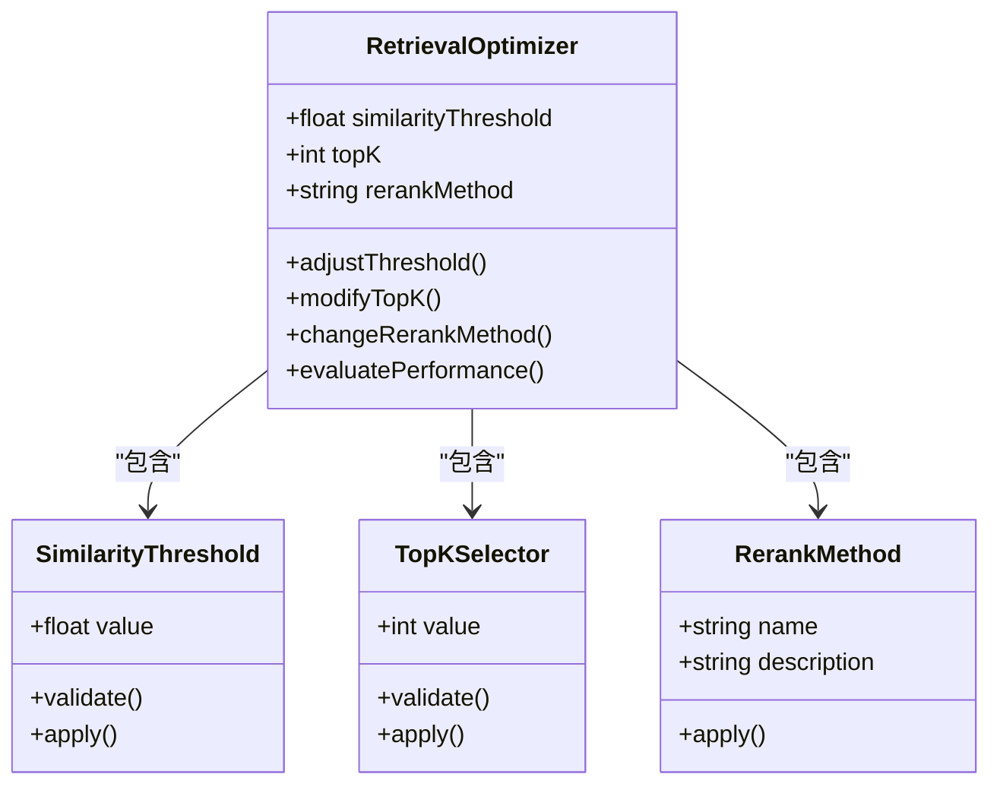
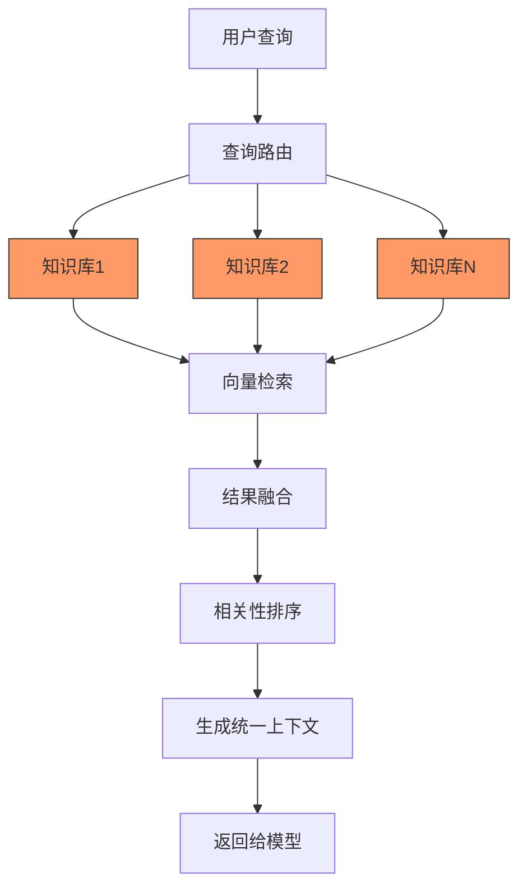

# 工作流与知识库模块集成

<cite>
**本文档引用文件**  
- [AIArsenal.vue](file://components/landing/AIArsenal.vue)
- [智言万象.vue](file://pages/智言万象.vue)
- [agent.vue](file://pages/agent.vue)
- [ProductFeatures.vue](file://components/landing/ProductFeatures.vue)
- [ValueProps.vue](file://components/landing/ValueProps.vue)
- [AIIndustry.vue](file://components/AIIndustry.vue)
- [1.bt.md](file://content/docs/introduction/1.bt.md)
</cite>

## 目录
1. [项目结构与核心功能](#项目结构与核心功能)
2. [工作流与知识库集成方案](#工作流与知识库集成方案)
3. [RAG检索节点嵌入与执行](#rag检索节点嵌入与执行)
4. [数据流分析与技术实现](#数据流分析与技术实现)
5. [缓存策略与检索优化](#缓存策略与检索优化)
6. [多知识库联合查询支持](#多知识库联合查询支持)

## 项目结构与核心功能

通过对项目结构和关键文件的分析，可以确定该平台的核心功能围绕AI智能体、知识库、工作流编排和模型管理展开。项目采用Nuxt 3 + Vue 3技术栈，提供了企业级AI应用开发的完整解决方案。

**图表来源**  
- [AIArsenal.vue](file://components/landing/AIArsenal.vue#L98-L106)
- [智言万象.vue](file://pages/智言万象.vue#L720-L763)

**本节来源**  
- [AIArsenal.vue](file://components/landing/AIArsenal.vue#L1-L129)
- [智言万象.vue](file://pages/智言万象.vue#L1-L800)

## 工作流与知识库集成方案

平台通过可视化工作流编排引擎实现了知识库功能的深度集成。在`components/landing/AIArsenal.vue`中明确列出了"知识库 (Knowledge Base)"作为核心功能之一，与"工作流 (Workflow)"并列展示，表明两者是平台的重要组成部分。

**图表来源**  
- [智言万象.vue](file://pages/智言万象.vue#L35)
- [agent.vue](file://pages/agent.vue#L348)

**本节来源**  
- [AIArsenal.vue](file://components/landing/AIArsenal.vue#L103-L104)
- [智言万象.vue](file://pages/智言万象.vue#L35)

## RAG检索节点嵌入与执行

RAG（检索增强生成）检索节点的嵌入是工作流系统的关键特性。在`pages/智言万象.vue`中，平台明确提出了"创新 RAG 检索"的概念，并将其与"可视化 Workflow 编排"和"超易用 AI 知识库"并列作为核心卖点。

### RAG检索节点配置

RAG检索节点的配置主要包括数据源、向量化模型和检索参数三个部分：

**图表来源**  
- [智言万象.vue](file://pages/智言万象.vue#L35)
- [1.bt.md](file://content/docs/introduction/1.bt.md#L200-L207)

**本节来源**  
- [智言万象.vue](file://pages/智言万象.vue#L35)
- [1.bt.md](file://content/docs/introduction/1.bt.md#L200-L238)

## 数据流分析与技术实现

基于`pages/智言万象.vue`中的实际应用场景，我们可以分析端到端的数据流，包括文档切片、向量存储查询、相关性排序和结果注入等环节的技术实现。

### 文档处理与向量化

平台支持多种格式文档的导入和处理，包括PDF、Word、Markdown等。在`components/AIIndustry.vue`中提到了"PDF解析工具"和"文档问答"功能，表明系统具备强大的文档处理能力。

**图表来源**  
- [AIIndustry.vue](file://components/AIIndustry.vue#L187)
- [1.bt.md](file://content/docs/introduction/1.bt.md#L200-L238)

### 运行时语义匹配流程

运行时的语义匹配流程涉及用户输入、知识库内容匹配、上下文生成和结果传递等多个步骤：

**图表来源**  
- [智言万象.vue](file://pages/智言万象.vue#L35)
- [agent.vue](file://pages/agent.vue#L341)

**本节来源**  
- [智言万象.vue](file://pages/智言万象.vue#L35)
- [agent.vue](file://pages/agent.vue#L340-L342)
- [1.bt.md](file://content/docs/introduction/1.bt.md#L200-L238)

## 缓存策略与检索优化

平台通过多种技术手段实现高效的缓存策略和检索精度调优。在`content/docs/introduction/1.bt.md`中提到了使用`pgvector`扩展实现向量搜索，以及`zhparser`用于中文分词，这些技术为高效的RAG检索提供了基础支持。

### 缓存策略

系统采用多层缓存策略来提高检索效率：

**图表来源**  
- [1.bt.md](file://content/docs/introduction/1.bt.md#L200-L238)
- [智言万象.vue](file://pages/智言万象.vue#L35)

### 检索精度调优

检索精度通过多种参数进行调优，包括相似度阈值、topK值和重排方法等：

**图表来源**  
- [智言万象.vue](file://pages/智言万象.vue#L35)
- [agent.vue](file://pages/agent.vue#L341)

**本节来源**  
- [1.bt.md](file://content/docs/introduction/1.bt.md#L200-L238)
- [智言万象.vue](file://pages/智言万象.vue#L35)

## 多知识库联合查询支持

平台支持多知识库的联合查询能力，这在企业级应用中尤为重要。通过`components/landing/ValueProps.vue`中的描述，系统能够"构建高精度企业知识库"，并支持多种文档格式的导入，暗示了对多个知识库的管理能力。

**图表来源**  
- [ValueProps.vue](file://components/landing/ValueProps.vue#L40-L42)
- [AIIndustry.vue](file://components/AIIndustry.vue#L182-L189)

**本节来源**  
- [ValueProps.vue](file://components/landing/ValueProps.vue#L40-L42)
- [AIIndustry.vue](file://components/AIIndustry.vue#L182-L189)