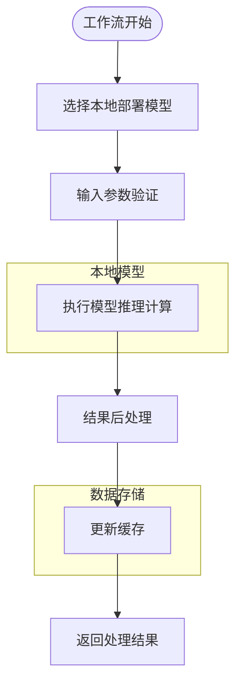
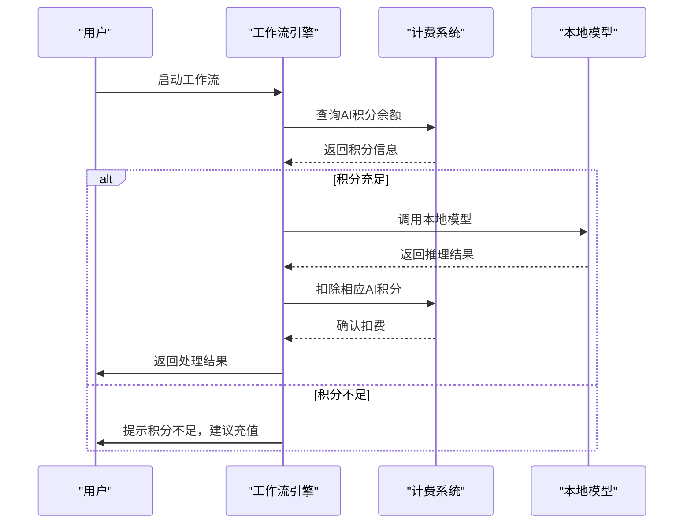
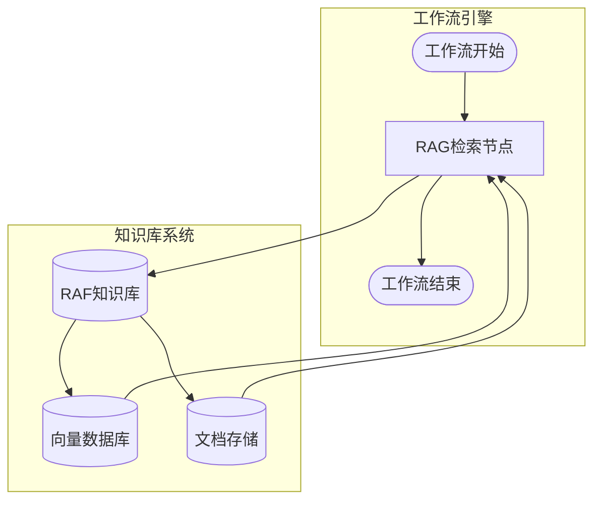
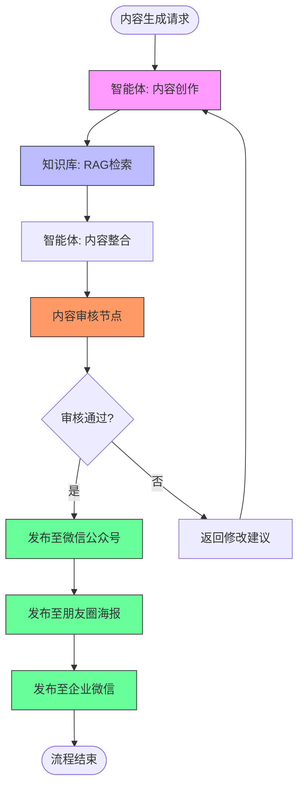

# 工作流与系统集成

<cite>
**本文档引用文件**   
- [AIArsenal.vue](file://components/landing/AIArsenal.vue)
- [agent.vue](file://pages/agent.vue)
- [pricing.vue](file://pages/pricing.vue)
- [ProductFeatures.vue](file://components/landing/ProductFeatures.vue)
- [智言万象.vue](file://pages/智言万象.vue)
</cite>

## 目录
1. [集成概述](#集成概述)
2. [工作流与本地模型集成](#工作流与本地模型集成)
3. [计费系统联动机制](#计费系统联动机制)
4. [知识库模块深度集成](#知识库模块深度集成)
5. [端到端应用示例](#端到端应用示例)

## 集成概述

智言万象平台通过工作流系统实现了与多个核心模块的深度集成，构建了一个完整的AI应用生态系统。工作流系统作为核心编排引擎，连接了智能体、知识库、本地模型和计费系统等关键组件，实现了从内容生成到审核发布的完整业务流程自动化。

平台在用户注册、会员订阅、算力充值、支付计费等方面实现了完整的商业能力闭环，无需重复开发，加速了最小可行智能体产品的落地。通过可视化工作流编排界面，用户可以像搭积木一样拖拽组件，构建功能强大的AI应用，极大降低了开发门槛。

**Section sources**
- [ProductDesign.vue](file://components/landing/ProductDesign.vue#L17-L39)
- [agent.vue](file://pages/agent.vue#L18-L358)

## 工作流与本地模型集成

工作流系统通过可视化编排引擎实现了与本地部署模型的无缝集成。用户可以通过拖拽方式将大模型、插件、知识库等组件连接起来，构建复杂的业务流程。平台支持主流的商业模型（如GPT-4、Claude 3.5、Gemini）以及开源模型（如Llama 3、Qwen、ChatGLM），并支持本地模型接入。

工作流编排引擎全面支持Model Context Protocol (MCP)，实现模型与数据的无缝连接。标准化的接口协议让智能体能够安全、高效地访问本地文件、数据库及第三方API服务。通过HTTP节点直连外部系统，如海关系统，实现了业务流程的自动化处理。

**Diagram sources **
- [agent.vue](file://pages/agent.vue#L347-L349)
- [ProductFeatures.vue](file://components/landing/ProductFeatures.vue#L128)

**Section sources**
- [agent.vue](file://pages/agent.vue#L347-L349)
- [ProductFeatures.vue](file://components/landing/ProductFeatures.vue#L128)

## 计费系统联动机制

工作流系统与计费系统实现了深度联动，形成了按执行次数/时长计费的商业模式。平台通过AI积分机制对模型调用进行计费，每次调用AI模型时会消耗相应的AI积分。系统优先采用模型厂商的高级Token计费方式，其中Token=0.75中文汉字=0.9英文单词。

计费系统提供了多种订阅方案，包括基础版、标准版、专业版和私有部署版，满足不同规模企业的需求。各版本在工作流数量、AI积分、知识库容量等方面有不同的限制：

| 版本 | 工作流数量 | AI积分 | 知识库文件容量 | 知识库条数 |
|------|------------|--------|----------------|------------|
| 基础版 | 2个 | 每日签到 | 100M | 2,000条 |
| 标准版 | 6个 | 36万 | 500M | 20,000条 |
| 专业版 | 15个 | 100万 | 3G | 100,000条 |
| 私有部署 | 可支持私有化部署 | 专业版所有权益 | 自定义企业LOGO | 自定义企业应用广场 |

用户可以选择按月或按年付费，按年付费可享受25%的优惠。计费系统还支持算力套餐、会员管理、支付功能等商业闭环能力，开箱即用。

**Diagram sources **
- [pricing.vue](file://pages/pricing.vue#L41-L177)
- [智言万象.vue](file://pages/智言万象.vue#L757-L758)

**Section sources**
- [pricing.vue](file://pages/pricing.vue#L41-L177)
- [智言万象.vue](file://pages/智言万象.vue#L757-L758)

## 知识库模块深度集成

工作流系统与知识库模块实现了深度集成，支持在工作流中嵌入RAG（检索增强生成）检索节点。平台构建了企业级RAF知识库，支持PDF、Word、Markdown等多种格式文档导入，自动分段与向量化，实现精准的语义检索与问答。

知识库功能在工作流中的应用包括：
- **内容审核**：通过RAG知识库阻断过期政策误用，确保内容合规性
- **信息检索**：基于企业私有数据进行精准回答，无需重新训练模型
- **权限管理**：实现部门级知识库隔离配置，支持多级权限审计
- **时效性预警**：监控文件时效性，及时提醒更新

用户评价显示，RAG知识库的应用使基层咨询准确率跃至98%，有效阻断了23次过期政策误用。通过文件时效性预警和多级权限审计，确保了企业知识管理的安全性和准确性。

**Diagram sources **
- [agent.vue](file://pages/agent.vue#L340-L342)
- [智言万象.vue](file://pages/智言万象.vue#L1059-L1061)

**Section sources**
- [agent.vue](file://pages/agent.vue#L340-L342)
- [智言万象.vue](file://pages/智言万象.vue#L1059-L1061)

## 端到端应用示例

结合AIArsenal.vue中"智能体"和"知识库"功能点，平台提供了自动内容生成+审核+发布的完整业务流程示例。该示例展示了工作流系统如何整合多个核心模块，实现端到端的自动化处理。

### 自动内容生成与发布流程

**Diagram sources **
- [AIArsenal.vue](file://components/landing/AIArsenal.vue#L98-L105)
- [AIIndustry.vue](file://components/AIIndustry.vue#L209-L217)

该流程展示了以下关键集成点：
1. **智能体内容创作**：利用大语言模型生成原始内容
2. **知识库RAG检索**：从企业知识库中检索相关信息，增强内容准确性
3. **内容审核**：基于企业政策知识库进行合规性审核
4. **多渠道发布**：一键发布至微信公众号、朋友圈海报、企业微信等多个渠道

实际应用案例显示，该流程在跨境物流集团中自动处理了87%的清关异常工单，通过HTTP节点直连海关系统，使人工干预成本下降220万元/年。在智慧政务SaaS团队中，工作流编排API无缝嵌入省公积金平台，承压每日20万笔审批流，异常自愈机制减少了80%的运维告警。

**Section sources**
- [AIArsenal.vue](file://components/landing/AIArsenal.vue#L98-L105)
- [AIIndustry.vue](file://components/AIIndustry.vue#L209-L217)
- [智言万象.vue](file://pages/智言万象.vue#L1067-L1069)