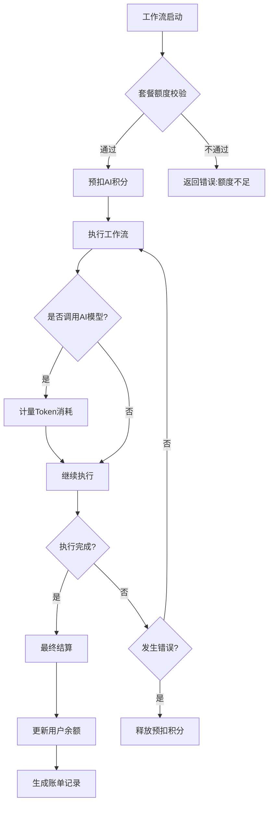

# 工作流与计费系统集成

<cite>
**本文档引用文件**
- [buidai.vue](file://pages/buidai.vue)
- [pricing.vue](file://pages/pricing.vue)
</cite>

## 目录
1. [介绍](#介绍)
2. [计费模式与套餐设计](#计费模式与套餐设计)
3. [工作流执行与计费联动机制](#工作流执行与计费联动机制)
4. [计量方式与资源消耗](#计量方式与资源消耗)
5. [计费事件触发与钩子逻辑](#计费事件触发与钩子逻辑)
6. [通信协议与结算模式](#通信协议与结算模式)
7. [业务规则实现](#业务规则实现)
8. [总结](#总结)

## 介绍
必创AI平台提供了一套完整的AI应用开发解决方案，其中工作流引擎与平台计费系统的深度集成是其核心功能之一。本文档旨在全面描述工作流执行与平台计费系统的联动机制，重点解析基于工作流的执行次数、执行时长及算力资源消耗的计量计费模型。通过分析`pages/buidai.vue`中的“充值计费”功能模块，揭示计费事件的触发条件、计量数据的采集方式以及账单生成流程。

## 计费模式与套餐设计
平台采用分级订阅制计费模式，用户可根据需求选择不同等级的套餐服务。计费周期支持按月和按年两种方式，并提供年付优惠激励。

### 套餐功能维度
计费系统围绕多个核心功能维度进行资源配额管理，主要包括：
- **AI积分**：用于调用AI模型的核心消耗单位
- **工作流**：限制用户可创建和运行的工作流数量
- **知识库容量**：包括文件总大小和条目数量限制
- **应用数量**：可创建的应用实例上限
- **插件与扩展**：自定义插件的使用权限
- **团队协作**：团队成员数量及权限管理

### 套餐等级
平台提供四个层级的订阅方案：
- **基础版**：免费使用，包含每日签到获取AI积分，支持2个工作流
- **标准版**：月付¥268/年付¥2680，提供36万AI积分，支持6个工作流
- **专业版**：月付¥998/年付¥9980，提供100万AI积分，支持15个工作流
- **私有部署版**：面向企业客户，支持定制化部署和服务

**Section sources**
- [pricing.vue](file://pages/pricing.vue#L68-L177)

## 工作流执行与计费联动机制
工作流引擎在每次执行时会与计费服务进行交互，确保资源使用在授权范围内，并准确记录消耗情况。

### 执行前校验
在工作流启动前，系统会执行以下校验流程：
1. 检查用户当前套餐是否包含足够的工作流配额
2. 验证AI积分余额是否足以支持本次执行预估消耗
3. 对于超出套餐限制的请求，提示用户升级套餐或充值

### 执行中计量
工作流执行过程中，系统实时采集以下计量数据：
- **执行次数**：每完成一次完整的工作流运行计为一次
- **执行时长**：从开始到结束的总耗时（秒）
- **节点调用次数**：各执行节点（特别是AI调用节点）的触发次数
- **Token消耗量**：实际调用大模型产生的Token数量

### 执行后结算
工作流执行完成后，系统根据实际消耗进行结算：
- 更新用户的AI积分余额
- 记录本次执行的详细日志用于对账
- 触发可能的预警机制（如余额不足提醒）

**Section sources**
- [buidai.vue](file://pages/buidai.vue#L758-L762)
- [pricing.vue](file://pages/pricing.vue#L46-L64)

## 计量方式与资源消耗
平台采用多维度复合计量方式，确保计费公平合理。

### AI积分计算标准
AI积分是平台的核心计费单位，其计算遵循以下规则：
- 优先采用模型厂商的高级Token计费方式
- 中文汉字：1 Token ≈ 0.75个汉字
- 英文单词：1 Token ≈ 0.9个单词
- 图像生成等特殊操作按固定积分扣除

### 工作流资源配额
不同套餐对工作流的支持能力不同：
- 基础版：2个工作流
- 标准版：6个工作流
- 专业版：15个工作流
- 私有部署版：无限制，按需定制

### 知识库存储计算
知识库存储按索引条数计算：
- 1条知识库存储 = 1条知识库索引
- 分块数据通常对应多条索引
- 可在知识库集合中查看“W组索引”统计

**Section sources**
- [pricing.vue](file://pages/pricing.vue#L190-L197)

## 计费事件触发与钩子逻辑
系统在关键执行节点注入计费钩子函数，实现精准计量。

### 钩子注入时机
计费钩子在以下时机被注入：
- 工作流开始执行前（预扣费或额度校验）
- AI节点调用前后（精确计量Token消耗）
- 工作流异常中断时（释放预扣资源）
- 工作流正常结束时（最终结算）

### 钩子调用流程

**Diagram sources**
- [buidai.vue](file://pages/buidai.vue#L758-L762)
- [pricing.vue](file://pages/pricing.vue#L46-L64)

## 通信协议与结算模式
工作流引擎与计费服务之间通过定义良好的API进行通信，支持同步和异步两种结算模式。

### 同步扣费模式
适用于实时性要求高的场景：
- **适用场景**：单次AI调用、短时工作流执行
- **特点**：即时扣费，操作原子性高
- **优势**：避免超额使用，保证账务一致性
- **流程**：请求→校验→扣费→执行→返回结果

### 异步结算模式
适用于长周期或批量处理场景：
- **适用场景**：长时间运行的工作流、批量任务处理
- **特点**：先执行后结算，定期对账
- **优势**：提升执行效率，减少实时依赖
- **流程**：请求→预授权→执行→生成待结算记录→定时批量结算

### 通信协议
服务间通信采用RESTful API设计：
- **端点**：`/api/billing/charge`
- **方法**：POST
- **请求体**：包含用户ID、资源类型、消耗量、时间戳等
- **响应**：包含扣费结果、剩余余额、交易ID等

## 业务规则实现
系统实现了完整的计费业务规则，确保用户体验和平台收益的平衡。

### 套餐额度校验
用户在执行工作流前，系统自动校验其当前套餐权限：
- 检查工作流数量是否超限
- 验证AI积分是否充足
- 对于企业用户，检查团队配额

### 余额不足处理
当用户积分不足时，系统提供多种处理方案：
- **临时降级**：限制非核心功能使用
- **提醒升级**：引导用户购买更高套餐
- **紧急充值**：提供快速充值通道
- **暂停执行**：阻止新的工作流启动

### 免费额度抵扣
平台为新用户提供免费额度：
- 每日签到可获得AI积分奖励
- 基础版用户享有有限的免费调用额度
- 免费额度优先于付费积分被消耗

### 套餐切换逻辑
用户升级或降级套餐时，系统采用覆盖更新逻辑：
- 新套餐立即生效
- 剩余旧套餐额度自动清除
- 提供明确的切换确认提示，防止误操作

**Section sources**
- [pricing.vue](file://pages/pricing.vue#L183-L184)

## 总结
必创AI平台通过精细化的工作流与计费系统集成，实现了灵活、透明、可扩展的商业化模式。系统基于执行次数、时长和资源消耗进行多维度计量，结合同步扣费和异步结算两种模式，既保证了账务准确性，又兼顾了执行效率。通过完善的套餐设计、额度校验和余额管理机制，为不同规模的用户提供合适的AI应用开发解决方案，同时确保平台的可持续运营。
