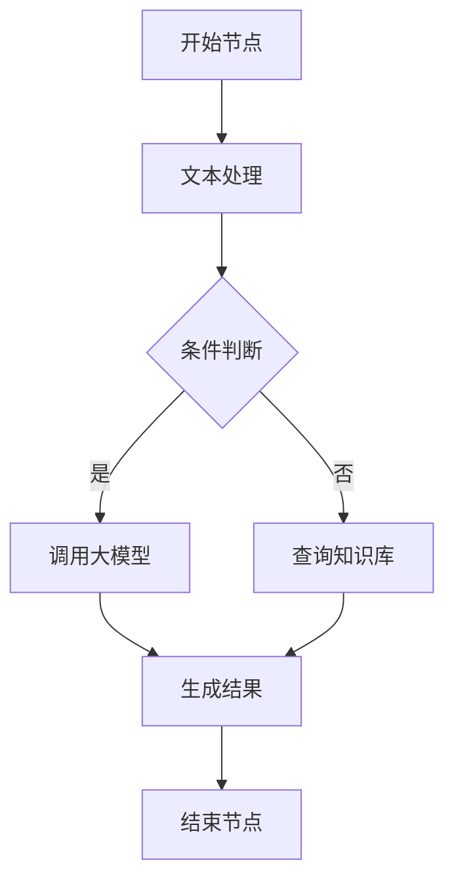
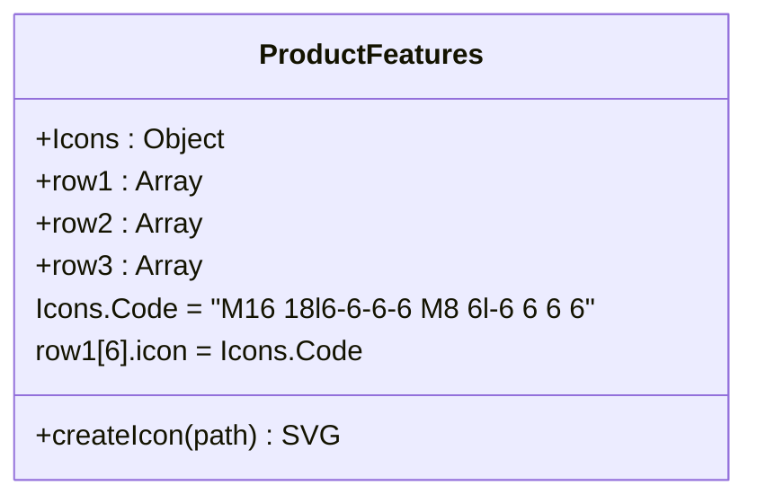

# 可视化编辑器

<cite>
**本文档引用文件**  
- [ProductFeatures.vue](file://components/landing/ProductFeatures.vue)
- [agent.vue](file://pages/agent.vue)
- [buidai.vue](file://pages/buidai.vue)
- [scene.ts](file://utils/scene.ts)
</cite>

## 目录

1. [简介](#简介)
2. [核心功能](#核心功能)
3. [可视化工作流编排](#可视化工作流编排)
4. [节点系统与参数配置](#节点系统与参数配置)
5. [代码模式切换机制](#代码模式切换机制)
6. [高级功能](#高级功能)
7. [应用场景示例](#应用场景示例)
8. [结论](#结论)

## 简介

buidai平台提供了一套完整的可视化AI工作流编辑器，旨在降低AI应用开发门槛，让非技术人员也能通过图形化界面构建复杂的智能流程。该编辑器基于拖拽式节点画布设计，支持从简单文本处理到多模型协作的复杂任务编排。通过直观的连接线数据流可视化，用户可以清晰地定义AI任务的执行逻辑与数据流转路径。

**Section sources**
- [agent.vue](file://pages/agent.vue#L1-L470)

## 核心功能

可视化工作流编辑器是buidai平台的核心功能之一，它允许用户通过拖拽组件来构建AI应用的执行流程。编辑器集成了大语言模型、知识库、插件系统等多种AI能力，用户可以通过连接不同的节点来创建复杂的业务逻辑。平台强调“开箱即用”和“可视化编排”，使得构建AI应用变得像搭积木一样简单。

编辑器支持实时预览功能，用户在构建流程的同时可以即时查看执行效果。此外，系统还提供了丰富的模板库，涵盖从智能客服到内容创作等多个领域，帮助用户快速启动项目。

**Section sources**
- [agent.vue](file://pages/agent.vue#L364-L389)
- [ProductFeatures.vue](file://components/landing/ProductFeatures.vue#L127)

## 可视化工作流编排

### 交互设计

可视化工作流编辑器采用基于画布的拖拽式交互设计。用户可以从左侧的节点库中拖拽不同类型的节点到画布上，并通过连接线将它们关联起来，形成一个完整的执行流程。画布支持缩放和平移操作，方便用户管理复杂的流程图。

节点之间的连接遵循数据流原则，输出端口只能连接到输入端口，确保了流程的逻辑正确性。当用户连接两个节点时，系统会自动验证数据类型的兼容性，并在不匹配时给出提示。

### 布局算法

编辑器内置了自动布局算法，可以根据节点间的连接关系自动调整节点位置，使整个工作流图更加清晰易读。对于手动布局的节点，系统会保留用户的自定义位置，仅对新增或未定位的节点进行自动排列。

**Diagram sources**
- [buidai.vue](file://pages/buidai.vue#L221-L286)

**Section sources**
- [buidai.vue](file://pages/buidai.vue#L221-L921)

## 节点系统与参数配置

### 节点类型系统

编辑器提供了多种预定义的节点类型，包括但不限于：
- **输入节点**：用于接收用户输入或外部数据
- **处理节点**：执行文本处理、数据转换等操作
- **AI模型节点**：调用大语言模型进行内容生成或分析
- **知识库节点**：查询RAF知识库获取信息
- **条件节点**：根据条件分支执行不同路径
- **输出节点**：返回最终结果

每种节点都有特定的输入输出端口，确保数据流的正确传递。

### 参数配置面板

每个节点都配有独立的参数配置面板，用户可以通过表单界面设置节点的具体行为。例如，在AI模型节点中，用户可以配置模型类型、温度参数、最大生成长度等。配置面板采用响应式设计，会根据节点类型动态调整显示的字段。

参数配置支持默认值和历史记录，方便用户快速复用之前的设置。所有配置项都经过类型校验，防止输入非法值。

**Section sources**
- [scene.ts](file://utils/scene.ts#L1-L122)
- [buidai.vue](file://pages/buidai.vue#L240-L257)

## 代码模式切换机制

### Code图标集成

在`ProductFeatures.vue`组件中，定义了一个名为`Code`的SVG图标，其路径数据为`M16 18l6-6-6-6 M8 6l-6 6 6 6`，呈现出典型的“</>”代码符号外观。这个图标被用于表示“工作流编排”功能，暗示了可视化与代码模式的关联。

**Diagram sources**
- [ProductFeatures.vue](file://components/landing/ProductFeatures.vue#L91-L106)

**Section sources**
- [ProductFeatures.vue](file://components/landing/ProductFeatures.vue#L91-L117)

### 切换机制说明

虽然当前代码库中未直接实现代码模式的切换功能，但`Code`图标的使用表明系统设计上预留了从可视化编辑切换到代码编辑的可能性。这种设计模式常见于低代码平台，允许高级用户在图形化界面和代码视图之间自由切换，以满足不同层次的开发需求。

未来实现该功能时，系统可能会将可视化工作流转换为JSON或YAML格式的配置文件，然后在代码模式下展示和编辑这些配置，实现双向同步。

## 高级功能

### 画布操作

编辑器支持多种画布操作，包括：
- **缩放**：通过鼠标滚轮或快捷键（Ctrl +/-）调整画布缩放比例
- **平移**：按住空格键并拖动鼠标来移动画布视图
- **框选**：拖拽选择多个节点进行批量操作

### 快捷键支持

系统提供了一系列快捷键来提高编辑效率：
- `Ctrl + Z`：撤销操作
- `Ctrl + Y`：重做操作
- `Ctrl + C/V`：复制粘贴节点
- `Delete`：删除选中节点

### 多人协作编辑

虽然当前代码库中未直接体现，但基于`prosemirror-collab`等协作编辑库的存在（见package-lock.json），平台具备实现多人实时协作编辑的潜力。未来可通过WebSocket实现实时同步，允许多个用户同时编辑同一个工作流。

**Section sources**
- [package-lock.json](file://package-lock.json#L15061-L15069)

## 应用场景示例

### 简单文本处理

用户可以创建一个简单的文本处理工作流：
1. 添加一个输入节点接收用户提问
2. 连接一个文本清洗节点去除无关字符
3. 接入大语言模型节点进行语义理解
4. 使用输出节点返回结构化答案

### 复杂多模型协作

构建一个跨模型协作的智能客服系统：
1. 用户输入问题
2. 并行调用多个大模型（如GPT-4、Claude）获取不同视角的回答
3. 使用投票机制节点整合多个回答
4. 查询企业知识库补充专业信息
5. 生成最终回复并记录到数据库

此类复杂流程充分体现了可视化编排的优势，无需编写代码即可实现高级功能。

**Section sources**
- [scene.ts](file://utils/scene.ts#L10-L121)

## 结论

buidai平台的可视化工作流编辑器通过直观的拖拽式界面，极大地降低了AI应用开发的复杂度。其核心优势在于将复杂的AI能力封装成可复用的节点，让用户能够专注于业务逻辑的设计而非技术实现细节。结合代码模式切换的设计理念，该编辑器既适合初学者快速上手，也为高级用户提供了深入定制的可能性。

随着功能的不断完善，特别是多人协作和代码模式的实现，buidai有望成为企业级AI应用开发的首选平台。