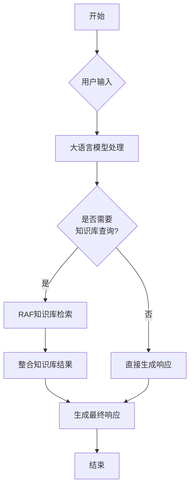

# 工作流编排引擎

<cite>
**本文档引用文件**  
- [ProductFeatures.vue](file://components/landing/ProductFeatures.vue)
- [agent.vue](file://pages/agent.vue)
- [demo.vue](file://pages/demo.vue)
- [README.md](file://README.md)
</cite>

## 目录
1. [简介](#简介)
2. [可视化节点式编排架构](#可视化节点式编排架构)
3. [数据流传递机制](#数据流传递机制)
4. [条件分支与循环控制](#条件分支与循环控制)
5. [代码集成能力](#代码集成能力)
6. [实际编排示例](#实际编排示例)
7. [可靠性设计](#可靠性设计)
8. [结论](#结论)

## 简介
buidai平台的工作流编排引擎是一个强大的可视化Workflow编排系统，允许用户通过拖拽组件的方式构建复杂的AI任务流程图。该引擎支持将大模型、插件、知识库等组件连接起来，实现从简单对话到复杂任务的自动化处理。通过直观的图形界面，用户无需编程基础即可完成AI应用的构建。

**Section sources**
- [agent.vue](file://pages/agent.vue#L344-L349)
- [ProductFeatures.vue](file://components/landing/ProductFeatures.vue#L127)

## 可视化节点式编排架构
工作流编排引擎采用基于可视化画布的节点式架构，用户可以通过拖拽不同功能的组件节点来构建AI任务流程。每个节点代表一个特定的功能模块，如大语言模型调用、知识库查询、插件执行等。节点之间通过连线表示数据流动方向和执行顺序。

系统提供了丰富的组件库，包括AI核心组件、知识管理组件、流程自动化组件和协议标准组件。用户可以根据业务需求自由组合这些组件，构建出符合实际场景的复杂工作流。整个编排过程直观易懂，大大降低了AI应用开发的技术门槛。

**Diagram sources**
- [agent.vue](file://pages/agent.vue#L344-L349)
- [ProductFeatures.vue](file://components/landing/ProductFeatures.vue#L127)

**Section sources**
- [agent.vue](file://pages/agent.vue#L344-L349)
- [ProductFeatures.vue](file://components/landing/ProductFeatures.vue#L127)

## 数据流传递机制
工作流引擎实现了高效的数据流传递机制，确保各个节点之间的信息能够准确、完整地传输。当一个节点完成处理后，其输出结果会自动作为下一个节点的输入参数进行传递。系统支持多种数据格式的转换和适配，保证了不同组件间的兼容性。

数据流的传递遵循严格的顺序控制逻辑，只有当前节点成功执行并返回有效结果时，才会触发后续节点的执行。同时，系统还提供了数据验证和过滤功能，可以在数据传递过程中进行必要的检查和处理，确保数据质量。

**Section sources**
- [agent.vue](file://pages/agent.vue#L344-L349)

## 条件分支与循环控制
工作流引擎支持复杂的条件分支和循环控制策略，使用户能够构建更加智能和灵活的任务流程。条件分支允许根据特定条件选择不同的执行路径，例如根据用户意图决定是否需要查询知识库。

循环控制则可以实现重复执行某个或某些节点，直到满足特定条件为止。这种机制特别适用于需要持续监控或迭代优化的场景。系统提供了可视化的条件设置界面，用户可以通过简单的配置来定义分支条件和循环规则。

**Section sources**
- [agent.vue](file://pages/agent.vue#L344-L349)

## 代码集成能力
在ProductFeatures.vue文件中，'Code'图标代表了工作流编排引擎的代码集成能力。通过这个功能，高级用户可以直接在工作流中嵌入自定义代码片段，实现更复杂或特定的业务逻辑。代码节点可以与其他可视化节点无缝集成，既保留了图形化编排的便利性，又提供了编程级别的灵活性。

这种混合式编排方式使得平台既能满足非技术人员的使用需求，又能为开发者提供足够的扩展空间。代码集成还支持调试和版本管理功能，确保代码质量和可维护性。

**Section sources**
- [ProductFeatures.vue](file://components/landing/ProductFeatures.vue#L106)
- [ProductFeatures.vue](file://components/landing/ProductFeatures.vue#L127)

## 实际编排示例

### 简单文本生成
最基础的应用是简单的文本生成工作流。用户输入问题后，系统调用大语言模型直接生成回答。这种流程适用于常见问题解答、内容创作等场景。

### 复杂多模型协作
更高级的应用涉及多个模型的协同工作。例如，先使用OCR模型识别图片中的文字，然后将识别结果传递给大语言模型进行理解和分析，最后通过语音合成模型输出音频结果。这种多模型协作的工作流可以解决复杂的跨模态任务。

**Section sources**
- [agent.vue](file://pages/agent.vue#L331-L357)
- [demo.vue](file://pages/demo.vue#L32-L97)

## 可靠性设计
工作流编排引擎在设计上充分考虑了可靠性需求，包含多项保障机制：

### 错误处理
系统实现了完善的错误捕获和处理机制。当某个节点执行失败时，引擎会自动记录错误信息，并根据预设策略进行处理，如重试、跳过或终止整个流程。

### 超时控制
为了避免任务长时间挂起，系统设置了合理的超时限制。当某个节点的执行时间超过设定阈值时，会自动中断并触发相应的处理逻辑。

### 状态持久化
所有工作流的执行状态都会被持久化存储，即使系统重启也不会丢失正在进行的任务。这保证了业务的连续性和数据的完整性。

**Section sources**
- [agent.vue](file://pages/agent.vue#L417-L419)
- [pricing.vue](file://pages/pricing.vue#L55)

## 结论
buidai平台的工作流编排引擎通过可视化节点式架构，为用户提供了一个强大而易用的AI任务构建工具。其灵活的数据流传递机制、完善的条件分支与循环控制策略，以及可靠的错误处理和状态持久化设计，共同构成了一个稳定高效的自动化处理平台。结合代码集成能力，该引擎既能满足普通用户的快速开发需求，又能支持专业开发者的深度定制，是实现AI应用落地的理想选择。