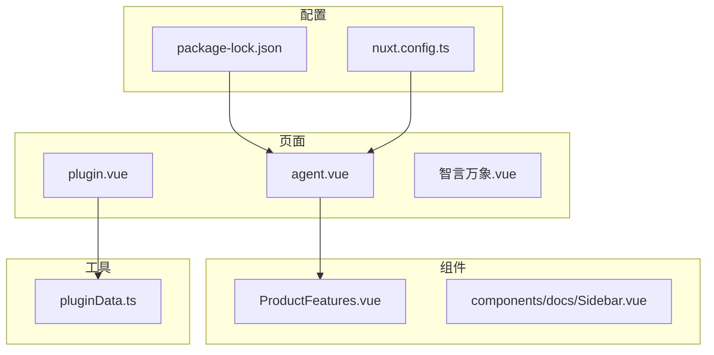
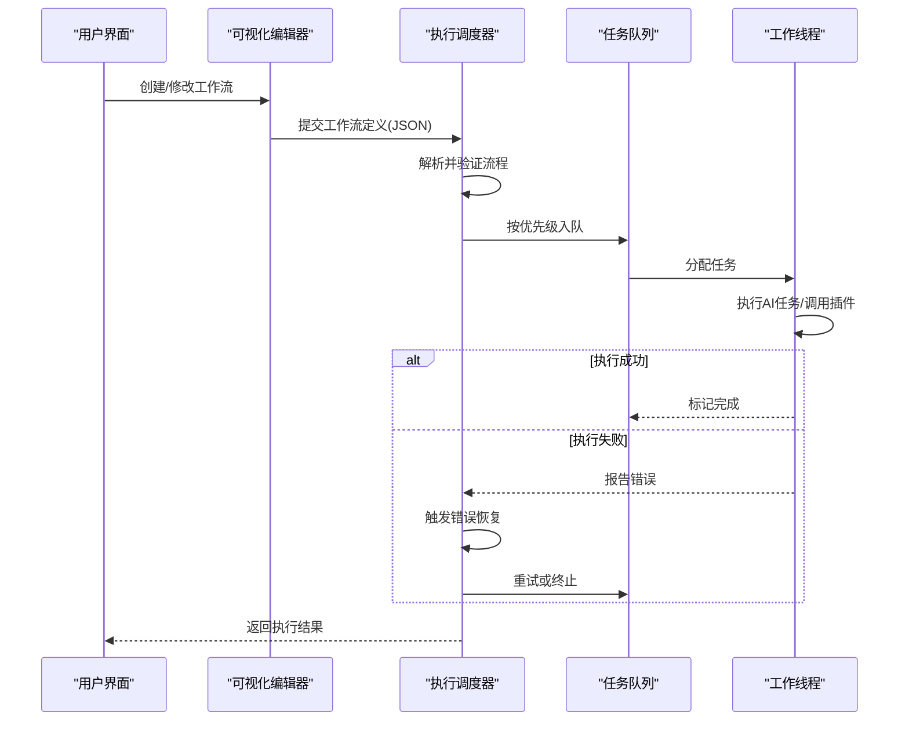
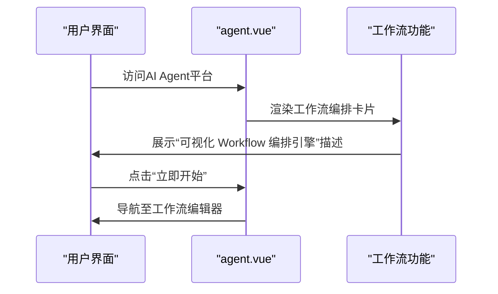
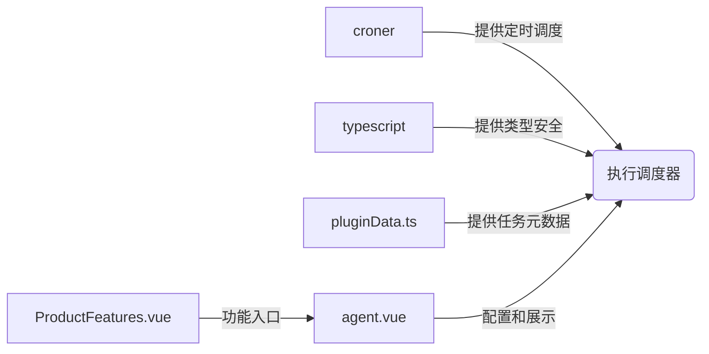

# 执行调度器

<cite>
**本文档引用文件**  
- [ProductFeatures.vue](file://components/landing/ProductFeatures.vue)
- [agent.vue](file://pages/agent.vue)
- [pluginData.ts](file://utils/pluginData.ts)
- [package-lock.json](file://package-lock.json)
</cite>

## 目录
1. [引言](#引言)
2. [项目结构](#项目结构)
3. [核心组件](#核心组件)
4. [架构概述](#架构概述)
5. [详细组件分析](#详细组件分析)
6. [依赖分析](#依赖分析)
7. [性能考量](#性能考量)
8. [故障排除指南](#故障排除指南)
9. [结论](#结论)

## 引言
本文档深入记录智言万象平台工作流执行调度器的技术实现。该调度器是平台实现AI任务自动化编排的核心引擎，负责解析可视化编辑器生成的流程图，并将其转换为可执行的指令序列。系统采用异步任务调度架构，支持复杂的条件分支判断、循环执行控制和错误恢复机制。通过集成`croner`等调度库，实现了高并发场景下的任务队列管理、并发控制、资源分配和优先级调度策略。结合`ProductFeatures.vue`中'Workflow'功能，展示了其在实际AI任务编排中的应用。

## 项目结构
项目采用基于Vue 3和Nuxt 3的现代前端架构，文件组织清晰，功能模块化。核心页面位于`pages`目录，组件按功能分类存放于`components`目录。`utils`目录包含共享工具和数据定义，`content`目录管理静态内容。`package-lock.json`显示项目依赖了`croner`（v9.1.0）用于任务调度，`typescript`（v5.9.3）提供类型支持。

**Diagram sources**
- [agent.vue](file://pages/agent.vue)
- [ProductFeatures.vue](file://components/landing/ProductFeatures.vue)
- [pluginData.ts](file://utils/pluginData.ts)
- [package-lock.json](file://package-lock.json)

**Section sources**
- [agent.vue](file://pages/agent.vue)
- [ProductFeatures.vue](file://components/landing/ProductFeatures.vue)
- [pluginData.ts](file://utils/pluginData.ts)
- [package-lock.json](file://package-lock.json)

## 核心组件
工作流执行调度器的核心功能在`agent.vue`页面中体现，该页面展示了可视化Workflow编排引擎。调度器通过拖拽方式将大模型、插件、知识库等组件连接，构建复杂业务流程。`ProductFeatures.vue`中的`Icons.Workflow`定义了工作流功能的UI图标。`pluginData.ts`中的应用数据结构（`AppData`）为调度器提供了可执行任务的元数据。

**Section sources**
- [agent.vue](file://pages/agent.vue#L1-L470)
- [ProductFeatures.vue](file://components/landing/ProductFeatures.vue#L98)
- [pluginData.ts](file://utils/pluginData.ts#L26-L36)

## 架构概述
智言万象平台的工作流执行调度器采用异步、事件驱动的微前端架构。用户在可视化编辑器中创建的流程图被序列化为JSON结构，由调度器解析并生成执行计划。任务被放入基于优先级的队列中，由工作线程异步执行。系统利用`croner`库处理定时任务，确保高并发下的稳定调度。错误恢复机制通过状态持久化和重试策略实现。

**Diagram sources**
- [agent.vue](file://pages/agent.vue)
- [pluginData.ts](file://utils/pluginData.ts)

## 详细组件分析

### 工作流编排功能分析
`ProductFeatures.vue`文件中的`Icons.Workflow`定义了工作流功能的视觉标识，`agent.vue`中的`featureCards`数据结构描述了“工作流编排”功能的核心价值：通过拖拽将大模型、插件、知识库连接，构建复杂业务流程，实现从简单对话到复杂任务的自动化处理。

#### 对于API/服务组件：

**Diagram sources**
- [agent.vue](file://pages/agent.vue#L347-L349)
- [ProductFeatures.vue](file://components/landing/ProductFeatures.vue#L98)

**Section sources**
- [agent.vue](file://pages/agent.vue#L329-L358)
- [ProductFeatures.vue](file://components/landing/ProductFeatures.vue#L91-L106)

### 调度器依赖分析
`package-lock.json`文件揭示了调度器的关键依赖。`croner`库（v9.1.0）是实现定时和周期性任务调度的核心，其`dev: true`标记表明调度功能可能在开发和生产环境均有使用。`typescript`为整个调度逻辑提供了静态类型检查，确保代码健壮性。

**Section sources**
- [package-lock.json](file://package-lock.json#L8272-L8281)
- [package-lock.json](file://package-lock.json#L17251-L17263)

## 依赖分析
项目依赖清晰，核心调度功能依赖于`croner`库。`pluginData.ts`中的`apps`数组定义了可被调度器执行的独立应用和插件，形成了任务生态。`agent.vue`通过导入`pluginData`来获取这些应用信息，实现了前端展示与后端调度任务的关联。

**Diagram sources**
- [package-lock.json](file://package-lock.json#L8272-L8281)
- [pluginData.ts](file://utils/pluginData.ts)
- [agent.vue](file://pages/agent.vue)

**Section sources**
- [package-lock.json](file://package-lock.json)
- [pluginData.ts](file://utils/pluginData.ts)
- [agent.vue](file://pages/agent.vue)

## 性能考量
虽然当前代码片段未直接暴露性能优化细节，但基于`croner`库的使用和异步架构设计，可以推断系统具备高并发处理能力。`croner`库支持微秒级精度和复杂的Cron表达式，适合处理大量定时任务。未来性能优化可考虑引入更精细的并发控制（如工作窃取算法）、资源池化（数据库连接、模型实例）和分布式调度。

## 故障排除指南
根据现有信息，工作流执行失败可能源于：
1.  **任务定义错误**：检查`agent.vue`中提交的工作流JSON结构是否有效。
2.  **依赖缺失**：确认`package-lock.json`中的`croner`等关键依赖已正确安装。
3.  **插件不可用**：验证`pluginData.ts`中引用的插件路径和状态。
4.  **资源不足**：监控系统资源，确保有足够的CPU和内存处理并发任务。

**Section sources**
- [agent.vue](file://pages/agent.vue)
- [package-lock.json](file://package-lock.json)
- [pluginData.ts](file://utils/pluginData.ts)

## 结论
智言万象平台的工作流执行调度器是一个基于异步架构和`croner`库的强大引擎。它通过解析可视化流程图，实现了AI任务的自动化编排。系统设计支持高并发、错误恢复和灵活的任务调度。未来可通过引入更先进的并发模型和分布式架构，进一步提升其性能和可靠性，满足更复杂的AI应用需求。