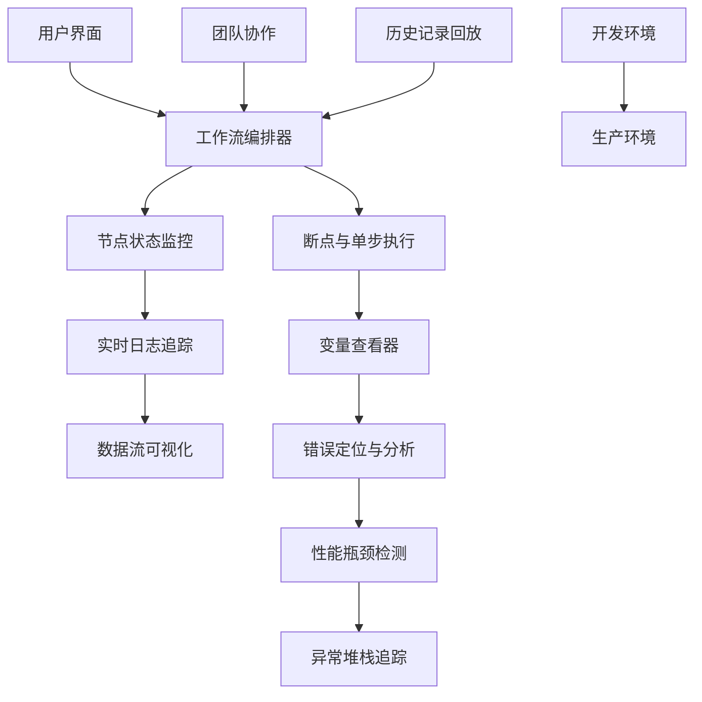
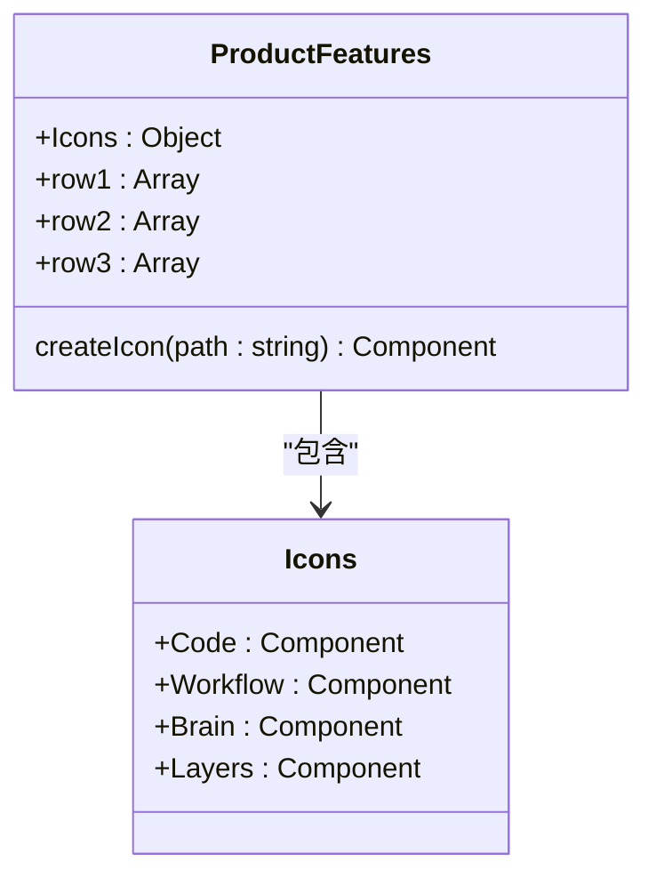
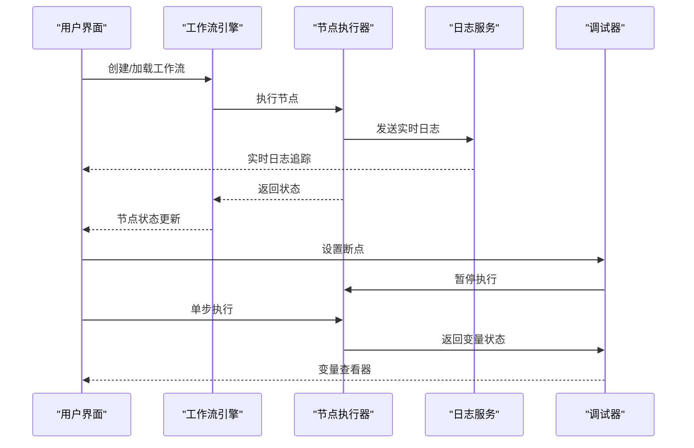
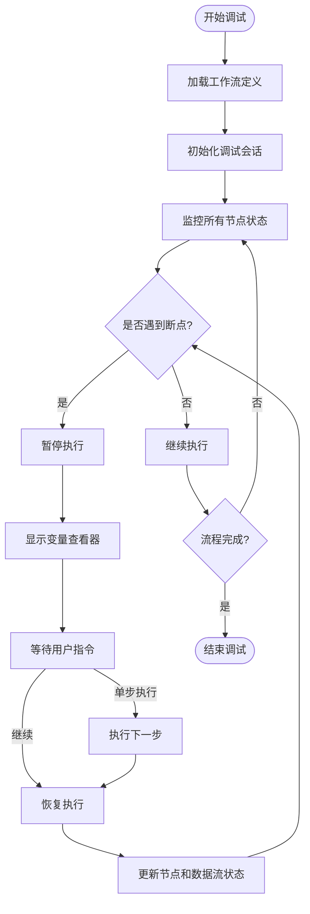
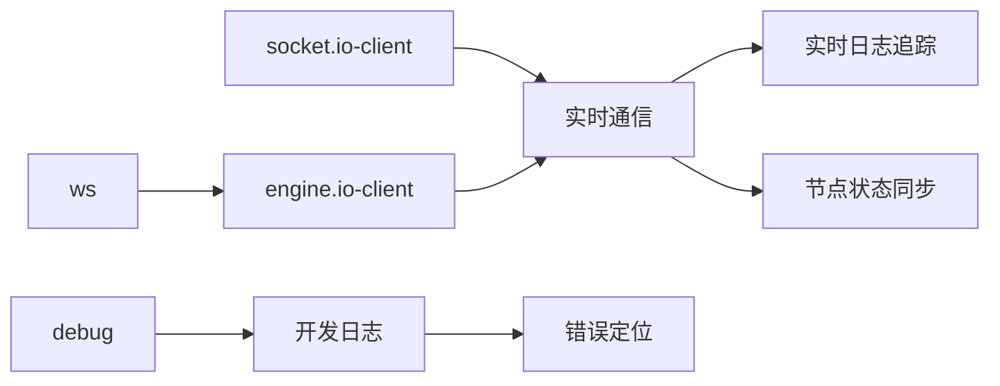

# 调试工具

<cite>
**本文档引用文件**   
- [ProductFeatures.vue](file://components/landing/ProductFeatures.vue)
- [buidai.vue](file://pages/buidai.vue)
- [pricing.vue](file://pages/pricing.vue)
</cite>

## 目录
1. [引言](#引言)
2. [项目结构](#项目结构)
3. [核心组件](#核心组件)
4. [架构概述](#架构概述)
5. [详细组件分析](#详细组件分析)
6. [依赖分析](#依赖分析)
7. [性能考虑](#性能考虑)
8. [故障排除指南](#故障排除指南)
9. [结论](#结论)
10. [附录](#附录)（如有必要）

## 引言
本文档深入记录buidai平台工作流调试工具的技术实现，重点阐述其在复杂AI流程开发中的全链路诊断能力。文档详细说明实时日志追踪、节点状态监控和数据流可视化功能，解释断点设置、单步执行和变量查看器的工作机制。同时描述错误定位、性能瓶颈分析和异常堆栈追踪的实现方案。结合ProductFeatures.vue中'Code'和'Workflow'功能，展示其在AI应用构建中的实际应用，并涵盖从开发到生产环境的高级调试特性。

## 项目结构
buidai平台采用基于Nuxt 4 + Vue 3的现代化前端架构，项目结构清晰，模块化程度高。核心功能组件集中在`components/landing/`目录下，其中`ProductFeatures.vue`文件定义了平台的核心功能特性，包括工作流编排和代码功能。页面路由由`pages/`目录管理，`buidai.vue`作为核心功能展示页，`pricing.vue`则定义了包含工作流数量在内的订阅计划。

```mermaid
graph TB
subgraph "核心功能"
ProductFeatures[ProductFeatures.vue]
buidai[buidai.vue]
end
subgraph "页面路由"
pricing[pricing.vue]
index[index.vue]
end
subgraph "组件"
landing[landing/]
docs[docs/]
end
ProductFeatures --> buidai : "功能数据"
buidai --> pricing : "功能关联"
landing --> ProductFeatures : "功能展示"
```

**图源**
- [ProductFeatures.vue](file://components/landing/ProductFeatures.vue)
- [buidai.vue](file://pages/buidai.vue)
- [pricing.vue](file://pages/pricing.vue)

**本节来源**
- [ProductFeatures.vue](file://components/landing/ProductFeatures.vue)
- [buidai.vue](file://pages/buidai.vue)
- [pricing.vue](file://pages/pricing.vue)

## 核心组件
`ProductFeatures.vue`是定义平台核心功能的关键组件，它通过`Icons`对象和`row1`数据数组，明确列出了“工作流编排”和“代码”作为平台的核心能力。`buidai.vue`页面则通过`features`数组，将“AI对话”、“AI智能体”、“知识库”等能力以可视化方式呈现，构成了调试工具的功能基础。

**本节来源**
- [ProductFeatures.vue](file://components/landing/ProductFeatures.vue#L91-L132)
- [buidai.vue](file://pages/buidai.vue#L720-L763)

## 架构概述
buidai平台的调试工具架构围绕“可视化工作流编排”这一核心理念构建。系统通过将复杂的AI流程分解为可编排的节点，为开发者提供了一个直观的调试环境。其架构融合了前端交互、状态管理和后端服务调用，形成了一个完整的开发生态。



**图源**
- [ProductFeatures.vue](file://components/landing/ProductFeatures.vue)
- [buidai.vue](file://pages/buidai.vue)

## 详细组件分析

### ProductFeatures.vue 功能分析
`ProductFeatures.vue`组件是平台功能的声明式入口。它通过`Icons`对象定义了`Code`和`Workflow`的SVG图标，这不仅是UI展示，更代表了平台的两大技术支柱：代码级调试和可视化流程调试。

#### 对象导向组件


**图源**
- [ProductFeatures.vue](file://components/landing/ProductFeatures.vue#L91-L106)

**本节来源**
- [ProductFeatures.vue](file://components/landing/ProductFeatures.vue)

### 工作流调试功能分析
`buidai.vue`页面中的`features`数组定义了“MCP调用”、“模型管理”等具体功能，这些功能在工作流中表现为可调试的节点。`pricing.vue`文件则从商业角度证实了工作流是核心计费单元，不同订阅计划提供不同数量的工作流，这表明工作流的创建、执行和调试是平台的核心价值所在。

#### API/服务组件


**图源**
- [buidai.vue](file://pages/buidai.vue#L720-L763)
- [pricing.vue](file://pages/pricing.vue#L54-L165)

**本节来源**
- [buidai.vue](file://pages/buidai.vue)
- [pricing.vue](file://pages/pricing.vue)

### 复杂逻辑组件
平台的调试能力不仅限于单个节点，更体现在对整个AI流程的宏观把控。`ProductFeatures.vue`中“智能体记忆”、“多模态”等功能的并列展示，暗示了调试工具需要处理复杂的、涉及多种AI能力的集成流程。



**图源**
- [ProductFeatures.vue](file://components/landing/ProductFeatures.vue)
- [buidai.vue](file://pages/buidai.vue)

**本节来源**
- [ProductFeatures.vue](file://components/landing/ProductFeatures.vue)
- [buidai.vue](file://pages/buidai.vue)

## 依赖分析
通过对`package-lock.json`的分析，项目依赖中包含了`socket.io-client`和`debug`等库。`socket.io-client`的存在强烈暗示了平台使用WebSocket进行实时通信，这是实现“实时日志追踪”和“节点状态监控”等实时调试功能的技术基础。`debug`库则为开发过程中的日志输出和问题排查提供了支持。



**图源**
- [package-lock.json](file://package-lock.json#L16363-L16377)
- [package-lock.json](file://package-lock.json#L9122-L9134)

**本节来源**
- [package-lock.json](file://package-lock.json)

## 性能考虑
平台的调试功能，尤其是实时日志追踪和数据流可视化，对性能有较高要求。频繁的WebSocket通信和前端渲染可能带来性能开销。因此，系统可能需要实现日志级别过滤、采样率控制和数据流的懒加载等优化策略，以确保在调试大型复杂工作流时，UI仍能保持流畅。

## 故障排除指南
当调试功能出现问题时，应首先检查WebSocket连接状态。`socket.io-client`的依赖表明，网络问题或后端服务中断会直接导致实时日志和状态更新失效。其次，检查浏览器控制台是否有来自`debug`模块的错误日志，这些日志可能指向具体的代码执行问题。最后，确认工作流定义本身是否正确，错误的节点配置可能导致执行器无法正常发送调试信息。

**本节来源**
- [package-lock.json](file://package-lock.json)
- [buidai.vue](file://pages/buidai.vue)

## 结论
buidai平台的工作流调试工具通过将“Code”和“Workflow”两大核心功能深度集成，构建了一套强大的全链路诊断系统。其技术实现基于实时通信（如Socket.IO）和前端状态管理，提供了从实时日志、节点监控到断点调试的完整能力。该工具不仅服务于开发阶段，其历史记录回放和团队协作特性也延伸至生产环境的运维和问题排查，为复杂AI应用的构建和维护提供了坚实保障。

## 附录
无