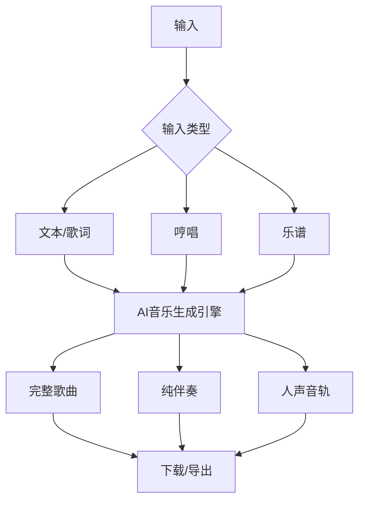
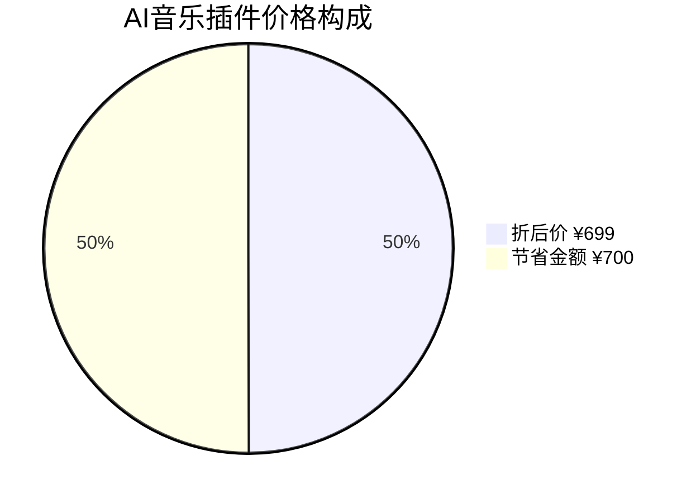

# AI音乐插件

<cite>
**本文档引用文件**
- [pluginData.ts](file://utils/pluginData.ts#L279-L288)
- [ProductFeatures.vue](file://components/landing/ProductFeatures.vue#L153)
- [scene.ts](file://utils/scene.ts#L116-L119)
- [plugin.vue](file://pages/plugin.vue#L179-L194)
- [AppNavigation.vue](file://components/AppNavigation.vue#L183)
</cite>

## 目录

1. [简介](#简介)
2. [核心功能](#核心功能)
3. [产品特性](#产品特性)
4. [使用场景](#使用场景)
5. [价格信息](#价格信息)
6. [集成与访问](#集成与访问)

## 简介

AI音乐插件是智言万象平台提供的一款智能音乐创作工具，旨在通过人工智能技术降低音乐创作门槛，提升创作效率。该插件支持以文本、歌词、哼唱或乐谱作为输入，快速生成完整的歌曲、伴奏、人声或纯音乐作品，适用于个人娱乐和商业配乐场景，实现“人机协同”的创作模式。

该插件作为智言万象应用市场中的核心功能之一，与其他AI工具无缝集成，为用户提供一站式创意生产力解决方案。

**Section sources**
- [pluginData.ts](file://utils/pluginData.ts#L279-L288)
- [scene.ts](file://utils/scene.ts#L116-L119)

## 核心功能

AI音乐插件具备以下核心功能：

- **多模态输入支持**：用户可通过文本描述、输入歌词、哼唱旋律或上传乐谱等方式触发音乐生成。
- **完整音乐生成**：能够生成包含旋律、和声、节奏和编曲的完整歌曲，支持不同风格和流派。
- **伴奏与人声分离**：支持生成纯伴奏或带人声的完整曲目，满足不同使用需求。
- **商用级音质输出**：生成的音乐作品达到商用配乐标准，可用于视频背景音乐、广告配乐等商业场景。
- **个性化定制**：允许用户指定音乐风格、情绪、节奏和乐器配置，实现个性化创作。

这些功能通过先进的AI模型实现，确保生成音乐的质量和多样性。

**Section sources**
- [pluginData.ts](file://utils/pluginData.ts#L280-L281)

## 产品特性

AI音乐插件在智言万象平台的产品矩阵中具有显著特性：

- **高效创作**：将传统音乐制作周期从数小时缩短至几分钟，大幅提升创作效率。
- **零门槛使用**：无需专业音乐知识，普通用户也能轻松创作高质量音乐。
- **风格多样**：支持流行、摇滚、电子、古典等多种音乐风格，满足不同场景需求。
- **无缝集成**：与智言万象平台的视频、写作等其他AI工具协同工作，实现多媒体内容的一体化创作。
- **持续更新**：作为平台核心功能，定期更新模型和功能，不断提升生成质量。

在产品功能展示中，AI音乐被列为重要功能之一，与其他AI创作工具共同构成完整的创意生产力体系。

**Diagram sources**
- [pluginData.ts](file://utils/pluginData.ts#L280-L281)

**Section sources**
- [ProductFeatures.vue](file://components/landing/ProductFeatures.vue#L153)

## 使用场景

AI音乐插件适用于多种实际应用场景：

- **短视频创作**：为抖音、快手等平台的短视频快速生成背景音乐，提升内容吸引力。
- **广告制作**：为商业广告定制专属背景音乐，增强品牌识别度。
- **游戏开发**：为独立游戏开发者提供低成本的背景音乐解决方案。
- **内容创作**：为播客、有声书等音频内容创作配乐。
- **教育培训**：用于音乐教学中的示范曲目生成。
- **个人娱乐**：帮助音乐爱好者实现创作想法，制作个性化音乐作品。

该插件特别适合需要频繁使用背景音乐但缺乏专业音乐制作能力的用户群体。

**Section sources**
- [scene.ts](file://utils/scene.ts#L116-L119)

## 价格信息

AI音乐插件的定价信息如下：

- **原价**：¥1399.00
- **折后价**：¥699.00
- **上线日期**：2025年12月27日

该插件被归类在"图像视频"类别下，作为智言万象应用市场中的高级功能提供。用户可以通过应用中心页面访问和购买该插件，享受限时优惠价格。

**Diagram sources**
- [pluginData.ts](file://utils/pluginData.ts#L285-L287)

**Section sources**
- [pluginData.ts](file://utils/pluginData.ts#L285-L287)

## 集成与访问

AI音乐插件深度集成于智言万象平台，用户可以通过多种方式访问：

- **应用中心入口**：通过导航菜单的"智言空间" > "应用中心"进入插件市场。
- **直接访问**：通过`/plugin`路由直接访问应用市场页面。
- **搜索功能**：在应用市场中使用搜索框查找"AI音乐"插件。
- **分类浏览**：在"图像视频"分类下找到该插件。

插件的集成遵循智言万象平台的统一设计规范，确保用户体验的一致性。用户界面提供搜索、分类筛选和应用展示等功能，方便用户发现和使用AI音乐插件。

**Section sources**
- [AppNavigation.vue](file://components/AppNavigation.vue#L183)
- [plugin.vue](file://pages/plugin.vue#L179-L194)
