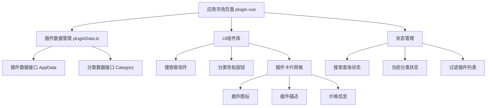
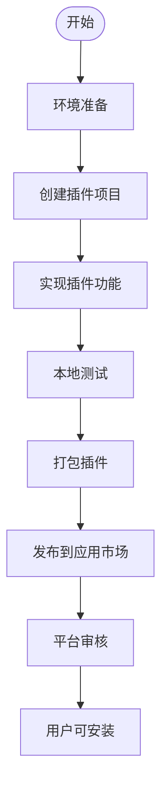
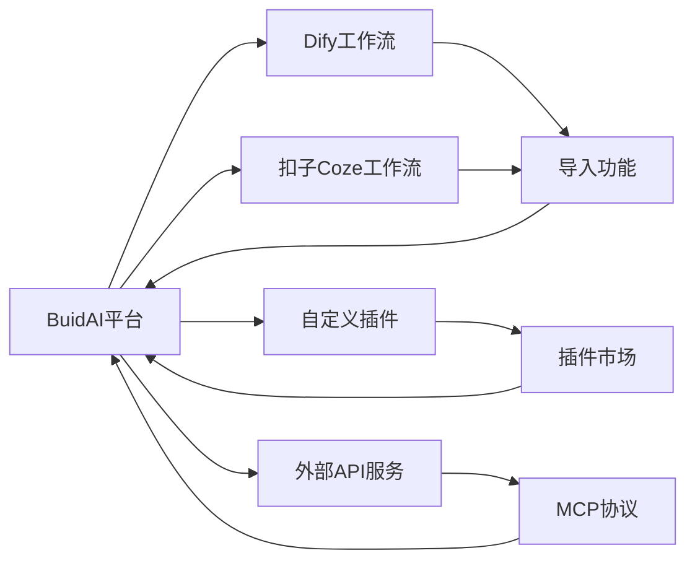

# 应用市场与插件系统

<cite>
**本文档引用文件**  
- [plugin.vue](file://pages/plugin.vue)
- [ScenarioSection.vue](file://components/landing/ScenarioSection.vue)
- [pluginData.ts](file://utils/pluginData.ts)
- [README.md](file://README.md)
- [1.start.md](file://content/docs/introduction/1.start.md)
- [define.md](file://content/docs/framework/define.md)
- [types.md](file://content/docs/framework/types.md)
- [validators.md](file://content/docs/framework/validators.md)
</cite>

## 目录
1. [简介](#简介)
2. [应用市场功能与架构](#应用市场功能与架构)
3. [插件开发规范与流程](#插件开发规范与流程)
4. [插件沙箱运行环境与权限控制](#插件沙箱运行环境与权限控制)
5. [版本管理与计费结算机制](#版本管理与计费结算机制)
6. [插件开发SDK与调试技巧](#插件开发sdk与调试技巧)
7. [安全审查标准](#安全审查标准)
8. [典型插件案例](#典型插件案例)
9. [平台开放性与兼容性设计](#平台开放性与兼容性设计)
10. [结论](#结论)

## 简介
BuidAI平台的应用市场（Plugin Marketplace）是一个集插件开发、发布、发现、安装与使用于一体的生态系统。该系统旨在为开发者提供一个便捷的AI插件开发与商业化平台，同时为用户提供丰富的AI工具扩展能力。通过插件机制，BuidAI实现了功能的高度可扩展性，支持从智能写作、图像处理到企业级工具的多样化应用场景。平台不仅支持原生插件开发，还具备强大的第三方工作流兼容能力，体现了其开放性与灵活性的设计理念。

## 应用市场功能与架构
BuidAI的应用市场通过`pages/plugin.vue`页面实现核心功能展示，结合`utils/pluginData.ts`中的数据模型，构建了一个完整的插件展示与管理界面。市场支持按分类（如图像视频、智能写作、企业工具等）和搜索关键词过滤插件，用户可浏览插件名称、描述、价格及发布日期等信息。前端采用Vue 3与Nuxt框架，通过响应式设计适配不同设备，确保良好的用户体验。

**Diagram sources**
- [plugin.vue](file://pages/plugin.vue#L1-L217)
- [pluginData.ts](file://utils/pluginData.ts#L1-L323)

**Section sources**
- [plugin.vue](file://pages/plugin.vue#L1-L217)
- [pluginData.ts](file://utils/pluginData.ts#L1-L323)

## 插件开发规范与流程
开发者可通过BuidAI提供的SDK和文档中心快速创建AI插件。插件开发需遵循平台定义的数据结构与接口规范，主要涉及插件元数据定义、功能实现与用户界面设计。开发流程包括：环境搭建、插件初始化、功能编码、本地测试、打包发布。

插件元数据在`pluginData.ts`中通过`AppData`接口定义，包含插件ID、名称、描述、图标、分类、价格等字段。开发者需确保插件符合平台的安全与性能要求，并通过自动化测试验证功能完整性。

**Diagram sources**
- [pluginData.ts](file://utils/pluginData.ts#L26-L36)
- [1.start.md](file://content/docs/introduction/1.start.md#L1-L117)

**Section sources**
- [pluginData.ts](file://utils/pluginData.ts#L26-L36)
- [1.start.md](file://content/docs/introduction/1.start.md#L1-L117)

## 插件沙箱运行环境与权限控制
为保障系统安全，所有插件均在隔离的沙箱环境中运行。沙箱限制了插件对系统资源的直接访问，防止恶意代码对平台造成损害。权限控制机制基于最小权限原则，插件需在manifest文件中声明所需权限（如网络访问、文件读写等），用户在安装时可查看并授权。

平台通过动态加载机制按需加载插件代码，结合内容安全策略（CSP）阻止潜在的跨站脚本攻击。同时，插件间的通信通过安全的消息传递接口进行，确保数据隔离与完整性。

**Section sources**
- [1.start.md](file://content/docs/introduction/1.start.md#L1-L117)

## 版本管理与计费结算机制
BuidAI平台实现了完整的插件版本管理与计费结算流程。开发者可上传多个版本的插件，平台自动维护版本历史，支持用户回滚到旧版本。版本更新需提供更新日志，确保透明度。

计费结算机制支持一次性购买与订阅模式。用户购买插件后，费用进入平台账户，开发者可按约定比例获得分成。平台提供详细的财务报表，包括销售额、分成金额、税费等信息，确保结算透明。

**Section sources**
- [1.start.md](file://content/docs/introduction/1.start.md#L1-L117)

## 插件开发SDK与调试技巧
BuidAI提供完整的插件开发SDK，包含API文档、示例代码与命令行工具。开发者可通过CLI工具快速生成插件模板，集成常用功能模块。调试技巧包括：使用浏览器开发者工具监控网络请求、利用平台提供的日志接口输出调试信息、在沙箱环境中模拟用户操作等。

平台还提供在线调试环境，开发者可实时预览插件效果，并进行性能分析与安全扫描。

**Section sources**
- [resources.vue](file://pages/resources.vue#L93-L131)
- [1.start.md](file://content/docs/introduction/1.start.md#L1-L117)

## 安全审查标准
所有提交到应用市场的插件必须通过严格的安全审查。审查标准包括：代码质量检测、依赖库漏洞扫描、权限合理性评估、用户数据保护合规性检查等。平台使用自动化工具进行静态代码分析，并结合人工审核确保插件安全性。

插件不得包含恶意代码、后门程序或未经授权的数据收集行为。开发者需签署安全承诺书，违反规定将被移除插件并可能面临法律追责。

**Section sources**
- [1.start.md](file://content/docs/introduction/1.start.md#L1-L117)

## 典型插件案例
BuidAI应用市场已上线多种实用插件，涵盖多个领域：
- **天气查询**：提供实时天气预报与空气质量信息
- **快递跟踪**：集成主流快递公司API，一键查询物流状态
- **AI简历**：智能生成与优化个人简历
- **思维导图**：在线创建与分享思维导图
- **AI证件照**：自动生成符合标准的证件照片
- **智能写作助手**：辅助文案创作与内容改写

这些插件展示了平台强大的扩展能力与实际应用价值。

**Section sources**
- [pluginData.ts](file://utils/pluginData.ts#L58-L323)

## 平台开放性与兼容性设计
BuidAI平台高度重视开放性与兼容性设计。在`components/landing/ScenarioSection.vue`中明确提到“导入 Dify & 扣子 工作流”功能，表明平台支持导入第三方工作流，打破平台局限。这一设计使用户能够将Dify、扣子（Coze）等平台的工作流无缝集成到BuidAI中，实现能力的充分施展。

平台通过标准化的API接口与MCP（Model Context Protocol）协议，实现与外部系统的高效连接。同时，支持通过CLI工具、REST API等多种方式与第三方系统集成，满足不同场景需求。

**Diagram sources**
- [ScenarioSection.vue](file://components/landing/ScenarioSection.vue#L1-L70)
- [1.start.md](file://content/docs/introduction/1.start.md#L1-L117)

**Section sources**
- [ScenarioSection.vue](file://components/landing/ScenarioSection.vue#L1-L70)
- [1.start.md](file://content/docs/introduction/1.start.md#L1-L117)

## 结论
BuidAI平台的应用市场与插件系统构建了一个完整的AI生态闭环。通过规范的开发流程、安全的运行环境、灵活的兼容设计与完善的商业化机制，平台为开发者和用户创造了巨大价值。未来，随着插件生态的不断丰富，BuidAI将成为企业智能化转型的重要基础设施。