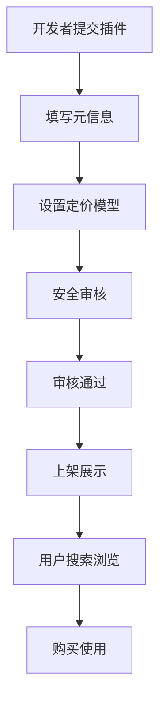
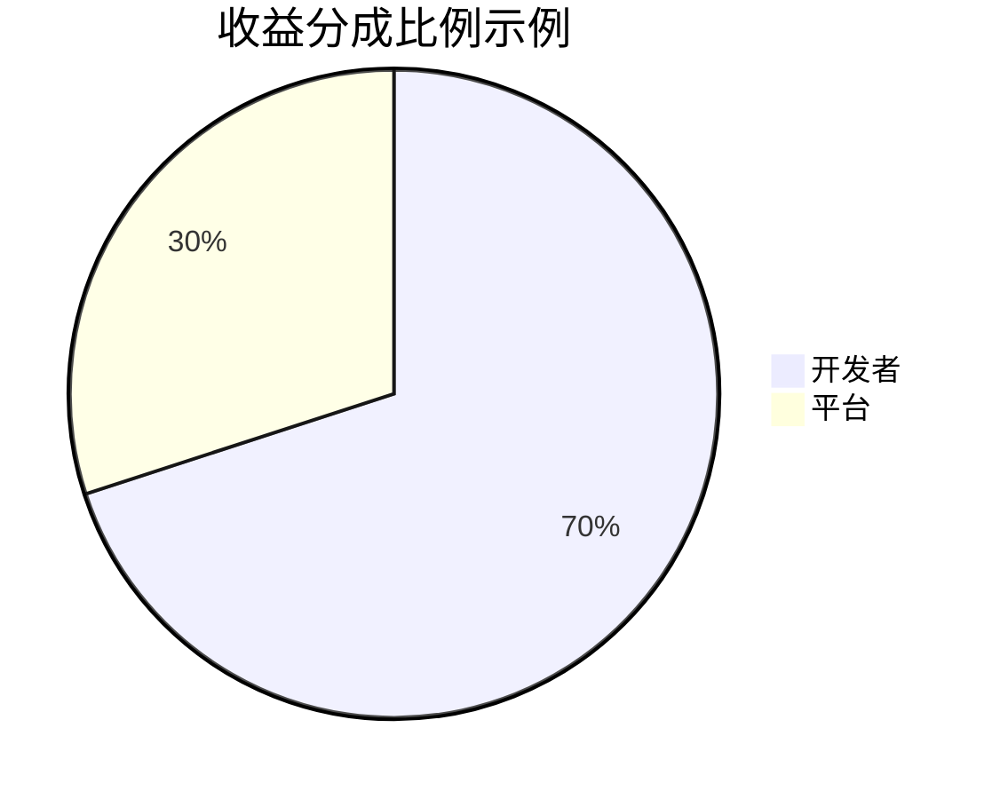

# 插件发布与分发机制

<cite>
**本文档引用文件**  
- [plugin.vue](file://pages/plugin.vue)
- [ScenarioSection.vue](file://components/landing/ScenarioSection.vue)
- [pluginData.ts](file://utils/pluginData.ts)
- [pricing.vue](file://pages/pricing.vue)
</cite>

## 目录
1. [插件发布流程](#插件发布流程)
2. [分发策略与市场展示](#分发策略与市场展示)
3. 第三方工作流兼容性设计
4. 版本管理与灰度发布
5. 用户反馈与更新机制
6. 计费结算与开发者激励

## 插件发布流程

开发者可通过BuidAI平台提交插件包，填写元信息并设置定价模型。平台要求开发者提供插件名称、描述、图标、分类、原始价格和折扣价格等核心元数据。所有插件需经过安全审核后方可上架，确保代码质量和数据安全。审核通过后，插件将被标记为"官方认证"，并在应用市场中展示。

**Section sources**
- [pluginData.ts](file://utils/pluginData.ts#L26-L35)
- [plugin.vue](file://pages/plugin.vue#L117-L123)

## 分发策略与市场展示

BuidAI应用市场采用分类分发策略，支持"全部应用"、"官方推荐"、"独立系统"、"扩展应用"等多种分类。插件在市场中以网格形式展示，包含预览图、名称、描述、价格等信息。平台通过促销横幅和推荐机制提升优质插件的曝光率。用户可通过搜索框和分类导航快速定位所需插件。

**Diagram sources**
- [plugin.vue](file://pages/plugin.vue#L72-L126)
- [pluginData.ts](file://utils/pluginData.ts#L57-L322)

## 第三方工作流兼容性设计

平台在`ScenarioSection.vue`中明确展示了对"Dify & 扣子工作流导入"功能的支持，体现了其打破平台局限的设计理念。该功能允许开发者导入Dify、扣子（Coze）等第三方工作流，实现跨平台能力复用。这种兼容性设计极大地丰富了插件生态，使开发者能够将现有工作流快速迁移至BuidAI平台，降低了开发门槛，促进了生态的开放性和互操作性。

**Section sources**
- [ScenarioSection.vue](file://components/landing/ScenarioSection.vue#L50-L64)

## 版本管理与灰度发布

平台通过`content.config.ts`中的版本管理机制支持插件的版本控制。每个版本包含标题、描述、发布日期等元数据，并可关联作者信息。平台支持主要版本和次要版本的区分，便于用户了解更新的重要性。虽然当前代码未直接体现灰度发布功能，但基于其企业级定位，可推断平台支持按用户群体逐步推送更新的灰度发布策略，以降低更新风险。

**Section sources**
- [content.config.ts](file://content.config.ts#L36-L55)
- [update\2503.md](file://content/update/2503.md#L1-L15)

## 用户反馈与更新机制

平台通过定价页面的FAQ模块收集用户常见问题，建立了用户反馈渠道。插件更新推送逻辑基于版本发布机制，新版本发布后将通过市场界面通知用户。对于重大更新，平台提供详细的更新日志，包括新增功能、优化改进和问题修复。回滚方案虽未在代码中直接体现，但基于企业级应用的安全要求，可推断平台具备快速回滚到稳定版本的能力，以应对更新后可能出现的严重问题。

**Section sources**
- [pricing.vue](file://pages/pricing.vue#L180-L198)
- [content.config.ts](file://content.config.ts#L36-L55)

## 计费结算与开发者激励

平台提供灵活的计费方案，包括基础版、标准版、专业版和私有部署版。计费周期支持按月和按年付费，年付可享受25%的优惠。插件定价由开发者自主设定，平台提供收益分成。虽然具体分成比例未在代码中明确，但基于行业惯例，可推断平台会从插件销售收入中抽取一定比例作为服务费。开发者激励政策可能包括推荐奖励、销售排行榜奖励等，以促进优质插件的开发和推广。

**Diagram sources**
- [pricing.vue](file://pages/pricing.vue#L68-L177)