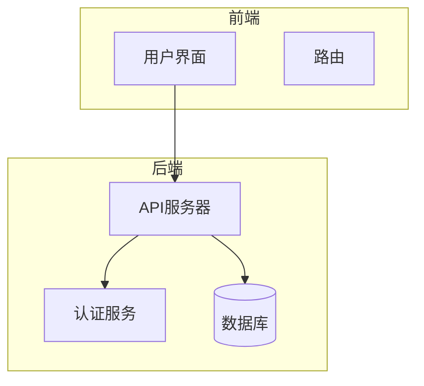
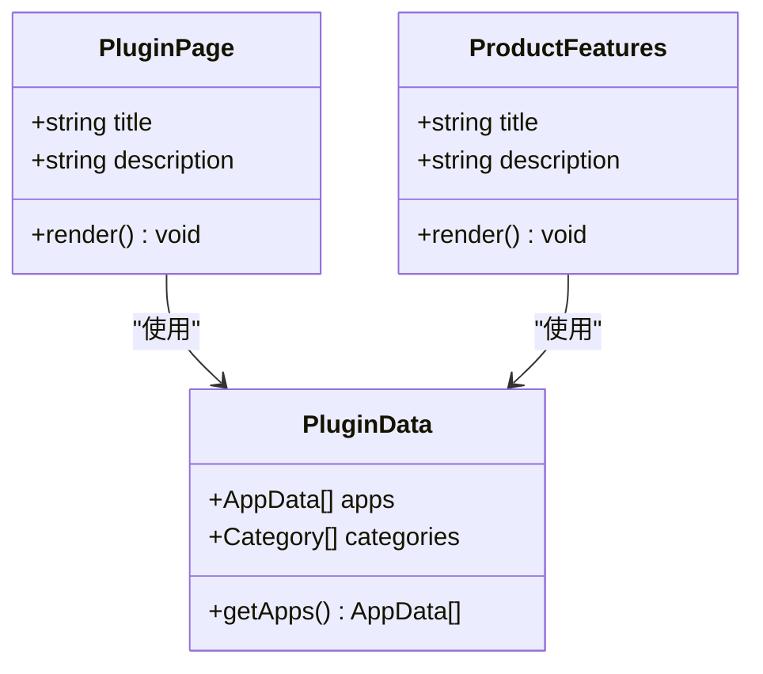

# 插件开发指南

<cite>
**本文档引用文件**  
- [plugin.vue](file://pages/plugin.vue)
- [ProductFeatures.vue](file://components/landing/ProductFeatures.vue)
- [pluginData.ts](file://utils/pluginData.ts)
- [nuxt.config.ts](file://nuxt.config.ts)
- [智言万象.vue](file://pages/智言万象.vue)
- [sources.md](file://content/docs/framework/sources.md)
</cite>

## 目录
1. [简介](#简介)
2. [项目结构](#项目结构)
3. [核心组件](#核心组件)
4. [架构概述](#架构概述)
5. [详细组件分析](#详细组件分析)
6. [依赖分析](#依赖分析)
7. [性能考虑](#性能考虑)
8. [故障排除指南](#故障排除指南)
9. [结论](#结论)

## 简介
本文档详细说明了在智言万象平台上开发插件的完整生命周期，涵盖从环境搭建、SDK集成、功能实现到本地调试的全过程。结合ProductFeatures.vue中展示的AI工具集功能，指导开发者如何基于平台提供的API接口创建如天气查询、快递跟踪等实用型插件。文档包含TypeScript代码示例、useAsyncData数据获取模式、组件封装规范以及与AI对话核心的集成方式。同时解释插件元数据定义、权限声明机制和依赖管理要求，并提供常见开发问题的排查方法。

## 项目结构
本项目采用Nuxt.js框架构建，整体结构清晰，主要分为以下几个部分：
- `assets/css/`：存放全局样式文件
- `components/`：存放可复用的Vue组件
- `content/`：存放文档和博客内容
- `layouts/`：定义页面布局
- `pages/`：存放页面组件
- `stories/`：存放Storybook测试文件
- `utils/`：存放工具函数和数据



**图表来源**
- [nuxt.config.ts](file://nuxt.config.ts#L1-L91)

**章节来源**
- [nuxt.config.ts](file://nuxt.config.ts#L1-L91)

## 核心组件
核心组件包括插件页面、产品功能展示和插件数据管理。这些组件共同构成了插件市场的基础。

**章节来源**
- [plugin.vue](file://pages/plugin.vue#L1-L217)
- [ProductFeatures.vue](file://components/landing/ProductFeatures.vue#L1-L163)
- [pluginData.ts](file://utils/pluginData.ts#L1-L323)

## 架构概述
系统架构基于Nuxt.js框架，使用Vue 3和TypeScript进行开发。通过Nuxt Content模块管理文档内容，支持Markdown格式。前端使用Tailwind CSS进行样式设计，后端通过Nitro引擎提供服务。



**图表来源**
- [plugin.vue](file://pages/plugin.vue#L1-L217)
- [ProductFeatures.vue](file://components/landing/ProductFeatures.vue#L1-L163)
- [pluginData.ts](file://utils/pluginData.ts#L1-L323)

## 详细组件分析
### 插件页面分析
插件页面负责展示所有可用的插件，支持搜索和分类过滤功能。

**章节来源**
- [plugin.vue](file://pages/plugin.vue#L1-L217)

### 产品功能展示分析
产品功能展示组件通过滚动条展示智言万象平台的各种功能，包括智能体记忆、多模态、AI对话等。

**章节来源**
- [ProductFeatures.vue](file://components/landing/ProductFeatures.vue#L1-L163)

### 插件数据管理分析
插件数据管理组件定义了插件和分类的数据结构，并提供了初始数据。

**章节来源**
- [pluginData.ts](file://utils/pluginData.ts#L1-L323)

## 依赖分析
项目依赖主要分为开发依赖和生产依赖。开发依赖包括Nuxt DevTools、Storybook等，生产依赖包括Nuxt UI、Tailwind CSS等。

```mermaid
dependencyDiagram
Nuxt --> Vue
Nuxt --> TailwindCSS
Nuxt --> NuxtUI
Nuxt --> NuxtContent
Storybook --> Vue
Storybook --> Nuxt
```

**图表来源**
- [package.json](file://package.json#L1-L48)

**章节来源**
- [package.json](file://package.json#L1-L48)

## 性能考虑
在开发插件时，需要注意以下性能问题：
- 避免在组件中进行大量计算
- 使用懒加载技术加载大型组件
- 优化API调用，减少不必要的请求

## 故障排除指南
### 上下文传递错误
确保在组件间传递数据时使用正确的props和emit机制。

### 异步加载超时
检查网络连接，确保API服务正常运行。可以增加超时时间或实现重试机制。

**章节来源**
- [智言万象.vue](file://pages/智言万象.vue#L700-L899)
- [sources.md](file://content/docs/framework/sources.md#L1-L129)

## 结论
通过本文档，开发者可以全面了解智言万象平台插件的开发流程，从环境搭建到功能实现，再到本地调试，每一步都有详细的指导。希望本文档能帮助开发者快速上手，开发出更多优秀的插件。