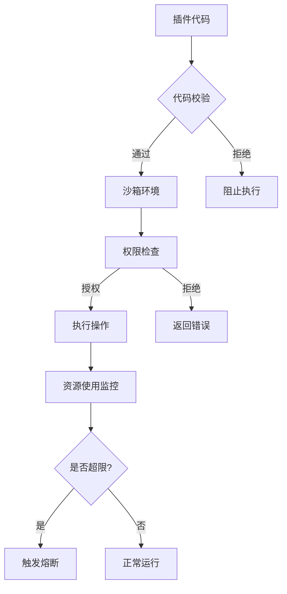

# 插件运行时安全与沙箱机制

<cite>
**本文档引用文件**  
- [pluginData.ts](file://utils/pluginData.ts#L1-L323)
- [ProductFeatures.vue](file://components/landing/ProductFeatures.vue#L1-L163)
- [plugin.vue](file://pages/plugin.vue#L1-L217)
- [security.js](file://node_modules/@nuxt/content/dist/runtime/internal/security.js#L1-L93)
- [app.config.ts](file://app.config.ts#L1-L83)
- [about.vue](file://pages/about.vue#L77-L89)
- [2503.md](file://content/update/2503.md#L1-L15)
</cite>

## 目录
1. [引言](#引言)
2. [插件权限模型](#插件权限模型)
3. [沙箱环境设计原理](#沙箱环境设计原理)
4. [敏感操作审批流程](#敏感操作审批流程)
5. [运行日志监控与异常熔断](#运行日志监控与异常熔断)
6. [基于功能模块的权限策略示例](#基于功能模块的权限策略示例)
7. [安全审查清单与合规开发建议](#安全审查清单与合规开发建议)
8. [结论](#结论)

## 引言
buidai平台致力于为用户提供一个安全、可控的AI应用生态系统。通过构建严格的插件运行时安全架构，平台在保障主系统稳定性的同时，允许开发者自由扩展功能。该架构核心在于插件沙箱环境的设计，结合权限隔离、资源限制和代码校验等多重机制，有效防止恶意或错误代码对系统造成损害。平台强调数据隐私保护，支持私有化部署，确保用户数据安全。

**Section sources**
- [about.vue](file://pages/about.vue#L77-L89)

## 插件权限模型
buidai平台采用基于角色的访问控制（RBAC）权限模型，对插件的网络访问、数据读写等敏感操作进行细粒度管控。插件在安装和运行时必须声明其所需的权限，用户可清晰查看并决定是否授权。权限模型覆盖了文件系统、网络请求、数据库访问等多个维度，确保插件只能在授权范围内执行操作。例如，网页抓取类插件需要明确申请网络访问权限，而文件解析类插件则需要申请特定目录的读写权限。

**Section sources**
- [2503.md](file://content/update/2503.md#L1-L15)

## 沙箱环境设计原理
插件的沙箱环境是其运行时安全的核心保障。平台通过虚拟化和代码校验技术，为每个插件创建一个隔离的执行空间。在该环境中，插件的代码执行受到严格限制，无法直接访问宿主系统的敏感资源。例如，`security.js`文件中的`assertSafeQuery`函数对SQL查询语句进行深度校验，禁止执行`SELECT`、`INSERT`、`UPDATE`、`DELETE`、`DROP`、`ALTER`等危险命令，有效防止SQL注入攻击。沙箱环境还对插件的资源使用（如CPU、内存）进行配额管理，避免单一插件耗尽系统资源。

**Diagram sources**
- [security.js](file://node_modules/@nuxt/content/dist/runtime/internal/security.js#L1-L93)

**Section sources**
- [security.js](file://node_modules/@nuxt/content/dist/runtime/internal/security.js#L1-L93)

## 敏感操作审批流程
对于涉及用户数据或系统核心功能的敏感操作，平台实施严格的审批流程。当插件尝试执行此类操作时，系统会向用户弹出明确的授权请求，详细说明操作内容和潜在风险。用户必须进行显式确认后，操作才能继续。此外，所有敏感操作均会被记录到审计日志中，支持事后追溯。例如，一个插件若想访问用户的个人文件，必须经过用户手动授权，且该授权行为会被永久记录。

## 运行日志监控与异常熔断
平台建立了全面的运行日志监控体系，实时收集和分析插件的运行状态。一旦检测到异常行为，如频繁的错误请求、资源使用突增或尝试执行未授权操作，系统将立即触发熔断机制。熔断机制会暂时或永久性地停止该插件的运行，防止故障扩散，保障主系统的稳定。同时，系统会向管理员发送告警通知，以便及时介入处理。

## 基于功能模块的权限策略示例
结合`ProductFeatures.vue`中展示的功能模块，不同类别的插件遵循不同的权限控制策略：

- **文件解析类插件**（如“AI简历”、“思维导图”）：主要申请对用户指定工作区的读写权限，禁止访问系统目录或其他用户数据。其网络访问权限通常被限制为仅能连接平台内部服务。
- **网页抓取类插件**（如“小红书内容复刻”、“GEO优化排名工具”）：需要申请网络访问权限，但其目标域名受到严格限制，通常只能访问公开的、非敏感的网站。同时，其抓取频率和数据量也受到配额控制，防止对目标网站造成压力。
- **AI生成类插件**（如“Sora2短剧视频创作”、“即梦AI绘画”）：主要消耗算力资源，因此其权限策略侧重于资源配额管理。它们通常被允许访问平台的AI模型服务，但调用次数和并发量受到严格限制。

**Section sources**
- [ProductFeatures.vue](file://components/landing/ProductFeatures.vue#L1-L163)
- [pluginData.ts](file://utils/pluginData.ts#L1-L323)

## 安全审查清单与合规开发建议
为确保插件安全，开发者在提交前应进行以下审查：
1.  **最小权限原则**：仅申请插件功能所必需的最低权限。
2.  **输入校验**：对所有外部输入进行严格校验，防止注入攻击。
3.  **错误处理**：妥善处理异常情况，避免信息泄露。
4.  **资源管理**：避免内存泄漏和无限循环，确保资源使用可控。
5.  **依赖安全**：使用经过验证的第三方库，并保持其更新。

合规开发建议包括：遵循平台提供的开发规范，使用安全的API，避免使用已知存在安全漏洞的函数。

**Section sources**
- [pluginData.ts](file://utils/pluginData.ts#L1-L323)

## 结论
buidai平台通过精心设计的插件运行时安全架构，成功地在功能扩展性与系统安全性之间取得了平衡。以沙箱环境为核心，结合RBAC权限模型、敏感操作审批、日志监控和熔断机制，构建了一个多层防御体系。这不仅保护了主系统的稳定和用户的数据安全，也为开发者提供了一个清晰、可信赖的开发环境，促进了健康、繁荣的插件生态发展。