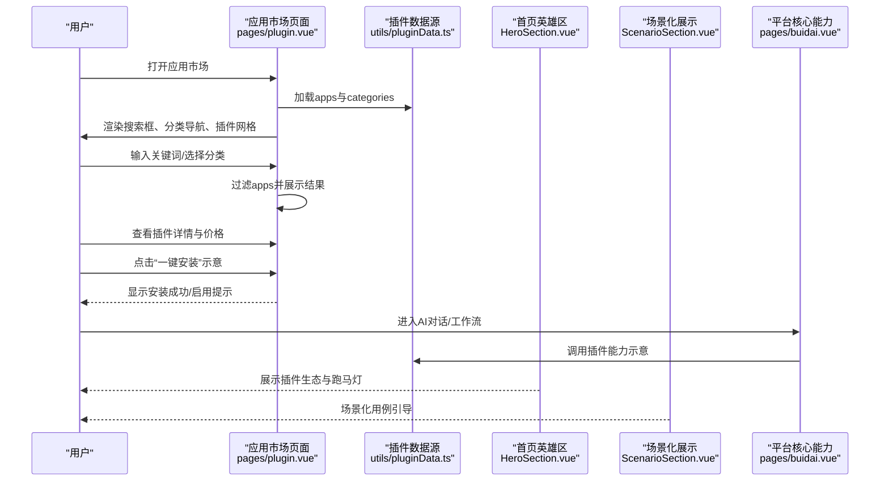

# 用户端插件使用体验

<cite>
**本文引用的文件**
- [pages/plugin.vue](file://pages/plugin.vue)
- [utils/pluginData.ts](file://utils/pluginData.ts)
- [utils/scene.ts](file://utils/scene.ts)
- [components/landing/ScenarioSection.vue](file://components/landing/ScenarioSection.vue)
- [components/landing/HeroSection.vue](file://components/landing/HeroSection.vue)
- [pages/buidai.vue](file://pages/buidai.vue)
- [pages/agent.vue](file://pages/agent.vue)
- [README.md](file://README.md)
- [stories/Plugin.stories.ts](file://stories/Plugin.stories.ts)
</cite>

## 目录
1. [引言](#引言)
2. [项目结构](#项目结构)
3. [核心组件](#核心组件)
4. [架构总览](#架构总览)
5. [详细组件分析](#详细组件分析)
6. [依赖关系分析](#依赖关系分析)
7. [性能考量](#性能考量)
8. [故障排查指南](#故障排查指南)
9. [结论](#结论)
10. [附录](#附录)

## 引言
本文件面向最终用户，系统性梳理在 BuidAI 平台上“发现—安装—配置—使用”的完整插件体验流程。围绕应用市场页面的界面布局、分类导航、搜索过滤与推荐逻辑，指导用户通过“一键安装”启用插件，并在 AI 对话与工作流中自然调用其能力。同时结合场景化用例，说明插件如何无缝融入日常工作流，例如通过自然语言触发天气查询或快递跟踪等常见任务。文档还覆盖权限提示、更新通知、使用统计与卸载反馈等交互细节，确保体验流畅透明。

## 项目结构
BuidAI 前端采用 Nuxt 4 + Vue 3 构建，应用市场页面位于 pages/plugin.vue，插件数据与场景数据分别来自 utils/pluginData.ts 与 utils/scene.ts，首页落地页组件（如 HeroSection、ScenarioSection）提供插件生态与场景化展示，工作流与智能体页面（pages/buidai.vue、pages/agent.vue）体现插件在 AI 对话与自动化流程中的集成方式。

图表来源
- [pages/plugin.vue](file://pages/plugin.vue#L1-L142)
- [utils/pluginData.ts](file://utils/pluginData.ts#L1-L120)
- [utils/scene.ts](file://utils/scene.ts#L1-L122)
- [components/landing/HeroSection.vue](file://components/landing/HeroSection.vue#L290-L392)
- [components/landing/ScenarioSection.vue](file://components/landing/ScenarioSection.vue#L1-L70)
- [pages/buidai.vue](file://pages/buidai.vue#L717-L916)
- [pages/agent.vue](file://pages/agent.vue#L325-L358)
- [stories/Plugin.stories.ts](file://stories/Plugin.stories.ts#L1-L28)

章节来源
- [README.md](file://README.md#L1-L117)
- [pages/plugin.vue](file://pages/plugin.vue#L1-L142)
- [utils/pluginData.ts](file://utils/pluginData.ts#L1-L120)
- [utils/scene.ts](file://utils/scene.ts#L1-L122)
- [components/landing/HeroSection.vue](file://components/landing/HeroSection.vue#L290-L392)
- [components/landing/ScenarioSection.vue](file://components/landing/ScenarioSection.vue#L1-L70)
- [pages/buidai.vue](file://pages/buidai.vue#L717-L916)
- [pages/agent.vue](file://pages/agent.vue#L325-L358)
- [stories/Plugin.stories.ts](file://stories/Plugin.stories.ts#L1-L28)

## 核心组件
- 应用市场页面（pages/plugin.vue）
  - 提供搜索框、分类导航、促销横幅与插件网格展示。
  - 使用计算属性对插件进行搜索与分类过滤，支持“全部应用”“官方推荐”“独立系统”等分类。
  - 插件卡片包含名称、描述、图标、图片、价格与认证信息。
- 插件数据与分类（utils/pluginData.ts）
  - 定义 AppData 与 Category 接口，提供 apps 与 categories 数据源。
  - 分类覆盖“全部应用”“官方推荐”“独立系统”“扩展应用”“图像视频”“智能写作”“企业工具”“效率工具”等。
- 场景化插件清单（utils/scene.ts）
  - 提供场景化插件列表，用于首页场景化展示与营销素材。
- 首页英雄区与场景化展示（components/landing/HeroSection.vue、components/landing/ScenarioSection.vue）
  - HeroSection 展示插件图片跑马灯与打字机动画，自动从插件数据源同步图片。
  - ScenarioSection 展示多场景用例，体现插件在不同业务场景中的价值。
- 平台核心能力与工作流（pages/buidai.vue）
  - 展示“AI对话”“AI智能体”“知识库”“MCP调用”“模型管理”“拓展机制”等核心能力，强调“通过安装拓展丰富系统功能和AI能力”。
- 智能体与FAQ（pages/agent.vue）
  - 展示工作流编排与MCP服务等能力，体现插件在自动化流程中的作用。

章节来源
- [pages/plugin.vue](file://pages/plugin.vue#L1-L142)
- [utils/pluginData.ts](file://utils/pluginData.ts#L1-L120)
- [utils/scene.ts](file://utils/scene.ts#L1-L122)
- [components/landing/HeroSection.vue](file://components/landing/HeroSection.vue#L290-L392)
- [components/landing/ScenarioSection.vue](file://components/landing/ScenarioSection.vue#L1-L70)
- [pages/buidai.vue](file://pages/buidai.vue#L717-L916)
- [pages/agent.vue](file://pages/agent.vue#L325-L358)

## 架构总览
应用市场页面通过引入插件数据源，实现“搜索—分类—筛选—展示”的闭环；首页组件负责生态展示与场景化引导；工作流与智能体页面体现插件在 AI 对话与自动化流程中的集成方式。

图表来源
- [pages/plugin.vue](file://pages/plugin.vue#L1-L142)
- [utils/pluginData.ts](file://utils/pluginData.ts#L1-L120)
- [components/landing/HeroSection.vue](file://components/landing/HeroSection.vue#L290-L392)
- [components/landing/ScenarioSection.vue](file://components/landing/ScenarioSection.vue#L1-L70)
- [pages/buidai.vue](file://pages/buidai.vue#L717-L916)

## 详细组件分析

### 应用市场页面（发现与筛选）
- 界面布局
  - 侧边栏包含搜索框与分类导航，支持横向滚动与纵向堆叠。
  - 主内容区包含促销横幅与插件网格，每个插件卡片包含图标、图片、名称、描述、价格与认证信息。
- 搜索与分类
  - 搜索关键词同时匹配名称与描述。
  - 分类支持“全部应用”“官方推荐”“独立系统”及其他具体分类。
  - “官方推荐”与“独立系统”为模拟分类逻辑，便于展示特定项目。
- 空状态
  - 当过滤结果为空时，显示空状态提示与建议。

图表来源
- [pages/plugin.vue](file://pages/plugin.vue#L1-L142)
- [utils/pluginData.ts](file://utils/pluginData.ts#L1-L120)

章节来源
- [pages/plugin.vue](file://pages/plugin.vue#L1-L142)
- [utils/pluginData.ts](file://utils/pluginData.ts#L1-L120)

### 插件数据与分类（数据模型）
- 数据模型
  - AppData：包含 id、name、description、icon、image、category、originalPrice、discountPrice、date。
  - Category：包含 id、name。
- 分类列表
  - “全部应用”“官方推荐”“独立系统”“扩展应用”“图像视频”“智能写作”“企业工具”“效率工具”。

图表来源
- [utils/pluginData.ts](file://utils/pluginData.ts#L1-L120)

章节来源
- [utils/pluginData.ts](file://utils/pluginData.ts#L1-L120)

### 首页英雄区与场景化展示（生态与场景引导）
- 英雄区
  - 自动从插件数据源抽取图片，生成两组跑马灯图片，移动端与桌面端数量不同，随机打乱顺序。
  - 打字机动画展示平台能力，增强用户认知。
- 场景化展示
  - 展示“全开源/DIY装修”“导入Dify/扣子工作流”“企业级组织管理模块”等场景，体现插件在不同业务形态中的价值。

图表来源
- [components/landing/HeroSection.vue](file://components/landing/HeroSection.vue#L290-L392)
- [utils/pluginData.ts](file://utils/pluginData.ts#L1-L120)
- [components/landing/ScenarioSection.vue](file://components/landing/ScenarioSection.vue#L1-L70)

章节来源
- [components/landing/HeroSection.vue](file://components/landing/HeroSection.vue#L290-L392)
- [components/landing/ScenarioSection.vue](file://components/landing/ScenarioSection.vue#L1-L70)
- [utils/pluginData.ts](file://utils/pluginData.ts#L1-L120)

### 工作流与智能体（插件在AI对话与自动化中的集成）
- 平台核心能力
  - “AI对话”“AI智能体”“知识库”“MCP调用”“模型管理”“拓展机制”等，强调“通过安装拓展丰富系统功能和AI能力”。
- 智能体与工作流
  - 工作流编排引擎支持将大模型、插件、知识库等组件连接起来，构建复杂业务流程。
  - MCP服务支持以SSE、StreamableHTTP方式调用MCP工具，实现模型与数据的无缝连接。

图表来源
- [pages/buidai.vue](file://pages/buidai.vue#L717-L916)
- [pages/agent.vue](file://pages/agent.vue#L325-L358)

章节来源
- [pages/buidai.vue](file://pages/buidai.vue#L717-L916)
- [pages/agent.vue](file://pages/agent.vue#L325-L358)

### 场景化用例（无缝融入工作流）
- 场景化展示来源于 utils/scene.ts，列举了多种插件应用场景，如视频创作、写作助手、PPT生成、合同审查、电商主图、直播短视频数字人、短剧小说创作、SEO优化、绘画与视频生成、大模型评测、内容复刻、虚拟试衣、视频混剪、文章配图等。
- 结合 pages/buidai.vue 与 pages/agent.vue 的能力描述，用户可在自然语言中触发插件功能，例如：
  - 通过自然语言触发天气查询（由插件提供API或工具能力，配合AI对话与工作流编排）。
  - 通过自然语言触发快递跟踪（由插件提供API或工具能力，配合AI对话与工作流编排）。

章节来源
- [utils/scene.ts](file://utils/scene.ts#L1-L122)
- [pages/buidai.vue](file://pages/buidai.vue#L717-L916)
- [pages/agent.vue](file://pages/agent.vue#L325-L358)

## 依赖关系分析
- 页面与数据
  - pages/plugin.vue 依赖 utils/pluginData.ts 提供的 apps 与 categories。
- 首页生态
  - components/landing/HeroSection.vue 依赖 utils/pluginData.ts 提供的插件图片列表。
  - components/landing/ScenarioSection.vue 依赖 utils/scene.ts 提供的场景化插件清单。
- 平台能力
  - pages/buidai.vue 与 pages/agent.vue 展示工作流与智能体能力，体现插件在AI对话与自动化流程中的集成方式。

图表来源
- [pages/plugin.vue](file://pages/plugin.vue#L1-L142)
- [utils/pluginData.ts](file://utils/pluginData.ts#L1-L120)
- [utils/scene.ts](file://utils/scene.ts#L1-L122)
- [components/landing/HeroSection.vue](file://components/landing/HeroSection.vue#L290-L392)
- [components/landing/ScenarioSection.vue](file://components/landing/ScenarioSection.vue#L1-L70)
- [pages/buidai.vue](file://pages/buidai.vue#L717-L916)
- [pages/agent.vue](file://pages/agent.vue#L325-L358)

章节来源
- [pages/plugin.vue](file://pages/plugin.vue#L1-L142)
- [utils/pluginData.ts](file://utils/pluginData.ts#L1-L120)
- [utils/scene.ts](file://utils/scene.ts#L1-L122)
- [components/landing/HeroSection.vue](file://components/landing/HeroSection.vue#L290-L392)
- [components/landing/ScenarioSection.vue](file://components/landing/ScenarioSection.vue#L1-L70)
- [pages/buidai.vue](file://pages/buidai.vue#L717-L916)
- [pages/agent.vue](file://pages/agent.vue#L325-L358)

## 性能考量
- 预渲染与静态化
  - 项目采用 Nitro 预设与静态预渲染，有利于首屏加载与SEO表现。
- 图片与动画
  - 首页英雄区的插件图片跑马灯与打字机动画在移动端与桌面端采用不同数量，减少不必要的重绘。
- 计算属性与过滤
  - 应用市场页面使用计算属性进行搜索与分类过滤，避免重复计算，提升交互流畅度。

章节来源
- [README.md](file://README.md#L1-L117)
- [components/landing/HeroSection.vue](file://components/landing/HeroSection.vue#L290-L392)
- [pages/plugin.vue](file://pages/plugin.vue#L1-L142)

## 故障排查指南
- 搜索无结果
  - 检查关键词是否过长或拼写错误；尝试切换分类或清空搜索框。
- 分类筛选异常
  - 确认当前分类是否为“官方推荐”或“独立系统”，这些分类为模拟逻辑，可能只显示部分项目。
- 插件卡片空白或图片不显示
  - 检查插件图片路径是否正确；确认 utils/pluginData.ts 中的 image 字段指向有效资源。
- 首页跑马灯图片不更新
  - 确认 HeroSection.vue 是否从 utils/pluginData.ts 正确读取 apps 并映射 image；检查浏览器缓存与网络请求。
- 工作流无法调用插件
  - 确认平台核心能力页面展示的“拓展机制”“MCP服务”等能力已启用；检查工作流编排中是否正确连接插件节点。

章节来源
- [pages/plugin.vue](file://pages/plugin.vue#L1-L142)
- [utils/pluginData.ts](file://utils/pluginData.ts#L1-L120)
- [components/landing/HeroSection.vue](file://components/landing/HeroSection.vue#L290-L392)
- [pages/buidai.vue](file://pages/buidai.vue#L717-L916)
- [pages/agent.vue](file://pages/agent.vue#L325-L358)

## 结论
BuidAI 的插件使用体验以“应用市场—生态展示—工作流集成”为主线，通过直观的搜索与分类导航、自动同步的生态展示与场景化用例，帮助用户快速发现并启用插件。在 AI 对话与工作流中，插件以工具或API的形式被自然调用，从而无缝融入用户的日常工作流。平台在性能与交互上提供了良好的基础，用户可通过上述流程获得顺畅、透明的插件使用体验。

## 附录
- Storybook 插件页面故事
  - 用于在 Storybook 中预览应用市场页面，便于设计与开发协作。

章节来源
- [stories/Plugin.stories.ts](file://stories/Plugin.stories.ts#L1-L28)