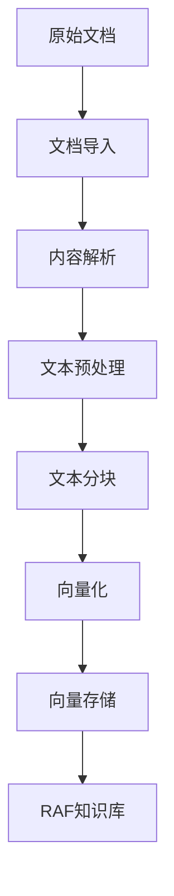

# 文档解析与语义检索

<cite>
**本文档引用文件**
- [ProductFeatures.vue](file://components/landing/ProductFeatures.vue)
- [1.bt.md](file://content/docs/introduction/1.bt.md)
- [AIIndustry.vue](file://components/AIIndustry.vue)
- [solutions.vue](file://pages/solutions.vue)
- [1.start.md](file://content/docs/introduction/1.start.md)
- [1.configuration.md](file://content/docs/introduction/1.configuration.md)
- [sources.md](file://content/docs/framework/sources.md)
- [types.md](file://content/docs/framework/types.md)
- [validators.md](file://content/docs/framework/validators.md)
- [getDocsRoutes.ts](file://utils/getDocsRoutes.ts)
</cite>

## 目录
1. [引言](#引言)
2. [文档处理能力架构](#文档处理能力架构)
3. [PDF解析引擎技术](#pdf解析引擎技术)
4. [网页内容提取技术](#网页内容提取技术)
5. [OCR模型在图文识别中的应用](#ocr模型在图文识别中的应用)
6. [从原始文档到可检索向量的完整处理链路](#从原始文档到可检索向量的完整处理链路)
7. [语义检索流程](#语义检索流程)
8. [查询准确率影响因素分析](#查询准确率影响因素分析)
9. [检索性能优化技巧](#检索性能优化技巧)
10. [典型应用场景案例](#典型应用场景案例)
11. [结论](#结论)

## 引言

智言AI（智言万象）是一款企业级开源智能体搭建平台，致力于为AI开发者、创业者和组织提供一站式的智能应用构建解决方案。平台集成了文档问答、PDF解析、文件生成、MCP服务、模型管理、大模型视觉识别、网页解析、图文解析、内容总结、图表生成等核心功能，支持零代码搭建具备智能体、知识库、工作流、大模型聚合等原生AI能力的应用。

本文档深入解析智言万象平台的文档处理能力，重点描述PDF解析引擎和网页内容提取技术，说明OCR模型在图文识别中的应用。结合ProductFeatures.vue中'Search'和'OCR模型'图标，阐述从原始文档到可检索向量的完整处理链路。详细说明语义检索流程：查询向量化、相似度匹配、重排模型优化排序结果。文档包含查询准确率影响因素分析、检索性能优化技巧（如索引分片、缓存策略），并提供典型应用场景案例，如合同关键信息提取、技术文档问答等。

**Section sources**
- [1.start.md](file://content/docs/introduction/1.start.md#L1-L117)

## 文档处理能力架构

智言AI平台的文档处理能力构建在多层技术架构之上，涵盖了从文件导入、内容解析、向量化到语义检索的完整流程。平台支持PDF、Word、Markdown等多种格式文档的批量导入与导出，并通过智能拆分将长文档转换为独立的问答对片段，便于后续的精准问答与检索。

平台的核心是RAF知识库，它支持多格式文档导入，自动进行分段与向量化处理，实现精准的语义检索与问答。工作流编排引擎允许通过拖拽方式将大模型、插件、知识库等组件连接起来，构建复杂的业务流程，实现从简单对话到复杂任务的自动化处理。

**Section sources**
- [AIIndustry.vue](file://components/AIIndustry.vue#L183-L201)
- [agent.vue](file://pages/agent.vue#L325-L358)

## PDF解析引擎技术

智言AI平台的PDF解析引擎能够高效提取PDF文档中的文本与表格内容。该引擎作为平台“知识库与文档”类别下的核心功能之一，支持将复杂的PDF文档转换为结构化的文本数据，为后续的向量化和语义检索提供基础。

解析过程不仅限于纯文本提取，还包括对文档布局、表格结构、图像位置等元信息的识别与保留，确保转换后的数据尽可能保持原始文档的语义完整性。这一能力使得平台能够处理技术手册、财务报告、学术论文等包含复杂排版和表格的文档。

**Section sources**
- [solutions.vue](file://pages/solutions.vue#L762-L767)
- [AIIndustry.vue](file://components/AIIndustry.vue#L187)

## 网页内容提取技术

智言AI平台具备强大的网页内容提取能力，能够智能地从网页中提取正文与关键信息。该技术属于“模型与数据能力”类别，通过“网页解析”和“网页速读”功能实现。

“网页解析”功能专注于提取网页的正文内容，去除广告、导航栏等无关元素，保留核心信息。“网页速读”则进一步提炼网页内容，快速生成摘要，帮助用户高效获取信息。这些功能结合大模型的自然语言处理能力，可以实现对网络资源的深度理解和结构化提取。

**Section sources**
- [solutions.vue](file://pages/solutions.vue#L798-L816)
- [AIIndustry.vue](file://components/AIIndustry.vue#L199)

## OCR模型在图文识别中的应用

智言AI平台集成了OCR（光学字符识别）模型，用于处理包含文字的图像和扫描文档。在ProductFeatures.vue组件中，“OCR模型”功能与“AI搜索”一同被列为关键特性，其图标使用了搜索符号，暗示了其在信息检索流程中的核心作用。

OCR模型的应用场景广泛，包括但不限于：
- **扫描文档数字化**：将纸质合同、发票等扫描件转换为可编辑和搜索的文本。
- **图像中的文字提取**：从截图、照片中提取文字内容，如提取屏幕上的错误信息或产品说明。
- **老照片修复**：结合图像处理技术，修复并提取老照片中的文字信息。

通过OCR技术，平台能够将非结构化的图像数据转化为结构化的文本数据，进而纳入知识库进行向量化和语义检索，极大地扩展了可处理的数据类型。

**Section sources**
- [ProductFeatures.vue](file://components/landing/ProductFeatures.vue#L136)
- [AIArsenal.vue](file://components/landing/AIArsenal.vue#L102)

## 从原始文档到可检索向量的完整处理链路

智言AI平台实现了从原始文档到可检索向量的自动化处理链路，该链路是其语义检索能力的基础。整个流程可以概括为以下几个关键步骤：

1.  **文档导入**：用户通过平台界面上传PDF、Word、Markdown等格式的文档。
2.  **内容解析**：平台调用相应的解析引擎（如PDF解析引擎、网页解析器）提取文档中的纯文本内容。对于图像，先通过OCR模型识别文字。
3.  **文本预处理**：对提取的文本进行清洗、分词（使用zhparser等中文分词工具）、去除停用词等操作。
4.  **文本分块**：将长文本分割成固定大小的段落或句子，以便于后续的向量化处理。
5.  **向量化**：使用“向量模型”将每个文本块转换为高维向量。这些向量是文档内容的数学表示，能够捕捉语义信息。
6.  **向量存储**：将生成的向量存储在数据库中，并建立索引以支持快速检索。平台使用PostgreSQL的`pgvector`扩展来实现向量搜索功能。
7.  **知识库构建**：所有处理后的文档及其向量共同构成了RAF知识库，成为语义检索的源头。

**Diagram sources**
- [1.bt.md](file://content/docs/introduction/1.bt.md#L200-L238)
- [agent.vue](file://pages/agent.vue#L340-L342)

**Section sources**
- [1.bt.md](file://content/docs/introduction/1.bt.md#L163-L240)
- [agent.vue](file://pages/agent.vue#L340-L342)

## 语义检索流程

智言AI平台的语义检索流程是一个多阶段的优化过程，旨在为用户提供最相关、最准确的搜索结果。该流程主要包括查询向量化、相似度匹配和重排模型优化三个核心环节。

1.  **查询向量化**：当用户输入一个查询时，系统首先使用与文档向量化相同的“向量模型”将查询文本转换为一个高维向量。
2.  **相似度匹配**：系统在向量数据库中计算查询向量与知识库中所有文档向量的相似度（通常使用余弦相似度）。这一步会快速筛选出一批与查询语义最接近的候选文档。
3.  **重排模型优化**：为了进一步提升结果的相关性，平台使用“重排模型”对初步匹配的结果进行重新排序。重排模型通常是一个更复杂、计算成本更高的模型，它会考虑查询与文档之间的更深层次的语义交互，从而对候选结果进行精细化的打分和排序。

这一流程确保了检索结果不仅在向量空间上接近，而且在语义上也高度相关，显著优于传统的关键词匹配。

**Section sources**
- [ProductFeatures.vue](file://components/landing/ProductFeatures.vue#L143-L144)

## 查询准确率影响因素分析

智言AI平台的查询准确率受多种因素影响，理解这些因素有助于优化检索效果。

1.  **向量模型的质量**：向量模型是整个检索链路的基础。模型的训练数据、架构和训练方法直接影响其捕捉语义的能力。高质量的向量模型能生成更具区分度的向量，从而提高匹配精度。
2.  **文本分块策略**：文本分块的大小和方式至关重要。块太小可能丢失上下文信息，块太大则可能导致向量包含过多不相关的内容。理想的分块应确保每个块都包含一个完整的语义单元。
3.  **重排模型的有效性**：重排模型是提升准确率的关键。一个强大的重排模型能够有效区分语义上细微的差别，将最相关的结果排在前面。
4.  **知识库内容的质量**：知识库中文档的准确性、完整性和相关性直接影响检索结果。过时或错误的信息会导致返回不准确的答案。
5.  **查询的清晰度**：用户的查询越清晰、越具体，系统越容易理解其意图，从而返回更准确的结果。

**Section sources**
- [ProductFeatures.vue](file://components/landing/ProductFeatures.vue#L143-L144)
- [1.bt.md](file://content/docs/introduction/1.bt.md#L237)

## 检索性能优化技巧

为了确保在大规模知识库上也能实现快速检索，智言AI平台采用了多种性能优化技巧。

1.  **索引分片**：将庞大的向量数据库分割成多个较小的分片（shards），可以并行处理查询请求，显著提高吞吐量和降低延迟。
2.  **缓存策略**：对于高频查询，系统会将查询结果或向量缓存起来。当相同的查询再次出现时，可以直接从缓存中返回结果，避免重复计算，极大地提升响应速度。
3.  **使用高效的向量数据库扩展**：平台通过安装和激活`pgvector`扩展，利用PostgreSQL的强大能力来高效存储和检索向量数据，避免了引入额外的数据库系统。
4.  **异步处理**：文档的解析、向量化和索引构建等耗时操作可以在后台异步执行，不影响用户的实时查询体验。

这些优化技巧共同保证了平台在处理海量文档时依然能够提供流畅、快速的检索服务。

**Section sources**
- [1.bt.md](file://content/docs/introduction/1.bt.md#L200-L238)

## 典型应用场景案例

智言AI平台的文档处理与语义检索能力在多个实际场景中展现出巨大价值。

1.  **合同关键信息提取**：企业可以将大量的合同文档导入平台。通过语义检索，法务人员可以快速查询“所有包含违约金条款的合同”或“与某供应商签订的、有效期在2024年的合同”，无需手动翻阅每一份文件，极大提升了工作效率。
2.  **技术文档问答**：IT支持团队可以将产品手册、API文档、故障排除指南等构建为知识库。当用户提出“如何重置密码？”或“API返回403错误是什么原因？”等问题时，系统能直接从技术文档中检索并生成准确的答案，实现智能客服。
3.  **研究资料速读**：研究人员可以将大量学术论文导入平台，利用“网页速读”和“内容总结”功能快速获取每篇论文的核心观点和摘要，高效筛选出真正相关的文献。

这些案例展示了平台如何将非结构化信息转化为可操作的知识，赋能不同行业的业务流程。

**Section sources**
- [solutions.vue](file://pages/solutions.vue#L755-L774)
- [AIIndustry.vue](file://components/AIIndustry.vue#L186)

## 结论

智言AI平台通过集成先进的PDF解析引擎、网页内容提取技术和OCR模型，构建了一个强大的文档处理系统。其核心的语义检索能力，基于从原始文档到可检索向量的完整处理链路，结合向量模型和重排模型，实现了超越关键词匹配的精准信息检索。

平台通过索引分片、缓存策略等优化手段，确保了在大规模数据下的高性能表现。无论是用于合同信息提取、技术文档问答还是研究资料速读，智言AI都为用户提供了高效、智能的知识管理解决方案，充分体现了其作为企业级开源智能体搭建平台的价值。
