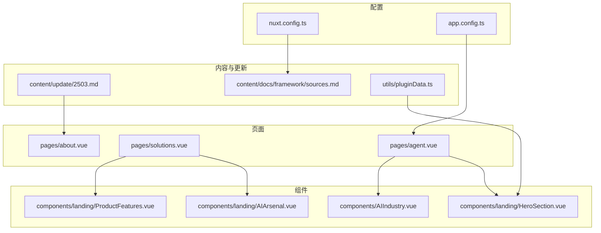
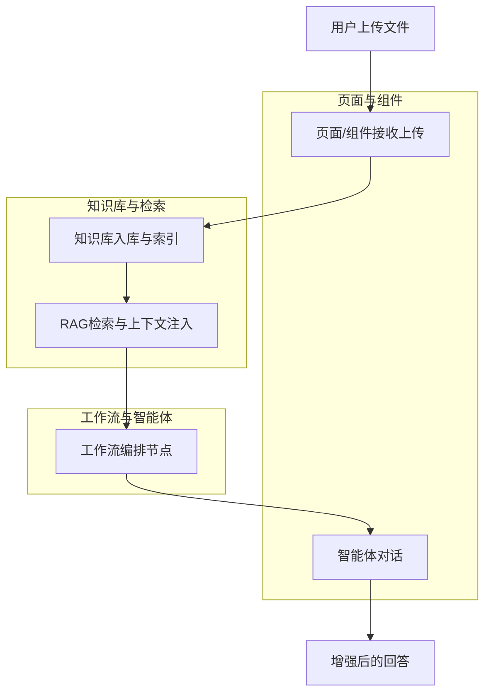
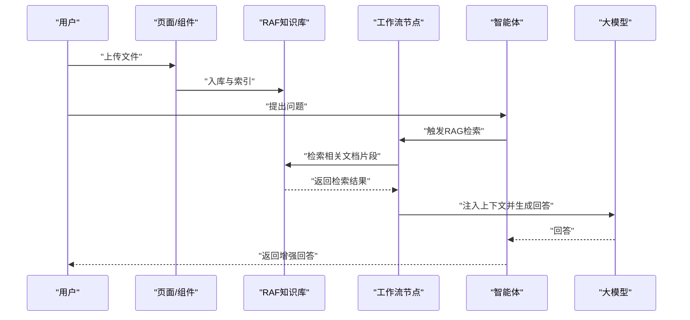
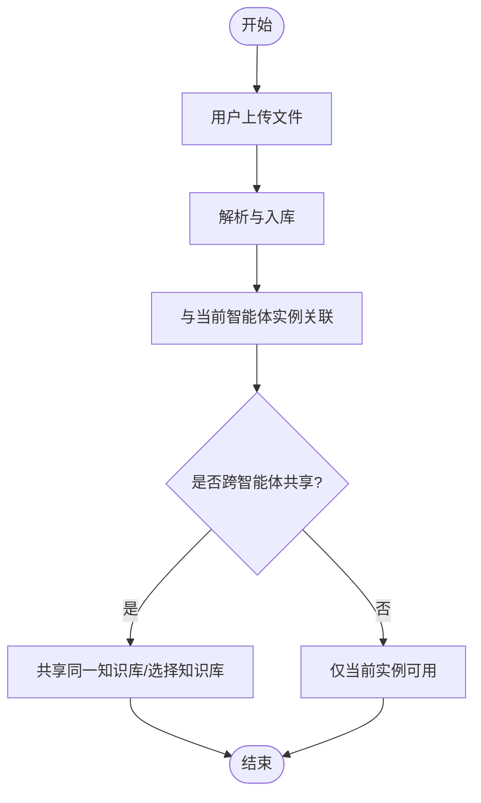
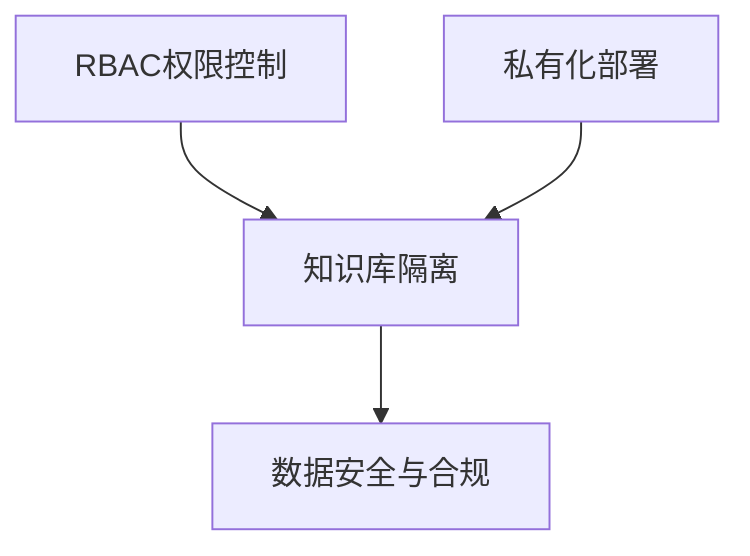
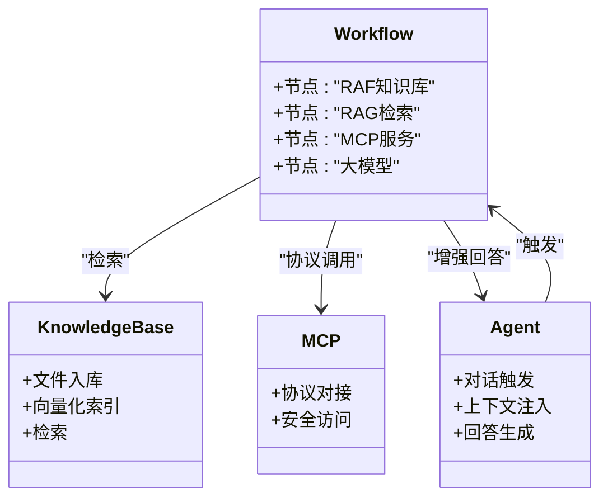
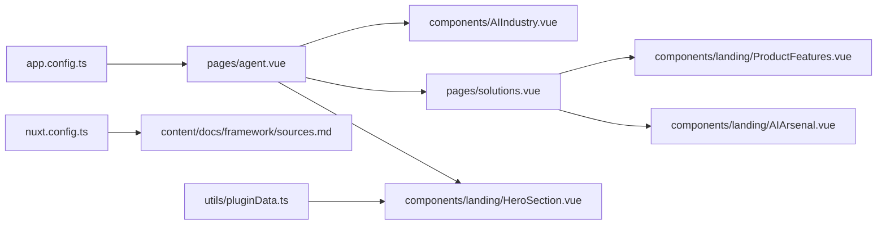

# 知识库与智能体集成

<cite>
**本文引用的文件**
- [pages/agent.vue](file://pages/agent.vue)
- [components/AIIndustry.vue](file://components/AIIndustry.vue)
- [pages/solutions.vue](file://pages/solutions.vue)
- [components/landing/ProductFeatures.vue](file://components/landing/ProductFeatures.vue)
- [components/landing/AIArsenal.vue](file://components/landing/AIArsenal.vue)
- [pages/about.vue](file://pages/about.vue)
- [content/update/2503.md](file://content/update/2503.md)
- [utils/pluginData.ts](file://utils/pluginData.ts)
- [components/landing/HeroSection.vue](file://components/landing/HeroSection.vue)
- [content/docs/framework/sources.md](file://content/docs/framework/sources.md)
- [nuxt.config.ts](file://nuxt.config.ts)
- [app.config.ts](file://app.config.ts)
</cite>

## 目录
1. [简介](#简介)
2. [项目结构](#项目结构)
3. [核心组件](#核心组件)
4. [架构总览](#架构总览)
5. [详细组件分析](#详细组件分析)
6. [依赖关系分析](#依赖关系分析)
7. [性能考量](#性能考量)
8. [故障排查指南](#故障排查指南)
9. [结论](#结论)
10. [附录](#附录)

## 简介
本文件系统性阐述知识库与智能体的深度集成方案，围绕以下目标展开：
- 智能体在对话过程中的知识库触发机制与上下文注入方式
- 记忆融合策略与跨智能体共享知识的实现思路
- 用户上传文件后，知识库与智能体实例的自动关联与权限边界控制
- 在智能体工作流中启用知识库增强功能的集成配置示例

本项目通过页面与组件展示了“RAF知识库”“RAG检索增强生成”“MCP服务”“工作流编排”等能力，为知识库与智能体的集成提供了清晰的功能蓝图与落地方向。

## 项目结构
该项目采用 Nuxt 16 + Vue 3 的前端工程，页面与组件分别承载“智能体能力展示”“知识库能力展示”“行业解决方案”等职责。核心页面与组件如下：
- 页面：agent.vue（智能体与知识库能力概览）、solutions.vue（知识库与文档能力矩阵）
- 组件：AIIndustry.vue（行业解决方案卡片）、ProductFeatures.vue（能力清单）、AIArsenal.vue（能力索引）
- 配置：nuxt.config.ts（构建与内容模块配置）、app.config.ts（UI主题与图标映射）

**图表来源**
- [pages/agent.vue](file://pages/agent.vue#L1-L120)
- [pages/solutions.vue](file://pages/solutions.vue#L600-L780)
- [components/AIIndustry.vue](file://components/AIIndustry.vue#L140-L200)
- [components/landing/ProductFeatures.vue](file://components/landing/ProductFeatures.vue#L119-L132)
- [components/landing/AIArsenal.vue](file://components/landing/AIArsenal.vue#L71-L106)
- [components/landing/HeroSection.vue](file://components/landing/HeroSection.vue#L294-L328)
- [content/update/2503.md](file://content/update/2503.md#L1-L15)
- [content/docs/framework/sources.md](file://content/docs/framework/sources.md#L1-L60)
- [nuxt.config.ts](file://nuxt.config.ts#L1-L40)
- [app.config.ts](file://app.config.ts#L1-L83)
- [utils/pluginData.ts](file://utils/pluginData.ts#L1-L60)

**章节来源**
- [pages/agent.vue](file://pages/agent.vue#L1-L120)
- [pages/solutions.vue](file://pages/solutions.vue#L600-L780)
- [components/AIIndustry.vue](file://components/AIIndustry.vue#L140-L200)
- [components/landing/ProductFeatures.vue](file://components/landing/ProductFeatures.vue#L119-L132)
- [components/landing/AIArsenal.vue](file://components/landing/AIArsenal.vue#L71-L106)
- [components/landing/HeroSection.vue](file://components/landing/HeroSection.vue#L294-L328)
- [content/update/2503.md](file://content/update/2503.md#L1-L15)
- [content/docs/framework/sources.md](file://content/docs/framework/sources.md#L1-L60)
- [nuxt.config.ts](file://nuxt.config.ts#L1-L40)
- [app.config.ts](file://app.config.ts#L1-L83)
- [utils/pluginData.ts](file://utils/pluginData.ts#L1-L60)

## 核心组件
- 智能体与知识库能力概览（agent.vue）：明确展示“RAF知识库”“RAG检索增强生成”“工作流编排”“MCP服务”等能力，为知识库与智能体集成提供场景支撑。
- 行业解决方案（AIIndustry.vue）：以“智能对话 Agent”“知识库与文档”为主题，列出知识库导入导出、问答对导入、文档问答、PDF解析等能力。
- 知识库能力矩阵（solutions.vue）：以网格形式呈现“知识库”“文件导入导出”“问答对导入/拆分/文档问答/PDF解析/文件生成”等能力。
- 能力清单与索引（ProductFeatures.vue、AIArsenal.vue）：统一标注“RAF知识库”“MCP服务”“工作流编排”等能力，便于在工作流中组合使用。
- 安全与权限（about.vue、content/update/2503.md）：强调私有化部署与RBAC权限控制，保障数据隔离与安全。

**章节来源**
- [pages/agent.vue](file://pages/agent.vue#L325-L358)
- [components/AIIndustry.vue](file://components/AIIndustry.vue#L162-L190)
- [pages/solutions.vue](file://pages/solutions.vue#L719-L760)
- [components/landing/ProductFeatures.vue](file://components/landing/ProductFeatures.vue#L119-L132)
- [components/landing/AIArsenal.vue](file://components/landing/AIArsenal.vue#L71-L106)
- [pages/about.vue](file://pages/about.vue#L77-L89)
- [content/update/2503.md](file://content/update/2503.md#L1-L15)

## 架构总览
下图从“用户上传文件”到“智能体对话增强”的视角，抽象展示知识库与智能体的集成路径与关键节点。

[本图为概念性流程示意，不直接映射具体源文件，故无图表来源]

## 详细组件分析

### 智能体对话与知识库触发机制
- 触发机制
  - 用户在对话中上传文件，页面组件负责接收与解析（见“对话上传文件”能力项）。
  - 知识库入库后，RAG检索在工作流节点中被调用，将相关文档片段注入上下文，再由智能体生成回答。
- 上下文注入
  - 通过“MCP服务”与“工作流编排”，将检索结果与用户问题拼接为上下文，传递给大模型。
- 记忆融合
  - “智能体记忆”能力与知识库检索共同作用，既保留对话历史，又引入外部知识，形成“短期记忆 + 外部知识”的融合。

**图表来源**
- [components/AIIndustry.vue](file://components/AIIndustry.vue#L162-L190)
- [pages/solutions.vue](file://pages/solutions.vue#L719-L760)
- [components/landing/AIArsenal.vue](file://components/landing/AIArsenal.vue#L71-L106)
- [components/landing/ProductFeatures.vue](file://components/landing/ProductFeatures.vue#L119-L132)

**章节来源**
- [components/AIIndustry.vue](file://components/AIIndustry.vue#L162-L190)
- [pages/solutions.vue](file://pages/solutions.vue#L719-L760)
- [components/landing/AIArsenal.vue](file://components/landing/AIArsenal.vue#L71-L106)
- [components/landing/ProductFeatures.vue](file://components/landing/ProductFeatures.vue#L119-L132)

### 用户上传文件与知识库自动关联
- 文件上传
  - 页面组件支持“对话上传文件”，上传后进入知识库处理流程。
- 自动关联
  - 上传完成后，系统自动将文件与当前智能体实例关联，形成“实例-知识库”的绑定关系。
- 跨智能体共享
  - 通过“知识库”能力与“工作流编排”，可在不同智能体之间共享同一知识库或按需选择知识库，实现跨实例的知识复用。

**图表来源**
- [components/AIIndustry.vue](file://components/AIIndustry.vue#L162-L190)
- [pages/solutions.vue](file://pages/solutions.vue#L719-L760)

**章节来源**
- [components/AIIndustry.vue](file://components/AIIndustry.vue#L162-L190)
- [pages/solutions.vue](file://pages/solutions.vue#L719-L760)

### 权限边界控制与数据隔离
- RBAC权限
  - 新增RBAC权限控制系统，支持细粒度资源访问策略，优化团队协作流程。
- 私有化部署
  - 强调私有化部署优先，确保数据掌握在客户手中，满足企业级安全要求。
- 知识库隔离
  - 通过RBAC与私有化部署，实现“部门级知识库隔离配置”，避免越权访问与数据泄露。

**图表来源**
- [content/update/2503.md](file://content/update/2503.md#L1-L15)
- [pages/about.vue](file://pages/about.vue#L77-L89)

**章节来源**
- [content/update/2503.md](file://content/update/2503.md#L1-L15)
- [pages/about.vue](file://pages/about.vue#L77-L89)

### 集成配置示例（在智能体工作流中启用知识库增强）
- 工作流编排
  - 使用“工作流编排”能力，将“RAF知识库”“RAG检索”“MCP服务”串联为节点，形成“检索-注入-生成”的增强链路。
- RAG检索
  - 在工作流节点中配置RAG检索参数，将用户问题与检索结果拼接为上下文，再交给大模型生成回答。
- MCP服务
  - 通过“MCP服务”实现模型与数据的无缝连接，确保检索与生成过程的安全与高效。
- 页面与组件联动
  - 页面组件负责接收上传与展示能力，组件负责能力清单与索引，便于在工作流中选择与组合。

**图表来源**
- [pages/agent.vue](file://pages/agent.vue#L325-L358)
- [components/AIIndustry.vue](file://components/AIIndustry.vue#L162-L190)
- [pages/solutions.vue](file://pages/solutions.vue#L719-L760)
- [components/landing/ProductFeatures.vue](file://components/landing/ProductFeatures.vue#L119-L132)
- [components/landing/AIArsenal.vue](file://components/landing/AIArsenal.vue#L71-L106)

**章节来源**
- [pages/agent.vue](file://pages/agent.vue#L325-L358)
- [components/AIIndustry.vue](file://components/AIIndustry.vue#L162-L190)
- [pages/solutions.vue](file://pages/solutions.vue#L719-L760)
- [components/landing/ProductFeatures.vue](file://components/landing/ProductFeatures.vue#L119-L132)
- [components/landing/AIArsenal.vue](file://components/landing/AIArsenal.vue#L71-L106)

## 依赖关系分析
- 页面与组件
  - agent.vue 与 AIIndustry.vue、solutions.vue、ProductFeatures.vue、AIArsenal.vue 共同构成“智能体与知识库能力”的展示闭环。
- 配置与内容
  - nuxt.config.ts 配置内容模块与静态输出；app.config.ts 配置UI主题与图标映射；content/docs/framework/sources.md 提供内容集合导入的参考。
- 数据与展示
  - utils/pluginData.ts 提供插件/应用数据，components/landing/HeroSection.vue 通过计算属性与随机打乱实现插件图片轮播，间接体现“能力矩阵”与“应用生态”。

**图表来源**
- [pages/agent.vue](file://pages/agent.vue#L1-L120)
- [components/AIIndustry.vue](file://components/AIIndustry.vue#L140-L200)
- [pages/solutions.vue](file://pages/solutions.vue#L600-L780)
- [components/landing/ProductFeatures.vue](file://components/landing/ProductFeatures.vue#L119-L132)
- [components/landing/AIArsenal.vue](file://components/landing/AIArsenal.vue#L71-L106)
- [components/landing/HeroSection.vue](file://components/landing/HeroSection.vue#L294-L328)
- [nuxt.config.ts](file://nuxt.config.ts#L1-L40)
- [app.config.ts](file://app.config.ts#L1-L83)
- [utils/pluginData.ts](file://utils/pluginData.ts#L1-L60)
- [content/docs/framework/sources.md](file://content/docs/framework/sources.md#L1-L60)

**章节来源**
- [pages/agent.vue](file://pages/agent.vue#L1-L120)
- [components/AIIndustry.vue](file://components/AIIndustry.vue#L140-L200)
- [pages/solutions.vue](file://pages/solutions.vue#L600-L780)
- [components/landing/ProductFeatures.vue](file://components/landing/ProductFeatures.vue#L119-L132)
- [components/landing/AIArsenal.vue](file://components/landing/AIArsenal.vue#L71-L106)
- [components/landing/HeroSection.vue](file://components/landing/HeroSection.vue#L294-L328)
- [nuxt.config.ts](file://nuxt.config.ts#L1-L40)
- [app.config.ts](file://app.config.ts#L1-L83)
- [utils/pluginData.ts](file://utils/pluginData.ts#L1-L60)
- [content/docs/framework/sources.md](file://content/docs/framework/sources.md#L1-L60)

## 性能考量
- 检索效率
  - 通过“RAF知识库”的自动分段与向量化，提升RAG检索的准确率与速度。
- 上下文长度
  - 结合“超长上下文”能力，合理控制上下文长度，平衡回答质量与延迟。
- 工作流编排
  - 使用“工作流编排”将检索与生成解耦，便于并行与缓存优化。
- 静态输出与预渲染
  - nuxt.config.ts 中的静态输出与预渲染配置有助于前端性能与SEO优化，间接提升用户体验。

[本节为通用性能建议，不直接分析具体文件，故无章节来源]

## 故障排查指南
- 上传文件未生效
  - 检查页面组件是否正确接收上传事件与解析流程；确认“文件导入导出”“对话上传文件”等能力已启用。
- 知识库检索无结果
  - 确认文件已入库并完成向量化索引；检查“RAF知识库”“RAG检索”节点配置。
- 回答质量不佳
  - 调整“MCP服务”与“工作流编排”中的上下文注入策略；优化提示词与检索参数。
- 权限问题
  - 检查RBAC权限配置与私有化部署策略，确保知识库隔离与访问控制符合预期。

**章节来源**
- [components/AIIndustry.vue](file://components/AIIndustry.vue#L162-L190)
- [pages/solutions.vue](file://pages/solutions.vue#L719-L760)
- [content/update/2503.md](file://content/update/2503.md#L1-L15)
- [pages/about.vue](file://pages/about.vue#L77-L89)

## 结论
本项目通过页面与组件清晰展示了“RAF知识库”“RAG检索增强生成”“MCP服务”“工作流编排”“智能体记忆”等能力，为知识库与智能体的深度集成提供了完整的能力矩阵与落地路径。结合RBAC权限与私有化部署，可实现安全可控的知识库增强与跨智能体共享。在实际工程中，建议以工作流编排为核心，串联“知识库入库—RAG检索—上下文注入—智能体回答”的链路，并通过权限与部署策略保障数据隔离与安全。

[本节为总结性内容，不直接分析具体文件，故无章节来源]

## 附录
- 页面与组件能力对照
  - agent.vue：RAF知识库、RAG检索、工作流编排、MCP服务
  - AIIndustry.vue：知识库、文件导入导出、问答对导入、文档问答、PDF解析
  - solutions.vue：知识库、文件导入导出、问答对导入/拆分/文档问答/PDF解析/文件生成
  - ProductFeatures.vue、AIArsenal.vue：RAF知识库、MCP服务、工作流编排
- 配置参考
  - nuxt.config.ts：内容模块与静态输出配置
  - app.config.ts：UI主题与图标映射
  - content/docs/framework/sources.md：内容集合导入参考

**章节来源**
- [pages/agent.vue](file://pages/agent.vue#L325-L358)
- [components/AIIndustry.vue](file://components/AIIndustry.vue#L162-L190)
- [pages/solutions.vue](file://pages/solutions.vue#L719-L760)
- [components/landing/ProductFeatures.vue](file://components/landing/ProductFeatures.vue#L119-L132)
- [components/landing/AIArsenal.vue](file://components/landing/AIArsenal.vue#L71-L106)
- [nuxt.config.ts](file://nuxt.config.ts#L1-L40)
- [app.config.ts](file://app.config.ts#L1-L83)
- [content/docs/framework/sources.md](file://content/docs/framework/sources.md#L1-L60)