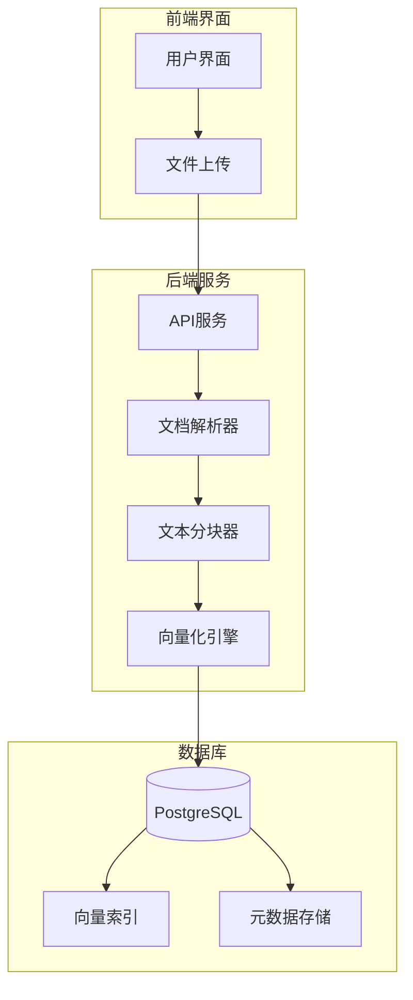

# 知识库构建与管理

<cite>
**本文档引用文件**
- [ProductFeatures.vue](file://components/landing/ProductFeatures.vue)
- [1.bt.md](file://content/docs/introduction/1.bt.md)
- [11.manual-installation.md](file://content/docs/introduction/11.manual-installation.md)
- [agent.vue](file://pages/agent.vue)
- [buidai.vue](file://pages/buidai.vue)
- [ValueProps.vue](file://components/landing/ValueProps.vue)
- [AIIndustry.vue](file://components/AIIndustry.vue)
</cite>

## 目录
1. [引言](#引言)
2. [文件上传支持格式](#文件上传支持格式)
3. [向量模型与数据库架构](#向量模型与数据库架构)
4. [文本分块与索引机制](#文本分块与索引机制)
5. [知识库存储架构](#知识库存储架构)
6. [知识库初始化与数据预处理](#知识库初始化与数据预处理)
7. [元数据管理与权限控制](#元数据管理与权限控制)
8. [实际操作示例](#实际操作示例)
9. [智能体记忆协同机制](#智能体记忆协同机制)
10. [结论](#结论)

## 引言

buidai平台的RAF知识库是企业级AI应用的核心组件，旨在通过检索增强生成（RAG）技术，将企业私有数据与大语言模型能力深度融合。该知识库支持多格式文档导入、自动语义索引与高效检索，确保AI能够基于企业特定业务上下文进行精准回答。本文档详细阐述其构建流程、技术架构与管理策略，为用户提供全面的实施指南。

## 文件上传支持格式

RAF知识库支持多种文档格式的上传与解析，以满足企业多样化的知识管理需求。用户可通过平台界面批量导入或单个上传文件，系统将自动进行内容提取与预处理。

支持的文件格式包括：
- **PDF文档**：支持文本与表格内容的精确提取
- **Word文档**（.doc, .docx）：保留文档结构与格式信息
- **Markdown文件**（.md）：直接解析为结构化文本
- **网页内容**：通过MCP服务实现智能提取网页正文与关键信息

平台通过内置的文档解析工具链，确保不同格式文件的内容能够被统一处理，为后续的向量化和索引创建奠定基础。

**Section sources**
- [ValueProps.vue](file://components/landing/ValueProps.vue#L41-L42)
- [AIIndustry.vue](file://components/AIIndustry.vue#L187-L188)
- [agent.vue](file://pages/agent.vue#L341-L342)

## 向量模型与数据库架构

RAF知识库采用先进的向量搜索技术，基于PostgreSQL数据库并通过pgvector扩展实现高效的语义索引与检索。该架构确保了知识库的高性能与可扩展性。

### 向量模型选择

平台使用预训练的嵌入模型将文本内容转换为高维向量，这些向量能够捕捉文本的语义信息。虽然具体模型名称未在前端代码中明确指出，但系统通过向量搜索扩展（pgvector）实现了向量数据的存储与相似度计算。

### 数据库配置

知识库的底层存储基于PostgreSQL数据库，通过以下关键配置实现高效的数据管理：

```sql
-- 创建buidAI数据库
CREATE DATABASE buidAI;

-- 激活必要的数据库扩展
CREATE EXTENSION IF NOT EXISTS "uuid-ossp";
CREATE EXTENSION IF NOT EXISTS zhparser;
CREATE EXTENSION IF NOT EXISTS vector;
```

其中：
- **uuid-ossp**：提供UUID生成函数，用于创建唯一标识符
- **zhparser**：中文分词扩展，提升中文文本的检索准确性
- **vector**：pgvector扩展，支持向量数据类型和相似度搜索

数据库的环境变量配置（.env文件）中定义了连接参数，包括数据库主机、端口、用户名、密码和数据库名称，确保应用能够正确连接到数据库实例。

**Section sources**
- [1.bt.md](file://content/docs/introduction/1.bt.md#L218-L238)
- [11.manual-installation.md](file://content/docs/introduction/11.manual-installation.md#L130-L142)

## 文本分块与索引机制

为了优化检索效果和处理效率，RAF知识库在数据预处理阶段采用智能文本分块策略，并建立高效的索引机制。

### 文本分块策略

系统将上传的文档自动分割为语义完整的文本块（chunks），每个文本块作为独立的检索单元。分块策略考虑以下因素：
- **语义完整性**：避免在句子中间切断，确保每个文本块具有完整的语义
- **长度控制**：根据向量模型的输入限制，控制文本块的大小
- **上下文保留**：在分块时保留必要的上下文信息，提高检索相关性

### 索引创建机制

分块后的文本经过向量化处理，生成的向量被存储在数据库的向量字段中。系统为向量字段创建专门的索引（如HNSW或IVFFlat），以加速相似度搜索。当用户发起查询时，系统将查询文本向量化，并在向量空间中进行最近邻搜索，快速找到最相关的知识片段。

**Section sources**
- [agent.vue](file://pages/agent.vue#L341-L342)
- [buidai.vue](file://pages/buidai.vue#L1102-L1103)

## 知识库存储架构

结合`ProductFeatures.vue`中的'Database'图标，可以理解RAF知识库的存储架构。该图标象征着知识库作为企业数据的核心存储与管理中枢。

### 架构特点

- **集中化存储**：所有导入的知识文档及其元数据集中存储在PostgreSQL数据库中
- **向量化索引**：通过pgvector扩展，为文本内容创建向量索引，实现高效的语义搜索
- **元数据管理**：每个知识条目关联丰富的元数据，如文档来源、上传时间、作者等
- **安全隔离**：支持多租户和部门级知识库隔离，确保数据安全

该架构确保了知识库的高可用性、可扩展性和安全性，为企业知识管理提供了坚实的基础。



**Diagram sources **
- [ProductFeatures.vue](file://components/landing/ProductFeatures.vue#L97)
- [1.bt.md](file://content/docs/introduction/1.bt.md#L237)

## 知识库初始化与数据预处理

知识库的初始化配置和数据预处理管道是确保系统正常运行的关键步骤。

### 初始化配置

1. **环境准备**：安装PostgreSQL、Redis和Node.js等依赖
2. **数据库设置**：创建buidAI数据库并激活必要的扩展
3. **环境变量配置**：设置数据库连接、Redis连接等参数
4. **服务启动**：通过pnpm start命令一键启动所有服务

### 数据预处理管道

数据预处理管道自动化地处理上传的文档，确保其可被有效检索：

1. **文件解析**：根据文件格式调用相应的解析器
2. **内容清洗**：去除无关的格式信息和噪声
3. **文本分块**：将文档分割为语义完整的文本块
4. **向量化**：使用嵌入模型将文本块转换为向量
5. **索引创建**：将向量和元数据存储到数据库并创建索引

**Section sources**
- [1.bt.md](file://content/docs/introduction/1.bt.md#L163-L240)
- [11.manual-installation.md](file://content/docs/introduction/11.manual-installation.md#L80-L221)

## 元数据管理与权限控制

RAF知识库提供完善的元数据管理和细粒度的权限控制策略，确保知识资产的安全与合规。

### 元数据管理

每个知识条目都关联丰富的元数据，包括：
- **文档信息**：标题、作者、创建时间、修改时间
- **来源信息**：原始文件路径、URL（对于网页）
- **分类标签**：便于组织和检索
- **访问统计**：使用频率、检索次数

### 权限控制策略

平台采用RBAC（基于角色的访问控制）权限系统，支持细粒度的资源访问策略：
- **角色定义**：管理员、编辑、查看者等
- **权限分配**：基于角色分配知识库的读写权限
- **部门隔离**：支持按部门或团队进行知识库隔离
- **审计日志**：记录所有访问和修改操作，满足合规要求

**Section sources**
- [update/2503.md](file://content/update/2503.md#L1-L15)
- [buidai.vue](file://pages/buidai.vue#L1052-L1053)

## 实际操作示例

### 企业知识库初始化

1. 登录buidai平台，进入知识库管理界面
2. 创建新的知识库实例，命名并设置访问权限
3. 上传企业文档（如产品手册、政策文件等）
4. 系统自动完成解析、分块和向量化
5. 验证知识库是否可检索，进行必要的调整

### 定期更新机制

1. 建立知识库更新计划，如每月或每季度
2. 收集新文档和更新版本
3. 通过批量上传功能导入新内容
4. 系统自动处理新增和更新的文档
5. 验证更新后的检索效果

## 智能体记忆协同机制

RAF知识库与智能体记忆系统协同工作，确保上下文一致性。当智能体处理用户请求时：
1. 首先查询RAF知识库，获取相关的企业知识
2. 结合智能体记忆中的对话历史和用户偏好
3. 生成综合性的回答，既基于企业知识又考虑上下文
4. 将新的交互信息存储到智能体记忆中，用于后续对话

这种协同机制使得AI应用能够提供既准确又个性化的服务。

**Section sources**
- [AIArsenal.vue](file://components/landing/AIArsenal.vue#L99-L100)
- [agent.vue](file://pages/agent.vue#L325-L358)

## 结论

buidai平台的RAF知识库通过先进的技术架构和完善的管理策略，为企业提供了强大的知识管理能力。从多格式文件支持到向量搜索，从智能分块到权限控制，每个环节都经过精心设计，确保知识库的高效、安全和易用。通过合理的初始化配置和定期更新机制，企业可以持续积累和利用知识资产，提升AI应用的智能化水平。
