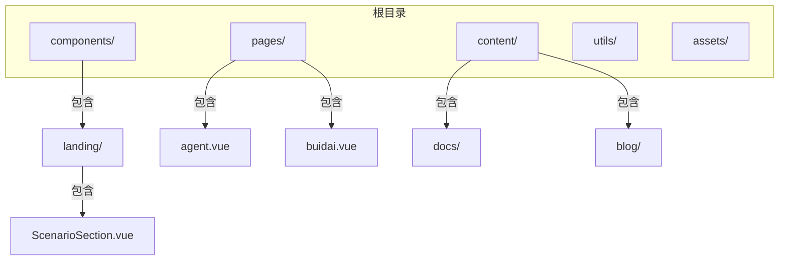
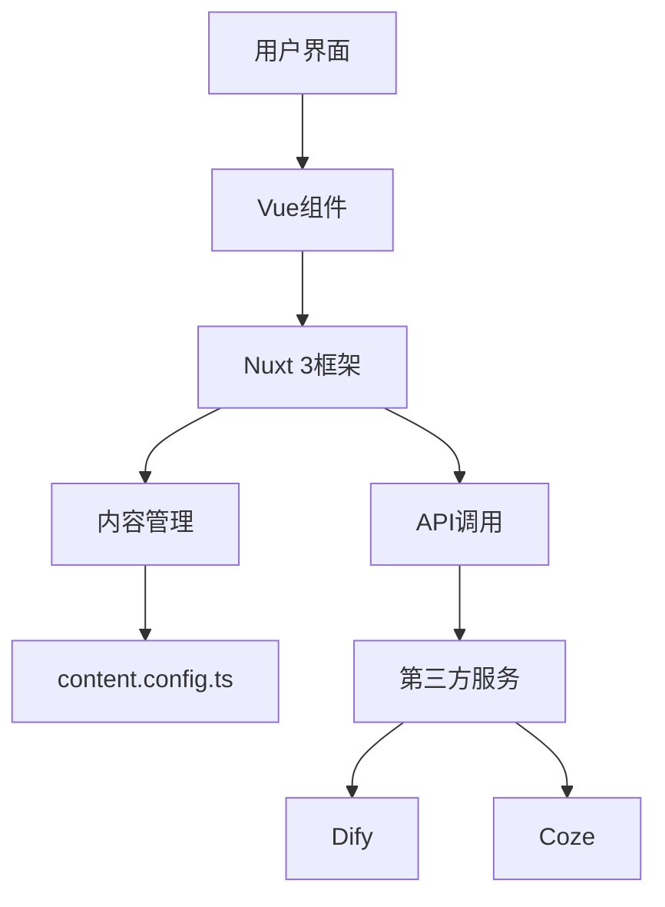
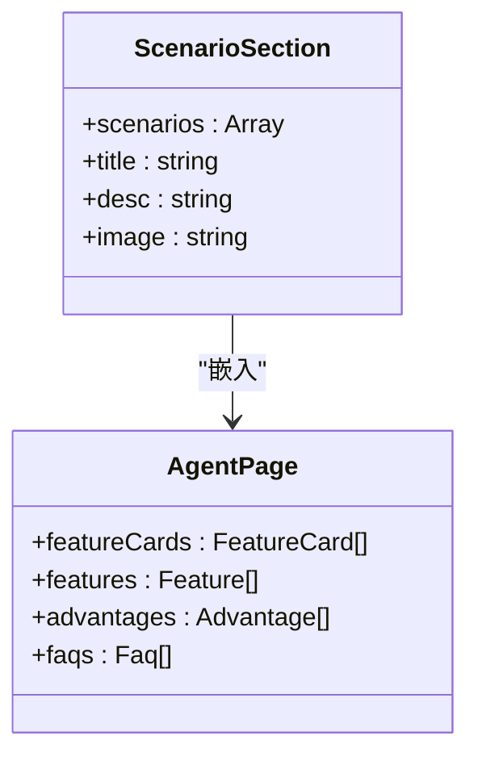
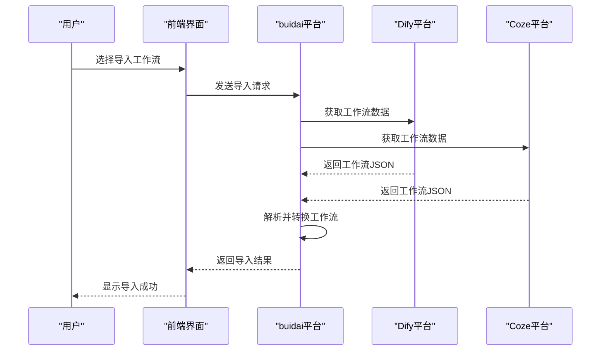
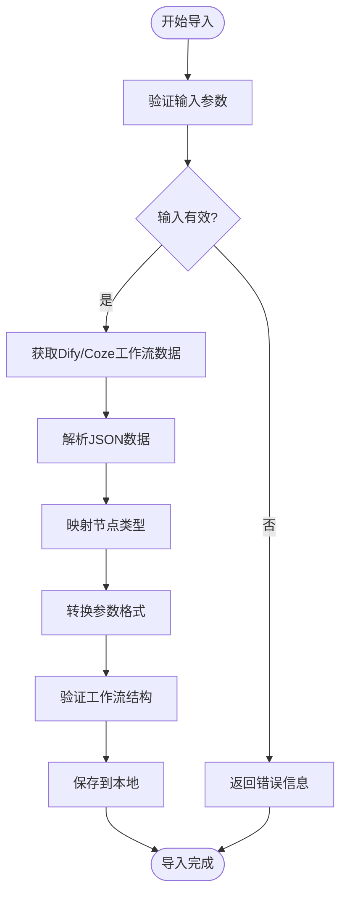
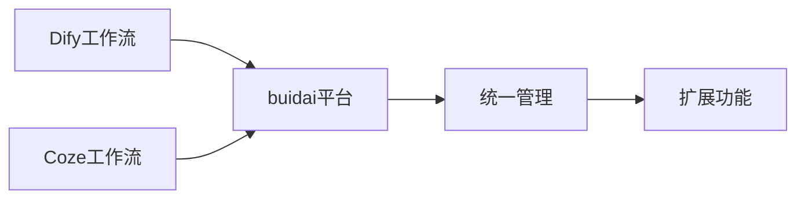

# Dify与扣子工作流导入

<cite>
**本文档引用文件**   
- [ScenarioSection.vue](file://components/landing/ScenarioSection.vue)
- [agent.vue](file://pages/agent.vue)
- [buidai.vue](file://pages/buidai.vue)
- [ProductFeatures.vue](file://components/landing/ProductFeatures.vue)
- [content.config.ts](file://content.config.ts)
- [package-lock.json](file://package-lock.json)
</cite>

## 目录
1. [简介](#简介)
2. [项目结构](#项目结构)
3. [核心功能](#核心功能)
4. [架构概述](#架构概述)
5. [详细组件分析](#详细组件分析)
6. [依赖分析](#依赖分析)
7. [性能考虑](#性能考虑)
8. [故障排除指南](#故障排除指南)
9. [结论](#结论)
10. [附录](#附录)（如有必要）

## 简介
本文档深入解析buidai平台对Dify和扣子（Coze）工作流的导入功能，说明其技术实现原理和兼容性保障措施。详细描述导入流程，包括文件格式解析、节点映射、参数转换和错误处理机制。阐述如何在buidai中继承和扩展原有工作流的能力，打破平台局限性。结合ScenarioSection.vue中“导入 Dify & 扣子 工作流”的描述，提供实际导入案例和常见问题解决方案，帮助用户实现跨平台能力迁移。

## 项目结构
本项目采用基于Nuxt 3 + Vue 3的现代化前端架构，整体结构清晰，模块化程度高。主要目录包括`components`（组件）、`pages`（页面）、`content`（内容管理）、`utils`（工具函数）等。工作流相关功能主要集中在`pages/agent.vue`和`components/landing/ScenarioSection.vue`中。



**图源**
- [ScenarioSection.vue](file://components/landing/ScenarioSection.vue)
- [agent.vue](file://pages/agent.vue)
- [buidai.vue](file://pages/buidai.vue)

**本节来源**
- [ScenarioSection.vue](file://components/landing/ScenarioSection.vue#L1-L70)
- [agent.vue](file://pages/agent.vue#L1-L470)

## 核心功能
buidai平台的核心功能包括大语言模型集成、RAF知识库、工作流编排和MCP服务。其中，工作流编排是实现复杂业务逻辑的关键，支持通过拖拽方式将大模型、插件、知识库等组件连接起来，构建从简单对话到复杂任务的自动化处理流程。特别地，平台支持导入Dify和扣子（Coze）等第三方工作流，打破了平台间的局限性，让用户的能力得到充分施展。

**本节来源**
- [agent.vue](file://pages/agent.vue#L325-L358)
- [buidai.vue](file://pages/buidai.vue#L717-L763)

## 架构概述
buidai平台采用模块化架构设计，前端基于Nuxt 3框架，实现了服务端渲染（SSR）和静态站点生成（SSG）的混合模式。平台通过`content.config.ts`配置内容源，利用Nuxt Content模块管理文档和博客内容。工作流导入功能作为平台的重要特性，集成在核心页面中，通过Vue组件化方式实现用户交互。



**图源**
- [content.config.ts](file://content.config.ts#L36-L55)
- [agent.vue](file://pages/agent.vue)

**本节来源**
- [content.config.ts](file://content.config.ts#L36-L55)
- [agent.vue](file://pages/agent.vue)

## 详细组件分析

### 工作流导入功能分析
buidai平台通过`ScenarioSection.vue`组件展示了“导入 Dify & 扣子 工作流”的功能。该功能的核心在于支持第三方工作流的导入，使用户能够将已有的Dify或Coze工作流无缝迁移到buidai平台。这一功能的实现依赖于对Dify和Coze工作流文件格式的解析和转换。

#### 对象导向组件


**图源**
- [ScenarioSection.vue](file://components/landing/ScenarioSection.vue#L48-L65)
- [agent.vue](file://pages/agent.vue#L285-L452)

#### API/服务组件


**图源**
- [ScenarioSection.vue](file://components/landing/ScenarioSection.vue)
- [agent.vue](file://pages/agent.vue)

#### 复杂逻辑组件


**图源**
- [ScenarioSection.vue](file://components/landing/ScenarioSection.vue)
- [agent.vue](file://pages/agent.vue)

**本节来源**
- [ScenarioSection.vue](file://components/landing/ScenarioSection.vue#L55-L58)
- [agent.vue](file://pages/agent.vue)

### 概念概述
buidai平台的工作流导入功能旨在解决AI应用开发中的平台锁定问题。通过支持Dify和Coze工作流的导入，用户可以自由迁移其已有的AI工作流，避免了重复开发的成本。这一功能不仅提升了平台的兼容性，也为用户提供了更大的灵活性和选择空间。



## 依赖分析
buidai平台的依赖主要通过`package-lock.json`文件管理。项目依赖了多个现代前端库，如`@heroicons/vue`用于图标，`aos`用于动画效果，以及`@nuxt/content`用于内容管理。这些依赖共同支撑了平台的丰富功能和良好用户体验。

```mermaid
graph LR
A[项目] --> B[@heroicons/vue]
A --> C[aos]
A --> D[@nuxt/content]
A --> E[vue]
A --> F[nuxt]
```

**图源**
- [package-lock.json](file://package-lock.json)

**本节来源**
- [package-lock.json](file://package-lock.json)

## 性能考虑
在实现工作流导入功能时，性能是一个重要的考虑因素。平台需要高效地解析和转换可能较大的工作流文件，同时保证用户界面的响应性。为此，建议采用异步处理机制，将文件解析和转换操作放在后台线程中执行，避免阻塞主线程。

## 故障排除指南
在使用工作流导入功能时，可能会遇到一些常见问题，如文件格式不兼容、网络请求失败等。以下是一些解决方案：

- **文件格式错误**：确保导出的工作流文件为标准JSON格式。
- **网络问题**：检查网络连接，确保能够访问Dify和Coze平台的API。
- **权限不足**：确认用户具有导入工作流的权限。

**本节来源**
- [ScenarioSection.vue](file://components/landing/ScenarioSection.vue)
- [agent.vue](file://pages/agent.vue)

## 结论
buidai平台通过支持Dify和扣子（Coze）工作流的导入，实现了跨平台的能力迁移，打破了平台局限性。该功能的技术实现涉及文件格式解析、节点映射、参数转换等多个方面，体现了平台的开放性和兼容性。未来，可以进一步优化导入流程，支持更多第三方平台的工作流格式，为用户提供更加便捷的AI应用开发体验。

## 附录
无