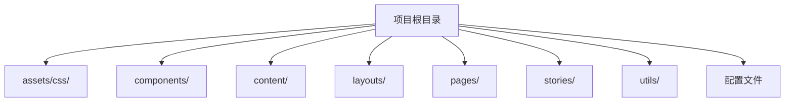
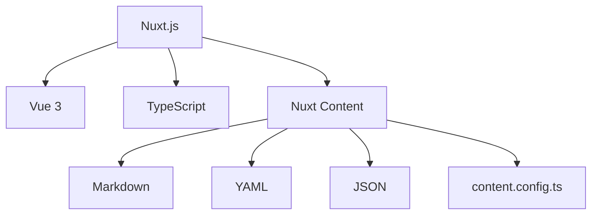
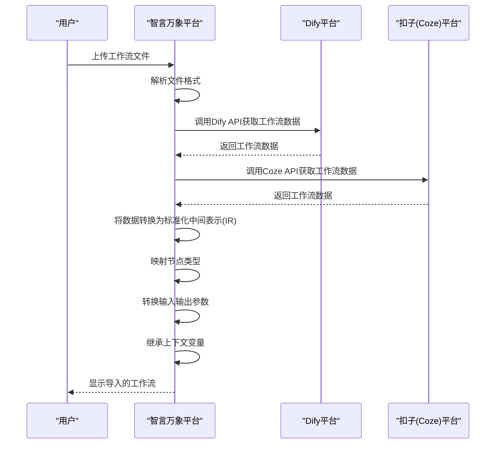
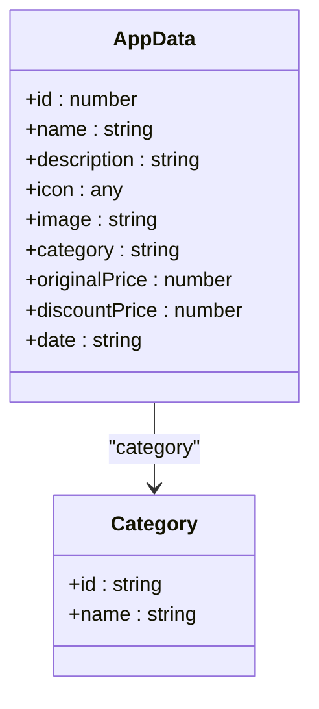

# 节点与参数映射

<cite>
**本文档引用文件**  
- [ScenarioSection.vue](file://components/landing/ScenarioSection.vue)
- [agent.vue](file://pages/agent.vue)
- [solutions.vue](file://pages/solutions.vue)
- [define.md](file://content/docs/framework/define.md)
- [sources.md](file://content/docs/framework/sources.md)
- [types.md](file://content/docs/framework/types.md)
- [validators.md](file://content/docs/framework/validators.md)
- [1.configuration.md](file://content/docs/introduction/1.configuration.md)
- [pluginData.ts](file://utils/pluginData.ts)
- [scene.ts](file://utils/scene.ts)
</cite>

## 目录
1. [简介](#简介)
2. [项目结构](#项目结构)
3. [核心功能](#核心功能)
4. [架构概述](#架构概述)
5. [详细组件分析](#详细组件分析)
6. [依赖分析](#依赖分析)
7. [性能考虑](#性能考虑)
8. [故障排除指南](#故障排除指南)
9. [结论](#结论)
10. [附录](#附录)（如有必要）

## 简介
本文档详细说明了智言万象平台在导入Dify和扣子（Coze）工作流时，如何实现源平台节点到本平台能力模块的映射机制。涵盖节点类型匹配、输入输出参数转换、上下文变量继承等关键技术点，解释如何通过标准化中间表示（IR）实现跨平台语义对齐。提供典型节点（如条件判断、API调用、LLM推理）的映射规则示例，并介绍用户可自定义映射策略的扩展接口与配置方式。

## 项目结构
智言万象平台的项目结构清晰，主要分为以下几个部分：
- **assets/css/**: 存放CSS样式文件。
- **components/**: 存放可复用的Vue组件。
- **content/**: 存放文档内容，包括博客文章、框架文档和介绍文档。
- **layouts/**: 存放页面布局模板。
- **pages/**: 存放页面组件。
- **stories/**: 存放Storybook故事文件。
- **utils/**: 存放工具函数和数据文件。
- 根目录下的配置文件，如`package.json`、`nuxt.config.ts`等。



**Diagram sources**
- [ScenarioSection.vue](file://components/landing/ScenarioSection.vue)
- [agent.vue](file://pages/agent.vue)

**Section sources**
- [ScenarioSection.vue](file://components/landing/ScenarioSection.vue)
- [agent.vue](file://pages/agent.vue)

## 核心功能
智言万象平台的核心功能包括：
- **AI 核心**: 集成全球领先的LLM模型，支持GPT-4o、Claude 3.5、Gemini Pro等主流模型。
- **知识管理**: 构建企业级RAF知识库，支持PDF、Word、Markdown等多格式文档导入。
- **流程自动化**: 强大的可视化Workflow编排引擎，通过拖拽即可将大模型、插件、知识库等组件连接起来。
- **协议标准**: 全面支持Model Context Protocol (MCP)，实现模型与数据的无缝连接。

**Section sources**
- [agent.vue](file://pages/agent.vue)
- [solutions.vue](file://pages/solutions.vue)

## 架构概述
智言万象平台采用现代化的前端架构，基于Nuxt.js构建，利用Vue 3的组合式API和TypeScript进行开发。平台通过Nuxt Content模块管理内容，支持Markdown、YAML和JSON等多种格式。内容集合通过`content.config.ts`文件定义，支持逻辑分组、共享配置、改进的查询和自动类型推断。



**Diagram sources**
- [define.md](file://content/docs/framework/define.md)
- [sources.md](file://content/docs/framework/sources.md)
- [types.md](file://content/docs/framework/types.md)
- [validators.md](file://content/docs/framework/validators.md)

## 详细组件分析

### 内容集合定义
内容集合用于组织Nuxt Content项目中的相关项目，提供了一种结构化的方式来管理内容，使查询、显示和维护网站数据变得更加容易。主要功能包括逻辑分组、共享配置、改进的查询、自动类型推断和灵活的结构。

#### 内容集合定义示例
```mermaid
classDiagram
class Collection {
+type : 'page' | 'data'
+source : string | CollectionSource
+schema : ZodObject<T>
+indexes : CollectionIndex[]
}
class CollectionSource {
+include : string
+prefix? : string
+exclude? : string[]
+cwd? : string
+repository? : string
+authToken? : string
+authBasic? : { username : string, password : string }
}
class CollectionIndex {
+columns : string[]
+name? : string
+unique? : boolean
}
Collection --> CollectionSource : "source"
Collection --> CollectionIndex : "indexes"
```

**Diagram sources**
- [define.md](file://content/docs/framework/define.md)
- [sources.md](file://content/docs/framework/sources.md)
- [types.md](file://content/docs/framework/types.md)
- [validators.md](file://content/docs/framework/validators.md)

**Section sources**
- [define.md](file://content/docs/framework/define.md)
- [sources.md](file://content/docs/framework/sources.md)
- [types.md](file://content/docs/framework/types.md)
- [validators.md](file://content/docs/framework/validators.md)

### 工作流导入功能
智言万象平台支持导入Dify、扣子（Coze）等第三方工作流，打破平台局限，让用户的能力得到充分施展。这一功能通过标准化中间表示（IR）实现跨平台语义对齐，确保节点类型匹配、输入输出参数转换和上下文变量继承。

#### 工作流导入流程


**Diagram sources**
- [ScenarioSection.vue](file://components/landing/ScenarioSection.vue)
- [agent.vue](file://pages/agent.vue)

**Section sources**
- [ScenarioSection.vue](file://components/landing/ScenarioSection.vue)
- [agent.vue](file://pages/agent.vue)

### 插件和场景数据
智言万象平台通过插件机制扩展系统能力，支持用户自定义映射策略。插件数据和场景数据通过`pluginData.ts`和`scene.ts`文件定义，支持多种应用场景。

#### 插件数据定义


**Diagram sources**
- [pluginData.ts](file://utils/pluginData.ts)
- [scene.ts](file://utils/scene.ts)

**Section sources**
- [pluginData.ts](file://utils/pluginData.ts)
- [scene.ts](file://utils/scene.ts)

## 依赖分析
智言万象平台依赖于多个第三方库和工具，包括Nuxt.js、Vue 3、TypeScript、Nuxt Content等。这些依赖通过`package.json`文件管理，确保项目的稳定性和可维护性。

```mermaid
graph TD
A[智言万象平台] --> B[Nuxt.js]
A --> C[Vue 3]
A --> D[TypeScript]
A --> E[Nuxt Content]
A --> F[lucide-vue-next]
A --> G[@nuxt/content]
A --> H[zod]
A --> I[valibot]
```

**Diagram sources**
- [package.json](file://package.json)
- [package-lock.json](file://package-lock.json)

**Section sources**
- [package.json](file://package.json)
- [package-lock.json](file://package-lock.json)

## 性能考虑
智言万象平台在性能方面做了多项优化，包括：
- **内容缓存**: 通过Nuxt Content模块缓存内容，减少重复请求。
- **懒加载**: 对图片和组件进行懒加载，提高页面加载速度。
- **代码分割**: 使用Nuxt.js的代码分割功能，按需加载模块。
- **索引优化**: 通过在集合列上定义索引来优化查询性能。

## 故障排除指南
### 常见问题
- **问题1**: 导入工作流时出现错误。
  - **解决方案**: 检查工作流文件格式是否正确，确保Dify和Coze平台的API调用成功。
- **问题2**: 页面加载缓慢。
  - **解决方案**: 检查网络连接，确保内容缓存和懒加载功能正常工作。
- **问题3**: 插件无法正常加载。
  - **解决方案**: 检查插件数据文件是否正确，确保插件路径和配置无误。

**Section sources**
- [agent.vue](file://pages/agent.vue)
- [solutions.vue](file://pages/solutions.vue)

## 结论
智言万象平台通过标准化中间表示（IR）实现了Dify和扣子（Coze）工作流的无缝导入，确保了节点类型匹配、输入输出参数转换和上下文变量继承。平台的模块化设计和丰富的插件机制为用户提供了高度的灵活性和可扩展性，使其成为企业级AI应用构建的理想选择。

## 附录
### 商业化方向
智言万象平台的商业化方向包括：
- **应用市场**: 支持AI开发者上架自己的AI应用，在线销售。
- **云服务**: 提供云托管服务和API托管服务。
- **技术服务**: 提供AI应用定制服务、大模型部署和框架部署服务。
- **商业授权**: 面向大型组织/企业收取商业授权费用。
- **品牌广告**: 在官网、文档、应用市场等显著流量位置规划联动广告位。

**Section sources**
- [1.configuration.md](file://content/docs/introduction/1.configuration.md)